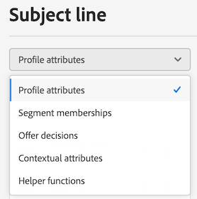

# Informazioni sull’editor espressioni {#build-personalization-expressions}

>[!CONTEXTUALHELP]
>id="ajo_perso_editor"
>title="Informazioni sull’editor espressioni"
>abstract="L’editor espressioni ti consente di selezionare, disporre, personalizzare e convalidare tutti i dati per creare una personalizzazione personalizzata per i contenuti."

L’editor espressioni è il fulcro della personalizzazione in [!DNL Journey Optimizer]. È disponibile in ogni contesto in cui devi definire la personalizzazione come e-mail, push e offerte.

Nell’interfaccia dell’editor di espressioni, seleziona, organizza, personalizza e convalida tutti i dati per creare una personalizzazione personalizzata per il contenuto.

Nella parte sinistra della schermata viene visualizzato un selettore di dominio che consente di selezionare l’origine da personalizzare.

Le origini disponibili sono:

* **[!UICONTROL Profile attributes]** : elenca tutti i riferimenti associati allo schema di profilo descritto in [Documentazione di Adobe Experience Platform Data Model (XDM)](https://experienceleague.adobe.com/docs/experience-platform/xdm/home.html?lang=it){target=&quot;_blank&quot;}.
* **[!UICONTROL Segment memberships]** : elenca tutti i segmenti creati nel servizio Segmentazione di Adobe Experience Platform. Ulteriori informazioni sulla segmentazione disponibili [qui](https://experienceleague.adobe.com/docs/experience-platform/segmentation/home.html){target=&quot;_blank&quot;}.
* **[!UICONTROL Offer decisions]** : elenca tutte le offerte associate a un posizionamento specifico. Seleziona il posizionamento e inserisci le offerte nel contenuto. Per una documentazione completa sulla gestione delle offerte, consulta [questa sezione](../design/deliver-personalized-offers.md).
* **[!UICONTROL Contextual attributes]** : quando in un percorso viene utilizzata un’attività di azione canale (E-mail, push, SMS), i campi di percorso contestuali sono disponibili tramite questo menu. Ulteriori informazioni in [questa sezione](personalization-use-case.md).
* **[!UICONTROL Helper functions]** : elenca tutte le funzioni di supporto disponibili per eseguire operazioni sui dati, ad esempio calcoli, formattazione dei dati o conversioni, condizioni e manipolarle nel contesto della personalizzazione. Ulteriori informazioni in [questa sezione](functions/functions.md).

Fai clic sul pulsante + per aggiungere un attributo all’editor.

>[!NOTE]
>
>Il menu dell&#39;ellisse accanto all&#39;icona &quot;+&quot; consente di ottenere ulteriori dettagli per ogni variabile e di aggiungere gli attributi utilizzati più di frequenza a [preferiti](personalization-favorites.md).

Nell’esempio seguente, l’editor di espressioni ti consente di selezionare i profili che compiono il loro compleanno oggi e quindi di completare la personalizzazione inserendo un’offerta specifica corrispondente a questo giorno.

Quando l’espressione di personalizzazione è pronta, è necessario che venga convalidata dall’editor espressioni. Ulteriori informazioni in [questa sezione](personalization-validation.md).
