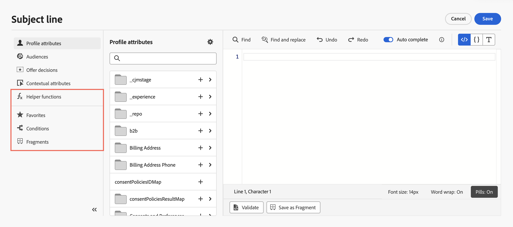

# Aggiungere personalizzazione {#build-personalization-expressions}

>[!CONTEXTUALHELP]
>id="ajo_perso_editor"
>title="Informazioni sull’editor di personalizzazione"
>abstract="L’editor di personalizzazione consente di selezionare, disporre, personalizzare e convalidare tutti i dati per creare una personalizzazione dei contenuti."

L&#39;editor di personalizzazione è il fulcro della personalizzazione in [!DNL Journey Optimizer]. È disponibile in ogni contesto in cui è necessario definire la personalizzazione, ad esempio e-mail, push e offerte.

Nell’interfaccia dell’editor di personalizzazione puoi selezionare, disporre, personalizzare e convalidare tutti i dati per creare una personalizzazione personalizzata per il contenuto.


## Dove posso aggiungere la personalizzazione {#where}

Puoi aggiungere la personalizzazione in **[!DNL Journey Optimizer]** in ogni campo con l&#39;icona . Per ulteriori informazioni, espandi le sezioni seguenti.

+++Messaggi

Nei messaggi, la personalizzazione può essere aggiunta in posizioni diverse nei messaggi, ad esempio il campo **[!UICONTROL Oggetto]**.


Può essere aggiunto anche in altre sezioni del contenuto. Ad esempio, per [notifiche push](../push/push-gs.md), è possibile aggiungere la personalizzazione nei campi **Titolo**, **Corpo**, **Audio personalizzato**, **Badge** e **Dati personalizzati**.

+++

+++E-mail Designer

Quando modifichi il contenuto delle e-mail in [E-mail Designer](../email/get-started-email-design.md), puoi aggiungere la personalizzazione in blocchi di testo e in URL utilizzando l&#39;icona nella barra degli strumenti contestuale.


+++

+++Offerte

Puoi aggiungere la personalizzazione quando utilizzi contenuto di tipo testo nelle rappresentazioni delle **offerte**. [Scopri come creare le offerte personalizzate](../offers/offer-library/creating-personalized-offers.md)

+++

+++URL

Journey Optimizer ti consente inoltre di personalizzare **URL** nel messaggio.  Gli URL personalizzati indirizzano i destinatari verso pagine specifiche di un sito web o verso un microsito personalizzato, a seconda degli attributi del profilo. La personalizzazione URL è disponibile per i seguenti tipi di collegamenti: **Collegamento esterno**, **Collegamento per l&#39;annullamento dell&#39;abbonamento** e **Rinuncia**.

URL personalizzati di esempio:

* `https://www.adobe.com/users/{{profile.person.name.lastName}}`
* `https://www.adobe.com/users?uid={{profile.person.name.firstName}}`
* `https://www.adobe.com/usera?uid={{context.journey.technicalProperties.journeyUID}}`
* `https://www.adobe.com/users?uid={{profile.person.crmid}}&token={{context.token}}`

{width="50%"}

>[!NOTE]
>
>Quando modifichi un URL personalizzato nell’editor di personalizzazione, le funzioni di assistenza e l’iscrizione a un pubblico vengono disabilitate per motivi di sicurezza.
>
>Gli spazi non sono supportati nei token di personalizzazione utilizzati negli URL.

In Disponibilità limitata per un set di clienti, Journey Optimizer supporta anche la personalizzazione URL completa/di base. Ad esempio:

```
<a href="{{profile.social.link}}" />
<a href="{{profile.social.baseUrl}}/profile" />
<a href="https://{{profile.social.baseUrl}}/profile" />
```

>[!WARNING]
>
>L’elenco dei domini accettati deve essere fornito prima a Adobe.

+++

+++Configurazione e-mail

Durante la creazione di una configurazione del canale e-mail, puoi definire valori personalizzati per sottodomini, intestazioni e parametri di tracciamento URL. [Ulteriori informazioni](../email/surface-personalization.md)

+++

## Origini Personalization {#sources}

Il riquadro di navigazione consente di selezionare l’origine per la personalizzazione. Le origini disponibili sono:

* **[!UICONTROL Attributi profilo]** : elenca tutti i riferimenti associati allo schema profilo descritto nella [documentazione di Adobe Experience Platform Data Model (XDM)](https://experienceleague.adobe.com/docs/experience-platform/xdm/home.html?lang=it){target="_blank"}.
* **[!UICONTROL Attributi di destinazione]**: questa cartella è specifica per le campagne orchestrate. Contiene attributi calcolati direttamente nell’area di lavoro della campagna. [Scopri come aggiungere la personalizzazione nelle campagne orchestrate](../orchestrated/activities/channels.md#add-personalization)
* **[!UICONTROL Tipi di pubblico]**: elenca tutti i tipi di pubblico creati nel servizio di segmentazione di Adobe Experience Platform. Ulteriori informazioni sulla segmentazione sono disponibili [qui](https://experienceleague.adobe.com/docs/experience-platform/segmentation/home.html?lang=it){target="_blank"}.
* **[!UICONTROL Decisioni di offerta]** : elenca tutte le offerte associate a un posizionamento specifico. Seleziona il posizionamento e inserisci le offerte nel contenuto. Per una documentazione completa su come gestire le offerte, consulta [questa sezione](../offers/get-started/starting-offer-decisioning.md).
* **[!UICONTROL Attributi contestuali]**: quando un&#39;attività di azione canale (e-mail, push, SMS) viene utilizzata in un percorso o in una campagna, gli attributi contestuali relativi a eventi e proprietà sono disponibili per la personalizzazione. Un esempio di personalizzazione che sfrutta gli attributi contestuali è presentato in [questa sezione](personalization-use-case.md). Inoltre, le risposte alle azioni personalizzate possono essere utilizzate per la personalizzazione. [Scopri come utilizzare le risposte alle azioni personalizzate nei canali nativi](../action/action-response.md#response-in-channels).

>[!NOTE]
>
>Se esegui il targeting di un pubblico con attributi di arricchimento generati utilizzando un flusso di lavoro di composizione, puoi sfruttare questi attributi di arricchimento per personalizzare il messaggio. [Scopri come utilizzare gli attributi di arricchimento del pubblico](../audience/about-audiences.md#enrichment)

## Aggiungere personalizzazione {#add}

>[!CONTEXTUALHELP]
>id="ajo_perso_editor_autocomplete"
>title="Completamento automatico"
>abstract="L’attivazione di questa opzione consente al sistema di suggerire e completare automaticamente il codice durante la digitazione. Questa funzione è disponibile solo per i formati HTML e Testo e supporta gli attributi di Profilo e Contesto. Se viene disabilitata tramite l’apposito pulsante di attivazione, il completamento automatico del codice HTML nativo verrà eseguito dall’editor."

Nell’area di lavoro centrale puoi creare la sintassi di personalizzazione. Per utilizzare un attributo per personalizzare il messaggio, individuarlo nel riquadro di spostamento a sinistra e fare clic sul pulsante `+` per aggiungerlo all&#39;espressione.


Il menu con i puntini di sospensione accanto all&#39;icona `+` consente di ottenere ulteriori dettagli per ciascun attributo e di aggiungere gli attributi utilizzati più di frequente ai preferiti. Gli attributi aggiunti ai preferiti sono accessibili dal menu **[!UICONTROL Preferiti]** nel riquadro di spostamento.

>[!NOTE]
>
>Per impostazione predefinita, nel riquadro degli attributi vengono visualizzati solo gli attributi compilati. Per visualizzare tutti gli attributi, selezionare il pulsante  situato sopra il campo di ricerca e disattivare l&#39;opzione **[!UICONTROL Mostra solo attributi popolati]**.

Inoltre, puoi definire il testo di fallback predefinito che verrà visualizzato se un attributo di profilo di tipo stringa è vuoto. A tale scopo, fare clic sul pulsante con i puntini di sospensione accanto all&#39;attributo e selezionare **[!UICONTROL Inserisci con testo di fallback]**. Scrivere il testo da visualizzare per impostazione predefinita se il valore dell&#39;attributo è vuoto per un profilo, quindi fare clic su **[!UICONTROL Aggiungi]**.


Nell’esempio seguente, l’editor di personalizzazione ti consente di selezionare i profili che hanno il compleanno oggi e quindi di completare la personalizzazione inserendo un’offerta specifica corrispondente a quel giorno.


## Opzioni per la modifica delle espressioni {#options}

L’area di lavoro centrale fornisce vari strumenti per aiutarti a scrivere la tua espressione di personalizzazione.


Le opzioni disponibili sono:

1. **[!UICONTROL Trova]** / **[!UICONTROL Trova e sostituisci]**: cerca nell&#39;espressione e sostituisci automaticamente parti di codice.
1. **[!UICONTROL Annulla]** / **[!UICONTROL Ripristina]**: annulla/ripristina l&#39;ultima operazione.
1. **[!UICONTROL Completamento automatico]**: suggerisce e completa automaticamente il codice durante la digitazione. Questa funzione è disponibile solo per i formati HTML e Testo e supporta gli attributi di Profilo e Contesto. Se viene disabilitata tramite l’apposito pulsante di attivazione, il completamento automatico del codice HTML nativo verrà eseguito dall’editor.

   {width="70%" align="center" zoomable="yes"}

1. **[!UICONTROL HTML]** / **[!UICONTROL JSON]** / **[!UICONTROL Testo]**: identifica il formato del codice. Questo consente al sistema di adattare la convalida e la funzione di completamento automatico in base alla lingua selezionata.
1. **[!UICONTROL Convalida]**: verifica la sintassi dell&#39;espressione. Ulteriori informazioni in [questa sezione](../personalization/personalization-build-expressions.md).
1. **[!UICONTROL Salva come frammento]**: salva l&#39;espressione come frammento di espressione. [Ulteriori informazioni](../content-management/save-fragments.md#save-as-expression-fragment)
1. **[!UICONTROL Dimensione font]**: regola la dimensione font per i contenuti all&#39;interno dell&#39;editor per migliorarne la leggibilità.
1. **[!UICONTROL Parola a capo]**: attiva o disattiva il ritorno a capo automatico, consentendo la visualizzazione di espressioni lunghe su una singola riga o racchiuse nell&#39;editor. Le opzioni includono:
   * **Disattivato** (impostazione predefinita) - Nessun ritorno a capo automatico. Le linee lunghe si estendono oltre la vista dell’editor e richiedono uno scorrimento orizzontale.
   * **Il** - Dispone le righe alla larghezza dell&#39;editor.
   * **Colonna a capo automatico** - Dispone le righe quando i caratteri di una riga raggiungono gli 80 caratteri.
   * **Limitato** - Dispone le righe alla larghezza dell&#39;editor o a 80 caratteri, a seconda di quale dei due valori è più basso.
1. **[!UICONTROL Pillole]**: visualizza gli attributi come &quot;pillole&quot; compatte per migliorare la leggibilità nascondendo i percorsi degli attributi lunghi. Fare clic su un attributo per visualizzarne il percorso completo.

   >[!NOTE]
   >
   >Questa opzione è disponibile solo per gli attributi di profilo, gli attributi contestuali e gli elementi multimediali dinamici.

Nel riquadro di navigazione sono disponibili funzioni aggiuntive per aiutarti a creare la tua espressione di personalizzazione.



* **[!UICONTROL Funzioni helper]** - Le funzioni helper consentono di eseguire operazioni sui dati, ad esempio calcoli, formattazione o conversioni di dati, condizioni e di manipolarli nel contesto della personalizzazione. [Ulteriori informazioni sulle funzioni helper disponibili](functions/functions.md)

* **[!UICONTROL Preferiti]** - Gli attributi aggiunti ai preferiti vengono visualizzati in questo elenco. Questo consente di accedere rapidamente agli elementi utilizzati con maggiore frequenza. Per aggiungere un attributo ai preferiti, fai clic sul menu con i puntini di sospensione e scegli **[!UICONTROL Aggiungi ai preferiti]**.

* **[!UICONTROL Condizioni]** - Sfrutta le regole condizionali create nella libreria per aggiungere contenuto dinamico ai messaggi. Questo consente di creare più varianti del messaggio in base alle condizioni. [Scopri come creare contenuti dinamici](../personalization/get-started-dynamic-content.md)

* **[!UICONTROL Frammenti]** - Sfrutta i frammenti di espressione creati o salvati nella sandbox corrente. Un frammento è un componente riutilizzabile a cui è possibile fare riferimento in [!DNL Journey Optimizer] campagne e percorsi. Questa funzionalità consente di precreare più blocchi di contenuto personalizzati che possono essere utilizzati dagli utenti di marketing per assemblare rapidamente i contenuti in un processo di progettazione migliorato. [Scopri come utilizzare i frammenti di espressione per la personalizzazione](../personalization/use-expression-fragments.md)

Una volta che l’espressione di personalizzazione è pronta, devi farla convalidare dall’editor di personalizzazione. Ulteriori informazioni in [questa sezione](../personalization/personalization-build-expressions.md).

## Meccanismi di convalida {#validation-mechanisms}

La convalida dell&#39;espressione viene eseguita automaticamente quando si fa clic sul pulsante **Aggiungi** per chiudere la finestra dell&#39;editor. Puoi anche usare il pulsante **Convalida** per controllare la sintassi di personalizzazione.


Espandi la sezione seguente per visualizzare gli errori più comuni che possono verificarsi durante la convalida della personalizzazione.

+++Errori comuni

* **Percorso &quot;XYZ&quot; non trovato**

Quando tenti di fare riferimento a un campo non definito nello schema.

In questo caso **firstName1** non è definito come attributo nello schema del profilo:

```
{{profile.person.name.firstName1}}
```

* **Tipo non corrispondente per la variabile &quot;XYZ&quot;. Previsto array. Trovata stringa.**

Quando si tenta di eseguire l’iterazione su una stringa anziché su un array.

In questo caso **product** non è un array:

```
{{each profile.person.name.firstName as |product|}}
 {{product.productName}}
{{/each}}
```

* **Sintassi Handlebars non valida. Trovato`'[XYZ}}'`**

Se viene utilizzata una sintassi Handlebars non valida.

Le espressioni Handlebars sono circondate da **{{expression}}**

```
   {{[profile.person.name.firstName}}
```

* **Definizione segmento non valida**

```
No segment definition found for 988afe9f0-d4ae-42c8-a0be-8d90e66e151
```

+++

Per le offerte, possono verificarsi errori specifici. Per ulteriori informazioni, espandi la sezione seguente:

+++ Errori specifici relativi alle offerte

Gli errori relativi all’integrazione delle offerte in un messaggio e-mail o push hanno il seguente pattern:

```
Offer.<offerType>.[PlacementID].[ActivityID].<offer-attribute>
```

La convalida viene eseguita durante la convalida del contenuto di personalizzazione nell’editor di personalizzazione.

<table> 
 <thead> 
  <tr> 
   <th> Titolo errore<br /> </th> 
   <th> Convalida/risoluzione <br /> </th> 
  </tr> 
 </thead> 
 <tbody> 
  <tr> 
   <td>Risorsa con ID placementID e tipo OfferPlacement non trovata <br/>
Risorsa con ID activityID e tipo OfferActivity non trovata<br/></td> 
   <td>Controlla se ActivityID e/o PlacementID sono disponibili</td> 
  </tr> 
   <tr> 
   <td>Impossibile convalidare la risorsa.</td> 
   <td>Il componentType nel posizionamento deve corrispondere all’offerta offerType</td> 
  </tr> 
   <tr> 
   <td>L’URL pubblico non è presente in offerId.</td> 
   <td>Le offerte di immagini (tutte le offerte personalizzate e di fallback associate alla coppia decisione-posizionamento) devono avere un URL pubblico popolato (deliveryURL non deve essere vuoto).</td> 
  </tr> 
  <tr> 
   <td>La decisione contiene attributi non di profilo.</td> 
   <td>Offerte L’utilizzo del modello deve contenere solo gli attributi del profilo.</td> 
  </tr> 
  <tr> 
   <td>Si è verificato un errore durante il recupero dell’utilizzo della decisione.</td> 
   <td>Questo errore può verificarsi quando l’API tenta di recuperare il modello di offerta.</td> 
  </tr>
  <tr> 
   <td>Attributo offerta attributo offerta non valido.</td> 
   <td>Verifica se l’attributo dell’offerta a cui si fa riferimento nel pacchetto di offerta è valido. Di seguito sono riportati gli attributi validi: <br/>
Immagine: deliveryURL, linkURL<br/>
Testo: content<br/>
HTML: content<br/></td> 
  </tr> 
 </tbody> 
</table>

+++
