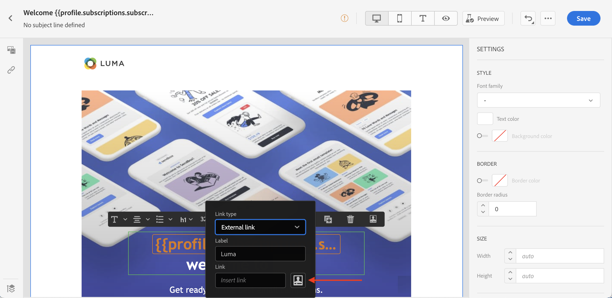
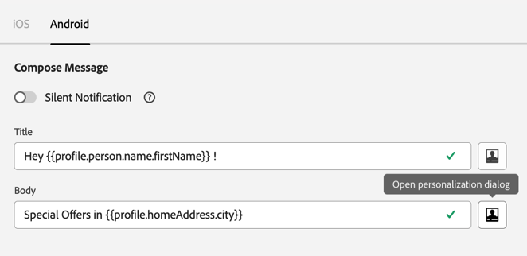

# Contesti di personalizzazione{#personalization-areas}

Il contenuto e la visualizzazione dei messaggi consegnati da [!DNL Journey Optimizer] possono essere personalizzati in diversi modi. In ogni campo con l’icona dell’editor, puoi aprire l’editor di personalizzazione (noto anche come editor di personalizzazione) e definire la personalizzazione.

## Personalizzare le e-mail {#personalize-emails}

Quando crei un messaggio e-mail, puoi aggiungere la personalizzazione nel campo **[!UICONTROL Oggetto]** del messaggio.

In E-mail designer, puoi personalizzare il contenuto:

* Nel **messaggio**: fare clic all&#39;interno di un blocco di testo, fare clic sull&#39;icona **Aggiungi Personalization** nella barra degli strumenti contestuale. Per ulteriori informazioni sull&#39;interfaccia di E-mail Designer, consulta questa [sezione](../email/get-started-email-design.md).

  

* Per un **collegamento**: seleziona del testo o dell&#39;immagine all&#39;interno di un blocco di testo, fai clic sull&#39;icona **Inserisci collegamento** nella barra degli strumenti contestuale. Nella finestra puoi aggiungere un blocco di personalizzazione facendo clic sull&#39;icona **Aggiungi personalizzazione**.

  

In entrambi i casi, accedi all’editor di personalizzazione.

## Personalizzare le notifiche push {#personalize-push}

Puoi anche personalizzare le **notifiche push** nei seguenti campi:

* **Titolo**
* **Corpo**
* **Audio personalizzato**
* **Distintivi**
* **Dati personalizzati**

Ulteriori informazioni sulla configurazione delle notifiche push in [questa sezione](../push/push-gs.md).

## Personalizzare le offerte {#personalize-offers}

Puoi anche accedere all’editor di personalizzazione quando aggiungi contenuto di tipo testo alle rappresentazioni delle offerte.

Ulteriori informazioni sulla gestione dei contenuti con la gestione delle decisioni in [questa sezione](../offers/offer-library/creating-personalized-offers.md#custom-text).

## Creare URL personalizzati{#personalize-urls}

Gli URL personalizzati indirizzano i destinatari verso pagine specifiche di un sito web o verso un microsito personalizzato, a seconda degli attributi del profilo. In Adobe Journey Optimizer, puoi aggiungere la personalizzazione agli URL nel contenuto del messaggio. La personalizzazione URL può essere applicata a testo e immagini e utilizzare dati di profilo o dati contestuali.

Scopri come inserire un URL personalizzato in [questa sezione](personalization-syntax.md#perso-urls).

