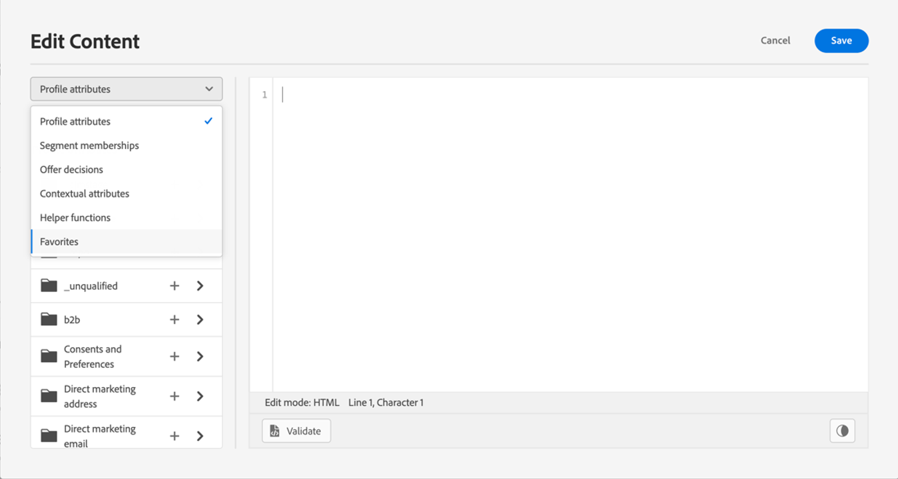

# Aggiungi attributi ai preferiti {#fav}

L’aggiunta di attributi diversi al menu dei preferiti consente di accedere rapidamente agli elementi utilizzati con maggiore frequenza. Per aggiungere un attributo ai preferiti, fai clic sul menu ellisse e scegli **[!UICONTROL Add to favorites]**.

Per accedere agli elementi preferiti, utilizza la **[!UICONTROL Favorites]** nel menu a discesa.

Da questo elenco puoi aggiungere rapidamente l’oggetto di personalizzazione all’espressione corrente.

Se non desideri più visualizzare un elemento nell&#39;elenco dei preferiti, puoi rimuoverlo dai preferiti.

