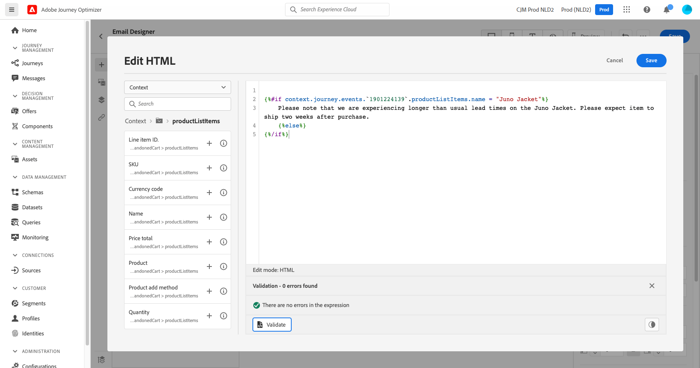

# Caso di utilizzo della personalizzazione: e-mail di abbandono carrello {#personalization-use-case-helper-functions}

In questo esempio, personalizzerai il corpo di un messaggio e-mail. Questo messaggio è destinato ai clienti che hanno lasciato gli articoli nel carrello ma non hanno completato l’acquisto.

Verranno utilizzati i seguenti tipi di funzioni di supporto:

* La `upperCase` funzione stringa, per inserire il nome del cliente in lettere maiuscole. [Ulteriori informazioni](functions/string.md#upper).
* La `each` helper, per elencare gli elementi presenti nel carrello. [Ulteriori informazioni](functions/helpers.md#each).
* La `if` helper, per inserire una nota specifica del prodotto se il prodotto correlato è nel carrello. [Ulteriori informazioni](functions/helpers.md#if-function).

<!-- **Context**: personalization based on contextual data from the journey -->

Prima di iniziare, assicurati di sapere come configurare questi elementi:
* Un messaggio e-mail. [Ulteriori informazioni](../messages/create-message.md)
* Il corpo di un’e-mail. [Ulteriori informazioni](../messages/create-email-content.md).
* Un evento unitario. [Ulteriori informazioni](../event/about-events.md).
* Percorso che inizia con un evento. [Ulteriori informazioni](../building-journeys/using-the-journey-designer.md).

Segui questi passaggi:
1. [Creare un messaggio e-mail](#configure-email).
1. [Inserire il nome del cliente in lettere maiuscole](#uppercase-function).
1. [Creare l’evento iniziale e il percorso](#create-context).
1. [Aggiungi il contenuto del carrello all’e-mail](#each-helper).
1. [Inserire una nota specifica per il prodotto](#if-helper).
1. [Test e pubblicazione del percorso](#test-and-publish).

## Passaggio 1: Creare l’e-mail{#configure-email}

1. Crea o modifica un messaggio e-mail, quindi fai clic su **[!UICONTROL Email Designer]**.
   

1. Dalla palette a sinistra della home page di E-mail Designer, trascina e rilascia tre componenti struttura nel corpo del messaggio.

1. Trascina e rilascia un componente di contenuto HTML su ogni nuovo componente struttura.

   

## Passaggio 2: Inserire il nome del cliente in lettere maiuscole {#uppercase-function}

1. Nella home page di E-mail Designer, fare clic sul componente HTML in cui si desidera aggiungere il nome del cliente.
1. Sulla barra degli strumenti contestuale, fai clic su **[!UICONTROL Show the source code]**.

   

1. In **[!UICONTROL Edit HTML]** aggiungi `upperCase` funzione stringa:
   1. Nel menu a sinistra, seleziona **[!UICONTROL Helper functions]**.
   1. Usa il campo di ricerca per trovare &quot;maiuscolo&quot;.
   1. Dai risultati della ricerca, aggiungi la `upperCase` funzione . A questo scopo, fai clic sul segno più (+) accanto a `: string`.

      L’editor espressioni mostra questa espressione:

      ```handlebars
      
      ```

      

1. Rimuovere il segnaposto &quot;string&quot; dall&#39;espressione.
1. Aggiungi il token del nome:
   1. Nel menu a sinistra, seleziona **[!UICONTROL Profile attributes]**.
   1. Seleziona **[!UICONTROL Person]** > **[!UICONTROL Full name]**.
   1. Aggiungi il **[!UICONTROL First name]** token dell&#39;espressione.

      L’editor espressioni mostra questa espressione:

      ```handlebars
      
      ```

      

      Ulteriori informazioni sul tipo di dati del nome della persona in [Documentazione di Adobe Experience Platform](https://experienceleague.adobe.com/docs/experience-platform/xdm/data-types/person-name.html){target=&quot;_blank&quot;}.

1. Fai clic su **[!UICONTROL Validate]**, quindi su **[!UICONTROL Save]**.

   
1. Salva il messaggio.

## Passaggio 3: Creare l’evento iniziale e il percorso correlato {#create-context}

Il contenuto del carrello è un’informazione contestuale proveniente dal percorso. Pertanto, devi aggiungere un evento iniziale e l’e-mail a un percorso prima di poter aggiungere informazioni specifiche sul carrello all’e-mail.

1. Crea un evento il cui schema include `productListItems` array.
1. Definisci tutti i campi di questa matrice come campi di payload per questo evento.

   Ulteriori informazioni sul tipo di dati dell’elemento dell’elenco prodotti [Documentazione di Adobe Experience Platform](https://experienceleague.adobe.com/docs/experience-platform/xdm/data-types/product-list-item.html){target=&quot;_blank&quot;}.

1. Crea un percorso che inizia con questo evento.
1. Aggiungi il messaggio al percorso.
1. Termina il percorso con un’attività finale.

   Poiché il messaggio non è ancora stato pubblicato, non puoi né testare né pubblicare il percorso.

   

1. Fai clic su **[!UICONTROL OK]**.

   Un messaggio ti informa che il contesto del percorso è stato trasmesso al messaggio.

   

## Passaggio 4: Inserisci l&#39;elenco degli elementi dal carrello {#each-helper}

1. Riapri il messaggio.

   

1. Nella home page di E-mail Designer, fare clic sul componente HTML in cui si desidera elencare il contenuto del carrello.
1. Sulla barra degli strumenti contestuale, fai clic su **[!UICONTROL Show the source code]**.

   

1. In **[!UICONTROL Edit HTML]** aggiungi `each` helper:
   1. Nel menu a sinistra, seleziona **[!UICONTROL Helper functions]**.
   1. Usa il campo di ricerca per trovare &quot;ogni&quot;.
   1. Dai risultati della ricerca, aggiungi la `each` aiutante.

      L’editor espressioni mostra questa espressione:

      ```handlebars
      {{#each someArray as |variable|}} {{/each}}
      ```

      

1. Aggiungi il `productListItems` all&#39;espressione:

   1. Rimuovere il segnaposto &quot;someArray&quot; dall’espressione.
   1. Nel menu a sinistra, seleziona **[!UICONTROL Contextual attributes]**.

      **[!UICONTROL Contextual attributes]** sono disponibili solo dopo che il contesto del percorso è stato trasmesso al messaggio.

   1. Seleziona **[!UICONTROL Journey Orchestration]** > **[!UICONTROL Events]** > ***[!UICONTROL event_name]***, quindi espandi il **[!UICONTROL productListItems]** nodo.

      In questo esempio, *nome_evento* rappresenta il nome dell&#39;evento.

   1. Aggiungi il **[!UICONTROL Product]** token dell&#39;espressione.

      L’editor espressioni mostra questa espressione:

      ```handlebars
      {{#each context.journey.events.event_ID.productListItems.product as |variable|}} {{/each}}
      ```
      In questo esempio, *event_ID* rappresenta l&#39;ID dell&#39;evento.

      

   1. Modificare l’espressione:
      1. Rimuovi la stringa &quot;.product&quot;.
      1. Sostituisci il segnaposto &quot;variabile&quot; con &quot;prodotto&quot;.

      Questo esempio mostra l&#39;espressione modificata:

      ```handlebars
      {{#each context.journey.events.event_ID.productListItems as |product|}}
      ```
1. Incolla questo codice tra l&#39;apertura `{{#each}}` e la chiusura `{/each}}` tag:

   ```html
   <table>
      <tbody>
         <tr>
            <td><b>#name</b></td>
            <td><b>#quantity</b></td>
            <td><b>$#priceTotal</b></td>
         </tr>
      </tbody>
   </table>
   ```

1. Aggiungi i token di personalizzazione per il nome dell’articolo, la quantità e il prezzo:

   1. Rimuovere il segnaposto &quot;#name&quot; dalla tabella HTML.
   1. Dai risultati della ricerca precedenti, aggiungi la **[!UICONTROL Name]** token dell&#39;espressione.

   Ripeti due volte questi passaggi:
   * Sostituisci il segnaposto &quot;#quantità&quot; con il **[!UICONTROL Quantity]** token.
   * Sostituisci il segnaposto &quot;#priceTotal&quot; con il **[!UICONTROL Total price]** token.

   Questo esempio mostra l&#39;espressione modificata:

   ```handlebars
   {{#each context.journey.events.event_ID.productListItems as |product|}}
      <table>
         <tbody>
            <tr>
               <td><b>{{context.journey.events.event_ID.productListItems.name}}</b></td>
               <td><b>{{context.journey.events.event_ID.productListItems.quantity}}</b></td>
               <td><b>${{context.journey.events.event_ID.productListItems.priceTotal}}</b></td>
            </tr>
         </tbody>
      </table>
   {{/each}}
   ```
1. Fai clic su **[!UICONTROL Validate]**, quindi su **[!UICONTROL Save]**.
   

## Passaggio 5: Inserire una nota specifica per il prodotto {#if-helper}

1. Nella home page di E-mail Designer, fare clic sul componente HTML in cui si desidera inserire la nota.
1. Sulla barra degli strumenti contestuale, fai clic su **[!UICONTROL Show the source code]**.

   

1. In **[!UICONTROL Edit HTML]** aggiungi `if` helper:
   1. Nel menu a sinistra, seleziona **[!UICONTROL Helper functions]**.
   1. Usa il campo di ricerca per trovare &quot;if&quot;.
   1. Dai risultati della ricerca, aggiungi la `if` aiutante.

      L’editor espressioni mostra questa espressione:

      ```handlebars
       render_1
          render_2
          default_render
      
      ```
      

1. Rimuovi questa condizione dall&#39;espressione:

   ```handlebars
    render_2
   ```

   Questo esempio mostra l&#39;espressione modificata:

   ```handlebars
    render_1
       default_render
   
   ```

1. Aggiungi il token del nome del prodotto alla condizione:
   1. Rimuovere il segnaposto &quot;condizione1&quot; dall&#39;espressione.
   1. Nel menu a sinistra, seleziona **[!UICONTROL Contextual attributes]**.
   1. Seleziona **[!UICONTROL Journey Orchestration]** > **[!UICONTROL Events]** > ***[!UICONTROL event_name]***, quindi espandi il **[!UICONTROL productListItems]** nodo.

      In questo esempio, *nome_evento* rappresenta il nome dell&#39;evento.

   1. Aggiungi il **[!UICONTROL Name]** token dell&#39;espressione.

      L’editor espressioni mostra questa espressione:

      ```handlebars
      
         render_1
          default_render
      
      ```
      

1. Modificare l’espressione:
   1. Nell’editor espressioni, specifica il nome del prodotto dopo il `name` token.

      Utilizza questa sintassi, dove *product_name* rappresenta il nome del prodotto:

      ```javascript
      = "product_name"
      ```

      In questo esempio, il nome del prodotto è &quot;Juno Jacket&quot;:

      ```handlebars
      
         render_1
          default_render
      
      ```

   1. Sostituire il segnaposto &quot;render_1&quot; con il testo della nota.

      Esempio:

      ```handlebars
      
         Due to longer than usual lead times on the Juno Jacket, please expect item to ship two weeks after purchase.
          default_render
      
      ```
   1. Rimuovere il segnaposto &quot;default_render&quot; dall&#39;espressione.
1. Fai clic su **[!UICONTROL Validate]**, quindi su **[!UICONTROL Save]**.

   

1. Salva e pubblica il messaggio.

## Passaggio 6: Test e pubblicazione del percorso {#test-and-publish}

1. Apri il percorso. Se il percorso è già aperto, aggiorna la pagina.
1. Accendere **[!UICONTROL Test]** attiva/disattiva, quindi fai clic su **[!UICONTROL Trigger an event]**.

   Puoi attivare la modalità di test solo dopo aver pubblicato il messaggio.

   

1. In **[!UICONTROL Event configuration]** immetti i valori immessi, quindi fai clic su **[!UICONTROL Send]**.

   La modalità di test funziona solo con i profili di test.

   

   L’e-mail viene inviata all’indirizzo del profilo di test.

   In questo esempio, l’e-mail contiene la nota sulla giacca Juno perché questo prodotto è nel carrello:

   

1. Verifica che non ci sia alcun errore, quindi pubblica il percorso.


## Argomenti correlati {#related-topics}

### Funzioni del manubrio {#handlebars}

* [Assistenza](functions/helpers.md)

* [Funzioni stringa](functions/string.md)

### Casi d’uso {#use-case}

* [Personalizzazione con informazioni sul profilo, contesto e offerta](personalization-use-case.md)

* [Personalizzazione con offerta basata su decisione](../offers/offers-e2e.md)

## Video tutorial{#helper-functions-video}

>[!VIDEO](https://video.tv.adobe.com/v/334244?quality=12)
