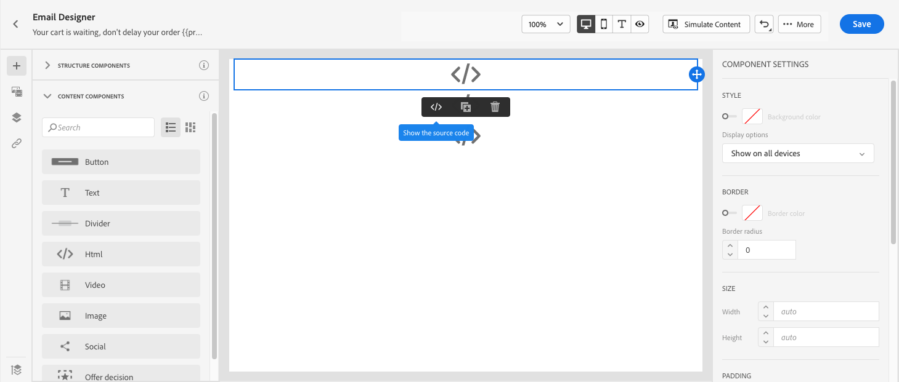
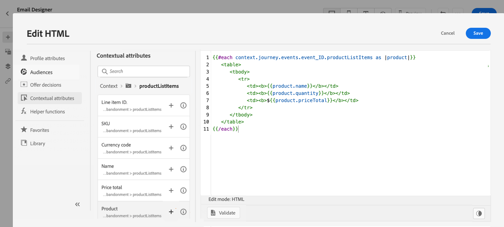

# Caso di utilizzo di Personalization: e-mail di abbandono del carrello {#personalization-use-case-helper-functions}

In questo esempio personalizzerai il corpo di un messaggio e-mail. Questo messaggio è destinato ai clienti che hanno lasciato articoli nel carrello ma non hanno completato l’acquisto.

Puoi utilizzare i seguenti tipi di funzioni di assistenza:

* La funzione stringa `upperCase`, per inserire il nome del cliente in lettere maiuscole. [Ulteriori informazioni](functions/string.md#upper).
* Helper `each`, per elencare gli elementi presenti nel carrello. [Ulteriori informazioni](functions/helpers.md#each).
* Helper `if`, per inserire una nota specifica per il prodotto se il prodotto correlato è nel carrello. [Ulteriori informazioni](functions/helpers.md#if-function).
<!-- **Context**: personalization based on contextual data from the journey -->

➡️ [Scopri come utilizzare le funzioni di assistenza in questo video](#video)

Prima di iniziare, assicurati di sapere come configurare questi elementi:

* Un evento unitario. [Ulteriori informazioni](../event/about-events.md).
* Un percorso che inizia con un evento. [Ulteriori informazioni](../building-journeys/using-the-journey-designer.md).
* Un messaggio e-mail nel percorso. [Ulteriori informazioni](../email/create-email.md)
* Corpo di un’e-mail. [Ulteriori informazioni](../email/content-from-scratch.md).

Segui questi passaggi:

1. [Creare l&#39;evento iniziale e il percorso](#create-context).
1. [Crea un messaggio e-mail](#configure-email).
1. [Inserire il nome del cliente in lettere maiuscole](#uppercase-function).
1. [Aggiungi il contenuto del carrello all&#39;e-mail](#each-helper).
1. [Inserire una nota specifica per il prodotto](#if-helper).
1. [Verifica e pubblica il percorso](#test-and-publish).

## Passaggio 1: creare l’evento iniziale e il percorso correlato {#create-context}

Il contenuto del carrello è un’informazione contestuale proveniente dal percorso. Pertanto, è necessario aggiungere un evento iniziale e l’e-mail a un percorso prima di poter aggiungere all’e-mail informazioni specifiche per il carrello.

1. Creare un evento il cui schema include l&#39;array `productListItems`.
1. Definisci tutti i campi di questo array come campi payload per questo evento.

   Ulteriori informazioni sul tipo di dati dell&#39;elemento dell&#39;elenco prodotti nella [documentazione di Adobe Experience Platform](https://experienceleague.adobe.com/docs/experience-platform/xdm/data-types/product-list-item.html?lang=it){target="_blank"}.

1. Crea un percorso che inizia con questo evento.
1. Aggiungi un&#39;attività **E-mail** al percorso.

   

## Passaggio 2: creare l’e-mail{#configure-email}

1. Nell&#39;attività **E-mail**, fai clic su **[!UICONTROL Modifica contenuto]**, quindi su **[!UICONTROL E-mail Designer]**.

   

1. Dalla palette a sinistra della home page di E-mail Designer, trascina e rilascia tre componenti struttura sul corpo del messaggio.

1. Trascina e rilascia un componente di contenuto HTML su ciascun nuovo componente struttura.

   

## Passaggio 3: inserire il nome del cliente in lettere maiuscole {#uppercase-function}

1. Nella home page di E-mail Designer, fai clic sul componente HTML in cui desideri aggiungere il nome del cliente.
1. Sulla barra degli strumenti contestuale fare clic su **[!UICONTROL Mostra codice sorgente]**.

   

1. Nella finestra **[!UICONTROL Modifica HTML]**, aggiungi la funzione stringa `upperCase`:
   1. Nel menu a sinistra, seleziona **[!UICONTROL Funzioni helper]**.
   1. Utilizza il campo di ricerca per trovare &quot;maiuscolo&quot;.
   1. Aggiungere la funzione `upperCase` dai risultati della ricerca. A tale scopo, fare clic sul segno più (+) accanto a `: string`.

      L’editor espressioni mostra questa espressione:

      ```handlebars
      
      ```

      

1. Rimuovi il segnaposto &quot;stringa&quot; dall’espressione.
1. Aggiungi il token di nome:
   1. Nel menu a sinistra, seleziona **[!UICONTROL Attributi del profilo]**.
   1. Selezionare **[!UICONTROL Persona]** > **[!UICONTROL Nome completo]**.
   1. Aggiungi il token **[!UICONTROL First name]** all&#39;espressione.

      L’editor espressioni mostra questa espressione:

      ```handlebars
      
      ```

      

      Ulteriori informazioni sul tipo di dati del nome della persona nella [documentazione di Adobe Experience Platform](https://experienceleague.adobe.com/docs/experience-platform/xdm/data-types/person-name.html?lang=it){target="_blank"}.

1. Fai clic su **[!UICONTROL Convalida]**, quindi su **[!UICONTROL Salva]**.

   

1. Salva il messaggio.

## Passaggio 4: inserire l’elenco degli articoli dal carrello {#each-helper}

<!--This step demonstrates iterating over event data. For comprehensive examples of iterating over different data sources (events, custom action responses, and other contextual data), see [Iterate over contextual data with Handlebars](personalization-contexts.md).-->

1. Riapri il contenuto del messaggio.

1. Nella pagina Home di E-mail Designer, fai clic sul componente HTML in cui desideri elencare il contenuto del carrello.
1. Sulla barra degli strumenti contestuale fare clic su **[!UICONTROL Mostra codice sorgente]**.

   

1. Nella finestra **[!UICONTROL Modifica HTML]**, aggiungi l&#39;helper `each`:
   1. Nel menu a sinistra, seleziona **[!UICONTROL Funzioni helper]**.
   1. Utilizza il campo di ricerca per trovare &quot;ciascuno&quot;.
   1. Aggiungere l&#39;helper `each` dai risultati della ricerca.

      L’editor espressioni mostra questa espressione:

      ```handlebars
      {{#each someArray as |variable|}} {{/each}}
      ```

      

1. Aggiungere l&#39;array `productListItems` all&#39;espressione:

   1. Rimuovi il segnaposto &quot;someArray&quot; dall’espressione.
   1. Nel menu a sinistra, seleziona **[!UICONTROL Attributi contestuali]**.

      **[!UICONTROL Gli attributi contestuali]** sono disponibili solo dopo che il contesto di percorso è stato passato al messaggio.

   1. Seleziona **[!UICONTROL Journey Optimizer]** > **[!UICONTROL Events]** > ***[!UICONTROL event_name]***, quindi espandi il nodo **[!UICONTROL productListItems]**.

      In questo esempio, *nome_evento* rappresenta il nome dell&#39;evento.

   1. Aggiungi il token **[!UICONTROL Product]** all&#39;espressione.

      L’editor espressioni mostra questa espressione:

      ```handlebars
      {{#each context.journey.events.event_ID.productListItems.product as |variable|}} {{/each}}
      ```

      In questo esempio, *event_ID* rappresenta l&#39;ID dell&#39;evento.

      

   1. Modifica l’espressione:
      1. Rimuovi la stringa &quot;.product&quot;.
      1. Sostituisci il segnaposto &quot;variable&quot; con &quot;product&quot;.

      Questo esempio mostra l’espressione modificata:

      ```handlebars
      {{#each context.journey.events.event_ID.productListItems as |product|}}
      ```

1. Incolla questo codice tra il tag di apertura `{{#each}}` e il tag di chiusura `{/each}}`:

   ```html
   <table>
      <tbody>
         <tr>
            <td><b>#name</b></td>
            <td><b>#quantity</b></td>
            <td><b>$#priceTotal</b></td>
         </tr>
      </tbody>
   </table>
   ```

1. Aggiungi i token di personalizzazione per il nome dell’articolo, la quantità e il prezzo:

   1. Rimuovi il segnaposto &quot;#name&quot; dalla tabella HTML.
   1. Dai risultati della ricerca precedente, aggiungi il token **[!UICONTROL Name]** all&#39;espressione.

   Ripeti questi passaggi due volte:

   * Sostituisci il segnaposto &quot;#quantity&quot; con il token **[!UICONTROL Quantity]**.
   * Sostituisci il segnaposto &quot;#priceTotal&quot; con il token **[!UICONTROL Total price]**.

   Questo esempio mostra l’espressione modificata:

   ```handlebars
   {{#each context.journey.events.event_ID.productListItems as |product|}}
      <table>
         <tbody>
            <tr>
            <td><b>{{product.name}}</b></td>
            <td><b>{{product.quantity}}</b></td>
            <td><b>${{product.priceTotal}}</b></td>
            </tr>
         </tbody>
      </table>
   {{/each}}
   ```

1. Fai clic su **[!UICONTROL Convalida]**, quindi su **[!UICONTROL Salva]**.

   

## Passaggio 5: inserire una nota specifica per il prodotto {#if-helper}

1. Nella home page di E-mail Designer, fai clic sul componente HTML in cui desideri inserire la nota.
1. Sulla barra degli strumenti contestuale fare clic su **[!UICONTROL Mostra codice sorgente]**.

   

1. Nella finestra **[!UICONTROL Modifica HTML]**, aggiungi l&#39;helper `if`:
   1. Nel menu a sinistra, seleziona **[!UICONTROL Funzioni helper]**.
   1. Utilizza il campo di ricerca per trovare &quot;if&quot;.
   1. Aggiungere l&#39;helper `if` dai risultati della ricerca.

      L’editor espressioni mostra questa espressione:

      ```handlebars
       render_1
          render_2
          default_render
      
      ```

      

1. Rimuovi questa condizione dall’espressione:

   ```handlebars
    render_2
   ```

   Questo esempio mostra l’espressione modificata:

   ```handlebars
    render_1
       default_render
   
   ```

1. Aggiungi il token del nome del prodotto alla condizione:
   1. Rimuovi il segnaposto &quot;condition1&quot; dall’espressione.
   1. Nel menu a sinistra, seleziona **[!UICONTROL Attributi contestuali]**.
   1. Seleziona **[!UICONTROL Journey Orchestration]** > **[!UICONTROL Events]** > ***[!UICONTROL event_name]***, quindi espandi il nodo **[!UICONTROL productListItems]**.

      In questo esempio, *nome_evento* rappresenta il nome dell&#39;evento.

   1. Aggiungi il token **[!UICONTROL Name]** all&#39;espressione.

      L’editor espressioni mostra questa espressione:

      ```handlebars
      
         render_1
          default_render
      
      ```

      

1. Modifica l’espressione:
   1. Nell&#39;editor espressioni specificare il nome del prodotto dopo il token `name`.

      Utilizza questa sintassi, in cui *product_name* rappresenta il nome del prodotto:

      ```javascript
      = "product_name"
      ```

      In questo esempio, il nome del prodotto è &quot;Juno Jacket&quot;:

      ```handlebars
      
         render_1
          default_render
      
      ```

   1. Sostituite il segnaposto &quot;render_1&quot; con il testo della nota.

      Esempio:

      ```handlebars
      
         Due to longer than usual lead times on the Juno Jacket, please expect item to ship two weeks after purchase.
          default_render
      
      ```

   1. Rimuovi il segnaposto &quot;default_render&quot; dall’espressione.
1. Fai clic su **[!UICONTROL Convalida]**, quindi su **[!UICONTROL Salva]**.

   

1. Salva il messaggio.

## Passaggio 6: testare e pubblicare il percorso {#test-and-publish}

1. Attiva il **[!UICONTROL Test]**, quindi fai clic su **[!UICONTROL Attiva un evento]**.

   

1. Nella finestra **[!UICONTROL Configurazione evento]**, immetti i valori di input, quindi fai clic su **[!UICONTROL Invia]**.

   La modalità di test funziona solo con i profili di test.

   

   L’e-mail viene inviata all’indirizzo del profilo di test.

   In questo esempio, l’e-mail contiene la nota sulla Giacca Juno, perché questo prodotto si trova nel carrello:

   

1. Verifica che non vi sia alcun errore, quindi pubblica il percorso.


## Argomenti correlati {#related-topics}

### Funzioni Handlebars {#handlebars}

* [Helper](functions/helpers.md)

* [Funzioni stringa](functions/string.md)

### Casi d’uso {#use-case}

* [Personalization con informazioni di profilo, contesto e offerta](personalization-use-case.md)

* [Personalization con offerta basata su decisioni](../offers/offers-e2e.md)

## Video dimostrativo{#video}

Scopri come utilizzare le funzioni di assistenza.

>[!VIDEO](https://video.tv.adobe.com/v/3416645?captions=ita&quality=12)
