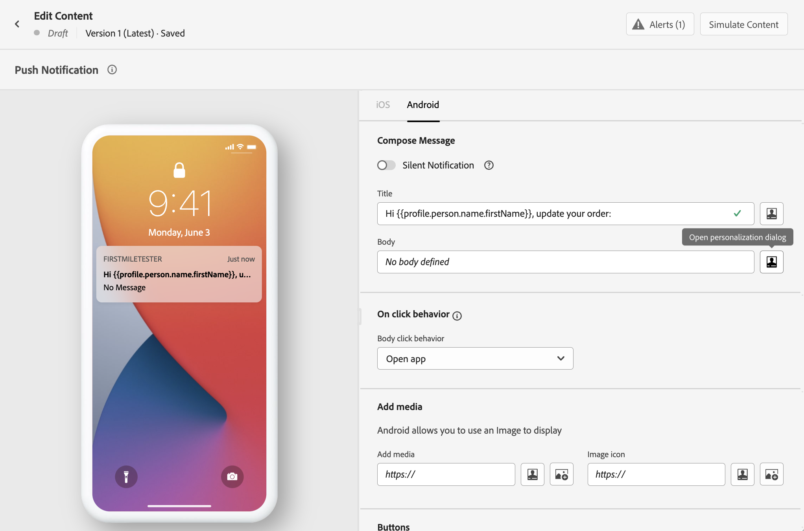

# Caso di utilizzo della personalizzazione: notifica dello stato dell&#39;ordine {#personalization-use-case}

In questo caso d’uso, vedrai come utilizzare più tipi di personalizzazione in un singolo messaggio di notifica push. Verranno utilizzati tre tipi di personalizzazione:

* **Profilo**: personalizzazione dei messaggi in base a un campo del profilo
* **Decisione** di offerta: personalizzazione basata su variabili di offer decisioning
* **Contesto**: personalizzazione basata sui dati contestuali del percorso

L&#39;obiettivo di questo esempio è quello di inviare un evento a [!DNL Journey Optimizer] ogni volta che un ordine del cliente viene aggiornato. Viene quindi inviata al cliente una notifica push con informazioni sull’ordine e un’offerta personalizzata.

Per questo caso d’uso sono necessari i seguenti prerequisiti:

* crea e progetta un messaggio di notifica push, senza pubblicarlo. Fare riferimento a questa sezione [sezione](../create-message.md).
* configura un evento ordine, che include il numero dell&#39;ordine, lo stato e il nome dell&#39;articolo. Fare riferimento a questa sezione [sezione](../event/about-events.md).
* crea una decisione (precedentemente nota come &quot;attività di offerta&quot;), fai riferimento a questa [sezione](../offers/offer-activities/create-offer-activities.md).

## Passaggio 1: aggiungere la personalizzazione sul profilo

1. Fai clic sul menu **[!UICONTROL Message]** e seleziona il messaggio.

   

1. Fai clic sul campo **Titolo** .

   

1. Digita l’oggetto e aggiungi la personalizzazione del profilo. Utilizza la barra di ricerca per trovare il campo del nome del profilo. Nel testo dell’oggetto, posiziona il cursore nel punto in cui desideri inserire il campo di personalizzazione e fai clic sull’icona **+** . Fai clic su **Salva**.

   

   >[!NOTE]
   >
   >Lascia il messaggio in bozza. Non pubblicarlo ancora.

## Passaggio 2: creare il percorso

1. Fai clic sul menu **[!UICONTROL Journeys]** e crea un nuovo percorso.

   

1. Aggiungi l&#39;evento di ingresso, un&#39;attività **Message** e un&#39;attività **End**.

   

1. Nell’attività **Messaggio** , seleziona il messaggio creato in precedenza. Fare clic su **Ok**.

   

   Viene visualizzato un messaggio per informarti che al messaggio sono stati passati i dati dell’evento di immissione e le proprietà del percorso.

   

   >[!NOTE]
   >
   >Il messaggio viene visualizzato con un’icona di avviso. Questo perché il messaggio non è ancora stato pubblicato.

## Passaggio 3: aggiungere la personalizzazione sui dati contestuali

1. Dall&#39;attività **Messaggio**, fai clic sull&#39;icona **Apri il messaggio**. Il messaggio viene visualizzato in una nuova scheda.

   

1. Fai clic sul campo **Titolo** .

   

1. Seleziona la categoria **Contesto** . Questo elemento è disponibile solo se un percorso ha trasmesso dati contestuali al messaggio. Fare clic su **Journey Orchestration**. Vengono visualizzate le seguenti informazioni contestuali:

   * **Eventi**: questa categoria raggruppa tutti i campi degli eventi posizionati prima dell’attività  **** Messaggio nel percorso.
   * **Proprietà** percorso: i campi tecnici relativi al percorso per un determinato profilo, ad esempio l’ID percorso o gli errori specifici rilevati. Consulta la [documentazione del Journey Orchestration](https://experienceleague.adobe.com/docs/journeys/using/building-advanced-conditions-journeys/syntax/journey-properties.html#building-advanced-conditions-journeys).

   

1. Espandi l’elemento **Eventi** e cerca il campo relativo al numero dell’ordine relativo all’evento. È inoltre possibile utilizzare la casella di ricerca. Fai clic sull’icona **+** per inserire il campo di personalizzazione nel testo dell’oggetto. Fai clic su **Salva**.

   

1. Ora fai clic sul campo **Corpo** .

   

1. Digita il messaggio e inserisci, dalla categoria **Contesto**, il nome dell&#39;articolo dell&#39;ordine e l&#39;avanzamento dell&#39;ordine.

   

1. Dal menu a discesa, seleziona **Decisione offerta** per inserire una variabile di offer decisioning. Seleziona il posizionamento e fai clic sull’icona **+** accanto alla decisione (precedentemente nota come &quot;attività di offerta&quot;) per aggiungerlo al corpo.

   

1. Fai clic su convalida per assicurarti che non ci siano errori e fai clic su **Salva**.

   

1. Ora pubblica il messaggio.

   

## Passaggio 4: testare e pubblicare il percorso

1. Apri di nuovo il percorso. Se il percorso è già aperto, assicurati di aggiornare la pagina. Ora che il messaggio è pubblicato, puoi vedere che non vi è alcun errore nel percorso. Fai clic sul pulsante **Test**, quindi fai clic su **Attiva un evento**.

   

1. Immetti i diversi valori da passare nel test. La modalità di test funziona solo con i profili di test. L’identificatore del profilo deve corrispondere a un profilo di test. Fare clic su **Invia**.

   

   La notifica push viene inviata e visualizzata sul telefono cellulare del profilo di test.

   

1. Verifica che non vi siano errori e pubblica il percorso.

