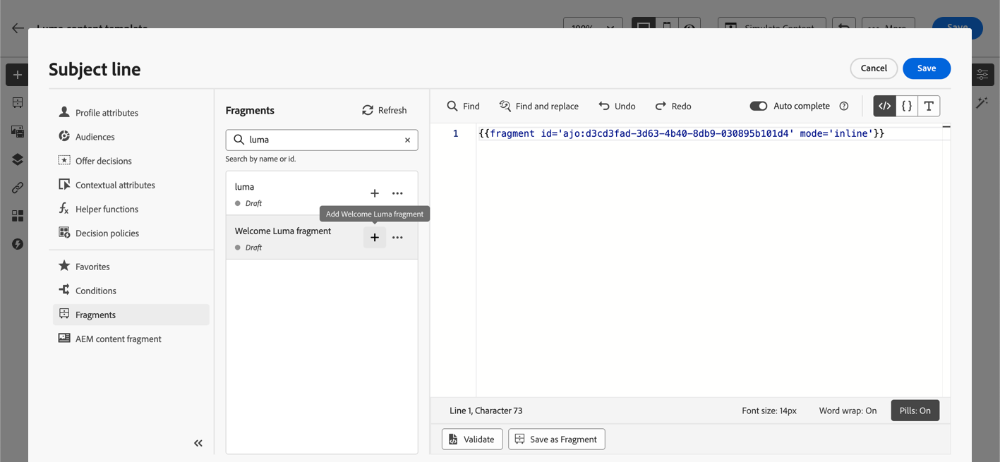
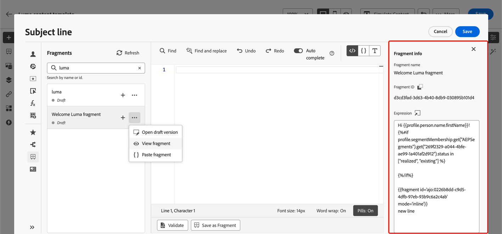

# Sfruttare i frammenti di espressione {#use-expression-fragments}

Quando utilizzi l&#39;**editor di personalizzazione**, puoi sfruttare tutti i frammenti di espressione creati o salvati nella sandbox corrente.

Un frammento è un componente riutilizzabile a cui è possibile fare riferimento in [!DNL Journey Optimizer] campagne e percorsi. Questa funzionalità consente di precreare più blocchi di contenuto personalizzati che possono essere utilizzati dagli utenti di marketing per assemblare rapidamente i contenuti in un processo di progettazione migliorato. [Ulteriori informazioni sui frammenti](../content-management/fragments.md)

➡️ [Scopri come gestire, creare e utilizzare i frammenti in questo video](../content-management/fragments.md#video-fragments)

## Utilizzare un frammento di espressione {#use-expression-fragment}

Per aggiungere frammenti di espressione al contenuto, segui i passaggi seguenti.

>[!NOTE]
>
>Puoi aggiungere fino a 30 frammenti in una determinata consegna. I frammenti possono essere nidificati solo fino a un livello.

1. Apri [l&#39;editor di personalizzazione](personalization-build-expressions.md) e seleziona il pulsante **[!UICONTROL Frammenti]** nel riquadro a sinistra.

   Nell’elenco vengono visualizzati tutti i frammenti di espressione creati o salvati come frammenti nella sandbox corrente. [Scopri come creare frammenti](../content-management/create-fragments.md)
Sono ordinati per data di creazione: i frammenti di espressione aggiunti di recente vengono visualizzati per primi nell’elenco.

   

   Puoi anche aggiornare questo elenco.

   >[!NOTE]
   >
   >Se alcuni frammenti sono stati modificati o aggiunti durante la modifica del contenuto, l’elenco verrà aggiornato con le modifiche più recenti.

1. Fai clic sull’icona + accanto a un frammento di espressione per inserire nell’editor l’ID frammento corrispondente.

   

   >[!CAUTION]
   >
   >Puoi aggiungere al contenuto qualsiasi frammento **Bozza** o **Live**. Tuttavia, non potrai attivare il percorso o la campagna se al suo interno viene utilizzato un frammento con lo stato **Bozza**. Durante la pubblicazione di un percorso o di una campagna, i frammenti bozza mostreranno un errore e dovrai approvarli per poterli pubblicare.

1. Una volta aggiunto l&#39;ID frammento, se apri il frammento di espressione corrispondente e lo [modifichi](../content-management/manage-fragments.md#edit-fragments) dall&#39;interfaccia, le modifiche vengono sincronizzate. Vengono propagati automaticamente a tutte le bozze o ai percorsi/campagne live che contengono tale ID frammento.

1. Fai clic sul pulsante **[!UICONTROL Altre azioni]** accanto a un frammento. Dal menu contestuale visualizzato, selezionare **[!UICONTROL Visualizza frammento]** per ottenere ulteriori informazioni sul frammento. Viene visualizzato anche l&#39;**[!UICONTROL ID frammento]** che può essere copiato da qui.

   

1. Puoi aprire il frammento di espressione in un&#39;altra finestra per modificarne il contenuto e le proprietà utilizzando l&#39;opzione **[!UICONTROL Apri frammento]** nel menu contestuale o dal riquadro **[!UICONTROL Informazioni frammento]**. [Scopri come modificare un frammento](../content-management/manage-fragments.md#edit-fragments)

   

1. Potrai quindi personalizzare e convalidare i contenuti come di consueto utilizzando tutte le funzionalità di personalizzazione e authoring dell&#39;[editor di personalizzazione](personalization-build-expressions.md).

1. In alcuni casi, è necessario calcolare solo le variabili, quindi potrebbe essere utile nascondere il contenuto del frammento di espressione. A tale scopo, utilizzare l&#39;attributo `render` e impostarlo su `false`. Ad esempio:

   ```
   Hi {{profile.person.name.firstName|fragment id='ajo:fragmentId/variantId' mode ='inline' render=false}}
   ```

>[!NOTE]
>
>Se crei un frammento di espressione che contiene più interruzioni di riga e lo utilizzi nel contenuto [SMS](../sms/create-sms.md#sms-content) o [push](../push/design-push.md), le interruzioni di riga vengono mantenute. Assicurati quindi di verificare il messaggio [SMS](../sms/send-sms.md) o [push](../push/send-push.md) prima di inviarlo.

## Usa variabili implicite {#implicit-variables}

Le variabili implicite migliorano la funzionalità dei frammenti esistenti per migliorare l’efficienza in termini di riutilizzabilità dei contenuti e casi di utilizzo di script. I frammenti possono utilizzare variabili di input e creare variabili di output che possono essere utilizzate nel contenuto di campagne e percorsi.

Questa funzionalità può essere utilizzata, ad esempio, per inizializzare i parametri di tracciamento delle e-mail, in base alla campagna o al percorso corrente, e utilizzarli nei collegamenti personalizzati aggiunti al contenuto dell’e-mail.

Sono possibili i seguenti casi d’uso:

1. **Utilizzare variabili di input in un frammento.**

   Quando un frammento viene utilizzato in un contenuto di azione campagna/percorso, può sfruttare le variabili dichiarate al di fuori del frammento. Di seguito è riportato un esempio:

   

   Vediamo che sopra la variabile `utm_content` è dichiarata nel contenuto della campagna. Quando si utilizza il frammento **Blocco principale**, verrà visualizzato un collegamento a cui verrà aggiunto il valore del parametro `utm_content`. Risultato finale: `https://luma.enablementadobe.com?utm_campaign= Product_launch&utm_content= start_shopping`.

1. **Utilizzare variabili di output da un frammento.**

   Le variabili calcolate o definite all’interno di un frammento sono disponibili per l’utilizzo nel contenuto. Nell&#39;esempio seguente, un frammento **F1** dichiara un set di variabili:

   

   In un contenuto e-mail, puoi avere la seguente personalizzazione:

   

   Il frammento F1 inizializza le seguenti variabili: `utm_campaign` e `utm_content`. Al collegamento nel contenuto del messaggio verranno aggiunti questi parametri. Risultato finale: `https://luma.enablementadobe.com?utm_campaign= Product_launch&utm_content= start_shopping`.

>[!NOTE]
>
>In fase di runtime, il sistema espande il contenuto dei frammenti e quindi interpreta il codice di personalizzazione dall’alto verso il basso. Tenendo presente questo aspetto, è possibile ottenere casi d’uso più complessi. Ad esempio, puoi avere un frammento F1 che passa le variabili a un altro frammento F2 che si trova sotto. È inoltre possibile che un frammento visivo F1 passi delle variabili a un frammento di espressione nidificato F2.

## Utilizzare frammenti di espressione all’interno di cicli {#fragments-in-loops}

Quando si utilizzano frammenti di espressione nei cicli di `{{#each}}`, è importante comprendere come funziona l&#39;ambito delle variabili. I frammenti di espressione possono accedere alle variabili globali definite nel contenuto del messaggio, ma non possono ricevere variabili specifiche per il ciclo come parametri.

### Schema supportato: utilizza variabili globali {#global-variables-in-loops}

I frammenti di espressione possono fare riferimento a variabili globali definite all’esterno del frammento, anche quando il frammento viene chiamato dall’interno di un loop. Questo è l’approccio consigliato quando devi utilizzare frammenti in contesti iterativi.

**Esempio: utilizzo di un frammento con variabili globali all&#39;interno di un loop**

Nel contenuto del messaggio, definisci una variabile globale e utilizza un frammento che vi faccia riferimento:

```handlebars


{{#each context.journey.actions.GetProducts.items as |product|}}
  <div class="product">
    <h3>{{product.name}}</h3>
    <p>Price: ${{product.price}}</p>
    {{fragment id='ajo:fragment123/variant456' mode='inline'}}
  </div>
{{/each}}
```

Nel frammento di espressione (fragment123), è possibile fare riferimento alla variabile `globalDiscount`:

```handlebars
<p class="discount-info">Save {{globalDiscount}}% on all items!</p>
```

Questo modello funziona perché la variabile globale è accessibile in tutto il messaggio, inclusi i frammenti, indipendentemente dal contesto del loop.

### Non supportato: passaggio delle variabili di loop come parametri di frammento {#loop-variables-limitations}

Impossibile passare l&#39;elemento di iterazione corrente (ad esempio `product` nell&#39;esempio precedente) come parametro a un frammento di espressione. Il frammento non può accedere direttamente alle variabili con ambito di loop dal blocco `{{#each}}` circostante.

**Esempio: cosa NON funziona**

```handlebars
{{#each context.journey.actions.GetProducts.items as |product|}}
  <!-- This will NOT work as expected -->
  {{fragment id='ajo:fragment123/variant456' mode='inline' currentProduct=product}}
{{/each}}
```

Il frammento non può ricevere `product` come parametro e utilizzarlo internamente perché il passaggio del parametro per variabili specifiche del ciclo non è supportato nell&#39;implementazione corrente.

### Soluzioni consigliate {#fragments-in-loops-workarounds}

Quando devi utilizzare frammenti di espressione con dati provenienti da un ciclo, considera questi approcci:

1. **Includi la logica direttamente nel messaggio**: anziché utilizzare un frammento per la logica specifica del ciclo, aggiungi il codice di personalizzazione direttamente nel blocco `{{#each}}`.

   ```handlebars
   {{#each context.journey.actions.GetProducts.items as |product|}}
     <div class="product">
       <h3>{{product.name}}</h3>
       <p>Price: ${{product.price}}</p>
       {{#if product.price > 100}}
         <span class="premium-badge">Premium Product</span>
       {{/if}}
     </div>
   {{/each}}
   ```

2. **Usa frammenti all&#39;esterno di cicli**: se il contenuto del frammento non è dipendente dal ciclo, chiamare il frammento prima o dopo il blocco dell&#39;iterazione.

   ```handlebars
   {{fragment id='ajo:fragment123/variant456' mode='inline'}}
   
   {{#each context.journey.actions.GetProducts.items as |product|}}
     <div class="product">
       <h3>{{product.name}}</h3>
       <p>Price: ${{product.price}}</p>
     </div>
   {{/each}}
   ```

3. **Imposta più variabili globali**: se devi passare valori diversi a un frammento in più iterazioni, imposta le variabili globali prima di ogni chiamata al frammento (anche se questo limita la flessibilità).

>[!NOTE]
>
>Per l&#39;iterazione dei dati contestuali e l&#39;utilizzo dei loop, vedere la guida completa sull&#39;[iterazione dei dati contestuali](iterate-contextual-data.md), che include best practice, suggerimenti per la risoluzione dei problemi e modelli avanzati.

## Personalizza campi modificabili {#customize-fields}

Se alcune parti di un frammento di espressione sono state rese modificabili utilizzando le variabili, è possibile sovrascrivere i relativi valori predefiniti utilizzando una sintassi specifica. [Scopri come rendere personalizzabili i tuoi frammenti](../content-management/customizable-fragments.md)

Per personalizzare i campi, effettua le seguenti operazioni:

1. Inserisci il frammento nel codice dal menu **[!UICONTROL Frammenti]**.

1. Utilizzare il codice `<fieldId>="<value>"` alla fine della sintassi per sostituire il valore predefinito della variabile.

   Nell’esempio seguente, sostituiamo il valore di una variabile il cui ID è &quot;sports&quot; con il valore &quot;yoga&quot;. Questo visualizzerà lo &quot;yoga&quot; nel contenuto del frammento in tutti i casi in cui si fa riferimento alla variabile &quot;sport&quot;.

   

Un esempio che mostra come aggiungere campi modificabili in un frammento di espressione e ignorarne i valori durante la creazione di un messaggio e-mail è disponibile in [questa sezione](../content-management/customizable-fragments.md#example).

## Interrompi ereditarietà {#break-inheritance}

Quando si aggiunge un ID frammento all’editor di personalizzazione, le modifiche apportate al frammento di espressione originale vengono sincronizzate.

Tuttavia, puoi anche incollare il contenuto di un frammento di espressione nell’editor. Dal menu contestuale, seleziona **[!UICONTROL Incolla frammento]** per inserire tale contenuto.


In tal caso, l’ereditarietà dal frammento originale è interrotta. Il contenuto del frammento viene copiato nell’editor e le modifiche non vengono più sincronizzate.

Diventa un elemento autonomo non più collegato al frammento originale; puoi modificarlo come qualsiasi altro elemento nel codice.

