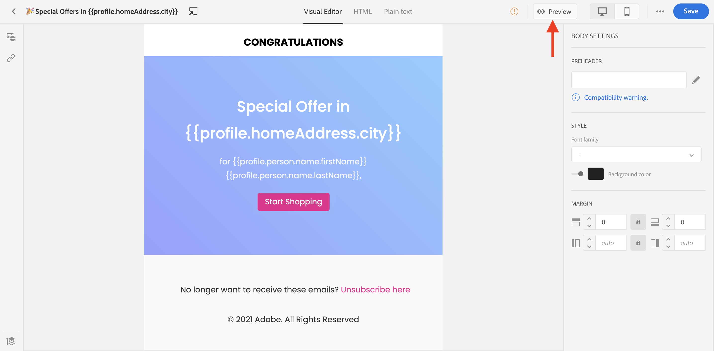
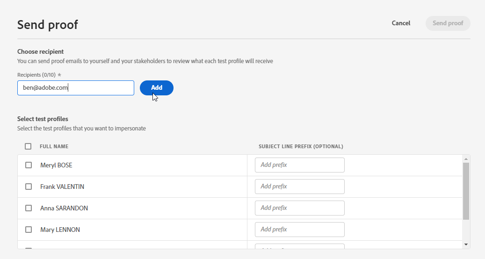

# Anteprima e verifica dei messaggi{#preview-and-proof}

Una volta definito il contenuto del messaggio, puoi utilizzare i profili di test per visualizzarlo in anteprima e testarlo. Se hai inserito [contenuti personalizzati](personalization/personalize.md), potrai controllare come questo contenuto viene visualizzato nel messaggio, sfruttando i dati del profilo di test.

Per rilevare eventuali errori nel contenuto delle e-mail o nelle impostazioni di personalizzazione, invia delle bozze ai profili di test. Per convalidare il contenuto più recente, è necessario inviare una bozza ogni volta che viene apportata una modifica.

>[!CAUTION]
>
>Per visualizzare l’anteprima dei messaggi e inviare delle bozze, devi disporre dei profili di test.
>
>Scopri come creare profili di test in [questa pagina](building-journeys/creating-test-profiles.md).

Per testare il contenuto del messaggio, devi:

* [seleziona profili di test](#select-test-profiles)
* [controlla l’anteprima del messaggio](#preview-your-messages)

Potrai quindi [inviare bozze](#send-proofs) ai profili di test.

Inoltre, sfrutta i **Litmo** tenere conto [!DNL Journey Optimizer] per visualizzare istantaneamente l&#39;anteprima del **rendering di e-mail** nei client e-mail popolari. Puoi quindi verificare che il contenuto dell’e-mail sia eccellente e funzioni correttamente in ogni casella in entrata. Scopri come sbloccare le anteprime e-mail di Litmus in [questa sezione](#email-rendering)

>[!CAUTION]
>
>Quando visualizzi in anteprima un messaggio o invii bozze, vengono visualizzati solo i dati di personalizzazione del profilo. La personalizzazione basata sui dati contestuali, ad esempio le informazioni sull’evento, può essere testata solo nel contesto di un percorso. Scopri come verificare la personalizzazione in [questo caso d&#39;uso](personalization/personalization-use-case.md).

➡️ [Scopri come visualizzare in anteprima, verificare e pubblicare il tuo messaggio e-mail in questo video](#video-preview)

## Selezionare i profili di test{#select-test-profiles}

>[!CONTEXTUALHELP]
>id="ac_preview_testprofiles"
>title="Anteprima e verifica dei messaggi"
>abstract="Una volta definito il contenuto del messaggio, puoi utilizzare i profili di test per visualizzarlo in anteprima e testarlo."
>additional-url="https://experienceleague.adobe.com/docs/journey-optimizer/using/create-messages/create-message/preview.html?lang=en#email-rendering" text="Rendering di e-mail"
>additional-url="https://experienceleague.adobe.com/docs/journey-optimizer/using/create-messages/create-message/preview.html?lang=en#preview-your-messages" text="Anteprima"

Utilizzo [Profili di test](building-journeys/creating-test-profiles.md) per eseguire il targeting di altri destinatari che non soddisfano i criteri di targeting definiti.

Per selezionare i profili di test, segui i passaggi seguenti:

1. Nell’interfaccia dei messaggi o nella finestra di progettazione e-mail, fai clic sul pulsante **[!UICONTROL Show preview]** per accedere alla selezione del profilo di test.

   

1. Seleziona lo spazio dei nomi da utilizzare per identificare i profili di test facendo clic sul pulsante **[!UICONTROL Identity namespace]** icona di selezione.

   

   Ulteriori informazioni sui namespace delle identità Adobe Experience Platform [in questa sezione](get-started-identity.md){target=&quot;_blank&quot;}.

   Nell’esempio seguente, utilizzeremo il **E-mail** spazio dei nomi.

1. Utilizza il campo di ricerca per trovare lo spazio dei nomi, selezionalo e fai clic su **[!UICONTROL Select]**

   

1. Immetti il valore per identificare il profilo di test e fai clic su **[!UICONTROL Find test profile]**.

   

1. Se hai aggiunto la personalizzazione nel messaggio, aggiungi altri profili in modo da poter testare diverse varianti del messaggio in base ai dati del profilo. Una volta aggiunti, i profili sono elencati nei campi di selezione.

   

   In base agli elementi di personalizzazione dei messaggi, questo elenco visualizza i dati per ciascun profilo di test nelle colonne correlate.

## Anteprima dei messaggi{#preview-your-messages}

Una volta [profili di test](#select-test-profiles) sono selezionati, è possibile visualizzare in anteprima i messaggi e controllare il contenuto.

1. Fai clic sul pulsante **[!UICONTROL Preview]** per testare il messaggio.

1. Seleziona un profilo di test. Puoi controllare i valori disponibili nelle colonne. Utilizza le frecce destra/sinistra per sfogliare i dati.

   

1. Fai clic sul pulsante **[!UICONTROL Select data]** , sopra l’elenco per aggiungere o rimuovere colonne.

   

   Puoi visualizzare i campi di personalizzazione specifici per il messaggio corrente alla fine dell’elenco. In questo esempio, la città del profilo, il nome e il cognome. Seleziona tali campi e assicurati che questi valori siano popolati nei profili di test.

1. Nell’anteprima dei messaggi, gli elementi personalizzati vengono sostituiti dai dati del profilo di test selezionati.

   Ad esempio, per questo messaggio, sia il contenuto dell’e-mail che l’oggetto dell’e-mail sono personalizzati:

   

1. Seleziona altri profili di test per visualizzare in anteprima il rendering delle e-mail per ogni variante del messaggio.

Per un&#39;anteprima di notifica push:

1. Passa alla **[!UICONTROL Push]** dal canale **[!UICONTROL Channels]** elenco a discesa in alto a destra **[!UICONTROL Preview]** schermo.

   

1. Applica gli stessi passaggi descritti in precedenza per selezionare un profilo di test e seleziona il tipo di dispositivo per visualizzare in anteprima il contenuto: **[!UICONTROL iOS]** o **[!UICONTROL Android]**

   

1. Nell’anteprima push, i dati del profilo di test vengono utilizzati nel contenuto del messaggio.

   Ad esempio, per questa notifica push, titolo e corpo sono personalizzati:

   

## Invia bozze{#send-proofs}

Una bozza è un messaggio specifico che ti consente di testare un messaggio prima di inviarlo al pubblico principale. I destinatari della bozza hanno il compito di approvare il messaggio: rendering, contenuto, impostazioni di personalizzazione, configurazione.

Una volta [profili di test](#select-test-profiles) sono selezionati, è possibile inviare bozze.

1. In **[!UICONTROL Preview]** fai clic su **[!UICONTROL Send proof]** pulsante .

   

1. Da **[!UICONTROL Send proof]** finestra, digita l’e-mail del destinatario e fai clic su **[!UICONTROL Add]** per inviare la bozza a te stesso o ai membri delle tue organizzazioni.

   Puoi aggiungere fino a dieci destinatari per la consegna delle prove.

   

1. Quindi, seleziona la **Profili di test** che verrà utilizzato per personalizzare il contenuto del messaggio.

   Ogni destinatario della bozza riceverà altrettanti messaggi del numero di profili di test selezionati. Ad esempio, se hai aggiunto cinque e-mail del destinatario e hai selezionato dieci profili di test, invierai cinquanta messaggi a prova di errore e ogni destinatario ne riceverà dieci.

1. Se necessario, puoi aggiungere un prefisso alla riga dell’oggetto della bozza. Solo caratteri alfanumerici e caratteri speciali, ad esempio . - _ ( ) [ ], sono consentiti come prefisso alla riga dell’oggetto.

1. Fai clic su **[!UICONTROL Send proof]**.

   

1. Indietro nel  **[!UICONTROL Preview]** fai clic su  **[!UICONTROL View proofs]** per controllare lo stato.

   

È consigliabile inviare bozze dopo ogni modifica al contenuto del messaggio.

>[!NOTE]
>
>Nella bozza inviata ai profili di test, il collegamento alla pagina speculare non è attivo. Viene attivato solo nei messaggi finali.

## Rendering di e-mail{#email-rendering}

Puoi sfruttare **Litmo** tenere conto [!DNL Journey Optimizer] per visualizzare istantaneamente l&#39;anteprima del **rendering di e-mail** nei client e-mail popolari.

Per accedere alle funzionalità di rendering di e-mail, devi:

* Avere un account Litmus
* [Selezionare i profili di test](#select-test-profiles)

Quindi, segui i passaggi seguenti:

1. In E-mail Designer, fai clic sul pulsante **[!UICONTROL Preview]** e seleziona il pulsante **[!UICONTROL Email rendering]** scheda .

1. Fai clic su **Collegare l&#39;account Litmus** nella parte superiore destra.

   

1. Immetti le tue credenziali e accedi.

   

1. Fai clic sul pulsante **Esegui test** per generare anteprime e-mail.

1. Controlla il contenuto delle tue e-mail nei popolari client desktop, mobili e basati su web.

   

>[!CAUTION]
>
>Quando si collega il **Litmo** account con [!DNL Journey Optimizer], l’utente accetta che i messaggi di prova siano inviati a Litmus: una volta inviate, queste e-mail non vengono più gestite da Adobe. Di conseguenza, i criteri di conservazione dei dati Litmus si applicano a queste e-mail, compresi i dati di personalizzazione che possono essere inclusi in questi messaggi di test.

## Video introduttivo{#video-preview}

Scopri come verificare il rendering delle e-mail nelle caselle in entrata, visualizzare in anteprima le e-mail personalizzate rispetto ai profili di test, inviare bozze e pubblicare le e-mail.

>[!VIDEO](https://video.tv.adobe.com/v/334239?quality=12)
