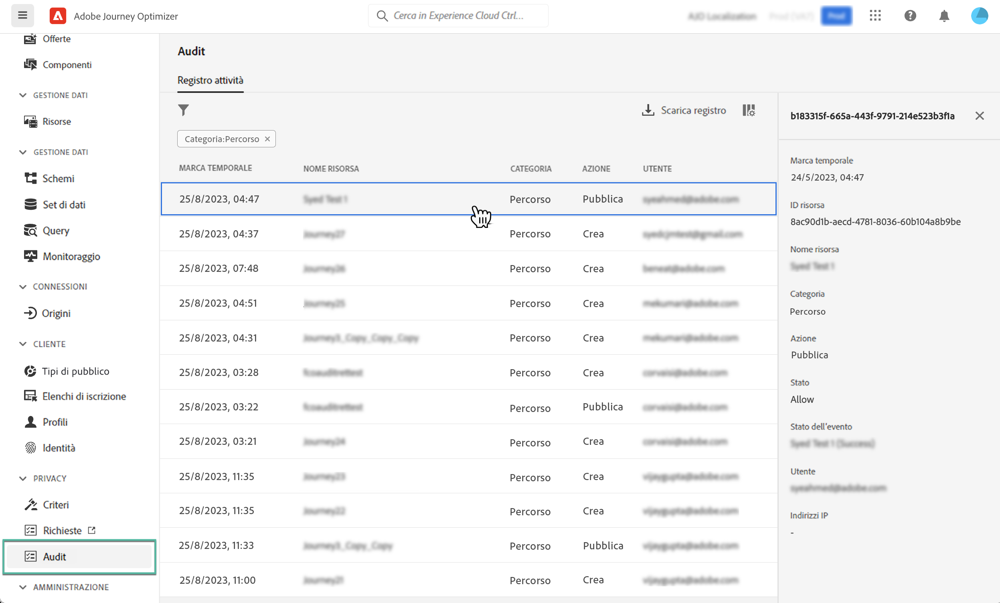

# Azioni di audit sulle risorse di Journey Optimizer {#track-changes}

## Informazioni sui registri di audit {#audit-logs}

>[!IMPORTANT]
>
>Per visualizzare ed esportare il registro di audit, è necessario disporre dell‘**[!DNL View User Activity Log]** autorizzazione. [Ulteriori informazioni](../administration/ootb-product-profiles.md)

Con Journey Optimizer puoi identificare le azioni eseguite dagli utenti nel sistema su vari servizi e funzionalità come percorsi, messaggi, pagine di destinazione, ecc.

Questo consente di aumentare la visibilità delle attività eseguite nel sistema, risolvere i problemi e aiutare la tua azienda a rispettare le normative e le politiche aziendali di gestione dei dati.

Ogni azione viene registrata con i metadati nei “registri di audit”, accessibili in Adobe Experience Platform. Per ulteriori informazioni sui registri di audit, tra cui come visualizzarli e gestirli nell’interfaccia utente o nell’API, consulta [Documentazione di Adobe Experience Platform](https://experienceleague.adobe.com/docs/experience-platform/landing/governance-privacy-security/audit-logs/overview.html?lang=it).

## Tipi di eventi acquisiti dai registri di audit {#events}

La tabella seguente illustra le azioni per le quali le risorse Journey Optimizer vengono registrate dai registri di audit. L’elenco completo delle azioni riportate nei registri di audit è disponibile nella [documentazione di Adobe Experience Platform](https://experienceleague.adobe.com/docs/experience-platform/landing/governance-privacy-security/audit-logs/overview.html?lang=it#category).

>[!NOTE]
>
>Registri di audit relativi a **gestione delle decisioni** sono visibili solo dal file CSV scaricabile tramite **[!UICONTROL Scarica registro]** pulsante.

| Risorsa | Azione |
|-----------|------------------|
| Campagna AJO | Crea / Elimina / Aggiorna / Attiva / Interrompi |
| Impostazione generale del canale AJO | Crea/Elimina/Aggiorna |
| Pool IP AJO | Crea/Elimina/Aggiorna |
| Pagina di destinazione AJO | Crea/Elimina/Aggiorna/Pubblica/Annulla pubblicazione |
| Modello HTML della pagina di destinazione AJO | Crea/Elimina/Aggiorna |
| Predefinito pagina di destinazione AJO | Crea/Elimina/Aggiorna |
| Sottodominio della pagina di destinazione AJO | Crea/Elimina/Aggiorna |
| Predefinito messaggio AJO | Crea/Elimina/Aggiorna |
| Record PTR AJO | Crea/Elimina/Aggiorna |
| Modello di espressione salvata AJO | Crea/Elimina/Aggiorna |
| Credenziali API SMS AJO | Crea/Elimina/Aggiorna |
| Sottodominio AJO | Crea/Elimina/Aggiorna |
| Elenco di soppressione AJO | Crea/Elimina/Scarica CSV |
| Gruppo di campi | Crea/Elimina/Aggiorna |
| Percorso | Crea/Elimina/Aggiorna/Arresta/Pubblica |
| Azione personalizzata percorso | Crea/Elimina/Aggiorna |
| Origine dati percorso | Crea/Elimina/Aggiorna |
| Evento percorso | Crea/Elimina/Aggiorna |
| Regola di frequenza dei messaggi | Crea/Elimina/Aggiorna |
| Strategia di classificazione | Crea/Elimina/Aggiorna |
