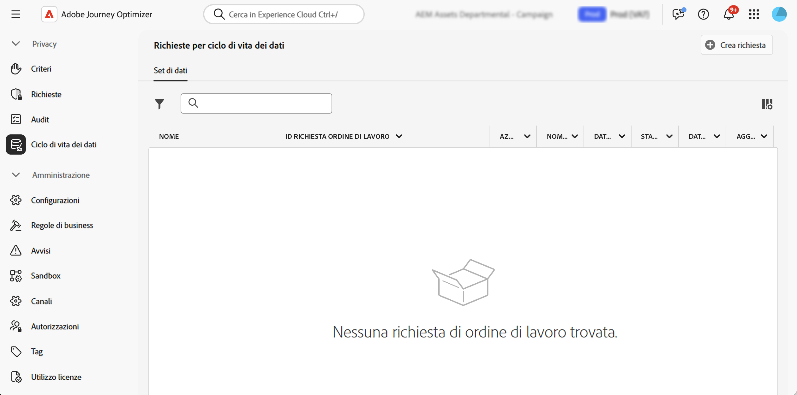

# Eseguire operazioni relative al ciclo di vita dei dati {#data-hygiene}

>[!AVAILABILITY]
>
>Le funzionalità relative al ciclo di vita dei dati sono attualmente disponibili solo per le organizzazioni che hanno acquistato le offerte aggiuntive **Healthcare Shield** e **Privacy and Security Shield**.

Man mano che i dati vengono continuamente acquisiti in Adobe Experience Platform, diventa fondamentale assicurarsi che vengano utilizzati come previsto, aggiornati quando necessario ed eliminati in base ai criteri organizzativi.

Queste attività possono essere eseguite utilizzando il menu **[!UICONTROL Ciclo di vita dei dati]** che consente di configurare e pianificare le operazioni del ciclo di vita dei dati, per la corretta manutenzione dei record.

## Consigli {#data-hygiene-recommendations}

Quando esegui operazioni di igiene dei dati (ad esempio l’eliminazione di identità o set di dati), tieni presente che gli eventi di consegna storici associati alle identità eliminate non verranno più visualizzati nei rapporti standard o nelle query di datalake. Questo può causare discrepanze tra il numero di e-mail segnalate come **Consegnate** e il numero di e-mail **Ricevute** nelle caselle in entrata dei destinatari, in particolare per i percorsi meno recenti.

Prima di eseguire eliminazioni su larga scala, convalida ed esporta tutti i dati di consegna o di reporting richiesti. Se è necessaria la riconciliazione dopo l’igiene dei dati, coordinati con il supporto Adobe per accedere ai registri archiviati o utilizzare le query del set di dati dell’Evento feedback dei messaggi per i dati recenti.

## Ulteriori informazioni {#data-hygiene-learn-more}

Per ulteriori informazioni su Privacy Service e su come seguire le operazioni relative al ciclo di vita dei dati, consulta la documentazione di Adobe Experience Platform:

* [Panoramica di Privacy Service](https://experienceleague.adobe.com/docs/experience-platform/privacy/home.html?lang=it)
* [Ciclo di vita dei dati in Adobe Experience Platform](https://experienceleague.adobe.com/docs/experience-platform/hygiene/home.html?lang=it)
