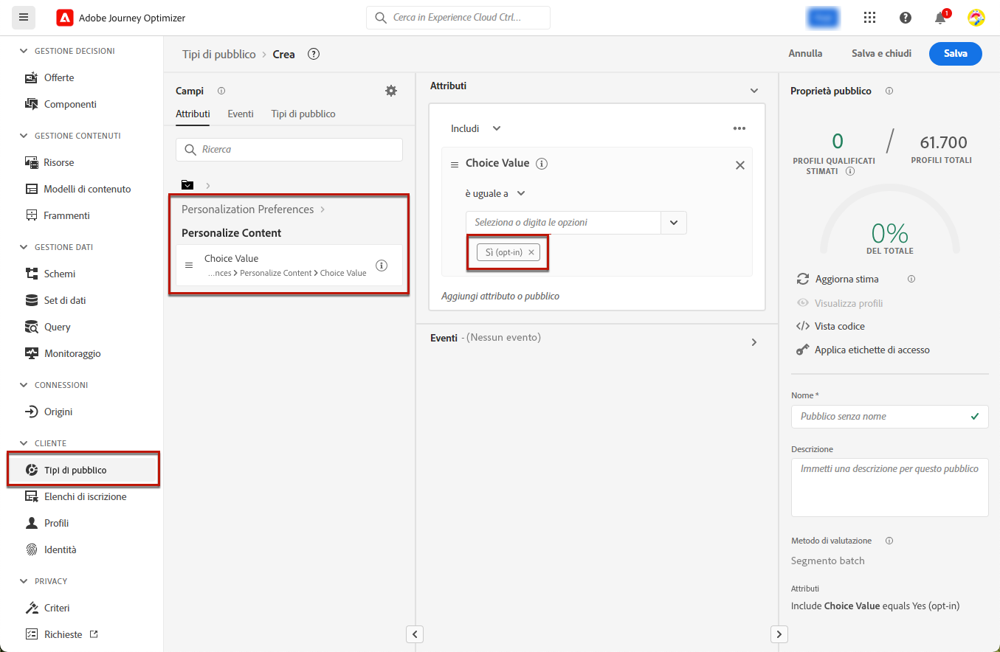
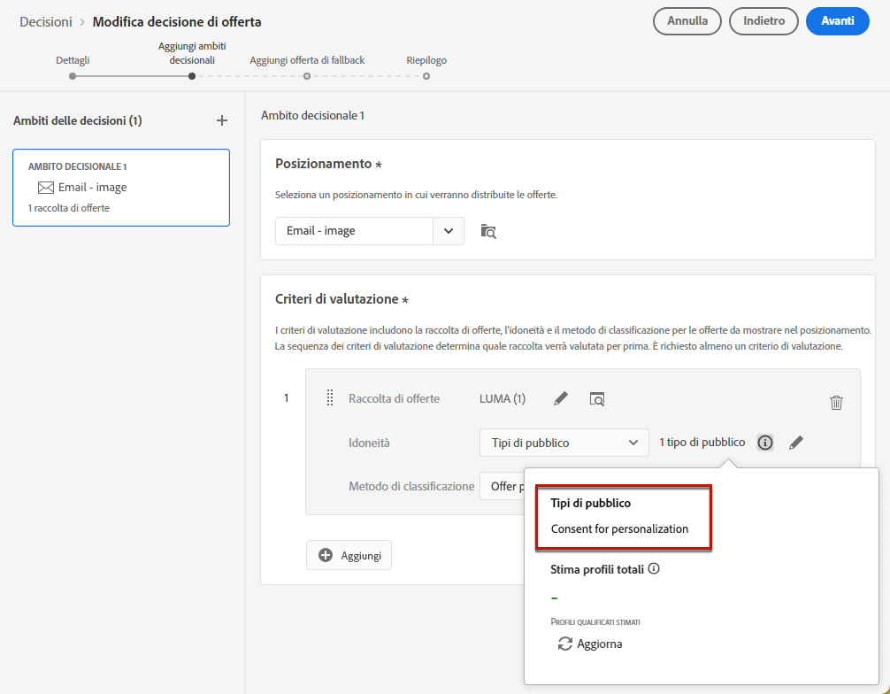
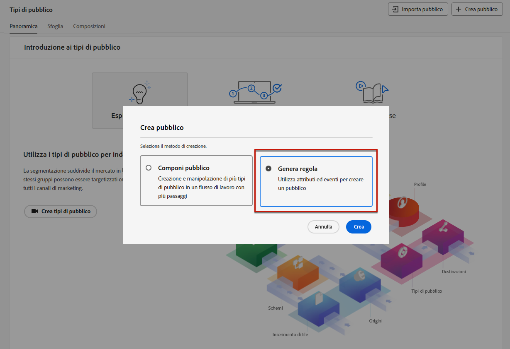
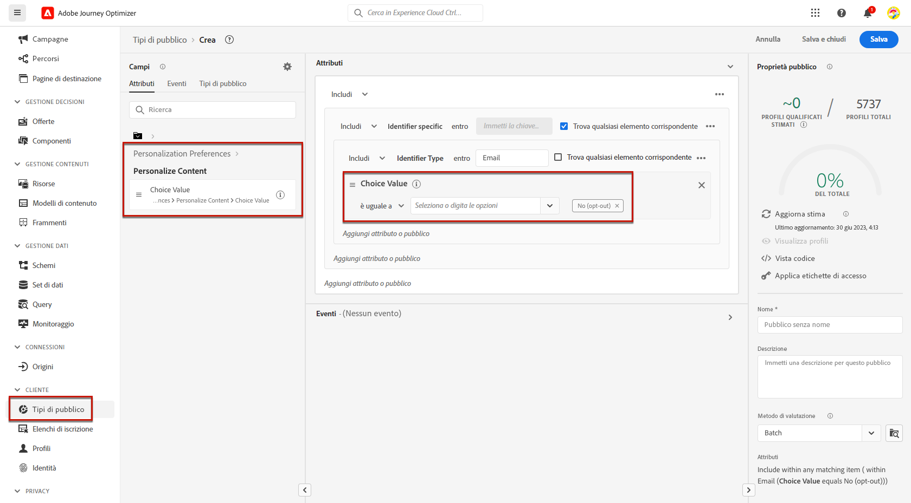
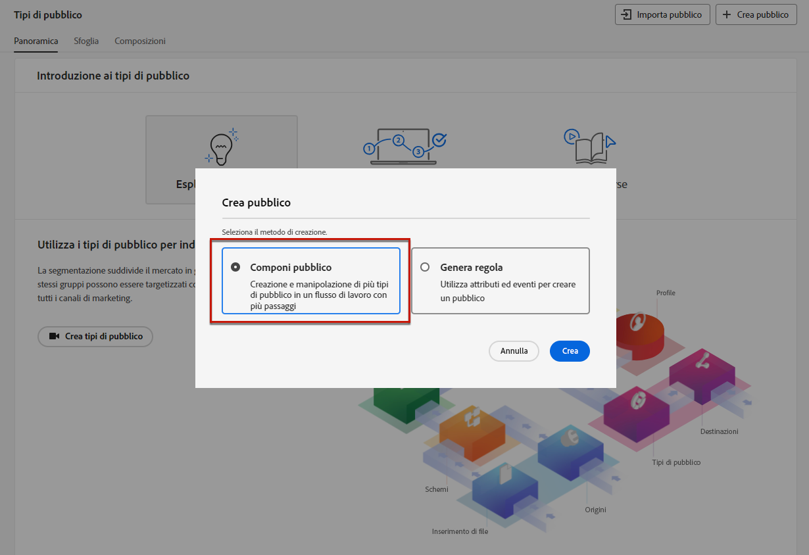
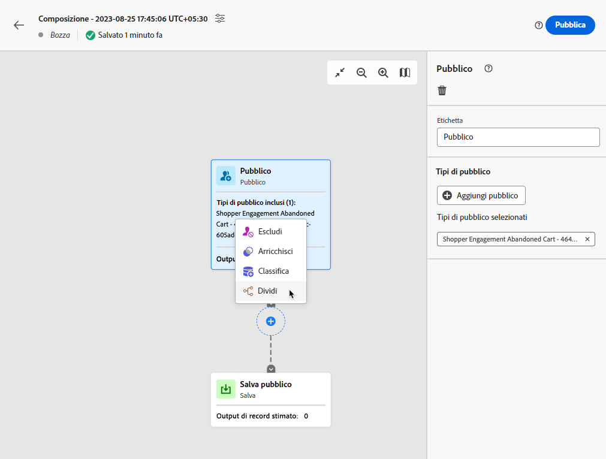
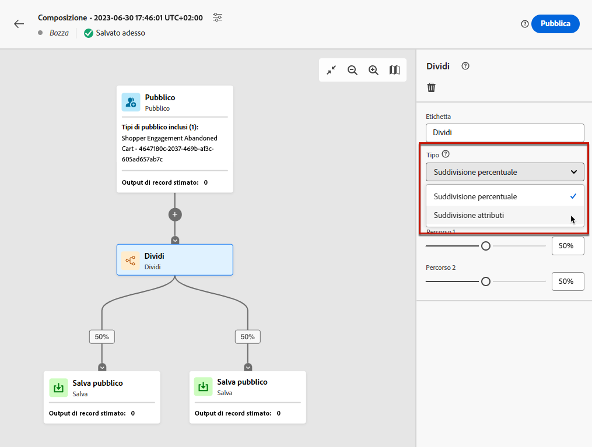
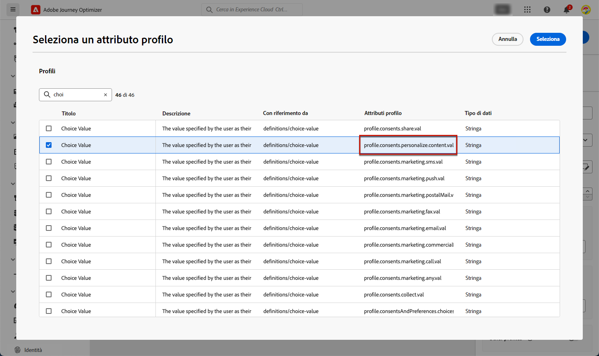
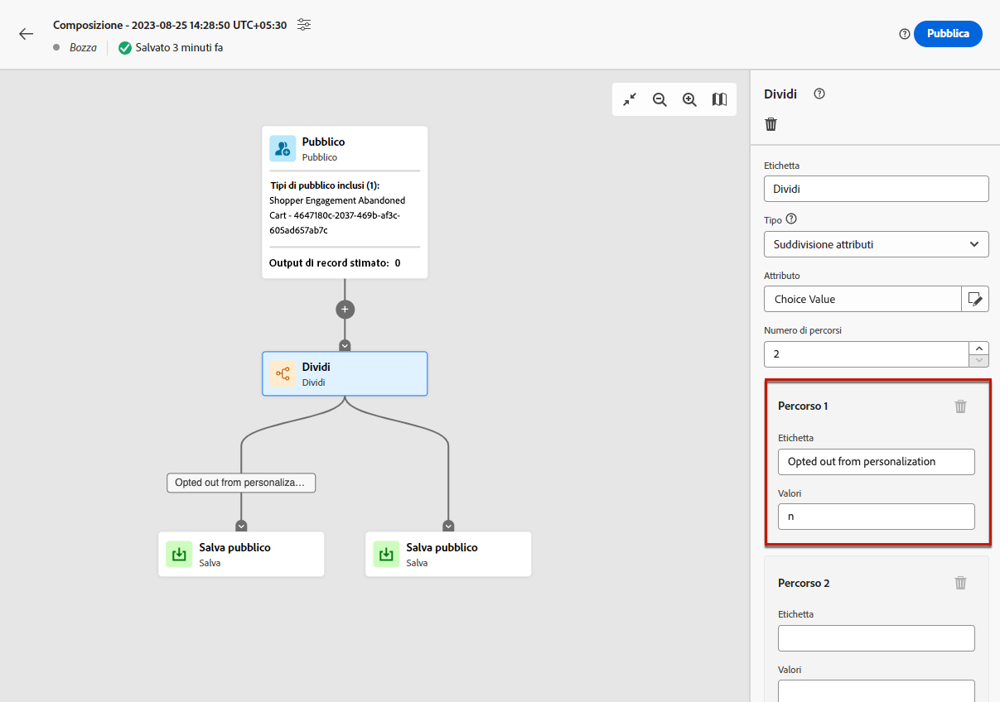

# Gestire la rinuncia {#consent}

Come requisito legale, è necessario fornire ai destinatari la possibilità di annullare l’iscrizione alla ricezione di comunicazioni da parte di un marchio e garantire il rispetto di questa scelta. Il mancato rispetto di queste normative implica rischi legali per il marchio. Ti aiuta a evitare l’invio di comunicazioni non richieste ai destinatari, in modo che queste non vengano contrassegnate come spam danneggiando la tua reputazione.

Ulteriori informazioni sulle normative applicabili sono disponibili nella [documentazione di Experience Platform](https://experienceleague.adobe.com/docs/experience-platform/privacy/regulations/overview.html?lang=it#regulations){target="_blank"}.

## Gestire gli annullamenti delle iscrizioni in percorsi e campagne {#opt-out-ajo}

Quando invii messaggi da percorsi o campagne, devi sempre assicurarti che i clienti abbiano la possibilità di annullare l’iscrizione in modo da non ricevere più comunicazioni. Una volta annullata l’iscrizione, i profili vengono rimossi automaticamente dal pubblico dei futuri messaggi di marketing.

**[!DNL Journey Optimizer]** permette di gestire la rinuncia nelle e-mail e nei messaggi SMS; tuttavia, le notifiche push non richiedono alcun intervento da parte tua, in quanto i destinatari possono annullare l’iscrizione direttamente dal proprio dispositivo. Ad esempio, al momento del download o dell’utilizzo dell’app, possono scegliere di interrompere le notifiche. Analogamente, possono modificare le impostazioni di notifica tramite il sistema operativo mobile.

>[!NOTE]
>
>Inoltre, puoi sfruttare le **API REST di soppressione** di Journey Optimizer per controllare i messaggi in uscita utilizzando elenchi Consentiti e di soppressione. [Scopri come utilizzare l’API REST di soppressione](https://developer.adobe.com/journey-optimizer-apis/references/suppression/){target="_blank"}

Scopri come gestire la rinuncia nei messaggi e-mail e SMS di Journey Optimizer in queste sezioni:

<table style="table-layout:fixed"><tr style="border: 0;">
<td>

<a href="../email/email-opt-out.md"><strong>Gestione della rinuncia e-mail</strong>

</td>
<td>

<a href="../sms/sms-opt-out.md"><strong>Gestione della rinuncia agli SMS</strong></a>

</td>
</tr></table>

>[!NOTE]
>
>In [!DNL Journey Optimizer], il consenso è gestito dallo [Schema di consenso](https://experienceleague.adobe.com/docs/experience-platform/xdm/field-groups/profile/consents.html?lang=it){target="_blank"} di Experience Platform. Per impostazione predefinita, il valore del campo di consenso è vuoto e viene trattato come consenso alla ricezione delle comunicazioni. Puoi modificare questo valore predefinito durante l’onboarding in uno dei possibili valori elencati [qui](https://experienceleague.adobe.com/docs/experience-platform/xdm/data-types/consents.html?lang=it#choice-values){target="_blank"} oppure utilizzare i [criteri di consenso](../action/consent.md) per ignorare la logica predefinita.

## Implementare il consenso alla personalizzazione {#opt-out-personalization}

I clienti possono anche rinunciare alla presentazione di contenuti personalizzati. Una volta che un profilo ha rinunciato alla personalizzazione, devi assicurarti che i suoi dati non vengano utilizzati per la personalizzazione e devi sostituire qualsiasi contenuto personalizzato con una variante di fallback.

### In Gestione decisioni {#opt-out-decision-management}

Quando utilizzi le offerte, le preferenze di personalizzazione non vengono implementate automaticamente negli [ambiti decisionali](../offers/offer-activities/create-offer-activities.md#add-decision-scopes) utilizzati da una richiesta di [Decisioning](../offers/api-reference/offer-delivery-api/decisioning-api.md) API o [Edge Decisioning](../offers/api-reference/offer-delivery-api/edge-decisioning-api.md) API. In questo caso, devi applicare manualmente il consenso alla personalizzazione. A questo scopo, segui i passaggi riportati qui sotto.

>[!NOTE]
>
>Gli ambiti decisionali utilizzati in canali creati in [!DNL Journey Optimizer] soddisfano questo requisito dal percorso o dalla campagna a cui appartengono.

1. Crea un pubblico di [Adobe Experience Platform](../audience/about-audiences.md) utilizzando il [Servizio di segmentazione](https://experienceleague.adobe.com/docs/experience-platform/segmentation/ui/overview.html?lang=it){target="_blank"} e utilizza un attributo di profilo come **[!UICONTROL Personalizza contenuto = Sì (consenso)]** per eseguire il targeting degli utenti che hanno acconsentito alla personalizzazione.

   

1. Durante la creazione di una [decisione](../offers/offer-activities/create-offer-activities.md), aggiungi un ambito decisionale e definisci un vincolo di idoneità basato su questo pubblico per ogni raccolta di criteri di valutazione che contiene offerte personalizzate.

   

1. Crea un’[offerta di fallback](../offers/offer-library/creating-fallback-offers.md) che non include contenuti personalizzati.

1. [Assegna](../offers/offer-activities/create-offer-activities.md#add-fallback) l’offerta di fallback non personalizzata alla decisione.

   

1. [Rivedi e salva](../offers/offer-activities/create-offer-activities.md#review) la decisione.

Se un utente:

* ha dato il consenso alla personalizzazione, l’ambito decisionale determinerà l’offerta migliore per quel profilo.

* non ha dato il consenso alla personalizzazione, il profilo corrispondente non sarà idoneo per nessuna delle offerte che rientrano nei criteri di valutazione e riceverà quindi l’offerta di fallback non personalizzata.

>[!NOTE]
>
>Il consenso all’utilizzo dei dati del profilo in [modellazione dati](../offers/ranking/ai-models.md) non è ancora supportato in [!DNL Journey Optimizer].

### Nell’editor di personalizzazione {#opt-out-expression-editor}

L’[editor di personalizzazione](../personalization/personalization-build-expressions.md) stesso non esegue alcun controllo o applicazione del consenso, in quanto non è coinvolto nella consegna dei messaggi.

Tuttavia, l’utilizzo di etichette di controllo dell’accesso basate sui diritti consente di limitare quali campi possono essere utilizzati per la personalizzazione. L’[anteprima del messaggio](../content-management/preview.md) e il [servizio Rendering e-mail](../content-management/rendering.md) maschererà i campi identificati con informazioni sensibili.

>[!NOTE]
>
>Ulteriori informazioni sul controllo degli accessi a livello di oggetto (OLAC) sono disponibili in [questa sezione](../administration/object-based-access.md).

Nelle campagne [!DNL Journey Optimizer], i criteri di consenso vengono applicati come segue:

* puoi includere le definizioni dei criteri di consenso nella creazione del pubblico affinché nel pubblico selezionato per la campagna siano già stati **filtrati ed esclusi i profili che non corrispondono ai criteri di consenso**.

* [!DNL Journey Optimizer] eseguirà un controllo generale del consenso a livello di canale per **verificare che i profili abbiano acconsentito alla** ricezione di comunicazioni di marketing tramite il canale dedicato.

  >[!NOTE]
  >
  >L’oggetto stesso della campagna [!DNL Journey Optimizer] non esegue ulteriori controlli relativi all’applicazione dei criteri di consenso.

Per applicare manualmente il consenso alla personalizzazione nelle campagne, segui una delle opzioni sottostanti.

### Utilizzo del Generatore di regole di segmento

Puoi utilizzare il generatore di regole di segmento per creare un pubblico contenente profili di rinuncia.

1. Crea un pubblico [Adobe Experience Platform](../audience/about-audiences.md) utilizzando il [servizio di segmentazione](https://experienceleague.adobe.com/docs/experience-platform/segmentation/ui/overview.html?lang=it){target="_blank"}.

   

1. Seleziona un attributo di profilo come **[!UICONTROL Personalizza contenuto = No (rinuncia)]** per escludere gli utenti che non hanno acconsentito alla personalizzazione.

   

1. Fai clic su **[!UICONTROL Salva]**.

Ora puoi utilizzare questo pubblico per filtrare dalle campagne i profili che non hanno dato il consenso alla personalizzazione.

### Utilizzo di un’attività di divisione in un flusso di lavoro di composizione

Puoi anche aggiungere un controllo del consenso alla personalizzazione di un pubblico, aggiungendo un’attività di divisione a un flusso di lavoro di composizione.

1. Crea un pubblico utilizzando l’opzione **[!UICONTROL Componi pubblico]**. [Ulteriori informazioni sulla creazione di un flusso di lavoro di composizione](../audience/get-started-audience-orchestration.md)

   

1. Aggiungi il pubblico iniziale utilizzando il pulsante dedicato a destra.

1. Fai clic sull’icona **+** e seleziona un’attività **[!UICONTROL Dividi]** per creare un pubblico suddiviso.

   

1. Nel riquadro a destra, seleziona **[!UICONTROL Suddivisione attributi]** come tipo di suddivisione.

   

1. Fai clic sull’icona a forma di matita accanto al campo **[!UICONTROL Attributo]** per visualizzare la finestra **[!UICONTROL Seleziona un attributo di profilo]**.

1. Cerca l’attributo di consenso alla personalizzazione (`profile.consents.personalize.content.val`) e selezionalo.

   

1. **[!UICONTROL Percorso 1]** sarà il pubblico non personalizzato. Scegli un’etichetta rilevante.

1. Scegli il valore appropriato da questo [elenco](https://experienceleague.adobe.com/docs/experience-platform/xdm/data-types/consents.html?lang=it#choice-values){target="_blank"}.

   In questo caso utilizzeremo `n` per indicare che gli utenti non acconsentono all’utilizzo dei loro dati a fini di personalizzazione.

   

1. È possibile creare un percorso separato per altri valori di scelta. È possibile scegliere anche di eliminare i percorsi rimanenti e attivare **[!UICONTROL Altri profili]** per includere tutti gli altri profili che non hanno un valore di scelta pari a `n`.

1. Al termine, fai clic su **[!UICONTROL Salva pubblico]** per ogni percorso, al fine di salvare il risultato del flusso di lavoro in un nuovo pubblico. In Adobe Experience Platform, verrà salvato un pubblico per ciascun percorso.

1. Al termine, pubblica il flusso di lavoro di composizione.

Ora puoi utilizzare questo pubblico per filtrare dalle campagne i profili che non hanno dato il consenso alla personalizzazione.

>[!NOTE]
>
>Se crei un pubblico che non ha dato il consenso alla personalizzazione e lo selezioni per l’attivazione in una campagna, gli strumenti di personalizzazione rimarranno comunque disponibili. L’utente marketing dovrà quindi essere consapevole del fatto che, quando lavora con un pubblico che non deve ricevere personalizzazioni, non dovrà utilizzare gli strumenti di personalizzazione.
