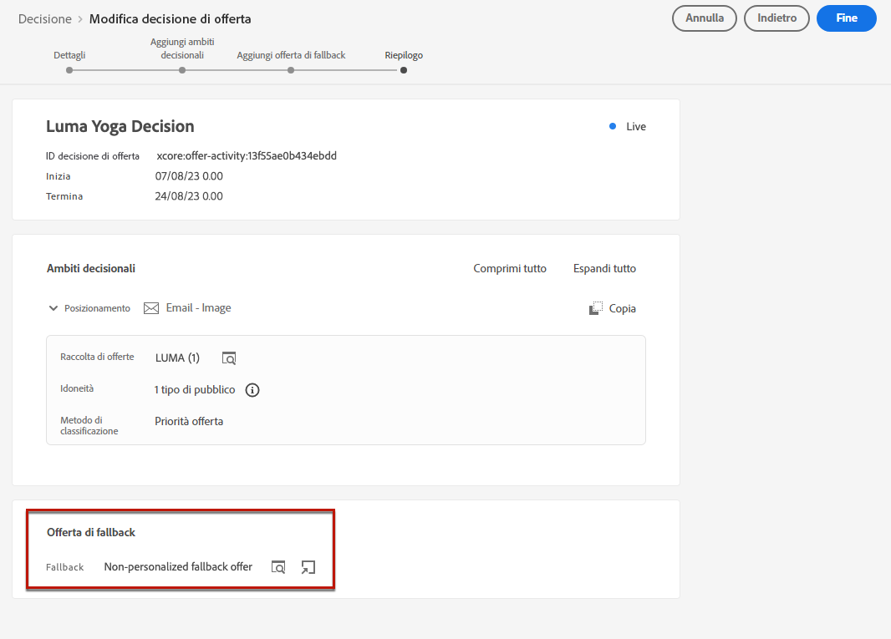

# Gestire la rinuncia {#consent}

Come requisito legale, è necessario fornire ai destinatari la possibilità di annullare l’iscrizione alla ricezione di comunicazioni da parte di un marchio e garantire il rispetto di questa scelta. Ulteriori informazioni sulle normative applicabili sono disponibili nella [documentazione di Experience Platform](https://experienceleague.adobe.com/docs/experience-platform/privacy/regulations/overview.html?lang=it#regulations){target="_blank"}.

**Perché è importante?**

* Il mancato rispetto di queste normative introduce rischi legali normativi per il tuo marchio.
* Ti aiuta a evitare l’invio di comunicazioni non richieste ai destinatari, in modo che queste non vengano contrassegnate come spam danneggiando la tua reputazione.

## Gestire gli annullamenti delle iscrizioni in percorsi e campagne {#opt-out-ajo}

Quando invii messaggi da percorsi o campagne, devi sempre assicurarti che i clienti abbiano la possibilità di annullare l’iscrizione in modo da non ricevere più comunicazioni. Una volta annullata l’iscrizione, i profili vengono rimossi automaticamente dal pubblico dei futuri messaggi di marketing.

**[!DNL Journey Optimizer]** permette di gestire la rinuncia nelle e-mail e nei messaggi SMS; tuttavia, le notifiche push non richiedono alcun intervento da parte tua, in quanto i destinatari possono annullare l’iscrizione direttamente dal proprio dispositivo. Ad esempio, al momento del download o dell’utilizzo dell’app, possono scegliere di interrompere le notifiche. Analogamente, possono modificare le impostazioni di notifica tramite il sistema operativo mobile.

Scopri come gestire la rinuncia nei messaggi e-mail e SMS di Journey Optimizer in queste sezioni:

<table style="table-layout:fixed"><tr style="border: 0;">
<td>

<a href="../email/email-opt-out.md"><strong>Gestione della rinuncia e-mail</strong>

</td>
<td>

<a href="../sms/sms-opt-out.md"><strong>Gestione della rinuncia agli SMS</strong></a>

</td>
</tr></table>

>[!NOTE]
>
>In [!DNL Journey Optimizer], il consenso è gestito dallo [Schema di consenso](https://experienceleague.adobe.com/docs/experience-platform/xdm/field-groups/profile/consents.html?lang=it){target="_blank"}. By default, the value for the consent field is empty and treated as consent to receive your communications. You can modify this default value while onboarding to one of the possible values listed [here](https://experienceleague.adobe.com/docs/experience-platform/xdm/data-types/consents.html?lang=it#choice-values){target="_blank"} di Experience Platform.

## Implementare il consenso alla personalizzazione {#opt-out-personalization}

I clienti possono anche rinunciare alla presentazione di contenuti personalizzati. Una volta che un profilo ha rinunciato alla personalizzazione, devi assicurarti che i suoi dati non vengano utilizzati per la personalizzazione e devi sostituire qualsiasi contenuto personalizzato con una variante di fallback.

### In Gestione decisioni

Quando utilizzi le offerte, le preferenze di personalizzazione non vengono implementate automaticamente negli [ambiti decisionali](../offers/offer-activities/create-offer-activities.md#add-decision-scopes) utilizzati da una richiesta di [Decisioning](../offers/api-reference/offer-delivery-api/decisioning-api.md) API o [Edge Decisioning](../offers/api-reference/offer-delivery-api/edge-decisioning-api.md) API. In questo caso, devi applicare manualmente il consenso alla personalizzazione. A questo scopo, segui i passaggi riportati qui sotto.

>[!NOTE]
>
>Gli ambiti decisionali utilizzati in canali creati in [!DNL Journey Optimizer] soddisfano questo requisito dal percorso o dalla campagna a cui appartengono.

1. Creare un [Pubblico Adobe Experience Platform](../audience/access-audiences.md) utilizzando [Servizio di segmentazione](https://experienceleague.adobe.com/docs/experience-platform/segmentation/ui/overview.html){target="_blank"} e utilizza un attributo di profilo come **[!UICONTROL Personalizza contenuto = Sì (consenso)]** per eseguire il targeting degli utenti che hanno acconsentito alla personalizzazione.

   

1. Durante la creazione di un’ [decisione](../offers/offer-activities/create-offer-activities.md), aggiungi un ambito decisionale e definisci un vincolo di idoneità basato su questo pubblico per ogni raccolta di criteri di valutazione che contiene offerte personalizzate.

   

1. Crea un’[offerta di fallback](../offers/offer-library/creating-fallback-offers.md) che non include contenuti personalizzati.

1. [Assegna](../offers/offer-activities/create-offer-activities.md#add-fallback) l’offerta di fallback non personalizzata alla decisione.

   

1. [Rivedi e salva](../offers/offer-activities/create-offer-activities.md#review) la decisione.

Se un utente:

* ha dato il consenso alla personalizzazione, l’ambito decisionale determinerà l’offerta migliore per quel profilo.

* non ha dato il consenso alla personalizzazione, il profilo corrispondente non sarà idoneo per nessuna delle offerte che rientrano nei criteri di valutazione e riceverà quindi l’offerta di fallback non personalizzata.

>[!NOTE]
>
>Il consenso all’utilizzo dei dati del profilo in [modellazione dati](../offers/ranking/ai-models.md) non è ancora supportato in [!DNL Journey Optimizer].

## Nell’editor espressioni

<!--Expressions Editor while personalizing images, text, subject line  ( Segment in Campaigns) - UI and Headless -->

Il [Editor espressioni](../personalization/personalization-build-expressions.md) non effettua di per sé alcun controllo del consenso o dell’applicazione in quanto non è coinvolta nella consegna dei messaggi.

Tuttavia, l’utilizzo di etichette di controllo dell’accesso basate su destra consente di limitare quali campi possono essere utilizzati per la personalizzazione. Il [anteprima del messaggio](../email/preview.md#preview-email) e [servizio di rendering di e-mail](../email/preview.md#email-rendering) maschererà i campi identificati con informazioni sensibili.

>[!NOTE]
>
>Ulteriori informazioni sul controllo dell&#39;accesso a livello di oggetto (OLAC) in [questa sezione](../administration/object-based-access.md).

In entrata [!DNL Journey Optimizer] campagne, i criteri di consenso vengono applicati come segue:

* Puoi includere le definizioni dei criteri di consenso nella creazione del pubblico per garantire che il pubblico selezionato per la campagna abbia già **ha escluso i profili che non corrispondono ai criteri di consenso**.

* [!DNL Journey Optimizer] eseguirà una verifica generale del consenso a livello di canale per **assicurarsi che i profili abbiano acconsentito** per ricevere comunicazioni di marketing sul canale corrispondente.

  >[!NOTE]
  >
  >Il [!DNL Journey Optimizer] al momento, l’oggetto campaign non esegue ulteriori controlli di applicazione dei criteri di consenso.

Per applicare manualmente il consenso alla personalizzazione nelle campagne, segui una delle opzioni seguenti.

### Utilizzo del generatore di regole di segmento

Puoi utilizzare il generatore di regole di segmento per creare un pubblico contenente profili di rinuncia.

1. Creare un [Pubblico Adobe Experience Platform](../audience/access-audiences.md) utilizzando [Servizio di segmentazione](https://experienceleague.adobe.com/docs/experience-platform/segmentation/ui/overview.html){target="_blank"}.

   

1. Seleziona un attributo di profilo come **[!UICONTROL Personalizza contenuto = No (rinuncia)]** per escludere gli utenti che non hanno acconsentito alla personalizzazione.

   

1. Fai clic su **[!UICONTROL Salva]**.

Ora puoi utilizzare questo pubblico per filtrare dalle campagne i profili che non hanno dato il consenso alla personalizzazione.

### Utilizzo di un’attività divisa in un flusso di lavoro di composizione

Puoi anche aggiungere a un pubblico un controllo del consenso alla personalizzazione aggiungendo un’attività divisa a un flusso di lavoro di composizione.

1. Creare un pubblico utilizzando **[!UICONTROL Componi pubblico]** opzione. [Ulteriori informazioni sulla creazione di un flusso di lavoro di composizione](../audience/create-compositions.md)

   

1. Aggiungi il pubblico iniziale utilizzando il pulsante dedicato a destra.

1. Fai clic sull’icona + e seleziona **[!UICONTROL Dividi]** per creare un pubblico diviso. [Ulteriori informazioni sull’attività Dividi](../audience/composition-canvas.md#split)

   

1. Seleziona **[!UICONTROL Suddivisione attributi]** come tipo di divisione nel riquadro di destra.

   

1. Fai clic sull’icona a forma di matita accanto a **[!UICONTROL Attributo]** campo da visualizzare **[!UICONTROL Seleziona un attributo di profilo]** finestra.

1. Cerca l’attributo di consenso della personalizzazione (`profile.consents.personalize.content.val`) e selezionarla.

   

1. **[!UICONTROL Percorso 1]** sarà il pubblico non personalizzato. Scegli un’etichetta rilevante.

1. Scegli il valore appropriato da questo [list](https://experienceleague.adobe.com/docs/experience-platform/xdm/data-types/consents.html?lang=it#choice-values){target="_blank"}.

   In questo caso utilizzeremo `n` per indicare che gli utenti non acconsentono all’utilizzo dei loro dati a fini di personalizzazione.

   

1. Potete creare un percorso separato per altri valori di scelta. Puoi anche scegliere di eliminare i percorsi rimanenti e attivare **[!UICONTROL Altri profili]** per includere tutti gli altri profili che non hanno un valore di scelta pari a `n`.

1. Al termine, fai clic su **[!UICONTROL Salva pubblico]** per ogni percorso per salvare il risultato del flusso di lavoro in un nuovo pubblico. Un pubblico verrà salvato in Adobe Experience Platform per ogni percorso.

1. Al termine, pubblica il flusso di lavoro di composizione.

Ora puoi utilizzare questo pubblico per filtrare dalle campagne i profili che non hanno dato il consenso alla personalizzazione.

>[!NOTE]
>
>Se crei un pubblico che non ha dato il consenso per la personalizzazione e poi lo selezioni in una campagna, gli strumenti di personalizzazione rimarranno disponibili. Spetta agli utenti marketing capire che se lavorano con un pubblico che non deve ricevere personalizzazioni, non deve utilizzare strumenti di personalizzazione.
