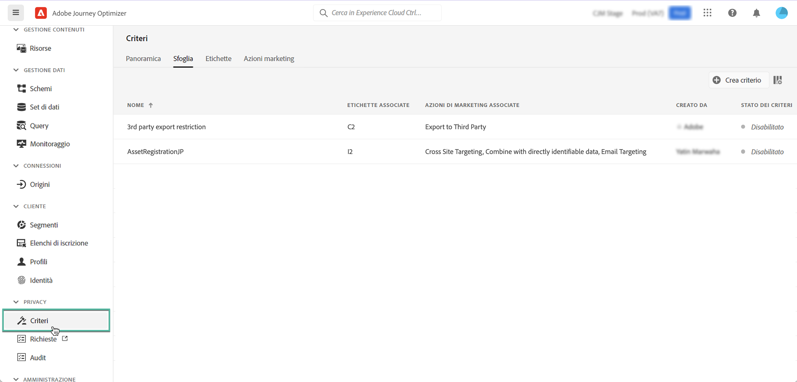

# Criteri di utilizzo dei dati {#Policies}

>[!CONTEXTUALHELP]
>id="ajo_olac_manage_access"
>title="Accesso a Gestione Olac"
>abstract="TBC"

Con il **Servizio di governance dei dati** di Adobe Experience Platform, puoi applicare restrizioni all’utilizzo dei dati tramite etichette, azioni di marketing e criteri.

A tal fine, il servizio di governance dei dati consente di applicare etichette di utilizzo ai set di dati e ai campi, suddividendoli in categorie in base ai criteri di utilizzo dei relativi dati.

I criteri di utilizzo dei dati sono regole che descrivono i tipi di azioni di marketing che possono essere eseguiti o meno sui dati in Experience Platform. Sono accessibili dal **[!UICONTROL Criteri]** menu.

Per ulteriori informazioni sul framework per la governance dei dati e su come utilizzare etichette e criteri, consulta la documentazione di Adobe Experience Platform:

* [Panoramica del servizio di governance dei dati](https://experienceleague.adobe.com/docs/experience-platform/data-governance/home.html?lang=it)
* [Panoramica delle etichette di utilizzo dei dati](https://experienceleague.adobe.com/docs/experience-platform/data-governance/labels/overview.html?lang=it)
* [Criteri di utilizzo dei dati](https://experienceleague.adobe.com/docs/experience-platform/data-governance/policies/overview.html?lang=it)
