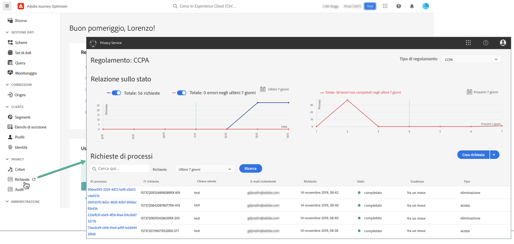

# Richieste di privacy {#track-changes}

Adobe Experience Platform **Privacy Service** fornisce un’API RESTful e un’interfaccia utente per aiutarti a gestire le richieste di dati dei clienti. Con Privacy Service puoi inviare richieste di accesso e cancellazione dei dati personali dei clienti dalle applicazioni Adobe Experience Cloud, facilitando la conformità automatica alle normative legali e organizzative sulla privacy.

Le richieste di accesso ai dati personali possono essere create e gestite dal menu **[!UICONTROL Richieste]**.



Per ulteriori informazioni su Privacy Service e su come creare e gestire le richieste di accesso a dati personali, consulta la [documentazione di Adobe Experience Platform](https://experienceleague.adobe.com/docs/experience-platform/privacy/home.html?lang=it){target="_blank"}.

<!--* [Privacy Service overview](https://experienceleague.adobe.com/docs/experience-platform/privacy/home.html?lang=it)
* [Managing privacy jobs in the Privacy Service UI](https://experienceleague.adobe.com/docs/experience-platform/privacy/ui/user-guide.html?lang=it)-->

## Gestione delle richieste di accesso ai dati personali di singoli utenti che è possibile inviare a Adobe Journey Optimizer {#data-privacy-requests}

Esistono due modi di inviare singole richieste di accesso ed eliminazione dei dati dei consumatori da Adobe Journey Optimizer:

* Mediante l’**Interfaccia utente di Privacy Service**. [Ulteriori informazioni](https://experienceleague.adobe.com/docs/experience-platform/privacy/ui/user-guide.html?lang=it){target="_blank"}
* Mediante l’**API di Privacy Service**. [Ulteriori informazioni](https://experienceleague.adobe.com/it/docs/experience-platform/privacy/api/overview){target="_blank"}
  <!--More specific information on Privacy Service API [here](https://developer.adobe.com/experience-platform-apis/references/privacy-service/#_blank).-->

Privacy Service supporta due tipi di richieste: **accesso ai dati** ed **eliminazione dei dati**.

Per **richieste di accesso**, specifica “**Adobe Journey Optimizer**” dall’interfaccia utente (o “**CJM**” come codice prodotto nell’API).

Per **eliminare le richieste**, oltre alla richiesta “**Adobe Journey Optimizer**”, è necessario inviare le richieste di eliminazione a **tre servizi a monte** per impedire a Journey Optimizer di reinserire i dati eliminati. Se questi servizi a monte non sono specificati, la richiesta “Adobe Journey Optimizer” rimarrà nello stato “Elaborazione” finché non saranno state create le richieste di eliminazione per i servizi a monte.

I tre servizi a monte sono:

* Profile (codice prodotto: “profileService”)
* Data Lake AEP (codice prodotto: “AdobeCloudPlatform”)
* Identity (codice prodotto: “identità”)

>[!NOTE]
>
>Questa guida descrive solo come effettuare le richieste di accesso ai dati personali per [!UICONTROL Adobe Journey Optimizer].
>
>* Se prevedi anche di effettuare richieste di privacy per il data lake di Platform, consulta questa [guida](https://experienceleague.adobe.com/it/docs/experience-platform/catalog/privacy) oltre a questo tutorial.
>
>* Per il profilo cliente in tempo reale, consulta questa [guida](https://experienceleague.adobe.com/it/docs/experience-platform/profile/privacy).
>* Per Identity Service, fai riferimento a questa [guida](https://experienceleague.adobe.com/it/docs/experience-platform/identity/privacy).
>
>Per le richieste di eliminazione e di accesso è necessario chiamare questi singoli sistemi per assicurarsi che le richieste siano gestite da ciascuno di essi. Effettuare una richiesta sulla privacy a [!DNL Adobe Journey Optimizer] non rimuove i dati da tutti questi sistemi.

## Creare richieste di accesso e di eliminazione

### Prerequisiti

Per effettuare richieste di accesso ed eliminazione di dati per Adobe Journey Optimizer, è necessario avere:

* un ID organizzazione Adobe
* un identificatore di identità della persona su cui desideri agire e i corrispondenti spazi dei nomi. Per ulteriori informazioni sugli spazi dei nomi delle identità in Adobe Journey Optimizer e Experience Platform, consulta la [panoramica dello spazio dei nomi identità](https://experienceleague.adobe.com/it/docs/experience-platform/identity/features/namespaces).

>[!IMPORTANT]
>
>Quando vengono inviate richieste di accesso ai dati personali, assicurati di specificare “[!DNL '**Adobe Journey Optimizer**]” come nome del prodotto di destinazione e **tutti gli spazi dei nomi delle identità** (ad esempio “E-mail” “ECID” o “ID fedeltà”) associati ai dati del profilo che devono essere rimossi o ai quali bisogna accedere. In particolare, per le richieste di eliminazione se non includi esplicitamente il nome del prodotto e tutti gli spazi dei nomi applicabili, i dati non verranno rimossi da [!DNL Adobe Journey Optimizer].

### Valori campo obbligatori in Journey Optimizer per le richieste API

```json
"companyContexts":
    "namespace": imsOrgID
    "value": <Your Adobe Organization ID Value>

"users":
    "action": either access or delete

    "userIDs":
        "namespace": e.g. email, aaid, ecid, etc.
        "type": standard
        "value": <Data Subject's Identity Identifier>

"include":
    CJM (which is the Adobe product code for Adobe Journey Optimizer)
    profileService (product code for Profile)
    AdobeCloudPlatform (product code for AEP Data Lake)
    identity (product code for Identity)

"regulation":
    gdpr, ccpa, pdpa, lgpd_bra, or nzpa_nzl (which is the privacy regulation that applies to the request)
```


### Esempio di richiesta di accesso GDPR:

Dall’interfaccia utente:

{width="60%" align="center"}

Mediante l’API

```json
// JSON Request
{
   "companyContexts":[
      {
         "namespace":"imsOrgID",
         "value":"745F37C35E4B776E0A49421B@AdobeOrg"
      }
   ],
   "users":[
      {
         "action":[
            "access"
         ],
         "userIDs":[
            {
               "namespace":"ecid",
               "value":"38400000-8cf0-11bd-b23e-10b96e40000d",
               "type":"standard"
            },
            {
               "namespace":"email",
               "value":"johndoe4@gmail.com",
               "type":"standard"
            }
         ]
      }
   ],
   "include":[
      "CJM"
   ],
   "regulation":"gdpr"
}
```

```json
// JSON Response
{
    "requestId": "17163122360480365RX-705",
    "totalRecords": 1,
    "jobs": [
        {
            "jobId": "e709b1f4-1796-11ef-b422-eddd0aebc40d",
            "customer": {
                "user": {
                    "key": "John Doe",
                    "action": [
                        "access"
                    ],
                    "userIDs": [
                        {
                            "namespace": "ecid",
                            "value": "38400000-8cf0-11bd-b23e-10b96e40000d",
                            "type": "standard",
                            "namespaceId": 4,
                            "isDeletedClientSide": false
                        },
                        {
                            "namespace": "email",
                            "value": "johndoe4@gmail.com",
                            "type": "standard",
                            "namespaceId": 6,
                            "isDeletedClientSide": false
                        }
                    ]
                }
            }
        }
    ]
}
```

### Esempio di richiesta di eliminazione GDPR:

Dall’interfaccia utente:

{width="60%" align="center"}

Mediante l’API

```json
// JSON Request
{
  "companyContexts": [
    {
      "namespace": "imsOrgID",
      "value": "745F37C35E4B776E0A49421B@AdobeOrg"
    }
  ],
  "users": [
    {
      "action": [
          "delete"
      ],
      "userIDs": [
        {
          "namespace": "ecid",
          "value": "38400000-8cf0-11bd-b23e-10b96e40000d",
          "type": "standard"
        },
                {
          "namespace": "email",
          "value": "johndoe4@gmail.com",
          "type": "standard"
        }
      ]
    }
  ],
  "include": [
    "CJM", "profileService", "AdobeCloudPlatform", "identity"
  ],
  "regulation": "gdpr"
}
```

```json
// JSON Response
{
    "requestId": "17163122360480365RX-705",
    "totalRecords": 1,
    "jobs": [
        {
            "jobId": "e709b1f4-1796-11ef-b422-eddd0aebc40d",
            "customer": {
                "user": {
                    "key": "John Doe",
                    "action": [
                        "delete"
                    ],
                    "userIDs": [
                        {
                            "namespace": "ecid",
                            "value": "38400000-8cf0-11bd-b23e-10b96e40000d",
                            "type": "standard",
                            "namespaceId": 4,
                            "isDeletedClientSide": false
                        },
                        {
                            "namespace": "email",
                            "value": "johndoe4@gmail.com",
                            "type": "standard",
                            "namespaceId": 6,
                            "isDeletedClientSide": false
                        }
                    ]
                }
            }
        }
    ]
}
```
