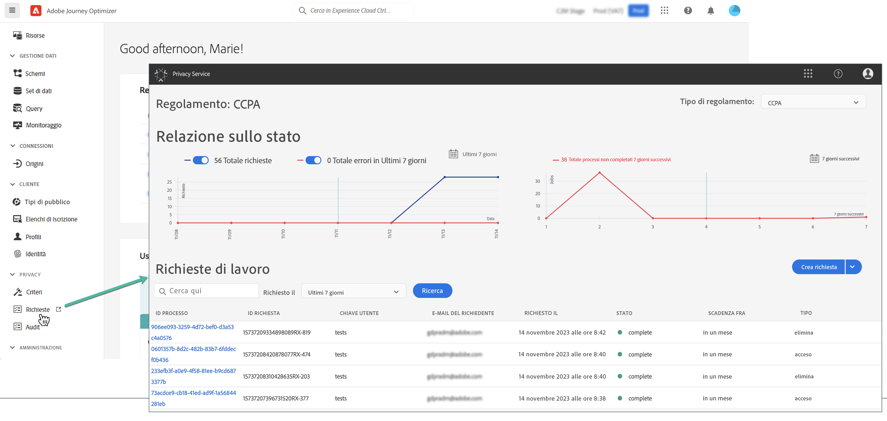

# Richieste di accesso a dati personali {#track-changes}

Adobe Experience Platform **Privacy Service** fornisce un’API RESTful e un’interfaccia utente per aiutarti a gestire le richieste di dati dei clienti. Con Privacy Service puoi inviare richieste di accesso e cancellazione dei dati personali dei clienti dalle applicazioni Adobe Experience Cloud, facilitando la conformità automatica alle normative legali e organizzative sulla privacy.

Le richieste di accesso ai dati personali possono essere create e gestite dal menu **[!UICONTROL Requests]**.

Per ulteriori informazioni su Privacy Service e su come creare e gestire le richieste di accesso a dati personali, consulta la documentazione di Adobe Experience Platform:

* [Panoramica di Privacy Service](https://experienceleague.adobe.com/docs/experience-platform/privacy/home.html?lang=it)
* [Gestione dei processi relativi alla privacy nell’interfaccia utente di Privacy Service](https://experienceleague.adobe.com/docs/experience-platform/privacy/ui/user-guide.html?lang=it)
