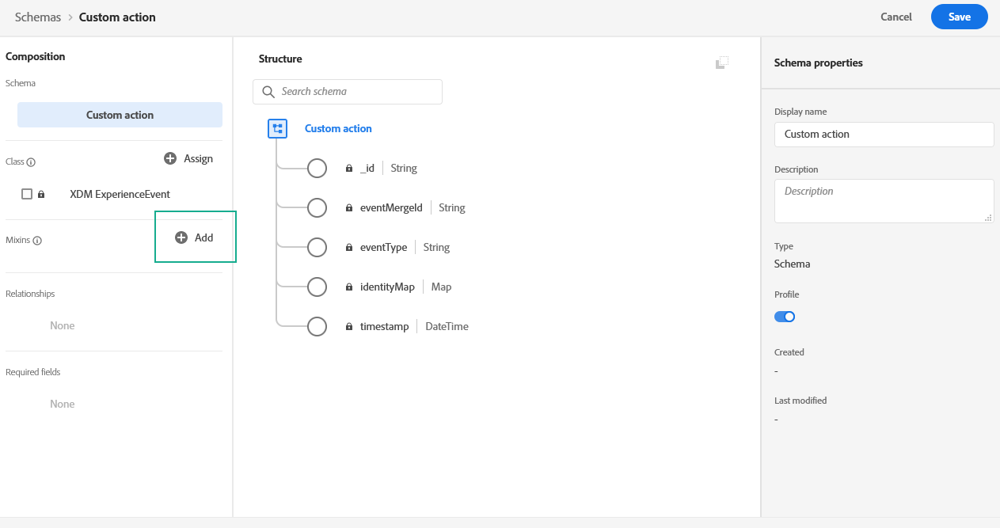

# Configurare il canale di notifica push {#push-notification-configuration}


Prima di iniziare a inviare notifiche push con [!DNL Journey Optimizer], devi definire le impostazioni sia in [!DNL Adobe Experience Platform] che in [!DNL Adobe Experience Platform Launch].

## Impostazioni Adobe Experience Platform {#platform-settings}

Per configurare la tua app mobile in [!DNL Adobe Experience Platform Launch], segui questi passaggi:

1. [Assegnare i diritti di proprietà e aziendali](#push-rights)
1. [Aggiungi le credenziali push dell’app mobile in Platform launch](#push-credentials-launch).
1. [Crea ](#edge-configuration) configurazione Edge da utilizzare per  **[!UICONTROL Edge]** estensione per inviare dati personalizzati da dispositivi mobili a  [!DNL Adobe Experience Platform].
1. [Imposta una proprietà](#launch-property) Platform launch.
1. [Pubblica la proprietà](#publish-property).
1. [Configura ProfileDataSource](#configure-profiledatasource).

### Passaggio 1: Assegnare diritti di proprietà e società {#push-rights}

Prima di creare un’app mobile, è necessario assicurarsi di disporre o assegnare le autorizzazioni utente corrette.

Per ulteriori informazioni sulla gestione degli utenti con [!DNL Adobe Experience Platform Launch], consulta la [documentazione del Platform launch](https://experienceleague.adobe.com/docs/launch/using/admin/user-permissions.html#experience-cloud-permissions).

Per assegnare i diritti di proprietà e aziendali:

1. Accedi a [!DNL Admin Console].

1. Dalla scheda **[!UICONTROL Products]** , seleziona la scheda **[!UICONTROL Adobe Experience Platform Launch]** .

   

1. Seleziona un **[!UICONTROL Product Profile]** esistente o creane uno nuovo con il pulsante **[!UICONTROL New profile]** . Per ulteriori informazioni su come creare un nuovo **[!UICONTROL New profile]**, consulta la [documentazione di Admin Console](https://experienceleague.adobe.com/docs/experience-platform/access-control/ui/create-profile.html#ui).

1. Dalla scheda **[!UICONTROL Permissions]** , seleziona **[!UICONTROL Property rights]**.

   

1. Fai clic su **[!UICONTROL Add all]**. Questo aggiungerà i seguenti diritti al tuo profilo di prodotto:
   * **[!UICONTROL Approve]**
   * **[!UICONTROL Develop]**
   * **[!UICONTROL Manage Environments]**
   * **[!UICONTROL Manage Extensions]**
   * **[!UICONTROL Publish]**

   

1. Quindi, seleziona **[!UICONTROL Company rights]** nel menu a sinistra.

   

1. Aggiungi i seguenti diritti:

   * **[!UICONTROL Manage App Configurations]**
   * **[!UICONTROL Manage Properties]**

   

1. Fai clic su **[!UICONTROL Save]**.

Per assegnare questo **[!UICONTROL Product profile]** agli utenti:

1. Nella scheda [!DNL Admin Console] , seleziona la scheda **[!UICONTROL Products]** dalla scheda **[!UICONTROL Adobe Experience Platform Launch]** .

1. Seleziona il **[!UICONTROL Product profile]** configurato in precedenza.

1. Dalla scheda **[!UICONTROL Users]**, fai clic su **[!UICONTROL Add user]**.

   

1. Digita il nome o l’indirizzo e-mail dell’utente e seleziona l’utente. Quindi, fai clic su **[!UICONTROL Save]**.

   >[!NOTE]
   >
   >Se l&#39;utente non è stato creato in precedenza in Admin Console, consulta la [documentazione Aggiungere utenti](https://helpx.adobe.com/enterprise/admin-guide.html/enterprise/using/manage-users-individually.ug.html#add-users).

   


Ora disponi delle autorizzazioni utente corrette per creare e configurare un’app mobile in [!DNL Adobe Experience Platform Launch].

### Passaggio 2: Aggiungi le credenziali push dell’app mobile nel Platform launch {#push-credentials-launch}

Dopo aver concesso le autorizzazioni utente corrette, ora devi aggiungere le credenziali push dell’app mobile in [!DNL Adobe Experience Platform Launch].

Per ulteriori dettagli e procedure su come aggiungere le credenziali push dell’app mobile, consulta i passaggi descritti in [Documentazione Adobe Experience Platform Mobile SDK](https://aep-sdks.gitbook.io/docs/beta/adobe-journey-optimizer#configure-the-journey-optimizer-extension-in-launch).

<!--
Note that to add push credentials in [!DNL Adobe Experience Platform Launch], the owner of the mobile app should fetch them from APNs/FCM.
1. From [!DNL Adobe Experience Platform Launch], ensure that **[!UICONTROL Client Side]** is selected in the drop-down menu.

1. Select the **[!UICONTROL App Configurations]** tab in the left-hand panel and click **[!UICONTROL App Configuration]** to create a new configuration.

1. Enter a **[!UICONTROL Name]** for the configuration.

1. From the **[!UICONTROL Messaging Service Type]** drop-down menu, select the **[!UICONTROL Messaging service type]** to be used for these credentials. Here, we selected **[!UICONTROL Apple Push Notification Service]** since we are working with iOS.

1. Enter the mobile app **[!UICONTROL Bundle Id]** in the **[!UICONTROL App ID (iOS Bundle ID)]** field if you are using Apple push notification service or in the **[!UICONTROL App ID (Android package name)]** field if you are using Firebase Cloud Messaging.

    

1. Drag and drop the .p8 key file or the .json private key file to the **[!UICONTROL Push Credentials]** field.

1. Enter the **[!UICONTROL Key Id]** and **[!UICONTROL Team Id]** if you are using Apple push notification service.

1. Click **[!UICONTROL Save]** to create your app configuration.
-->

### Passaggio 3: Creare la configurazione Edge {#edge-configuration}

**[!UICONTROL Edge configuration]** viene utilizzato dall’ **[!UICONTROL Edge]** estensione per inviare dati personalizzati da un dispositivo mobile a  [!DNL Adobe Experience Platform].
Per configurare [!DNL Adobe Experience Platform], è necessario specificare il nome **[!UICONTROL Sandbox]** e **[!UICONTROL Event Dataset]**.

Per ulteriori dettagli e procedure su come creare **[!UICONTROL Edge configuration]**, consulta i passaggi descritti nella [documentazione SDK di Adobe Experience Platform Mobile](https://aep-sdks.gitbook.io/docs/getting-started/configure-datastreams).


<!--
1. From [!DNL Adobe Experience Platform Launch], select the **[!UICONTROL Edge Configurations]** tab and click **[!UICONTROL Edge Configurations]**.
    
1. Select **[!UICONTROL New Edge Configuration]** to add a new **[!UICONTROL Edge Configuration]**.
1. Enter a **[!UICONTROL Name]** and click **[!UICONTROL Save]**

1. Click the **[!UICONTROL Adobe Experience Platform]** toggle to enable it.

1. Fill in the **[!UICONTROL Sandbox]**, **[!UICONTROL Event dataset]** and **[!UICONTROL Profile Dataset]** fields. Then, click **[!UICONTROL Save]**.
    
    
-->

### Passaggio 4: Imposta una proprietà Platform launch {#launch-property}

L’impostazione di una proprietà [!DNL Adobe Experience Platform Launch] consente allo sviluppatore o all’addetto al marketing dell’app mobile di configurare gli attributi degli SDK per dispositivi mobili, come i timeout della sessione, la sandbox [!DNL Adobe Experience Platform] di cui eseguire il targeting e la **[!UICONTROL Adobe Experience Platform Datasets]** da utilizzare affinché l’SDK mobile invii dati.

Per ulteriori dettagli e procedure su come impostare un **[!UICONTROL Platform Launch property]**, consulta i passaggi descritti nella [documentazione SDK di Adobe Experience Platform Mobile](https://aep-sdks.gitbook.io/docs/getting-started/create-a-mobile-property#create-a-mobile-property).

Per far funzionare gli SDK necessari per la notifica push, avrai bisogno delle seguenti estensioni SDK, sia per Android che per iOS:

* **[!UICONTROL Mobile Core]** (installato automaticamente)
* **[!UICONTROL Profile]** (installato automaticamente)
* **[!UICONTROL Adobe Experience Platform Edge]**
* **[!UICONTROL Adobe Experience Platform Assurance]**, facoltativo ma consigliato per eseguire il debug dell’implementazione mobile.

Per ulteriori informazioni sulle estensioni [!DNL Adobe Experience Platform Launch], consulta la [documentazione di Platform launch](https://experienceleague.adobe.com/docs/launch-learn/implementing-in-mobile-android-apps-with-launch/configure-launch/launch-add-extensions.html).

<!--

1. From [!DNL Adobe Experience Platform Launch], ensure that **[!UICONTROL Client Side]** is selected in the drop-down menu.

1. select the **[!UICONTROL Properties]** tab and click **[!UICONTROL New Property]**.

    

1. Enter a **[!UICONTROL Name]** for your new property.

1. Select **[!UICONTROL Mobile]** as **[!UICONTROL Platform]**.

    

1. Click **[!UICONTROL Save]** to create your new property.

To configure **[!UICONTROL Adobe Experience Platform Edge Extension]** to send custom data from mobile devices to [!DNL Adobe Experience Platform].

1. Select your previously created property and select the **[!UICONTROL Extensions]** tab to view the extensions for this property.

    

1. Click **[!UICONTROL Configure]** under the **[!UICONTROL Adobe Experience Platform Edge]** Network' extension.

1. From the **[!UICONTROL Edge Configuration]** drop-down list, select the **[!UICONTROL Edge Configuration]** created in the previous steps. For more information on **[!UICONTROL Edge Configuration]**, refer to this [section](#edge-configuration).

1. Click **[!UICONTROL Save]**.

To configure **[!UICONTROL Adobe Experience Platform Messaging]** extension to send push profile and push interactions to the correct datasets, follow the same steps as above. Use **[!UICONTROL Sandbox]**, **[!UICONTROL Event dataset]** and **[!UICONTROL Profile Dataset]** created in the [Adobe Experience Platform setup](#edge-configuration).
-->

### Passaggio 5: Pubblicare la proprietà {#publish-property}

Ora devi pubblicare la proprietà per integrare la configurazione e utilizzarla nell’app mobile.

Per pubblicare la proprietà, fai riferimento ai passaggi descritti nella [documentazione SDK di Adobe Experience Platform Mobile](https://aep-sdks.gitbook.io/docs/getting-started/create-a-mobile-property#publish-the-configuration)

### Passaggio 6: Configura ProfileDataSource {#configure-profiledatasource}

Per configurare il `ProfileDataSource`, utilizza l’ `ProfileDCInletURL` dalla configurazione [!DNL Adobe Experience Platform] e aggiungi quanto segue nell’app mobile:

```
    MobileCore.updateConfiguration(
    mutableMapOf("messaging.dccs" to <ProfileDCSInletURL>)
```

<!--
## Test your mobile app with custom action {#mobile-app-test}

After configuring your mobile app in both Adobe Experience Platform and Adobe Launch, you can now test it before sending push notifications to your profiles. In this use case, we will create a journey to target our mobile app and set a custom action which will trigger the push notification.

You can use a test mobile app for this use case. For more on this, refer to this [page](https://wiki.corp.adobe.com/pages/viewpage.action?spaceKey=CJM&title=Details+of+setting+the+mobile+test+app) (internal use only).

For this journey to work, you need to create an XDM schema. For more information, refer to [XDM documentation](https://experienceleague.adobe.com/docs/experience-platform/xdm/schema/composition.html?lang=en#schemas-and-data-ingestion).

1. In the left menu, click **[!UICONTROL Data]** then **[!UICONTROL Schemas]** under **[!UICONTROL Data management]** to create your XDM schema.

    

1. Click **[!UICONTROL Create schema]** then select **[!UICONTROL XDM Experience event]**.

    

1. In the right pane, enter the name of your schema and description. Enable this schema for **[!UICONTROL Profile]**.

1. In the left pane, click **[!UICONTROL Add]** under **[!UICONTROL Mixins]** and select  **[!UICONTROL Create a new Mixin]**. For more information on how to create mixin, refer to [XDM System documentation](https://experienceleague.adobe.com/docs/experience-platform/xdm/api/create-mixin.html?lang=en#api).

    

1. Enter a **[!UICONTROL Display Name]** and a **[!UICONTROL Description]**. Click **[!UICONTROL Add mixin]** when done.

    

1. In the **[!UICONTROL Field properties]** window, add a **[!UICONTROL Field name]**, **[!UICONTROL Display name]** and select **[!UICONTROL String]** as **[!UICONTROL Type]**.

    

1. Check **[!UICONTROL Required]** and click **[!UICONTROL Apply]**.

1. Click **[!UICONTROL Save]**. Your schema is now created and can be used in an **[!UICONTROL Event schema]**.

You then need to set up an **[!UICONTROL Event schema]** where you will set the custom action which you will need to enter in your mobile app to trigger your push notification.

1. From the left menu of the home page, click the **[!UICONTROL Admin]** icon, then click **[!UICONTROL Manage]** from the **[!UICONTROL Events]** card to create your new **[!UICONTROL Event schema]**.

1. Click **[!UICONTROL Add]**, the event configuration pane opens on the right side of the screen.

    

1. Enter the name of your event. You can also add a description.

1. In the **[!UICONTROL Event ID type]** field, select **[!UICONTROL Rule Based]**.

1. In the **[!UICONTROL Parameters]**, select your previously created XDM event.

    

1. Click **[!UICONTROL Edit]** in the **[!UICONTROL Event ID condition]** field.

1. Drag and your previously added mixin to define the condition that will be used by the system to identify the events that will trigger your journey.

    

1. Type in the syntax that you will need to use to trigger your push notification in your test app, in this example **order confirmation**.

    

1. Select **[!UICONTROL ECID]** as your **[!UICONTROL Namespace]**.

1. Click **[!UICONTROL Ok]** then **[!UICONTROL Save]**.

Your **[!UICONTROL Event schema]** is now created and can now be used in a journey.

1. In the left menu from [!DNL Journey Optimizer] homepage, click **[!UICONTROL Journeys]**.

1. Click **[!UICONTROL Create]** to create a new journey.

    

1. Edit the journey's properties in the configuration pane displayed on the right side. Learn more in this [section](building-journeys/journey-gs.md#change-properties).

1. Start by drag and dropping the **[!UICONTROL Event schema]** created in the previous steps from the **[!UICONTROL Events]** drop-down.

    

1. From the **[!UICONTROL Actions]** drop-down, drag and drop a **[!UICONTROL Message]** activity to your journey.

1. Select a previously created message. For more information on how to create push notifications, refer to this [page](create-message.md).

1. Drag and drop an **[!UICONTROL End]** activity to your journey.

1. Activate **[!UICONTROL Test]** to your journey to start testing your push notifications and click **[!UICONTROL Trigger an event]**.

    

1. Enter your ECID in the **[!UICONTROL Key]** field then your event that will trigger the push notification in our case **order confirmation**.

    

1. Click **[!UICONTROL Send]**.

Your event will be triggered and you will receive your push notification to your mobile app.


-->

### Passaggio 7: Creare un predefinito messaggio {#message-preset}

Una volta che l’app mobile è stata configurata in [!DNL Adobe Experience Platform Launch], devi creare un predefinito per messaggi per poter inviare notifiche push da **[!DNL Journey Optimizer]**.

Scopri come creare e configurare un predefinito per messaggi in [questa sezione](configuration/message-presets.md).