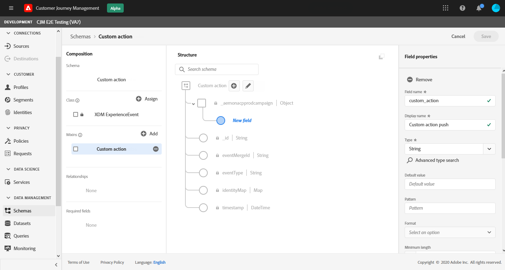

# Configurare il canale di notifica push {#push-notification-configuration}

[!DNL Journey Optimizer] consente di creare i percorsi e inviare messaggi a un pubblico di destinazione. Prima di iniziare a inviare notifiche push con [!DNL Journey Optimizer], assicurati che le configurazioni e le integrazioni siano presenti nell’app mobile e in [!DNL Adobe Experience Platform] e [!DNL Adobe Experience Platform Launch]. Per comprendere il flusso di dati delle notifiche push in Adobe Percorsi Optimizer, consulta [questa pagina](push-gs.md).

## Prima di iniziare

<!--
### Check provisioning

Your Adobe Experience Platform account must be provisioned to contain following schemas and datasets for push notification data flow to function correctly:

| Schema <br>Dataset                                                                       | Group of fields                                                                                                                                                                         | Operation                                                |
| -------------------------------------------------------------------------------------- | --------------------------------------------------------------------------------------------------------------------------------------------------------------------------------------- | -------------------------------------------------------- |
| CJM Push Profile Schema <br>CJM Push Profile Dataset                                     | Push Notification Details<br>Adobe CJM ExperienceEvent - Message Profile Details<br>Adobe CJM ExperienceEvent - Message Execution Details<br>Application Details<br>Environment Details | Register Push Token                                      |
| CJM Push Tracking Experience Event Schema<br>CJM Push Tracking Experience Event Dataset | Push Notification Tracking                                                                                                                                                              | Track interactions and provide data for the reporting UI |
-->

### Impostare le autorizzazioni

Prima di creare un&#39;app mobile, è necessario assicurarsi di disporre o assegnare le autorizzazioni utente corrette in **Adobe Experience Platform Launch**. Ulteriori informazioni sono disponibili nella [documentazione di Adobe Experience Platform Launch](https://experienceleague.adobe.com/docs/launch/using/admin/user-permissions.html).

>[!CAUTION]
>
>La configurazione push deve essere eseguita da un utente esperto. A seconda del modello di implementazione e degli utenti tipo coinvolti in questa implementazione, potrebbe essere necessario assegnare l&#39;intero set di autorizzazioni a un singolo profilo di prodotto o condividere le autorizzazioni tra lo sviluppatore dell&#39;app e l&#39;amministratore **Adobe Journey Optimizer**. Ulteriori informazioni sulle autorizzazioni **Adobe Experience Platform Launch** in [questa documentazione](https://experienceleague.adobe.com/docs/launch/using/admin/user-permissions.html?lang=en#platform-launch-permissions)

<!--ou need to your have access to perform following roles :

* Manage Datastreams
* Manage Client-side Properties
* Manage App Configurations
-->

Per assegnare i diritti **Property** e **Company**, segui i passaggi seguenti:

1. Accedi a **[!DNL Admin Console]**.

1. Dalla scheda **[!UICONTROL Products]** , seleziona la scheda **[!UICONTROL Adobe Experience Platform Launch]** .

   

1. Seleziona un **[!UICONTROL Product Profile]** esistente o creane uno nuovo con il pulsante **[!UICONTROL New profile]** . Scopri come creare un nuovo **[!UICONTROL New profile]** nella [documentazione di Admin Console](https://experienceleague.adobe.com/docs/experience-platform/access-control/ui/create-profile.html#ui).

1. Dalla scheda **[!UICONTROL Permissions]** , seleziona **[!UICONTROL Property rights]**.

   

1. Fai clic su **[!UICONTROL Add all]**. Questo aggiungerà il seguente diritto al tuo profilo di prodotto:
   * **[!UICONTROL Approve]**
   * **[!UICONTROL Develop]**
   * **[!UICONTROL Manage Environments]**
   * **[!UICONTROL Manage Extensions]**
   * **[!UICONTROL Publish]**

   Queste autorizzazioni sono necessarie per installare e pubblicare l&#39;estensione Adobe Journey Optimizer e pubblicare la proprietà dell&#39;app nell&#39;SDK di Adobe Experience Platform Mobile.

1. Quindi, seleziona **[!UICONTROL Company rights]** nel menu a sinistra.

   

1. Aggiungi i seguenti diritti:

   * **[!UICONTROL Manage App Configurations]**
   * **[!UICONTROL Manage Properties]**

   Queste autorizzazioni sono necessarie affinché lo sviluppatore di app mobili configuri le credenziali push in **Adobe Experience Launch** e definisca i predefiniti per le notifiche push in **Adobe Journey Optimizer**.

   

1. Fai clic su **[!UICONTROL Save]**.

Per assegnare questo **[!UICONTROL Product profile]** agli utenti, segui i passaggi seguenti:

1. Accedi a **[!DNL Admin Console]**.

1. Dalla scheda **[!UICONTROL Products]** , seleziona la scheda **[!UICONTROL Adobe Experience Platform Launch]** .

1. Seleziona il **[!UICONTROL Product profile]** configurato in precedenza.

1. Dalla scheda **[!UICONTROL Users]**, fai clic su **[!UICONTROL Add user]**.

   

1. Digita il nome o l’indirizzo e-mail dell’utente e seleziona l’utente. Quindi, fai clic su **[!UICONTROL Save]**.

   >[!NOTE]
   >
   >Se l&#39;utente non è stato creato in precedenza in Admin Console, consulta la [documentazione Aggiungere utenti](https://helpx.adobe.com/enterprise/admin-guide.html/enterprise/using/manage-users-individually.ug.html#add-users).

   

### Configurare l’app

La configurazione tecnica prevede una stretta collaborazione tra lo sviluppatore dell’app e l’amministratore aziendale. Prima di iniziare a inviare notifiche push con [!DNL Journey Optimizer], devi definire le impostazioni in Adobe Experience Platform Launch e integrare l’app mobile con gli SDK di Adobe Experience Platform Mobile.

Segui i passaggi di implementazione descritti nei collegamenti seguenti:

* Per **Apple iOS**: Scopri come registrare l’app con APN in [Documentazione Apple](https://developer.apple.com/documentation/usernotifications/registering_your_app_with_apns)
* Per **Google Android**: Scopri come configurare un’app client Firebase Cloud Messaging su Android in [Documentazione di Google](https://firebase.google.com/docs/cloud-messaging/android/client)

### Integrare la tua app mobile con l’SDK di Adobe Experience Platform

L’SDK di Adobe Experience Platform Mobile fornisce API di integrazione lato client per i dispositivi mobili tramite SDK compatibili con Android e iOS. Per effettuare la configurazione con gli SDK Adobe Experience Platform Mobile nell&#39;app, segui la [documentazione SDK di Adobe Experience Platform Mobile](https://aep-sdks.gitbook.io/docs/getting-started/overview) .

Alla fine di questo, avresti dovuto anche creare e configurare una proprietà mobile in Adobe Experience Platform Launch. In genere creerai una proprietà mobile per ogni app mobile che desideri gestire. Scopri come creare e configurare una proprietà mobile nella [documentazione di Adobe Experience Platform Launch](https://aep-sdks.gitbook.io/docs/getting-started/create-a-mobile-property).


## Passaggio 1: Aggiungi le credenziali push dell&#39;app in Adobe Experience Platform Launch {#push-credentials-launch}

Dopo aver concesso le autorizzazioni utente corrette, ora devi aggiungere le credenziali push dell’app mobile in [!DNL Adobe Experience Platform Launch].

La registrazione delle credenziali push dell’app mobile è necessaria per autorizzare l’Adobe a inviare notifiche push per tuo conto. Fai riferimento ai passaggi descritti di seguito:

1. Da [!DNL Adobe Experience Platform Launch], accertati che **[!UICONTROL Client Side]** sia selezionato nel menu a discesa.

1. Seleziona la scheda **[!UICONTROL App Configurations]** nel pannello a sinistra e fai clic su **[!UICONTROL App Configuration]** per creare una nuova configurazione.

1. Immetti un **[!UICONTROL Name]** per la configurazione.

1. Dal menu a discesa **[!UICONTROL Messaging Service Type]** , seleziona il **[!UICONTROL Messaging service type]** da utilizzare per queste credenziali.

   * **Per Android**

      

      1. Fornisci **[!UICONTROL App ID (Android package name)]**: in genere il nome del pacchetto è l&#39;ID app nel file `build.gradle` .

      1. Trascina e rilascia le credenziali push FCM. Per ulteriori dettagli su come ottenere le credenziali push, consulta [Documentazione di Google](https://firebase.google.com/docs/admin/setup#initialize-sdk).
   * **Per iOS**

      

      1. Immetti l&#39;app mobile **Bundle Id** nel campo **[!UICONTROL App ID (iOS Bundle ID)]** . L&#39;ID bundle dell&#39;app si trova nella scheda **Generale** della destinazione principale in **XCode**.

      1. Trascina e rilascia la **Chiave di autenticazione delle notifiche push Apple** per il tuo account sviluppatore Apple. Questa chiave può essere acquisita dalla pagina **Certificati**, **Identificatori** e **Profili** .

      1. Specifica l&#39; **ID chiave**. Si tratta di una stringa di 10 caratteri assegnata durante la creazione della chiave di autenticazione p8. È disponibile nella scheda **Tasti** nella pagina **Certificati**, **Identificatori** e **Profili**.

      1. Specifica l&#39; **ID team**. Questo è un valore di stringa che si trova nella scheda Appartenenza.


1. Fai clic su **[!UICONTROL Save]** per creare la configurazione dell&#39;app.

<!--
## Step 2: Set up a mobile property in Adobe Experience Platform Launch {#launch-property}

Setting up a mobile property allows the mobile app developer or marketer to configure the mobile SDKs attributes such as Session Timeouts, the [!DNL Adobe Experience Platform] sandbox to be targeted and the **[!UICONTROL Adobe Experience Platform Datasets]** to be used for mobile SDK to send data to.

For further details and procedures on how to set up a **[!UICONTROL Platform Launch property]**, refer to the steps detailed in [Adobe Experience Platform Mobile SDK documentation](https://aep-sdks.gitbook.io/docs/getting-started/create-a-mobile-property#create-a-mobile-property).


To get the SDKs needed for push notification to work you will need the following SDK extensions, for both Android and iOS:

* **[!UICONTROL Mobile Core]** (installed automatically)
* **[!UICONTROL Profile]** (installed automatically)
* **[!UICONTROL Adobe Experience Platform Edge]**
* **[!UICONTROL Adobe Experience Platform Assurance]**, optional but recommended to debug the mobile implementation.

Learn more about [!DNL Adobe Experience Platform Launch] extensions in [Adobe Experience Platform Launch documentation](https://experienceleague.adobe.com/docs/launch-learn/implementing-in-mobile-android-apps-with-launch/configure-launch/launch-add-extensions.html).
-->

## Passaggio 2: Configura estensione Adobe Journey Optimizer nella tua proprietà mobile

L’ **estensione Adobe Journey Optimizer** per gli SDK Adobe Experience Platform Mobile potenzia le notifiche push per le app mobili e consente di raccogliere i token push degli utenti e di gestire la misurazione dell’interazione con Adobe Experience Platform Services.

Scopri come impostare l’estensione Journey Optimizer nella [documentazione Adobe Experience Platform Mobile SDK](https://aep-sdks.gitbook.io/docs/using-mobile-extensions/adobe-journey-optimizer).


<!-- 
**[!UICONTROL Edge configuration]** is used by **[!UICONTROL Edge]** extension to send custom data from mobile device to [!DNL Adobe Experience Platform]. 
To configure [!DNL Adobe Experience Platform], you must provide the **[!UICONTROL Sandbox]** name and **[!UICONTROL Event Dataset]**.

For further details and procedures on how to create **[!UICONTROL Edge configuration]**, refer to the steps detailed in [Adobe Experience Platform Mobile SDK documentation](https://aep-sdks.gitbook.io/docs/getting-started/configure-datastreams).

1. From [!DNL Adobe Experience Platform Launch], select the **[!UICONTROL Edge Configurations]** tab and click **[!UICONTROL Edge Configurations]**.
    
1. Select **[!UICONTROL New Edge Configuration]** to add a new **[!UICONTROL Edge Configuration]**.
1. Enter a **[!UICONTROL Name]** and click **[!UICONTROL Save]**

1. Click the **[!UICONTROL Adobe Experience Platform]** toggle to enable it.

1. Fill in the **[!UICONTROL Sandbox]**, **[!UICONTROL Event dataset]** and **[!UICONTROL Profile Dataset]** fields. Then, click **[!UICONTROL Save]**.
    
    


1. From [!DNL Adobe Experience Platform Launch], ensure that **[!UICONTROL Client Side]** is selected in the drop-down menu.

1. select the **[!UICONTROL Properties]** tab and click **[!UICONTROL New Property]**.

    

1. Enter a **[!UICONTROL Name]** for your new property.

1. Select **[!UICONTROL Mobile]** as **[!UICONTROL Platform]**.

    

1. Click **[!UICONTROL Save]** to create your new property.

To configure **[!UICONTROL Adobe Experience Platform Edge Extension]** to send custom data from mobile devices to [!DNL Adobe Experience Platform].

1. Select your previously created property and select the **[!UICONTROL Extensions]** tab to view the extensions for this property.

    

1. Click **[!UICONTROL Configure]** under the **[!UICONTROL Adobe Experience Platform Edge]** Network' extension.

1. From the **[!UICONTROL Edge Configuration]** drop-down list, select the **[!UICONTROL Edge Configuration]** created in the previous steps. For more information on **[!UICONTROL Edge Configuration]**, refer to this [section](#edge-configuration).

1. Click **[!UICONTROL Save]**.

To configure **[!UICONTROL Adobe Experience Platform Messaging]** extension to send push profile and push interactions to the correct datasets, follow the same steps as above. Use **[!UICONTROL Sandbox]**, **[!UICONTROL Event dataset]** and **[!UICONTROL Profile Dataset]** created in the [Adobe Experience Platform setup](#edge-configuration).
-->

<!--
## Step 4: Publish the Property {#publish-property}

You now need to publish the property to integrate your configuration and to use it in the mobile app. 

To publish your property, refer to the steps detailed in [Adobe Experience Platform Mobile SDK documentation](https://aep-sdks.gitbook.io/docs/getting-started/create-a-mobile-property#publish-the-configuration)

## Step 5: Configure the ProfileDataSource {#configure-profiledatasource}

To configure the `ProfileDataSource`, use the `ProfileDCInletURL` from [!DNL Adobe Experience Platform] setup and add the following in the mobile app:

```
    MobileCore.updateConfiguration(
    mutableMapOf("messaging.dccs" to <ProfileDCSInletURL>)
```

-->

## Passaggio 3: Testa l’app mobile con un evento {#mobile-app-test}

Dopo aver configurato la tua app mobile sia in Adobe Experience Platform che in Adobe Launch, ora puoi testarla prima di inviare notifiche push ai profili. In questo caso d’uso, creeremo un percorso per eseguire il targeting della nostra app mobile e imposteremo un evento che attiverà la notifica push.

<!--
You can use a test mobile app for this use case. For more on this, refer to this [page](https://wiki.corp.adobe.com/pages/viewpage.action?spaceKey=CJM&title=Details+of+setting+the+mobile+test+app) (internal use only).
-->

Affinché questo percorso funzioni, è necessario creare uno schema XDM. Per ulteriori informazioni, consulta la [documentazione XDM](https://experienceleague.adobe.com/docs/experience-platform/xdm/schema/composition.html?lang=en#schemas-and-data-ingestion).

1. Nel menu a sinistra, seleziona **[!UICONTROL Schemas]**.

1. Fai clic su **[!UICONTROL Create schema]**, quindi seleziona **[!UICONTROL XDM ExperienceEvent]**.

   

1. Seleziona **[!UICONTROL Create a new field group]**.

1. Immetti un **[!UICONTROL Display Name]** e un **[!UICONTROL Description]**. Al termine, fai clic su **[!UICONTROL Add field groups]** . Per ulteriori informazioni su come creare gruppi di campi, consulta la [documentazione di sistema XDM](https://experienceleague.adobe.com/docs/experience-platform/xdm/tutorials/create-schema-ui.html?lang=it).


   

1. Sul lato sinistro, seleziona lo schema. Nel riquadro a destra, immetti il nome dello schema e della descrizione. Abilita questo schema per **[!UICONTROL Profile]**.

   


1. Sul lato sinistro, seleziona il gruppo di campi, quindi fai clic sull’icona + per creare un nuovo campo. In **[!UICONTROL Field groups properties]**, a destra, digita un **[!UICONTROL Field name]**, **[!UICONTROL Display name]** e seleziona **[!UICONTROL String]** come **[!UICONTROL Type]**.

   

1. Seleziona **[!UICONTROL Required]** e fai clic su **[!UICONTROL Apply]**.

1. Fai clic su **[!UICONTROL Save]**. Lo schema viene ora creato e può essere utilizzato in un evento.

È quindi necessario impostare un evento.

1. Dal menu a sinistra della home page, in AMMINISTRAZIONE, selezionare **[!UICONTROL Configurations]**. Fai clic su **[!UICONTROL Manage]** nella sezione **[!UICONTROL Events]** per creare il nuovo evento.

1. Fai clic su **[!UICONTROL Create Event]** per aprire il riquadro di configurazione dell’evento sul lato destro dello schermo.

   

1. Inserisci il nome dell’evento. Puoi anche aggiungere una descrizione.

1. Nel campo **[!UICONTROL Event ID type]** seleziona **[!UICONTROL Rule Based]**.

1. In **[!UICONTROL Parameters]**, seleziona lo schema creato in precedenza.

   

1. Nell’elenco dei campi, verifica che il campo creato nel gruppo di campi dello schema sia selezionato.

   

1. Fare clic su **[!UICONTROL Edit]** nel campo **[!UICONTROL Event ID condition]**. Trascina e rilascia il campo aggiunto in precedenza per definire la condizione che verrà utilizzata dal sistema per identificare gli eventi che attiveranno il percorso.

   

1. Digita la sintassi da utilizzare per attivare la notifica push nell&#39;app di prova, in questo esempio **conferma dell&#39;ordine**.

   

1. Seleziona **[!UICONTROL ECID]** come **[!UICONTROL Namespace]**.

1. Fai clic su **[!UICONTROL Ok]**, quindi su **[!UICONTROL Save]**.

L’evento viene ora creato e può essere utilizzato in un percorso.

1. Nel menu a sinistra, fai clic su **[!UICONTROL Journeys]**.

1. Fai clic su **[!UICONTROL Create Journey]** per creare un nuovo percorso.

1. Modifica le proprietà del percorso nel riquadro di configurazione visualizzato sul lato destro. Ulteriori informazioni in questa sezione [sezione](building-journeys/journey-gs.md#change-properties).

1. Inizia trascinando l’evento creato nei passaggi precedenti dal menu a discesa **[!UICONTROL Events]** .

   

1. Dall’elenco a discesa **[!UICONTROL Actions]** , trascina e rilascia un’attività **[!UICONTROL Message]** nel percorso.

1. Seleziona un messaggio creato in precedenza. Per ulteriori informazioni su come creare le notifiche push, consulta questa [pagina](create-message.md).

1. Trascina e rilascia un’attività **[!UICONTROL End]** nel percorso.

1. Fai clic sull’interruttore **[!UICONTROL Test]** per iniziare a testare le notifiche push e fai clic su **[!UICONTROL Trigger an event]**.

   

1. Immetti il tuo ECID nel campo **[!UICONTROL Key]** , quindi digita **conferma ordine** nel secondo campo.

   

1. Fai clic su **[!UICONTROL Send]**.

L’evento verrà attivato e riceverai la notifica push all’app mobile.

## Passaggio 4: Crea un messaggio predefinito per push{#message-preset}

Una volta che l’app mobile è stata configurata in [!DNL Adobe Experience Platform Launch], devi creare un predefinito per messaggi per poter inviare notifiche push da **[!DNL Journey Optimizer]**.

Scopri come creare e configurare un predefinito per messaggi in [questa sezione](configuration/message-presets.md).

Ora puoi inviare notifiche push con Journey Optimizer.

* Scopri come creare un messaggio push in [questa pagina](create-push.md).
* Scopri come inviare un messaggio in un percorso in [questa sezione](building-journeys/journeys-message.md).
