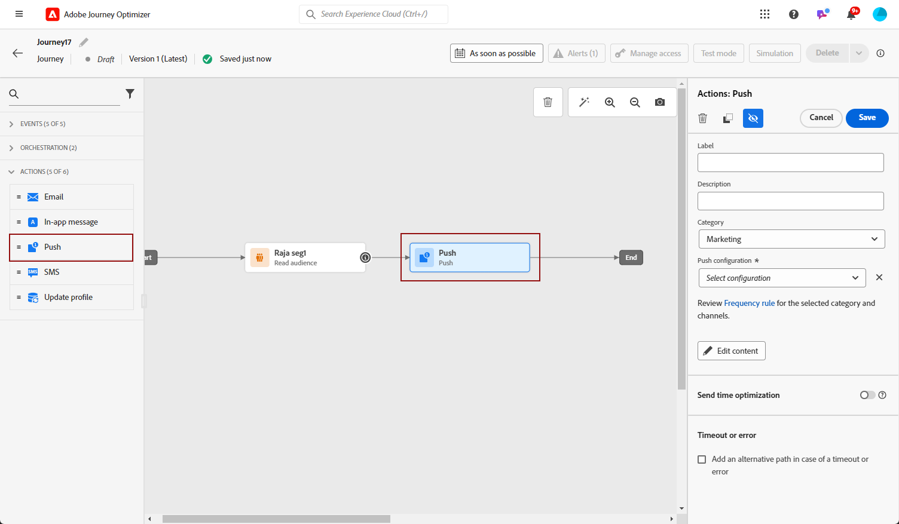
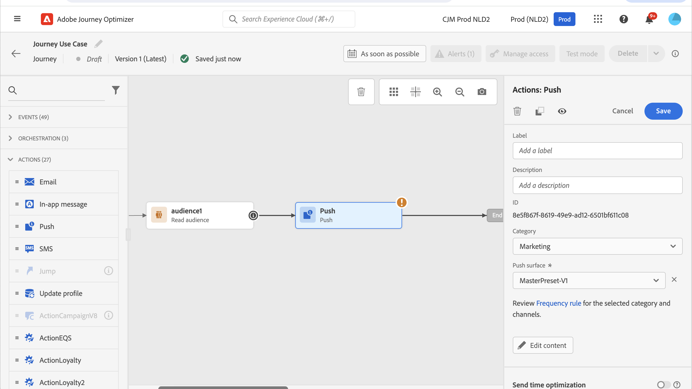

# Creare una notifica push {#create-push-notification}

>[!BEGINSHADEBOX]

**In questa pagina:** Scopri come creare una notifica push all&#39;interno di un percorso o di una campagna per dispositivi mobili e web, incluso l&#39;utilizzo della modalità di consegna rapida per l&#39;invio di volumi elevati.

>[!ENDSHADEBOX]

>[!CONTEXTUALHELP]
>id="ajo_journey_action_push"
>title="Azione notifica push"
>abstract="Un’azione del canale di notifica push invia una notifica push ai profili quando raggiungono questo passaggio del percorso. L’etichetta identifica l’attività nell’area di lavoro del percorso e l’azione fa riferimento a una configurazione push che definisce il contenuto distribuito. La sezione **Ottimizzazione** può includere esperimenti di contenuto o regole di targeting, la sezione **Multilingue** può distribuire contenuto in più lingue e la sezione **Timeout o errore** può definire un percorso alternativo se l&#39;azione non riesce."
>additional-url="https://experienceleague.adobe.com/en/docs/journey-optimizer/using/orchestrate-journeys/about-journey-building/journey-action#add-action" text="Introduzione alle azioni dei canali"

>[!CONTEXTUALHELP]
>id="ajo_message_push"
>title="Creazione di messaggi push"
>abstract="Aggiungi il messaggio push e inizia a personalizzarlo con l’editor di personalizzazione."

Puoi creare notifiche push per dispositivi mobili (iOS e Android) e browser web. Questa pagina ti guida attraverso la procedura di configurazione di una notifica push in un percorso o in una campagna.

## Creare la notifica push in un percorso o in una campagna {#create}

Per creare una notifica push, effettua le seguenti operazioni:

>[!BEGINTABS]

>[!TAB Aggiungi un messaggio push a un Percorso]

1. Apri il percorso, quindi trascina e rilascia un&#39;attività **[!UICONTROL Action]** dalla sezione **[!UICONTROL Actions]** della palette. Ulteriori informazioni sull&#39;[attività Azione](../building-journeys/journey-action.md).

   >[!IMPORTANT]
   >
   >Le attività dei canali nativi legacy (e-mail, push, SMS, in-app, web, esperienza basata su codice e scheda di contenuto) sono diventate obsolete a partire dalla versione di marzo 2026. I percorsi esistenti che utilizzano queste attività continuano a funzionare senza alcuna modifica e non è richiesta alcuna migrazione.

1. Seleziona **[!UICONTROL Push]** come tipo di azione.

   

1. Immetti un **[!UICONTROL Label]** per identificare l&#39;azione nell&#39;area di lavoro del percorso.

1. Fai clic sul pulsante **[!UICONTROL Configura azione]**.

1. Sei indirizzato alla scheda **[!UICONTROL Azioni]**. Da qui, seleziona o crea la configurazione push da utilizzare. [Ulteriori informazioni](push-configuration.md)

   

1. Inoltre:

   * Puoi applicare le regole di limitazione all&#39;azione push selezionando un set di regole nell&#39;elenco a discesa **[!UICONTROL Regole aziendali]**. [Ulteriori informazioni](../conflict-prioritization/channel-capping.md)

   * È possibile utilizzare l&#39;opzione **[!DNL Send time optimization]** per prevedere il momento migliore per inviare il messaggio in modo da massimizzare il coinvolgimento in base alle percentuali storiche di apertura e clic. [Scopri come](../building-journeys/send-time-optimization.md)

1. Utilizza la **[!UICONTROL modalità Consegna rapida]** per inviare la notifica push in grandi volumi. [Scopri come](#rapid-delivery)

1. Seleziona il pulsante **[!UICONTROL Modifica contenuto]** e crea il contenuto come desiderato. [Ulteriori informazioni](design-push.md)

1. Una volta definito il contenuto del messaggio, puoi utilizzare profili di test o dati di input di esempio caricati da un file CSV/JSON, o aggiunti manualmente per visualizzarne l’anteprima. [Scopri come](send-push.md)

1. Torna all’area di lavoro del percorso. Se necessario, completa il flusso di percorso trascinando altre azioni o eventi. [Ulteriori informazioni](../building-journeys/about-journey-activities.md)

   >[!NOTE]
   >
   >Per tenere traccia del comportamento dei destinatari tramite le aperture push e/o le interazioni, assicurati che le opzioni dedicate nella sezione di tracciamento siano abilitate nell&#39;[attività e-mail](../building-journeys/journey-action.md).

Per ulteriori informazioni su come creare, configurare e pubblicare un percorso, fare riferimento a [questa pagina](../building-journeys/journey-gs.md).

>[!TAB Aggiungere un messaggio push a una campagna]

1. Accedi al menu **[!UICONTROL Campagne]**, quindi fai clic su **[!UICONTROL Crea campagna]**.

1. Seleziona il tipo di campagna da eseguire

   * **Pianificato - Marketing**: esegui la campagna immediatamente o in una data specificata. Le campagne pianificate hanno lo scopo di inviare messaggi di marketing. Vengono configurati ed eseguiti dall’interfaccia utente di.

   * **Attivato da API - Marketing/Transazionale**: esegui la campagna utilizzando una chiamata API. Le campagne attivate da API hanno lo scopo di inviare messaggi di marketing o transazionali, ovvero messaggi inviati in seguito a un’azione eseguita da un individuo: reimpostazione della password, acquisto del carrello, ecc.

1. Dalla sezione **[!UICONTROL Proprietà]**, modifica il **[!UICONTROL Titolo]** e la **[!UICONTROL Descrizione]** della tua campagna.

1. Fai clic sul pulsante **[!UICONTROL Seleziona pubblico]** per definire il pubblico di destinazione dall&#39;elenco dei tipi di pubblico di Adobe Experience Platform disponibili. [Ulteriori informazioni](../audience/about-audiences.md).

1. Nel campo **[!UICONTROL Spazio dei nomi identità]**, scegli lo spazio dei nomi da utilizzare per identificare i singoli utenti del pubblico selezionato. [Ulteriori informazioni](../event/about-creating.md#select-the-namespace).

1. Nella sezione **[!UICONTROL Azioni]**, scegli la **[!UICONTROL notifica push]** e seleziona o crea una nuova configurazione.

   Ulteriori informazioni sulla configurazione push per dispositivi mobili in [questa pagina](push-configuration.md) e per il Web in [questa pagina](push-configuration-web.md).

   

1. Fai clic su **[!UICONTROL Crea esperimento]** per iniziare a configurare l&#39;esperimento sui contenuti e creare trattamenti per misurarne le prestazioni e identificare l&#39;opzione migliore per il pubblico di destinazione. [Ulteriori informazioni](../content-management/content-experiment.md)

1. Le campagne sono progettate per essere eseguite in una data specifica o con una frequenza ricorrente. Scopri come configurare la **[!UICONTROL pianificazione]** della campagna in [questa sezione](../campaigns/create-campaign.md#schedule).

1. Dal menu **[!UICONTROL Trigger azione]**, scegli la **[!UICONTROL Frequenza]** della notifica push:

   * Una volta
   * Giornaliera
   * Settimanale
   * Mensile

1. Dalla schermata di configurazione della campagna, fai clic sul pulsante **[!UICONTROL Modifica contenuto]** per configurare il contenuto push. [Progettare una notifica push](design-push.md)

1. Una volta definito il contenuto del messaggio, puoi utilizzare profili di test o dati di input di esempio caricati da un file CSV/JSON, o aggiunti manualmente per visualizzarne l’anteprima. [Scopri come](send-push.md)

1. Quando il push è pronto, completa la configurazione della [campagna](../campaigns/create-campaign.md) per inviarla.

   Per tenere traccia del comportamento dei destinatari tramite aperture push e/o interazioni, assicurati che le opzioni dedicate nella sezione di tracciamento siano abilitate nella [campagna](../campaigns/create-campaign.md).

Per ulteriori informazioni su come creare, configurare e attivare una campagna, consulta [questa pagina](../campaigns/get-started-with-campaigns.md).

>[!ENDTABS]

**Argomenti correlati**

* [Configurare il canale push](push-gs.md)
* [Aggiungere un messaggio in un percorso](../building-journeys/journey-action.md)

## Modalità di consegna rapida {#rapid-delivery}

>[!CONTEXTUALHELP]
>id="ajo_campaigns_rapid_delivery"
>title="Modalità di consegna rapida"
>abstract="La modalità di consegna rapida consente di inviare messaggi ad alta velocità sul canale push a un pubblico di dimensione inferiore a 30 milioni."

La modalità Consegna rapida è un componente aggiuntivo [!DNL Journey Optimizer] che consente l’invio molto rapido di messaggi push in volumi elevati tramite campagne.

La consegna rapida viene utilizzata quando il ritardo nella consegna dei messaggi è business-critical, quando desideri inviare un avviso push urgente sui telefoni cellulari, ad esempio una notizia straordinaria agli utenti che hanno installato la tua app per il canale notizie.

Per ulteriori informazioni sulle prestazioni durante l’utilizzo della modalità Consegna rapida, consulta la [descrizione del prodotto Adobe Journey Optimizer](https://helpx.adobe.com/it/legal/product-descriptions/adobe-journey-optimizer.html){target="_blank"}.

### Prerequisiti {#prerequisites}

I messaggi di consegna rapida sono forniti con i seguenti requisiti:

* La consegna rapida è disponibile solo per **[!UICONTROL campagne pianificate]** e non per campagne attivate da API,
* Nel messaggio push non è consentita alcuna personalizzazione,
* Il pubblico di destinazione deve contenere meno di 30 milioni di profili,
* Puoi eseguire fino a 5 campagne simultaneamente utilizzando la modalità Consegna rapida.

### Attiva modalità Consegna rapida

1. Crea una campagna di notifica push e attiva l&#39;opzione **[!UICONTROL Consegna rapida]**.

   

1. Configura il contenuto del messaggio e seleziona il pubblico di destinazione. [Scopri come creare una campagna](#create)

   >[!IMPORTANT]
   >
   >Assicurati che il contenuto del messaggio non includa alcuna personalizzazione e che il pubblico contenga meno di 30 milioni di profili.

1. Rivedi e attiva la campagna come di consueto. Tieni presente che, in modalità di test, i messaggi non vengono inviati tramite la modalità Consegna rapida.