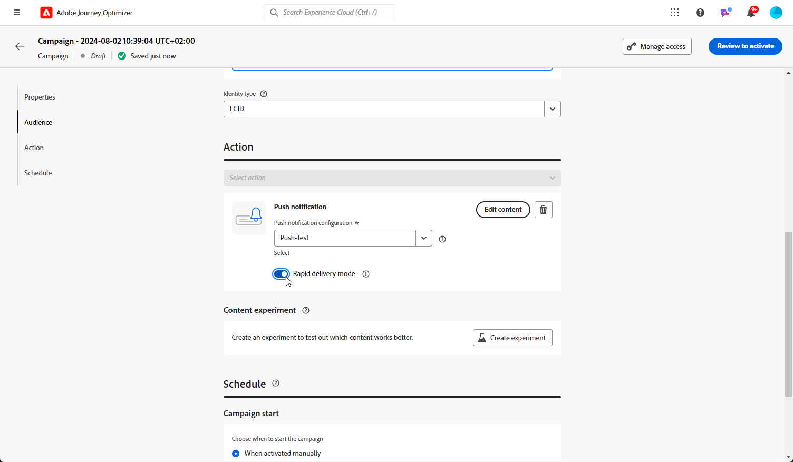

# Creare una notifica push {#create-push-notification}

>[!CONTEXTUALHELP]
>id="ajo_message_push"
>title="Creazione di messaggi push"
>abstract="Aggiungi il messaggio push e inizia a personalizzarlo con l’editor espressioni."

## Creare la notifica push in un percorso o in una campagna {#create}

Per creare una notifica push, segui i passaggi seguenti:

>[!BEGINTABS]

>[!TAB Aggiungere un push a un Percorso]

1. Apri il percorso, quindi trascina e rilascia un’attività Push dalla sezione Azioni della palette.

   

1. Fornisci informazioni di base sul messaggio (etichetta, descrizione, categoria), quindi scegli l’area del messaggio da utilizzare.

   

   >[!NOTE]
   >
   >Se invii una notifica push da un percorso, puoi sfruttare la funzione di ottimizzazione del momento di invio di Adobe Journey Optimizer per prevedere il momento migliore per l’invio del messaggio per massimizzare il coinvolgimento in base ai tassi storici di apertura e clic. [Scopri come utilizzare l’ottimizzazione per i tempi di invio](../building-journeys/journeys-message.md#send-time-optimization)

   Per ulteriori informazioni su come configurare un percorso, consulta [questa pagina](../building-journeys/journey-gs.md)

1. Dalla schermata di configurazione del percorso, fai clic sul pulsante **[!UICONTROL Modifica contenuto]** per configurare il contenuto push. [Progettazione di una notifica push](design-push.md)

1. Una volta definito il contenuto del messaggio, puoi utilizzare i profili di test per visualizzarlo in anteprima e testarlo.

1. Quando il push è pronto, completa la configurazione del tuo [percorso](../building-journeys/journey-gs.md) per inviarlo.

   Per tenere traccia del comportamento dei destinatari tramite le aperture e/o le interazioni push, assicurati che le opzioni dedicate nella sezione di tracciamento siano abilitate nella sezione [attività e-mail](../building-journeys/journeys-message.md).

>[!TAB Aggiungere un push a una campagna]

1. Crea una nuova campagna pianificata o attivata dall’API, seleziona **[!UICONTROL Notifica push]** come azione e scegli la **[!UICONTROL Superficie dell&#39;app]** da utilizzare. [Ulteriori informazioni sulla configurazione push](push-configuration.md).

   

1. Fai clic su **[!UICONTROL Crea]**.

1. Da **[!UICONTROL Proprietà]** , modifica la **[!UICONTROL Titolo]** e **[!UICONTROL Descrizione]**.

   

1. Fai clic sul pulsante **[!UICONTROL Selezionare il pubblico]** per definire il pubblico di cui eseguire il targeting dall’elenco dei segmenti Adobe Experience Platform disponibili. [Maggiori informazioni](../segment/about-segments.md).

1. In **[!UICONTROL Spazio dei nomi identità]** scegli lo spazio dei nomi da utilizzare per identificare gli individui del segmento selezionato. [Maggiori informazioni](../event/about-creating.md#select-the-namespace).

   

1. Le campagne sono progettate per essere eseguite in una data specifica o su una frequenza ricorrente. Scopri come configurare il **[!UICONTROL Pianificazione]** della campagna in [questa sezione](../campaigns/create-campaign.md#schedule).

1. Da **[!UICONTROL Trigger delle azioni]** scegliere il menu **[!UICONTROL Frequenza]** della notifica push:

   * Una volta
   * Giornaliera
   * Settimanale
   * Mensile

1. Dalla schermata di configurazione della campagna, fai clic su **[!UICONTROL Modifica contenuto]** per configurare il contenuto push. [Progettazione di una notifica push](design-push.md)

1. Una volta definito il contenuto del messaggio, puoi utilizzare i profili di test per visualizzarlo in anteprima e testarlo.

1. Quando il push è pronto, completa la configurazione del tuo [campagna](../campaigns/create-campaign.md) per inviarlo.

   Per tenere traccia del comportamento dei destinatari tramite le aperture e/o le interazioni push, assicurati che le opzioni dedicate nella sezione di tracciamento siano abilitate nella sezione [campagna](../campaigns/create-campaign.md).

>[!ENDTABS]

**Argomenti correlati**

* [Configurare il canale push](push-gs.md)
* [Aggiungere un messaggio in un percorso](../building-journeys/journeys-message.md)

## Modalità di consegna rapida {#rapid-delivery}

>[!CONTEXTUALHELP]
>id="ajo_campaigns_rapid_delivery"
>title="Modalità di consegna rapida"
>abstract="La modalità di consegna rapida consente di inviare messaggi ad alta velocità sul canale push a una dimensione di pubblico inferiore a 30M."

La modalità di consegna rapida, precedentemente nota come modalità Burst nei percorsi, è una [!DNL Journey Optimizer] add-on che consente l&#39;invio rapido di messaggi push in grandi volumi attraverso le campagne.

La consegna rapida viene utilizzata quando il ritardo nella consegna dei messaggi è di importanza critica per l’azienda, quando si desidera inviare un avviso push urgente sui telefoni cellulari, ad esempio una notizia di emergenza per gli utenti che hanno installato la tua app di canale di notizie.

Per ulteriori informazioni sulle prestazioni quando si utilizza la modalità di consegna rapida, consulta [Descrizione del prodotto Adobe Journey Optimizer](https://helpx.adobe.com/it/legal/product-descriptions/adobe-journey-optimizer.html).

### Prerequisiti {#prerequisites}

I messaggi di consegna rapida sono forniti con i seguenti requisiti:

* La consegna rapida è disponibile per **[!UICONTROL Pianificato]** solo per le campagne e non è disponibile per le campagne con attivazione API,
* Nel messaggio push non è consentita alcuna personalizzazione,
* Il pubblico di destinazione deve contenere meno di 30 milioni di profili,
* Puoi eseguire fino a 5 campagne contemporaneamente utilizzando la modalità di consegna rapida.

### Attiva modalità di consegna rapida

1. Creare una campagna di notifica push e attivare **[!UICONTROL Consegna rapida]** opzione .

1. Configura il contenuto del messaggio e seleziona il pubblico di cui eseguire il targeting. [Scopri come creare una campagna](#create)

   >[!IMPORTANT]
   >
   >Assicurati che il contenuto del messaggio non includa alcuna personalizzazione e che il pubblico contenga meno di 30M profili.

1. Rivedi e attiva la campagna come di consueto. In modalità di test i messaggi non vengono inviati tramite la modalità di consegna rapida.