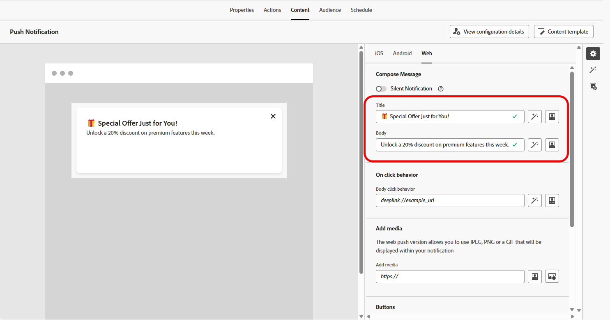
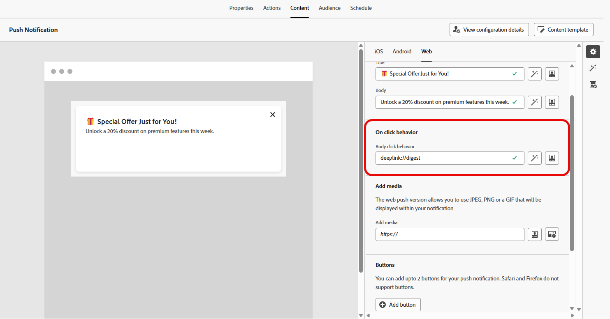

# Progettare una notifica push web {#design-push-notification}

>[!AVAILABILITY]
>
>Attualmente, le notifiche Web push in Journey Optimizer non supportano le funzionalità **Silent Notification** e **Simulate Content**, ma saranno disponibili in un secondo momento.

Dopo aver creato la campagna o il percorso di notifiche Web push, puoi progettarne il contenuto e la struttura in base alle tue esigenze. Prima di inviare qualsiasi notifica Web push, è necessario configurare questo canale nella [configurazione canale](push-configuration-web.md).

<!--
## Send a silent notification {#silent-notification}

A silent push notification (also called a background notification) is a hidden message sent to your web application without alerting the user.

To enable a silent notification, enable the **[!UICONTROL Silent Notification]** option. When this option is used, the notification is delivered directly to the application, and no alert, banner, or sound is shown to the user.

Use the **Custom Data** section to include additional information in the form of key-value pairs. 

-->

## Titolo e corpo {#push-title-body}

Per comporre il messaggio, fai clic sui campi **[!UICONTROL Titolo]** e **[!UICONTROL Corpo]**. Utilizza l&#39;editor di personalizzazione per definire il contenuto, [personalizzare i dati](../personalization/personalize.md) e aggiungere [contenuto dinamico](../personalization/get-started-dynamic-content.md).

Fai clic su **[!UICONTROL Modifica testo con l&#39;assistente di intelligenza artificiale]** per generare facilmente i contenuti utilizzando l&#39;assistente di intelligenza artificiale di Journey Optimizer.

## Comportamento al clic {#on-click-behavior}

Utilizza il campo **[!UICONTROL Comportamento clic corpo]** per definire un collegamento profondo che determina cosa accade quando un utente fa clic sul corpo della notifica. Questo consente di inviare gli utenti direttamente a una pagina o sezione specifica dell’applicazione web.

## Aggiungere file multimediali {#add-media-push}

Immetti l&#39;URL del supporto nel campo **[!UICONTROL Aggiungi supporto]**. Puoi anche includere token di personalizzazione nell’URL per personalizzare il contenuto di ogni utente.

Fai clic su  per generare rapidamente file multimediali utilizzando l&#39;Assistente di IA per Journey Optimizer.

## Aggiungere pulsanti {#add-buttons-push}

Rendi interattive le notifiche push web aggiungendo pulsanti al contenuto.

I pulsanti sono visibili solo quando il dispositivo è sbloccato. Se la schermata è bloccata, verranno visualizzati solo **[!UICONTROL Titolo]** e **[!UICONTROL Messaggio]**.

Utilizza l&#39;opzione **[!UICONTROL Aggiungi pulsante]** per definire l&#39;etichetta di ogni pulsante e l&#39;azione associata, come descritto di seguito:

* **[!UICONTROL Deeplink]**: reindirizza gli utenti a una visualizzazione, sezione o scheda specifica nell&#39;app. Immetti l’URL del collegamento diretto nel campo associato.

* **[!UICONTROL URL Web]**: reindirizzare gli utenti a una pagina Web esterna. Immetti l’URL nel campo associato.

## Dati personalizzati {#custom-data}

Nella sezione **[!UICONTROL Dati personalizzati]** è possibile aggiungere coppie chiave-valore personalizzate al payload di notifica. Questi valori possono essere utilizzati dall’applicazione web per attivare azioni specifiche o personalizzare l’esperienza utente. Per ulteriori informazioni su come impostare le notifiche push in Adobe Experience Platform, consulta [questa sezione](push-gs.md)

