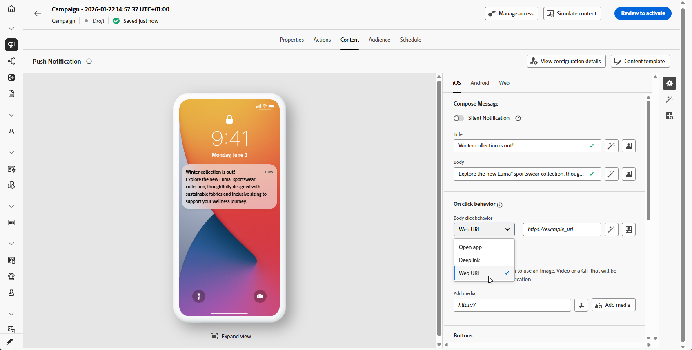
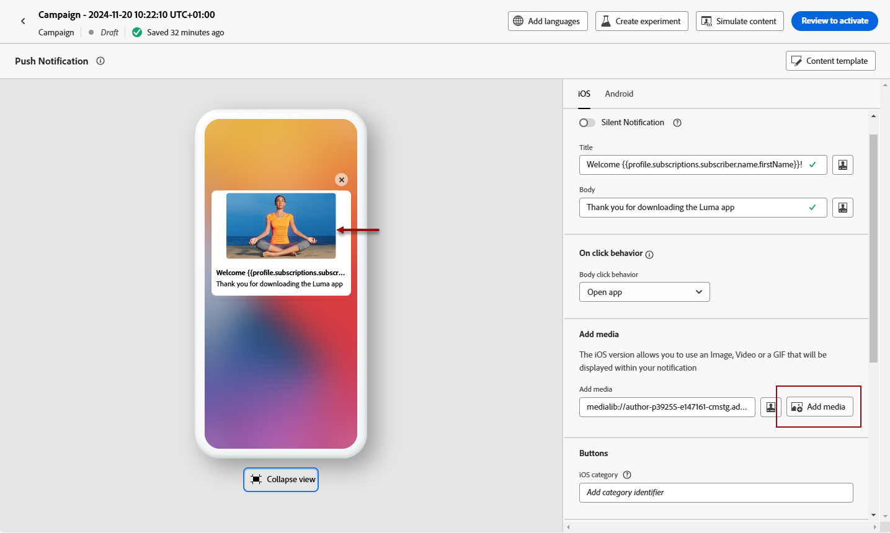
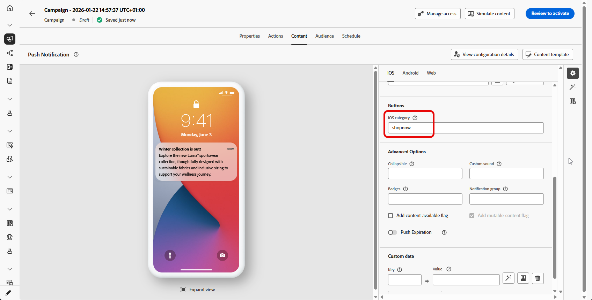
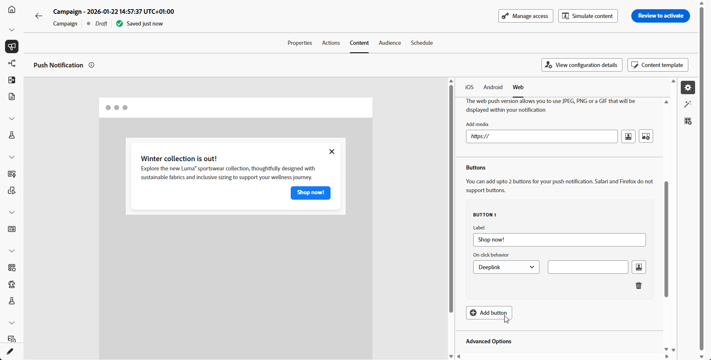

# Progettare una notifica push {#design-push-notification}

Dopo aver creato una notifica push, puoi progettarne il contenuto per le piattaforme iOS, Android e Web. Questa pagina ti guida attraverso la composizione del messaggio, la configurazione del comportamento al clic, l’aggiunta di supporti e pulsanti e l’impostazione di opzioni avanzate per creare notifiche push coinvolgenti che risuonano con il tuo pubblico.

## Titolo e corpo {#push-title-body}

>[!CONTEXTUALHELP]
>id="ajo-message-push-compose"
>title="Personalizzare la notifica push."
>abstract="Per comporre il messaggio, immetti il contenuto nei campi **Titolo** e **Corpo**. Per includere i token di personalizzazione, apri la finestra di dialogo di personalizzazione."

Per comporre il messaggio, fai clic sui campi **[!UICONTROL Titolo]** e **[!UICONTROL Corpo]**. Utilizza l’editor di personalizzazione per definire i contenuti, personalizzare i dati e aggiungere contenuti dinamici. Ulteriori informazioni sulla [personalizzazione](../personalization/personalize.md) e sul [contenuto dinamico](../personalization/get-started-dynamic-content.md) nell&#39;editor di personalizzazione.

Utilizza la sezione anteprima dispositivo per visualizzare come viene visualizzata la notifica push su iOS, Android e Web.

Accelera la creazione dei contenuti con l&#39;Assistente di intelligenza artificiale e genera un testo di notifica push convincente con [Assistente di intelligenza artificiale per la generazione di testo](../content-management/generative-text.md) oppure crea notifiche push complete con [Assistente di intelligenza artificiale per la generazione di contenuti completi](../content-management/generative-full-content.md).

## Comportamento al clic {#on-click-behavior}

>[!CONTEXTUALHELP]
>id="ajo-message-push-onclick"
>title="Informazioni sul comportamento del clic"
>abstract="Seleziona il comportamento che si verifica quando un destinatario fa clic sul corpo della notifica push."

Configura l’azione che si verifica quando i destinatari toccano il corpo della notifica push. Scegli una tra le opzioni seguenti:

* **[!UICONTROL Apri app]**: avvia l&#39;applicazione associata alla notifica. L&#39;app è specificata nella [configurazione canale](../configuration/channel-surfaces.md) (ossia il predefinito per messaggi).
* **[!UICONTROL Deeplink]**: indirizza gli utenti a contenuto specifico all&#39;interno dell&#39;app, ad esempio una visualizzazione, una sezione di pagina o una scheda specifica. Immetti l’URL del collegamento diretto nel campo fornito.
* **[!UICONTROL URL Web]**: indirizza gli utenti a una pagina Web esterna. Immetti l’URL di destinazione nel campo fornito.

  >[!NOTE]
  >
  >If your push notification contains a URL that is configured as a universal link in iOS, the push will open the associated app if installed, regardless of your chosen **[!UICONTROL Web URL]** action. To force a browser open, use a domain not configured for universal links, or remove universal link registration for the domain.
  >For more information on how the Adobe SDK handles deep links and universal links, refer to the [Adobe Experience Platform Mobile SDK documentation](https://developer.adobe.com/client-sdks/documentation/adobe-journey-optimizer/push-notifications){target="_blank"}.

## Aggiungere file multimediali {#add-media-push}

>[!CONTEXTUALHELP]
>id="ajo-message-push-media"
>title="Aggiungere contenuti multimediali alla notifica push"
>abstract="Puoi aggiungere un’immagine, un video o una GIF da visualizzare all’interno della notifica."

Enhance your push notification by adding visual media. The available media types and implementation methods vary by operating system, as detailed in the tabs below.

>[!BEGINTABS]

>[!TAB Android]

For Android, you can only add an image icon, and an image for expanded notifications.

You can add media using either of the following methods:

* **[!UICONTROL Add media]** button: Select an asset from [Adobe Experience Manager Assets](../integrations/assets.md) or access the AI Assistant to generate [engaging images](../content-management/generative-image.md) for push notifications.

* **[!UICONTROL Add media]** field: Enter the media URL directly. You can include personalization tokens in the URL.

Once added, the media displays on the right of the notification body.

>[!NOTE]
>
>When including media attachments in the push notification payload (such as images in custom data fields like `adb_media`), your mobile application must implement specific client-side handling for the images to render on devices. Your app must implement the [automatic display and tracking workflow](https://developer.adobe.com/client-sdks/edge/adobe-journey-optimizer/push-notification/android/automatic-display-and-tracking){target="_blank"} to handle image attachments from the payload.

>[!TAB iOS]

For iOS, you can add an image, video, or GIF to display within your notification.

You can add media using either of the following methods:

* **[!UICONTROL Add media]** button: Select an asset from **[!DNL Adobe Experience Manager Assets]**. Learn more about using **[!DNL Adobe Experience Manager Assets]** in [this page](../integrations/assets.md).

* **[!UICONTROL Add media]** field: Enter the media URL directly. You can include personalization tokens in the URL.

Once added, the media displays on the right of the notification body.

>[!NOTE]
>
>When including media attachments in the push notification payload (such as images in custom data fields like `adb_media`), your mobile application must implement specific client-side handling for the images to render on devices. Your app must implement a [Notification Service Extension](https://developer.apple.com/documentation/usernotifications/modifying_content_in_newly_delivered_notifications){target="_blank"} to download and process media content from the payload. Additionally, the **[!UICONTROL Add mutable-content flag]** option must be enabled in the [Advanced options](#advanced-options-push) section.

>[!TAB Web]

Enter the media URL in the **[!UICONTROL Add media]** field. You can also include personalization tokens in the URL to customize the content for each user.

Fai clic su  per generare rapidamente file multimediali utilizzando l&#39;Assistente di IA per Journey Optimizer.

>[!ENDTABS]

## Aggiungere pulsanti {#add-buttons-push}

>[!CONTEXTUALHELP]
>id="ajo-message-push-buttons"
>title="Aggiungi i pulsanti per consentire agli utenti di interagire con la notifica push."
>abstract="Da questa sezione, aggiungi i pulsanti di invito all’azione al messaggio. Per Apple iOS, specifica un identificatore di categoria di notifica. Per Google Android, per ciascun pulsante puoi specificare il testo personalizzato e le destinazioni."

Crea una notifica actionable aggiungendo pulsanti al contenuto push. Sfoglia le schede seguenti in base al tuo sistema operativo.

Se la schermata del dispositivo è bloccata, questi pulsanti non vengono visualizzati: solo allora sono visibili il **Titolo** e il **Messaggio** della notifica. Se il dispositivo è sbloccato, i destinatari visualizzeranno i pulsanti.

>[!BEGINTABS]

>[!TAB Android]

Per Android, puoi aggiungere fino a tre pulsanti.

1. Utilizza il **[!UICONTROL pulsante Aggiungi]** per definire le impostazioni: l&#39;etichetta e l&#39;azione associata. Le azioni possibili sono le stesse del [comportamento al clic](#on-click-behavior).

   

1. Utilizza l&#39;icona **[!UICONTROL Espandi visualizzazione]** sotto l&#39;immagine di anteprima centrale per visualizzare l&#39;anteprima dei pulsanti personalizzati.

>[!TAB iOS]

Per iOS, viene specificato un identificatore di categoria di notifica. Le categorie di notifica devono essere preconfigurate nell’app iOS che definirà i pulsanti da visualizzare e le azioni da intraprendere. Per ulteriori dettagli, consulta la [documentazione di Apple](https://developer.apple.com/documentation/usernotifications/declaring_your_actionable_notification_types).

>[!TAB Web]

Utilizza l&#39;opzione **[!UICONTROL Aggiungi pulsante]** per definire l&#39;etichetta di ogni pulsante e l&#39;azione associata, come descritto di seguito:

* **[!UICONTROL Deeplink]**: reindirizza gli utenti a una visualizzazione, sezione o scheda specifica nell&#39;app. Immetti l’URL del collegamento diretto nel campo associato.

* **[!UICONTROL URL Web]**: reindirizzare gli utenti a una pagina Web esterna. Immetti l’URL nel campo associato.

>[!ENDTABS]

## Inviare una notifica silenziosa {#silent-notification}

>[!CONTEXTUALHELP]
>id="ajo_message_push_silent_notification"
>title="Informazioni sulla notifica silenziosa"
>abstract="Invia notifiche senza disturbare l’utente: le notifiche non verranno visualizzate nel centro notifiche o nella barra delle notifiche."

>[!AVAILABILITY]
>
>Le notifiche Web push in Journey Optimizer non supportano la funzionalità **Notifica silenziosa**.

Una notifica push invisibile all’utente (o notifica in background) è un’istruzione nascosta distribuita all’applicazione. Viene utilizzato ad esempio per notificare all’applicazione la disponibilità di nuovo contenuto o per avviare un download in background.

Selezionare l&#39;opzione **[!UICONTROL Notifica invisibile all&#39;utente]** per inviare una notifica invisibile all&#39;utente: in questo caso, la notifica viene trasferita direttamente all&#39;applicazione. Sullo schermo del dispositivo non viene visualizzato alcun avviso.

Utilizza la sezione **[!UICONTROL Dati personalizzati]** per aggiungere coppie chiave-valore.

## Dati personalizzati {#custom-data}

>[!CONTEXTUALHELP]
>id="ajo-message-push-custom"
>title="Configura i dati personalizzati per la notifica push."
>abstract="Aggiungi variabili personalizzate al payload, a seconda della configurazione dell’app mobile."

Nella sezione **[!UICONTROL Dati personalizzati]** puoi aggiungere variabili personalizzate al payload, a seconda della configurazione dell&#39;app mobile. Per ulteriori informazioni su come impostare le notifiche push in Adobe Experience Platform, consulta [questa sezione](push-gs.md)

## Personalize with Decisioning {#decisioning-push}

You can personalize and optimize the content of your push notifications with **Decisioning**. This capability allows you to use Priority Scores, Formulas, or AI Models to dynamically select and display the best content to your customers.

For more information on how to create and use decision policies in push notifications, refer to [this section](../experience-decisioning/create-decision.md).

## Opzioni avanzate {#advanced-options-push}

>[!CONTEXTUALHELP]
>id="ajo-message-push-advanced"
>title="Configura le opzioni avanzate per la notifica push."
>abstract="Questa sezione ti permette di migliorare la personalizzazione della notifica push."

You can configure **[!UICONTROL Advanced options]** for your push notification. Available parameters are listed below:

| Parametro | Descrizione |
|---------|---------|
| **[!UICONTROL Collapsible]** (iOS / Android) | A collapsible message is a message that may be replaced by a new message if it has become outdated. A common use cases of collapsible messages are messages used to tell a mobile app to sync data from the server. An example would be a sports app that updates users with the latest score. Only the most recent message is relevant. On the other hand, with non-collapsible message, every message is important to the client app and needs to be delivered. |
| **[!UICONTROL Custom sound]** (iOS / Android) | The sound to be played by the mobile terminal when the notification is received. The sound needs to be bundled in the app. |
| **[!UICONTROL Badges]** (iOS / Android) | Un badge viene utilizzato per visualizzare direttamente sull’icona dell’applicazione il numero di nuove informazioni non lette.  The badge value will disappear as soon as the user opens or reads the new content from the application. Quando un dispositivo riceve una notifica, quest’ultima può aggiornare o aggiungere un valore di badge per l’app correlata. For example, if you are storing the number of unread articles of your customers, you can leverage personalization to send the unique unread articles badge value for each customer. For more personalization, refer to [this section](../personalization/personalize.md). |
| **[!UICONTROL Notification group]**  (iOS only) | Associate a notification group to the push notification. Starting with iOS 12, notification groups allow you to consolidate message threads and notification topics into thread IDs. For example, a brand might send marketing notifications under one group ID, while keeping more operational type notifications under one or more different IDs. To illustrate this, you can have groupID: 123 &quot;check out the new spring collection of sweaters&quot; and groupID: 456 &quot;your package was delivered&quot; notification groups. In this example, all delivery notifications would be bundled under group ID: 456. |
| **[!UICONTROL Notification channel]** (Android only) | Associa un canale di notifica alla notifica push. A partire da Android 8.0 (livello API 26), tutte le notifiche devono essere assegnate a un canale per poter essere visualizzate. Per ulteriori informazioni, consulta la [documentazione per gli sviluppatori di Android](https://developer.android.com/guide/topics/ui/notifiers/notifications#ManageChannels). |
| **[!UICONTROL Aggiungi flag di disponibilità del contenuto]** (solo iOS) | Invia il contrassegno di contenuto disponibile nel payload push per garantire che l&#39;app venga riattivata non appena riceve la notifica push, il che significa che l&#39;app sarà in grado di accedere ai dati del payload.  Questo funziona anche se l’app è in esecuzione in background e non richiede alcuna interazione da parte dell’utente (ad esempio, toccando la notifica push). Tuttavia, questo non si applica se l’app non è in esecuzione. Per ulteriori informazioni, consulta la [documentazione per gli sviluppatori di Apple](https://developer.apple.com/library/content/documentation/NetworkingInternet/Conceptual/RemoteNotificationsPG/CreatingtheNotificationPayload.html). |
| **[!UICONTROL Aggiungi flag di contenuto mutabile]** (solo iOS) | Invia il flag di contenuto mutabile nel payload push e consentirà la modifica del contenuto della notifica push da parte di un’estensione dell’applicazione del servizio di notifica fornita in iOS SDK. Per ulteriori informazioni, consulta la [documentazione per sviluppatori di Apple](https://developer.apple.com/library/content/documentation/NetworkingInternet/Conceptual/RemoteNotificationsPG/ModifyingNotifications.html). Puoi quindi sfruttare le estensioni dell&#39;app mobile per modificare ulteriormente il contenuto o la presentazione delle notifiche push in arrivo inviate da [!DNL Journey Optimizer]. Ad esempio, gli utenti possono sfruttare questa opzione per decrittografare i dati, modificare il testo del corpo o del titolo di una notifica, aggiungere un identificatore di thread a una notifica ecc. **Importante**: questo flag deve essere abilitato quando si includono allegati multimediali (immagini, video) tramite campi payload (come `adb_media`) affinché possano eseguire il rendering sui dispositivi iOS. L’app deve anche implementare un’estensione del servizio di notifica per scaricare ed elaborare il contenuto multimediale dal payload. |
| **[!UICONTROL Aggiungi scadenza push]** (solo iOS) | Scegli la **data e ora** della scadenza push. In iOS, la scadenza delle notifiche viene applicata come arresto rigido, ovvero qualsiasi messaggio che raggiunge il servizio APNS (Apple Push Notification Service) dopo la scadenza non viene consegnato, garantendo ai clienti di non ricevere mai notifiche obsolete o irrilevanti. Per ulteriori informazioni, consulta la [documentazione per gli sviluppatori di Apple](https://developer.apple.com/documentation/usernotifications/sending-notification-requests-to-apns). |
| **[!UICONTROL Visibilità notifica]** (solo Android) | Definisce la visibilità della notifica push.  <b>Privato</b> mostrerà la notifica su tutte le schermate di blocco, ma nasconderà informazioni riservate o private su schermate di blocco sicure.  <b>Pubblico</b> mostrerà la notifica nella sua interezza su tutte le schermate di blocco.  <b>Segreto</b> non rivelerà alcuna parte della notifica in una schermata di blocco protetta.  Per ulteriori informazioni, consulta la [documentazione per gli sviluppatori di Android](https://developer.android.com/reference/android/app/Notification). |
| **[!UICONTROL Priorità notifica]** (solo Android) | Definisce l’importanza della notifica push da Bassa a Max. Questo determina il grado di &quot;intrusività&quot; della notifica push quando viene distribuita. Per ulteriori informazioni, consulta la [documentazione per gli sviluppatori di Android](https://developer.android.com/guide/topics/ui/notifiers/notifications#importance) |
| **[!UICONTROL Priorità di consegna]** (solo Android) | Imposta una priorità alta o normale per le notifiche push. Per ulteriori informazioni sulla priorità dei messaggi, consulta la [documentazione per gli sviluppatori di Google](https://firebase.google.com/docs/cloud-messaging/concept-options#setting-the-priority-of-a-message). |
| **[!UICONTROL Durata]** (solo Android) | Imposta il numero di secondi dopo i quali il messaggio scadrà. In Android, la scadenza viene trattata come una finestra di consegna: Firebase Cloud Messaging (FCM) converte il tempo di scadenza in un valore TTL (time-to-live) che inizia al momento della ricezione del messaggio, il che significa che le campagne non consegnate possono essere inviate più tardi del previsto o anche al di fuori dell’intervallo temporale desiderato. Per ulteriori informazioni, consulta la [documentazione per gli sviluppatori di Android](https://firebase.google.com/docs/cloud-messaging/concept-options#ttl). |
