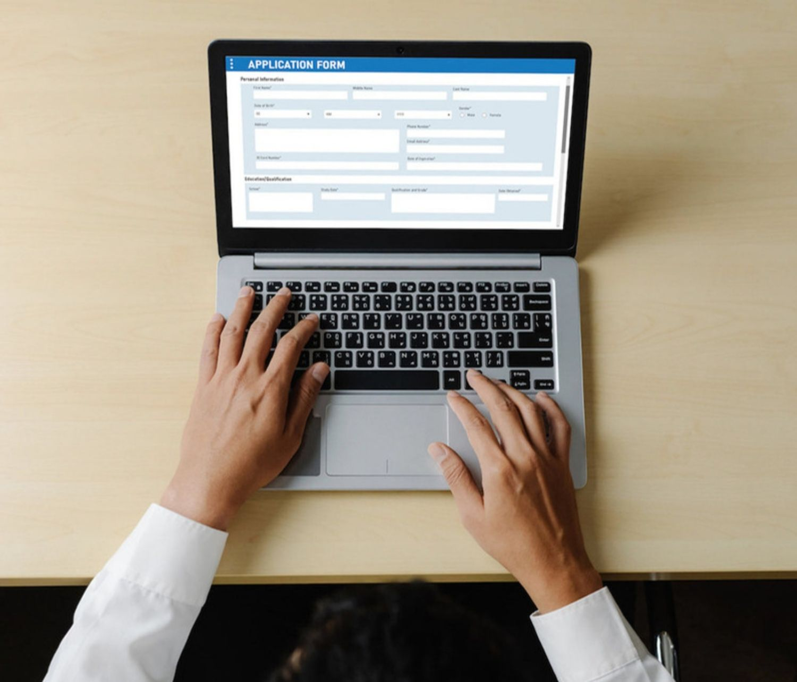

# Introduzione alle notifiche push {#gs-push-notification}

>[!BEGINSHADEBOX]

**In questa pagina:** introduzione alle notifiche push in Adobe Journey Optimizer per raggiungere gli utenti dell’app mobile e i visitatori del sito web tramite percorsi e campagne.

>[!ENDSHADEBOX]

>[!IMPORTANT]
>
>Se è la prima volta che crei una notifica push, assicurati che il canale push sia stato configurato. [Ulteriori informazioni](push-gs.md).

Con le notifiche push puoi raggiungere gli utenti della tua app mobile e i visitatori del tuo sito web in qualsiasi momento, e in particolare quando non stanno attivamente utilizzando l’app o navigando sul sito web. Le notifiche push possono aiutarti a gestire una varietà di casi d’uso, come fornire aggiornamenti sul tuo servizio, chiedere a un utente intraprendere un’azione, avvisarlo di una nuova offerta, ecc. Le piattaforme dei dispositivi richiedono il consenso prima che gli utenti finali possano ricevere o visualizzare le notifiche. È possibile ricevere il consenso dell’utente non appena l’app viene avviata per la prima volta dopo l’installazione oppure in una sessione o in un flusso di lavoro successivi, a seconda delle necessità.

[!DNL Journey Optimizer] supporta le notifiche push e ti aiuta a inviare notifiche altamente pertinenti ai tassi di velocità leader di settore. Le notifiche push possono includere la personalizzazione e il contesto basato su percorsi per sfruttare gli insight sui dati di cui il tuo brand dispone in [!DNL Adobe CX Enterprise].

Puoi creare le notifiche push:

* In un **percorso**: dopo aver aggiunto un’attività push nel percorso e definito le impostazioni di base, utilizza il riquadro **[!UICONTROL Azioni: push]** a destra per creare il contenuto per le notifiche push. [Scopri come creare un percorso](../building-journeys/journey-gs.md)

* In una **campagna**: dopo aver creato una campagna, seleziona l’azione Notifica push e definisci le impostazioni di base. Scopri come creare [una campagna con azioni](../campaigns/campaign-action.md#action-campaign-action) | [una campagna attivata da API](../campaigns/api-triggered-campaigns.md) | [una campagna orchestrata](../orchestrated/create-orchestrated-campaign.md#create)

Utilizza le schede dedicate per definire le impostazioni di notifica push per le piattaforme **iOS**, **Android** e **web**.

>[!NOTE]
>
>**[!DNL Journey Optimizer]** permette di gestire la rinuncia nelle e-mail e nei messaggi SMS; tuttavia, le notifiche push non richiedono alcun intervento da parte tua, in quanto i destinatari possono annullare l’iscrizione direttamente dal proprio dispositivo. Ad esempio, al momento del download o dell’utilizzo dell’app, possono scegliere di bloccare le notifiche. Analogamente, possono modificare le impostazioni di notifica tramite il sistema operativo mobile o le impostazioni del browser web. Per verificare lo stato del consenso push di un profilo nel visualizzatore di profili di AEP, consulta [Verificare lo stato di rinuncia push](../privacy/opt-out.md#push-opt-out-status).

 

<table style="table-layout:fixed"><tr style="border: 0;">
<td>

<a href="create-push.md"><strong>Creare una notifica push</strong>

</td>
<td>

<a href="design-push.md"><strong>Progettare una notifica push</strong></a>

</td>
<td>

<a href="send-push.md"><strong>Inviare una notifica push</strong></a>

</td>
<td>

<a href="push-gs.md"><strong>Configurare le notifiche push</strong></a>

</td>
</tr></table>

## Casi d’uso

Le notifiche push funzionano al meglio quando è necessario raggiungere gli utenti in modo rapido e diretto sul loro dispositivo, senza dover fare affidamento sul fatto che siano all’interno dell’app o che controllino la loro casella in entrata.

| Beneficio | Il motivo | Casi d’uso di esempio |
| --- | --- | --- |
| Aggiornamenti urgenti | Forniti immediatamente, anche quando gli utenti non stanno utilizzando attivamente la tua app | Avvisi di ritardo del volo, modifiche allo stato dell’ordine, ultime notizie |
| Nuovo coinvolgimento | Richiede agli utenti di tornare nell’app dopo un periodo di inattività | Promemoria di abbandono del carrello, campagne di recupero dei clienti |
| Riduzione dei costi rispetto agli SMS | Nessuna tariffa per il gestore di messaggi, a differenza degli SMS | Notifiche promozionali o transazionali a volume elevato |
| Contenuti avanzati e interattivi | Supporta immagini, pulsanti di azione e deep link | Promozioni sui prodotti con pulsanti Tocca per acquistare, anteprime rich media |
| Funzionalità native per il dispositivo | Sfrutta funzioni a livello di sistema operativo non disponibili per altri canali | Avvisi di vibrazione, badge su icone app, attivatori di posizione area geografica virtuale |
| Elevata probabilità di consenso | Agli utenti viene richiesto di dare il consenso già al momento dell’installazione o del primo avvio dell&#39;app | Flussi di onboarding, campagne di coinvolgimento per il primo giorno |

## Quando non utilizzare

Le notifiche push non sono adatte a ogni messaggio. Considera un altro canale nelle seguenti situazioni:

* Il tuo pubblico presenta bassi tassi di consenso alle notifiche push o ha mostrato una certa riluttanza nei confronti delle notifiche, poiché è possibile che il messaggio non gli arrivi mai
* Il messaggio richiede contenuti lunghi, che vengono gestiti meglio tramite e-mail e consentono una formattazione più dettagliata
* Il contenuto è sensibile o privato e non dovrebbe essere visibile sulla schermata di blocco, perché chiunque si trova nelle vicinanze del dispositivo potrebbe vederlo
* La maggior parte degli utenti accede al servizio dal desktop anziché da un’app mobile, perché nel secondo caso le notifiche push hanno una portata limitata o nulla

{{$include /help/_includes/do-not-localize/push/ai-augmented-get-started-push.md}}
