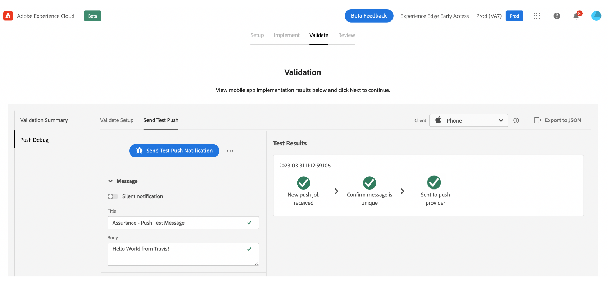
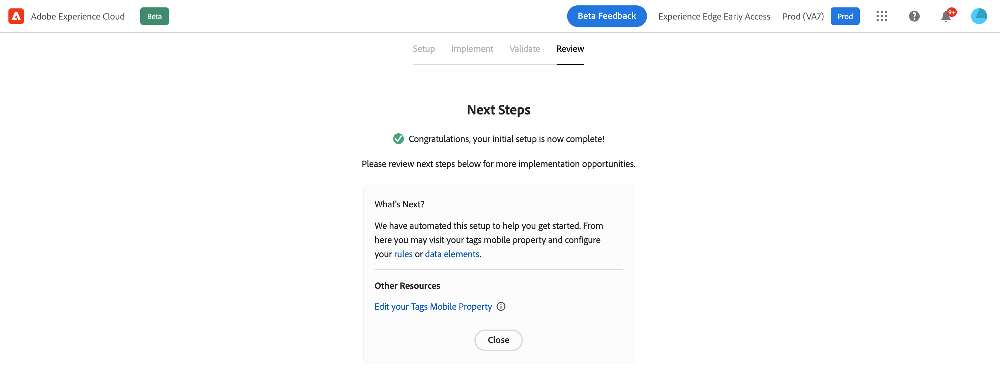

# Flusso di lavoro di avvio rapido per l’onboarding mobile {#mobile-wf}

Il nuovo **flusso di lavoro di avvio rapido per l&#39;onboarding di dispositivi mobili** è una nuova funzionalità del prodotto che consente di configurare rapidamente Adobe Experience Platform Mobile SDK, iniziare a raccogliere e convalidare i dati di eventi mobili e inviare notifiche push con [!DNL Journey Optimizer].

Questa funzionalità è accessibile tramite la home page di **[!DNL Adobe Experience Platform Data Collection]** a tutti i clienti come Beta pubblico.

## Introduzione{#gs-mobile-wf}

Questo nuovo flusso di lavoro automatizza la configurazione della raccolta dati riducendo il numero totale di clic e accelerando la configurazione mobile per Journey Optimizer. Questo flusso di lavoro di avvio rapido consente di eseguire quattro semplici passaggi per [configurare](#gs-mobile-wf), [implementare](#implement-mobile-wf), [convalidare](#valid-mobile-wf) e [rivedere](#review-mobile-wf) la configurazione mobile.

Per accedere al nuovo flusso di lavoro di avvio rapido per l&#39;onboarding di dispositivi mobili, passa a **[!DNL Data Collection]** dal commutatore della soluzione. Selezionare quindi la scheda **[!DNL Start Collecting Mobile Data]** nella home page.

Di seguito sono riportate alcune funzioni aggiuntive:

* Semplice workflow in quattro fasi e interfaccia utente.
* Fornisce una configurazione di base per iniziare a raccogliere i dati dell&#39;evento mobile tramite [Adobe Experience Platform Mobile SDK](https://developer.adobe.com/client-sdks/documentation){target="_blank"} in pochi minuti.
* Possibilità di testare e convalidare un evento push mobile di base utilizzando [Adobe Experience Platform Assurance](https://experienceleague.adobe.com/docs/experience-platform/assurance/home.html?lang=it){target="_blank"}.
* Crea e configura automaticamente tutte le risorse di Data Collection e Journey Optimizer necessarie.
* Nelle guide del prodotto e nelle descrizioni.
* Fornisce una transizione naturale per un&#39;implementazione più avanzata, se necessario.

## Configura {#setup-mobile-wf}

Il primo passaggio di questo flusso di lavoro crea e configura automaticamente tutte le risorse necessarie di Raccolta dati e Journey Optimizer, come Proprietà mobili, Estensioni mobili, Estensione Journey Optimizer, Regole, Elementi dati, ecc.

Dopo aver accettato i termini e le condizioni di Beta, inserisci il nome della tua app mobile e fai clic su **[!DNL Next]**.

Fornisci informazioni per le piattaforme iOS e Android, compreso l&#39;App ID e le chiavi di autenticazione o il file di chiave.

## Implementazione{#implement-mobile-wf}

Il passaggio successivo fornisce indicazioni dettagliate per installare il codice nell’app mobile.

## Convalidare{#valid-mobile-wf}

Esamina e controlla l’implementazione per convalidarla. Puoi inviare una notifica push di prova.

## Rivedi {#review-mobile-wf}

La configurazione automatica è completata. Ora puoi visitare la proprietà mobile dei tag, configurare le regole o l’elemento dati e iniziare a inviare notifiche push con Adobe Journey Optimizer.

**Argomenti correlati**

* [Introduzione alle notifiche push](../../rp_landing_pages/push-landing-page.md)
* [Flusso di dati e componenti delle notifiche push](push-gs.md)
* [Configurare il canale push](push-configuration.md)
* [Rapporto notifiche push](../reports/journey-global-report-cja-push.md#track-link-url-push)
* [Creare una notifica push](create-push.md)
