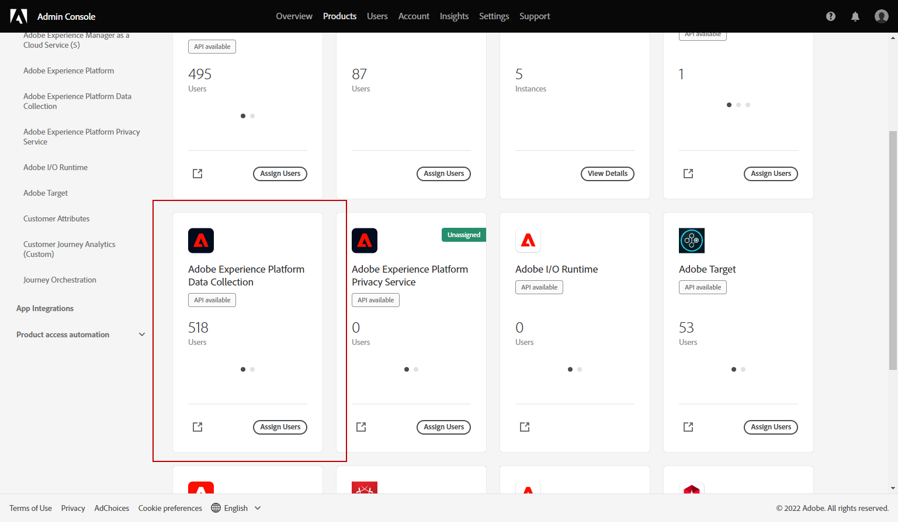
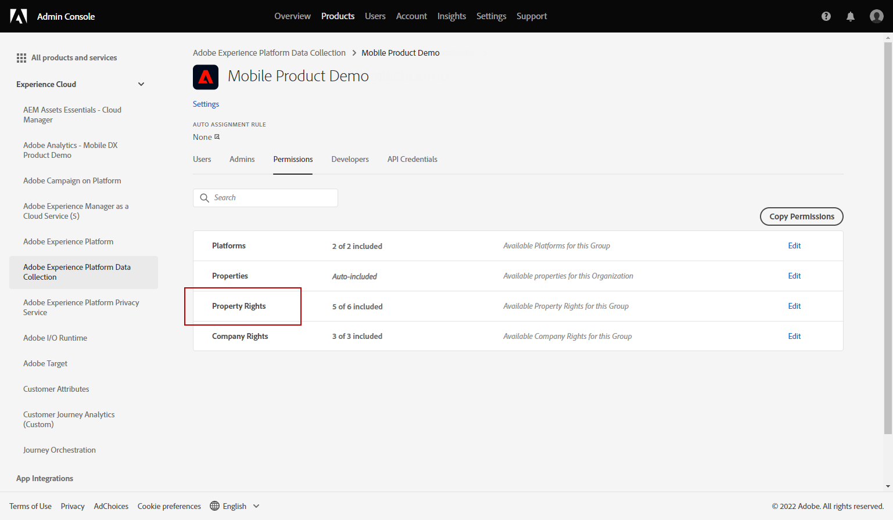
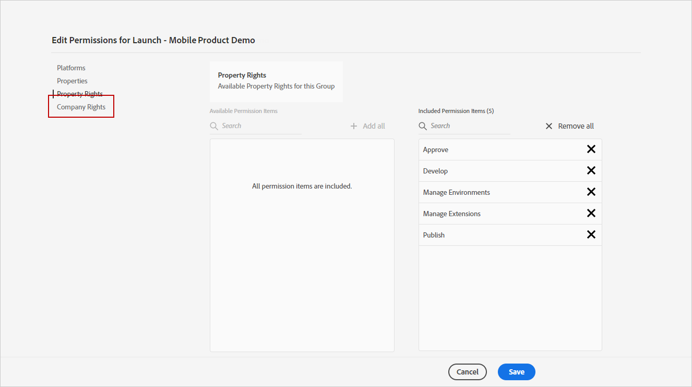
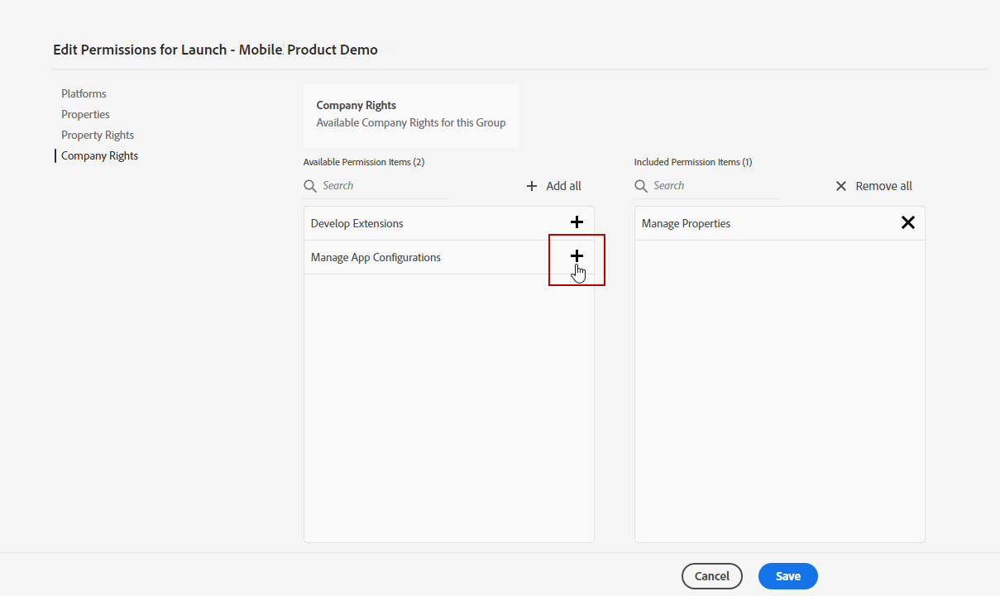
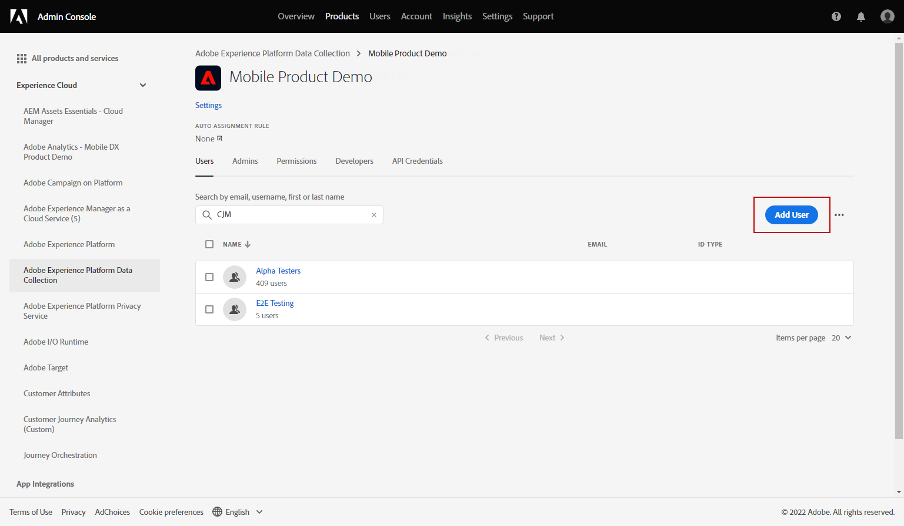
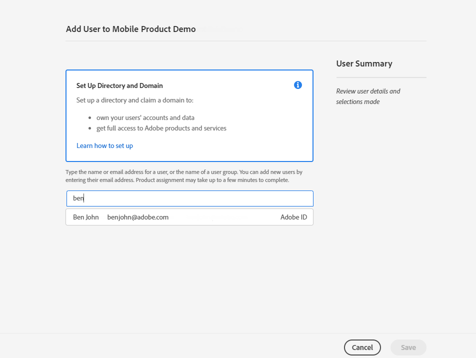
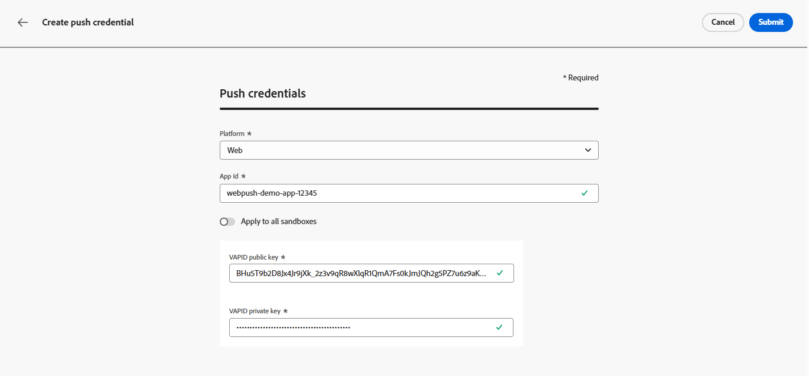
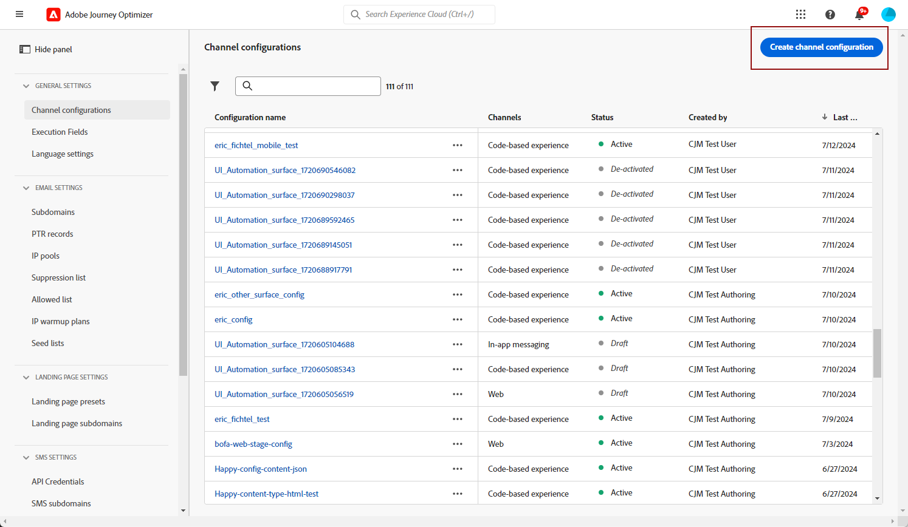
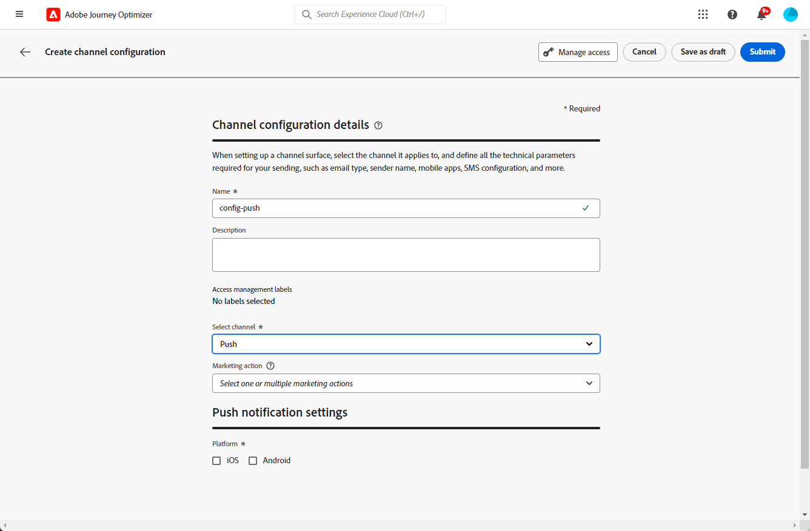

# Configurare il canale di notifica web push {#push-notification-configuration}

[!DNL Journey Optimizer] consente di creare percorsi e inviare messaggi a un pubblico target. Prima di iniziare a inviare notifiche push Web con [!DNL Journey Optimizer], è necessario assicurarsi che le configurazioni e le integrazioni siano attive in Adobe Experience Platform. Per comprendere il flusso di dati delle notifiche push in [!DNL Adobe Journey Optimizer], consulta [questa pagina](push-gs.md).

>[!AVAILABILITY]
>
>È ora disponibile il nuovo flusso di lavoro di avvio rapido per l&#39;onboarding di **Mobile**. Utilizza questa nuova funzione del prodotto per configurare rapidamente Mobile SDK per iniziare a raccogliere e convalidare i dati degli eventi mobili e per inviare notifiche push mobili. Questa funzionalità è accessibile tramite la home page di Data Collection come versione beta pubblica. [Ulteriori informazioni](mobile-onboarding-wf.md)
>

## Prima di iniziare {#start-push}

### Impostare le autorizzazioni {#setup-permissions}

Prima di creare un’app mobile, è necessario assicurarsi di disporre delle autorizzazioni utente corrette per i tag in Adobe Experience Platform o assegnarle. Ulteriori informazioni nella [documentazione sui tag](https://experienceleague.adobe.com/docs/experience-platform/tags/admin/user-permissions.html?lang=it){target="_blank"}.

>[!CAUTION]
>
>La configurazione push deve essere eseguita da un utente esperto. A seconda del modello di implementazione e degli utenti tipo coinvolti nell&#39;implementazione, potrebbe essere necessario assegnare l&#39;intero set di autorizzazioni a un singolo profilo di prodotto o condividere le autorizzazioni tra lo sviluppatore di app e l&#39;amministratore **Adobe Journey Optimizer**. Ulteriori informazioni sulle autorizzazioni **Tag** sono disponibili in [questa documentazione](https://experienceleague.adobe.com/docs/experience-platform/tags/admin/user-permissions.html?lang=it){target="_blank"}.

<!--ou need to your have access to perform following roles :

* Manage Datastreams
* Manage Client-side Properties
* Manage App Configurations
-->

Per assegnare i diritti di **Proprietà** e **Società**, effettua le seguenti operazioni:

1. Accedere a **[!DNL Admin Console]**.

1. Dalla scheda **[!UICONTROL Prodotti]**, seleziona la scheda **[!UICONTROL Raccolta dati Adobe Experience Platform]**.

   

1. Seleziona un **[!UICONTROL profilo prodotto]** esistente o creane uno nuovo con il pulsante **[!UICONTROL Nuovo profilo]**. Scopri come creare un nuovo **[!UICONTROL nuovo profilo]** nella [documentazione di Admin Console](https://experienceleague.adobe.com/docs/experience-platform/access-control/ui/create-profile.html?lang=it#ui){target="_blank"}.

1. Dalla scheda **[!UICONTROL Autorizzazioni]**, seleziona **[!UICONTROL Diritti di proprietà]**.

   

1. Fare clic su **[!UICONTROL Aggiungi tutto]**. Questo aggiungerà il seguente diritto al tuo profilo di prodotto:
   * **[!UICONTROL Approva]**
   * **[!UICONTROL Sviluppa]**
   * **[!UICONTROL Gestisci ambienti]**
   * **[!UICONTROL Gestione estensioni]**
   * **[!UICONTROL Pubblica]**

   Queste autorizzazioni sono necessarie per installare e pubblicare l&#39;estensione Adobe Journey Optimizer e pubblicare la proprietà dell&#39;app in Adobe Experience Platform Mobile SDK.

1. Quindi, seleziona **[!UICONTROL Diritti azienda]** nel menu a sinistra.

   

1. Aggiungi i seguenti diritti:

   * **[!UICONTROL Gestione configurazioni app]**
   * **[!UICONTROL Gestisci proprietà]**

   Queste autorizzazioni sono necessarie affinché lo sviluppatore di app mobili possa impostare le credenziali push in **Raccolta dati Adobe Experience Platform** e definire le configurazioni del canale di notifica push (ossia i predefiniti per messaggi) in **Adobe Journey Optimizer**.

   

1. Fai clic su **[!UICONTROL Salva]**.

Per assegnare questo **[!UICONTROL profilo di prodotto]** agli utenti, effettua le seguenti operazioni:

1. Accedere a **[!DNL Admin Console]**.

1. Dalla scheda **[!UICONTROL Prodotti]**, seleziona la scheda **[!UICONTROL Raccolta dati Adobe Experience Platform]**.

1. Seleziona il **[!UICONTROL profilo di prodotto]** configurato in precedenza.

1. Dalla scheda **[!UICONTROL Utenti]**, fai clic su **[!UICONTROL Aggiungi utente]**.

   

1. Digita il nome o l’indirizzo e-mail dell’utente e selezionalo. Quindi fare clic su **[!UICONTROL Salva]**.

   >[!NOTE]
   >
   >Se l&#39;utente non è stato creato in precedenza in Admin Console, consulta la [documentazione sull&#39;aggiunta di utenti](https://helpx.adobe.com/it/enterprise/admin-guide.html/enterprise/using/manage-users-individually.ug.html#add-users).

   

### Verifica i set di dati {#push-datasets}

Con il canale di notifica push sono disponibili i seguenti schemi e set di dati:

| Schema  Set di dati | Gruppo di campi | Operazione |
| -------------------------------------------------------------------------------------- | --------------------------------------------------------------------------------------------------------------------------------------------------------------------------------------- | -------------------------------------------------------- |
| Schema profilo push CJM  Set di dati profilo push CJM | Dettagli notifica push Adobe CJM ExperienceEvent - Dettagli profilo messaggio Adobe CJM ExperienceEvent - Dettagli esecuzione messaggio Dettagli applicazione Dettagli ambiente | Registra token di push |
| Schema evento di tracciamento push CJM Set di dati evento di tracciamento push CJM | Tracciamento notifiche push | Tracciare le interazioni e fornire i dati per l’interfaccia utente di reporting |

>[!NOTE]
>
>Quando gli eventi di tracciamento push vengono acquisiti nel set di dati dell’evento di tracciamento push CJM, possono verificarsi alcuni errori, anche se i dati vengono parzialmente acquisiti con successo. Ciò può verificarsi se alcuni campi nella mappatura non esistono negli eventi in arrivo: il sistema registra gli avvisi ma non impedisce l’acquisizione di parti valide dei dati. Questi avvisi vengono visualizzati nello stato batch come &quot;non riuscito&quot; ma riflettono un parziale successo dell’acquisizione.
>
>Per visualizzare l’elenco completo dei campi e degli attributi di ogni schema, consulta il [dizionario dello schema di Journey Optimizer](https://experienceleague.adobe.com/tools/ajo-schemas/schema-dictionary.html?lang=it){target="_blank"}.

### Configurare la proprietà pushNotification {#push-property}

Per abilitare le **notifiche push Web**, è necessario innanzitutto verificare che la proprietà [pushNotifications](https://experienceleague.adobe.com/it/docs/experience-platform/collection/js/commands/configure/pushnotifications) sia configurata correttamente in Web SDK. Questa proprietà controlla il modo in cui le notifiche push vengono gestite dall’applicazione web.

Inoltre, devi generare le chiavi VAPID, necessarie per configurare [le credenziali push dell&#39;app](#push-credentials-launch) in Journey Optimizer.

## Passaggio 1: aggiungere le credenziali push dell’app in Journey Optimizer {#push-credentials-launch}

Dopo aver concesso le autorizzazioni utente corrette, ora devi aggiungere le credenziali push dell’app mobile in Journey Optimizer.

La registrazione delle credenziali push dell’app mobile è necessaria per autorizzare Adobe a inviare notifiche push per tuo conto. Consulta i passaggi descritti di seguito:

1. Accedi al menu **[!UICONTROL Canali]** > **[!UICONTROL Impostazioni push]** > **[!UICONTROL Credenziali push]**.

1. Fare clic su **[!UICONTROL Crea credenziali push]**.

1. Dal menu a discesa **[!UICONTROL Platform]**, seleziona **[!UICONTROL Web]**.

   

1. Fornisci **[!UICONTROL ID app]**.

1. Immetti la **[!UICONTROL chiave pubblica VAPID]** e la **[!UICONTROL chiave privata]**.

1. Fai clic su **[!UICONTROL Invia]** per creare la configurazione dell&#39;app.

## Passaggio 2: creare una configurazione di canale per il push{#message-preset}

Dopo aver creato le credenziali push, devi creare una configurazione per poter inviare notifiche push da **[!DNL Journey Optimizer]**.

1. Accedi al menu **[!UICONTROL Canali]** > **[!UICONTROL Impostazioni generali]** > **[!UICONTROL Configurazioni canale]**, quindi fai clic su **[!UICONTROL Crea configurazione canale]**.

   

1. Immetti un nome e una descrizione (facoltativa) per la configurazione.

   >[!NOTE]
   >
   > I nomi devono iniziare con una lettera (A-Z). Può contenere solo caratteri alfanumerici. È inoltre possibile utilizzare i caratteri trattino basso `_`, punto `.` e trattino `-`.

1. Per assegnare etichette di utilizzo dei dati personalizzate o di base alla configurazione, è possibile selezionare **[!UICONTROL Gestisci accesso]**. [Ulteriori informazioni sul controllo degli accessi a livello di oggetto](../administration/object-based-access.md).

1. Seleziona il canale **Push**.

   

1. Seleziona **[!UICONTROL Azione di marketing]** per associare i criteri di consenso ai messaggi utilizzando questa configurazione. Tutti i criteri di consenso associati all’azione di marketing vengono utilizzati per rispettare le preferenze dei clienti. [Ulteriori informazioni](../action/consent.md#surface-marketing-actions)

1. Scegli la tua **[!UICONTROL piattaforma]**: Android, iOS e/o Web.

1. Seleziona lo stesso **[!UICONTROL ID app]** di [credenziali push](#push-credentials-launch) configurato in precedenza.

1. Salva le modifiche.

Ora puoi selezionare la configurazione durante la creazione delle notifiche push.

## Passaggio 3: configurare la proprietà sendPushSubscription {#sendPushSubscription-property}

Una volta configurate le credenziali push e la configurazione del canale, devi implementare [il comando sendPushSubscription](https://experienceleague.adobe.com/it/docs/experience-platform/collection/js/commands/sendpushsubscription) nell&#39;applicazione Web. Questo comando registra gli abbonamenti push degli utenti a Adobe Experience Platform, consentendo al sistema di tenere traccia degli utenti che hanno acconsentito alla ricezione di notifiche push e di mantenere il proprio stato di abbonamento. Questa registrazione è essenziale per consentire a Journey Optimizer di inviare notifiche push mirate agli utenti.

## Passaggio 4: testare l’app mobile con un evento {#mobile-app-test}

Dopo aver completato la configurazione Web push sia in Adobe Experience Platform che in [!DNL Adobe Experience Platform Data Collection], puoi testare l&#39;implementazione prima di inviare notifiche Web push ai profili. I test garantiscono che gli abbonamenti siano registrati correttamente e che le notifiche vengano inviate correttamente ai browser dei tuoi utenti.

Per istruzioni dettagliate sulla creazione di un percorso di test con eventi per convalidare la configurazione del push web, consulta la [documentazione sulla configurazione della notifica push per app mobile](push-configuration.md), che fornisce un flusso di lavoro di test completo applicabile sia ai canali push mobili che a quelli web.
