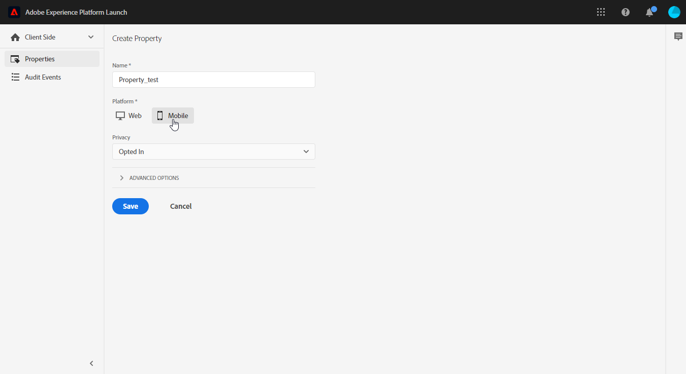
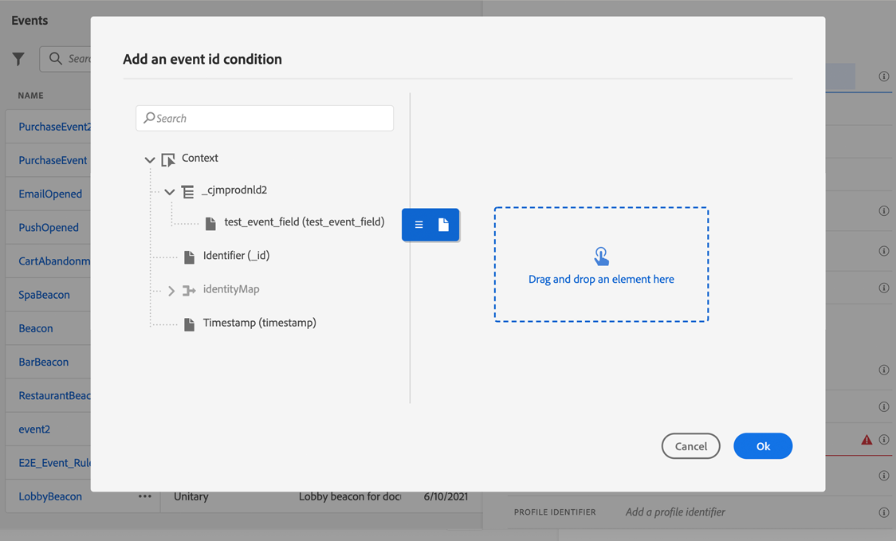

# Configurare il canale di notifica push {#push-notification-configuration}

[!DNL Journey Optimizer] consente di creare percorsi e inviare messaggi a un pubblico target. Prima di iniziare a inviare notifiche push con [!DNL Journey Optimizer], è necessario assicurarsi che le configurazioni e le integrazioni siano attive nell&#39;app mobile e per i tag in Adobe Experience Platform. Per comprendere il flusso di dati delle notifiche push in [!DNL Adobe Journey Optimizer], consulta [questa pagina](push-gs.md).

>[!AVAILABILITY]
>
>È ora disponibile il nuovo flusso di lavoro di avvio rapido per l&#39;onboarding di **Mobile**. Utilizza questa nuova funzione del prodotto per configurare rapidamente Mobile SDK per iniziare a raccogliere e convalidare i dati degli eventi mobili e per inviare notifiche push mobili. Questa funzionalità è accessibile tramite la home page di Data Collection come versione beta pubblica. [Ulteriori informazioni](mobile-onboarding-wf.md)
>

## Prima di iniziare {#start-push}

### Impostare le autorizzazioni {#setup-permissions}

Prima di creare un’app mobile, è necessario assicurarsi di disporre delle autorizzazioni utente corrette per i tag in Adobe Experience Platform o assegnarle. Ulteriori informazioni nella [documentazione sui tag](https://experienceleague.adobe.com/docs/experience-platform/tags/admin/user-permissions.html){target="_blank"}.

>[!CAUTION]
>
>La configurazione push deve essere eseguita da un utente esperto. A seconda del modello di implementazione e degli utenti tipo coinvolti nell&#39;implementazione, potrebbe essere necessario assegnare l&#39;intero set di autorizzazioni a un singolo profilo di prodotto o condividere le autorizzazioni tra lo sviluppatore di app e l&#39;amministratore **Adobe Journey Optimizer**. Ulteriori informazioni sulle autorizzazioni **Tag** sono disponibili in [questa documentazione](https://experienceleague.adobe.com/docs/experience-platform/tags/admin/user-permissions.html){target="_blank"}.

<!--ou need to your have access to perform following roles :

* Manage Datastreams
* Manage Client-side Properties
* Manage App Configurations
-->

Per assegnare i diritti di **Proprietà** e **Società**, effettua le seguenti operazioni:

1. Accedere a **[!DNL Admin Console]**.

1. Dalla scheda **[!UICONTROL Prodotti]**, seleziona la scheda **[!UICONTROL Raccolta dati Adobe Experience Platform]**.

   

1. Seleziona un **[!UICONTROL profilo prodotto]** esistente o creane uno nuovo con il pulsante **[!UICONTROL Nuovo profilo]**. Scopri come creare un nuovo **[!UICONTROL nuovo profilo]** nella [documentazione di Admin Console](https://experienceleague.adobe.com/docs/experience-platform/access-control/ui/create-profile.html#ui){target="_blank"}.

1. Dalla scheda **[!UICONTROL Autorizzazioni]**, seleziona **[!UICONTROL Diritti di proprietà]**.

   

1. Fare clic su **[!UICONTROL Aggiungi tutto]**. Questo aggiungerà il seguente diritto al tuo profilo di prodotto:
   * **[!UICONTROL Approva]**
   * **[!UICONTROL Sviluppa]**
   * **[!UICONTROL Gestisci ambienti]**
   * **[!UICONTROL Gestione estensioni]**
   * **[!UICONTROL Pubblica]**

   Queste autorizzazioni sono necessarie per installare e pubblicare l&#39;estensione Adobe Journey Optimizer e pubblicare la proprietà dell&#39;app in Adobe Experience Platform Mobile SDK.

1. Quindi, seleziona **[!UICONTROL Diritti azienda]** nel menu a sinistra.

   

1. Aggiungi i seguenti diritti:

   * **[!UICONTROL Gestione configurazioni app]**
   * **[!UICONTROL Gestisci proprietà]**

   Queste autorizzazioni sono necessarie affinché lo sviluppatore di app mobili possa impostare le credenziali push in **Raccolta dati Adobe Experience Platform** e definire le configurazioni del canale di notifica push (ossia i predefiniti per messaggi) in **Adobe Journey Optimizer**.

   

1. Fai clic su **[!UICONTROL Salva]**.

Per assegnare questo **[!UICONTROL profilo di prodotto]** agli utenti, effettua le seguenti operazioni:

1. Accedere a **[!DNL Admin Console]**.

1. Dalla scheda **[!UICONTROL Prodotti]**, seleziona la scheda **[!UICONTROL Raccolta dati Adobe Experience Platform]**.

1. Seleziona il **[!UICONTROL profilo di prodotto]** configurato in precedenza.

1. Dalla scheda **[!UICONTROL Utenti]**, fai clic su **[!UICONTROL Aggiungi utente]**.

   

1. Digita il nome o l’indirizzo e-mail dell’utente e selezionalo. Quindi fare clic su **[!UICONTROL Salva]**.

   >[!NOTE]
   >
   >Se l&#39;utente non è stato creato in precedenza in Admin Console, consulta la [documentazione sull&#39;aggiunta di utenti](https://helpx.adobe.com/enterprise/admin-guide.html/enterprise/using/manage-users-individually.ug.html#add-users).

   


### Verifica i set di dati {#push-datasets}

Con il canale di notifica push sono disponibili i seguenti schemi e set di dati:

| Schema <br>Set di dati | Gruppo di campi | Operazione |
| -------------------------------------------------------------------------------------- | --------------------------------------------------------------------------------------------------------------------------------------------------------------------------------------- | -------------------------------------------------------- |
| Schema profilo push CJM <br>Set di dati profilo push CJM | Dettagli notifica push<br>Adobe CJM ExperienceEvent - Dettagli profilo messaggio<br>Adobe CJM ExperienceEvent - Dettagli esecuzione messaggio<br>Dettagli applicazione<br>Dettagli ambiente | Registra token di push |
| Schema evento di tracciamento push CJM<br>Set di dati evento di tracciamento push CJM | Tracciamento notifiche push | Tracciare le interazioni e fornire i dati per l’interfaccia utente di reporting |


>[!NOTE]
>
>Quando gli eventi di tracciamento push vengono acquisiti nel set di dati dell’evento di tracciamento push CJM, possono verificarsi alcuni errori, anche se i dati vengono parzialmente acquisiti con successo. Ciò può verificarsi se alcuni campi nella mappatura non esistono negli eventi in arrivo: il sistema registra gli avvisi ma non impedisce l’acquisizione di parti valide dei dati. Questi avvisi vengono visualizzati nello stato batch come &quot;non riuscito&quot; ma riflettono un parziale successo dell’acquisizione.
>
>Per visualizzare l’elenco completo dei campi e degli attributi di ogni schema, consulta il [dizionario dello schema di Journey Optimizer](https://experienceleague.adobe.com/tools/ajo-schemas/schema-dictionary.html?lang=it){target="_blank"}.


### Configurare l’app {#configure-app}

La configurazione tecnica prevede una stretta collaborazione tra lo sviluppatore dell’app e l’amministratore aziendale. Prima di iniziare a inviare notifiche push con [!DNL Journey Optimizer], devi creare le credenziali push, una configurazione del canale push in Adobe Journey Optimizer e integrare la tua app mobile con gli SDK di Adobe Experience Platform Mobile.

Segui i passaggi di implementazione descritti nei collegamenti seguenti:

* Per **Apple iOS**: scopri come registrare la tua app con APN nella [documentazione di Apple](https://developer.apple.com/documentation/usernotifications/registering_your_app_with_apns){target="_blank"}
* Per **Google Android**: scopri come configurare un&#39;app client Firebase Cloud Messaging su Android nella [documentazione di Google](https://firebase.google.com/docs/cloud-messaging/android/client){target="_blank"}

### Integrare la tua app mobile con Adobe Experience Platform SDK {#integrate-mobile-app}

Adobe Experience Platform Mobile SDK fornisce API di integrazione lato client per i dispositivi mobili tramite SDK compatibili con Android e iOS. Segui la [documentazione di Adobe Experience Platform Mobile SDK](https://developer.adobe.com/client-sdks/documentation/getting-started/){target="_blank"} per completare la configurazione con gli SDK di Adobe Experience Platform Mobile nella tua app.

Al termine di questa fase, dovresti anche aver creato e configurato una proprietà mobile in [!DNL Adobe Experience Platform Data Collection]. In genere si crea una proprietà mobile per ogni applicazione mobile che si desidera gestire. Scopri come creare e configurare una proprietà mobile nella [documentazione di Adobe Experience Platform Mobile SDK](https://developer.adobe.com/client-sdks/documentation/getting-started/create-a-mobile-property/){target="_blank"}.

<!--To enable **Web push notifications**, ensure that the [pushNotifications property](https://experienceleague.adobe.com/en/docs/experience-platform/web-sdk/commands/configure/pushnotifications) is properly configured within the Web SDK. Then, use [the sendPushSubscription command](https://experienceleague.adobe.com/en/docs/experience-platform/web-sdk/commands/sendpushsubscription) to register push subscriptions with Adobe Experience Platform.
-->

## Passaggio 1: aggiungere le credenziali push dell’app in Journey Optimizer {#push-credentials-launch}

Dopo aver concesso le autorizzazioni utente corrette, ora devi aggiungere le credenziali push dell’app mobile in Journey Optimizer.

La registrazione delle credenziali push dell’app mobile è necessaria per autorizzare Adobe a inviare notifiche push per tuo conto. Consulta i passaggi descritti di seguito:

1. Accedi al menu **[!UICONTROL Canali]** > **[!UICONTROL Impostazioni push]** > **[!UICONTROL Credenziali push]**.

1. Fare clic su **[!UICONTROL Crea credenziali push]**.

1. Dal menu a discesa **[!UICONTROL Platform]**, seleziona il sistema operativo:

   * **Per iOS**

     

      1. Immetti l&#39;app mobile **[!UICONTROL ID app]**.

      1. Abilita l&#39;opzione **[!UICONTROL Applica a tutte le sandbox]** per rendere queste credenziali push disponibili in tutte le sandbox. Se una sandbox specifica ha le proprie credenziali per la stessa coppia Platform e App ID, queste avranno la precedenza.

      1. Attivato il pulsante **[!UICONTROL Immetti manualmente le credenziali push]** per aggiungere le tue credenziali.

      1. Trascina e rilascia il file .p8 Apple Push Notification Authentication Key. Questa chiave può essere acquisita dalla pagina **Certificati**, **Identificatori** e **Profili**.

         >[!NOTE]
         >
         > Sono supportate solo le chiavi di notifica push .p8 di Apple. Se hai raggiunto il limite di chiavi .p8, utilizza un altro account Apple Developer.
         >Per ulteriori informazioni sui limiti delle chiavi di Apple, consulta la [documentazione per sviluppatori di Apple](https://developer.apple.com/documentation/usernotifications/registering_your_app_with_apns).


      1. Fornisci l&#39;**ID chiave**. Si tratta di una stringa di 10 caratteri assegnata durante la creazione del tasto di autenticazione p8. È disponibile nella scheda **Chiavi** in **Certificati**, **Identificatori** e **Profili** pagina.

      1. Fornisci **ID team**. Si tratta di un valore stringa che si trova nella scheda Appartenenza.

   * **Per Android**

     

      1. Fornisci l&#39;**[!UICONTROL ID app]**, in genere il nome del pacchetto corrisponde all&#39;ID app nel file `build.gradle`.

      1. Abilita l&#39;opzione **[!UICONTROL Applica a tutte le sandbox]** per rendere queste credenziali push disponibili in tutte le sandbox. Se una sandbox specifica ha le proprie credenziali per la stessa coppia Platform e App ID, queste avranno la precedenza.

      1. Attivato il pulsante **[!UICONTROL Immetti manualmente le credenziali push]** per aggiungere le tue credenziali.

      1. Trascina e rilascia le credenziali push FCM. Per ulteriori dettagli su come ottenere le credenziali push, consulta la [documentazione di Google](https://firebase.google.com/docs/admin/setup#initialize-sdk){target="_blank"}.

<!--
    * **For Web**

        

        1. Provide the **[!UICONTROL App ID]**.

        1. Enter your **[!UICONTROL VAPID public key]** and **[!UICONTROL private key]**.
-->

1. Fai clic su **[!UICONTROL Invia]** per creare la configurazione dell&#39;app.

<!--
## Step 2: Set up a mobile property in Adobe Experience Platform Launch {#launch-property}

Setting up a mobile property allows the mobile app developer or marketer to configure the mobile SDKs attributes such as Session Timeouts, the [!DNL Adobe Experience Platform] sandbox to be targeted and the **[!UICONTROL Adobe Experience Platform Datasets]** to be used for mobile SDK to send data to.

For further details and procedures on how to set up a **[!UICONTROL Platform Launch property]**, refer to the steps detailed in [Adobe Experience Platform Mobile SDK documentation](https://aep-sdks.gitbook.io/docs/getting-started/create-a-mobile-property#create-a-mobile-property).


To get the SDKs needed for push notification to work you will need the following SDK extensions, for both Android and iOS:

* **[!UICONTROL Mobile Core]** (installed automatically)
* **[!UICONTROL Profile]** (installed automatically)
* **[!UICONTROL Adobe Experience Platform Edge]**
* **[!UICONTROL Adobe Experience Platform Assurance]**, optional but recommended to debug the mobile implementation.

Learn more about [!DNL Adobe Experience Platform Launch] extensions in [Adobe Experience Platform Launch documentation](https://experienceleague.adobe.com/docs/launch-learn/implementing-in-mobile-android-apps-with-launch/configure-launch/launch-add-extensions.html).
-->

## Passaggio 2: creare una configurazione di canale per il push{#message-preset}

Dopo aver creato le credenziali push, devi creare una configurazione per poter inviare notifiche push da **[!DNL Journey Optimizer]**.

1. Accedi al menu **[!UICONTROL Canali]** > **[!UICONTROL Impostazioni generali]** > **[!UICONTROL Configurazioni canale]**, quindi fai clic su **[!UICONTROL Crea configurazione canale]**.

   

1. Immetti un nome e una descrizione (facoltativa) per la configurazione.

   >[!NOTE]
   >
   > I nomi devono iniziare con una lettera (A-Z). Può contenere solo caratteri alfanumerici. È inoltre possibile utilizzare i caratteri trattino basso `_`, punto `.` e trattino `-`.


1. Per assegnare etichette di utilizzo dei dati personalizzate o di base alla configurazione, è possibile selezionare **[!UICONTROL Gestisci accesso]**. [Ulteriori informazioni sul controllo degli accessi a livello di oggetto](../administration/object-based-access.md).

1. Seleziona il canale **Push**.

   

1. Seleziona **[!UICONTROL Azione di marketing]** per associare i criteri di consenso ai messaggi utilizzando questa configurazione. Tutti i criteri di consenso associati all’azione di marketing vengono utilizzati per rispettare le preferenze dei clienti. [Ulteriori informazioni](../action/consent.md#surface-marketing-actions)

1. Scegli la tua **[!UICONTROL piattaforma]**: Android e/o iOS <!--and/or Web-->.

1. Seleziona lo stesso **[!UICONTROL ID app]** di [credenziali push](#push-credentials-launch) configurato in precedenza.

1. Salva le modifiche.

Ora puoi selezionare la configurazione durante la creazione delle notifiche push.

## Passaggio 3: configurare l’estensione Adobe Journey Optimizer nella proprietà mobile {#configure-journey-optimizer-extension}

L&#39;estensione **Adobe Journey Optimizer** per gli SDK Adobe Experience Platform Mobile potenzia le notifiche push per le app mobili e ti aiuta a raccogliere i token push degli utenti e a gestire la misurazione delle interazioni con i servizi Adobe Experience Platform.

Scopri come configurare l&#39;estensione Journey Optimizer nella [documentazione di Adobe Experience Platform Mobile SDK](https://developer.adobe.com/client-sdks/documentation/adobe-journey-optimizer/){target="_blank"}.


<!-- 
**[!UICONTROL Edge configuration]** is used by **[!UICONTROL Edge]** extension to send custom data from mobile device to [!DNL Adobe Experience Platform]. 
To configure [!DNL Adobe Experience Platform], you must provide the **[!UICONTROL Sandbox]** name and **[!UICONTROL Event Dataset]**.

1. From [!DNL Adobe Experience Platform Launch], select the **[!UICONTROL Edge Configurations]** tab and click **[!UICONTROL Edge Configurations]**.
    
1. Select **[!UICONTROL New Edge Configuration]** to add a new **[!UICONTROL Edge Configuration]**.
1. Enter a **[!UICONTROL Name]** and click **[!UICONTROL Save]**

1. Click the **[!UICONTROL Adobe Experience Platform]** toggle to enable it.

1. Fill in the **[!UICONTROL Sandbox]**, **[!UICONTROL Event dataset]** and **[!UICONTROL Profile Dataset]** fields. Then, click **[!UICONTROL Save]**.
    
    


1. From [!DNL Adobe Experience Platform Launch], ensure that **[!UICONTROL Client Side]** is selected in the drop-down menu.

1. select the **[!UICONTROL Properties]** tab and click **[!UICONTROL New Property]**.

    

1. Enter a **[!UICONTROL Name]** for your new property.

1. Select **[!UICONTROL Mobile]** as **[!UICONTROL Platform]**.

    

1. Click **[!UICONTROL Save]** to create your new property.

To configure **[!UICONTROL Adobe Experience Platform Edge Extension]** to send custom data from mobile devices to [!DNL Adobe Experience Platform].

1. Select your previously created property and select the **[!UICONTROL Extensions]** tab to view the extensions for this property.

    

1. Click **[!UICONTROL Configure]** under the **[!UICONTROL Adobe Experience Platform Edge]** Network' extension.

1. From the **[!UICONTROL Edge Configuration]** drop-down list, select the **[!UICONTROL Edge Configuration]** created in the previous steps. For more information on **[!UICONTROL Edge Configuration]**, refer to this [section](#edge-configuration).

1. Click **[!UICONTROL Save]**.

To configure **[!UICONTROL Adobe Experience Platform Messaging]** extension to send push profile and push interactions to the correct datasets, follow the same steps as above. Use **[!UICONTROL Sandbox]**, **[!UICONTROL Event dataset]** and **[!UICONTROL Profile Dataset]** created in the [Adobe Experience Platform setup](#edge-configuration).
-->

<!--
## Step 4: Publish the Property {#publish-property}

You now need to publish the property to integrate your configuration and to use it in the mobile app. 

To publish your property, refer to the steps detailed in [Adobe Experience Platform Mobile SDK documentation](https://aep-sdks.gitbook.io/docs/getting-started/create-a-mobile-property#publish-the-configuration)

## Step 5: Configure the ProfileDataSource {#configure-profiledatasource}

To configure the `ProfileDataSource`, use the `ProfileDCInletURL` from [!DNL Adobe Experience Platform] setup and add the following in the mobile app:

```
    MobileCore.updateConfiguration(
    mutableMapOf("messaging.dccs" to <ProfileDCSInletURL>)
```

-->

## Passaggio 4: testare l’app mobile con un evento {#mobile-app-test}

Dopo aver configurato l&#39;app mobile sia in Adobe Experience Platform che in [!DNL Adobe Experience Platform Data Collection], puoi testarla prima di inviare notifiche push ai profili. In questo caso d’uso, creiamo un percorso per eseguire il targeting della nostra app mobile e impostare un evento che attiva la notifica push.

<!--
You can use a test mobile app for this use case. For more on this, refer to this [page](https://wiki.corp.adobe.com/pages/viewpage.action?spaceKey=CJM&title=Details+of+setting+the+mobile+test+app) (internal use only).
-->

Affinché questo percorso funzioni, devi creare uno schema XDM. Per ulteriori informazioni, consulta [Documentazione XDM](https://experienceleague.adobe.com/docs/experience-platform/xdm/schema/composition.html#schemas-and-data-ingestion){target="_blank"}.

1. Nella sezione del menu DATA MANAGEMENT, fare clic su **[!UICONTROL Schemi]**.
   
1. Fai clic su **[!UICONTROL Crea schema]**, in alto a destra, seleziona **[!UICONTROL Evento esperienza]** e fai clic su **Avanti**.
   
1. Immetti un nome e una descrizione per lo schema e fai clic su **Fine**.
   
1. Nella sezione **Gruppi di campi**, a sinistra, fare clic su **Aggiungi** e selezionare **[!UICONTROL Crea un nuovo gruppo di campi]**.

1. Immetti un **[!UICONTROL Nome visualizzato]** e una **[!UICONTROL Descrizione]**. Al termine, fai clic su **[!UICONTROL Aggiungi gruppi di campi]**. Per ulteriori informazioni su come creare gruppi di campi, consulta la [documentazione del sistema XDM](https://experienceleague.adobe.com/docs/experience-platform/xdm/tutorials/create-schema-ui.html?lang=it){target="_blank"}.


   

1. Sul lato sinistro, seleziona lo schema. Nel riquadro di destra, abilitare questo schema per **[!UICONTROL Profilo]**.

   


1. Sul lato sinistro, seleziona il gruppo di campi, quindi fai clic sull’icona + per creare un nuovo campo. In **[!UICONTROL Proprietà gruppi di campi]**, sul lato destro, digitare un **[!UICONTROL Nome campo]**, **[!UICONTROL Nome visualizzato]** e selezionare **[!UICONTROL Stringa]** come **[!UICONTROL Tipo]**.

   

1. Seleziona **[!UICONTROL Obbligatorio]** e fai clic su **[!UICONTROL Applica]**.

1. Fai clic su **[!UICONTROL Salva]**. Ora lo schema viene creato e può essere utilizzato in un evento.

Quindi devi impostare un evento.

1. Dal menu a sinistra della home page, in AMMINISTRAZIONE, selezionare **[!UICONTROL Configurazioni]**. Fai clic su **[!UICONTROL Gestisci]** nella sezione **[!UICONTROL Eventi]** per creare il nuovo evento.

1. Fare clic su **[!UICONTROL Crea evento]**. Verrà visualizzato il riquadro di configurazione dell&#39;evento sul lato destro dello schermo.

   

1. Inserisci il nome dell’evento. Puoi anche aggiungere una descrizione.

1. Nel campo **[!UICONTROL Tipo ID evento]**, seleziona **[!UICONTROL Basato su regole]**.

1. In **[!UICONTROL Parametri]**, seleziona lo schema creato in precedenza.

   

1. Nell’elenco dei campi, verifica che sia selezionato il campo creato nel gruppo di campi dello schema.

   

1. Fai clic su **[!UICONTROL Modifica]** nel campo **[!UICONTROL Condizione ID evento]**. Trascina e rilascia il campo aggiunto in precedenza per definire la condizione che verrà utilizzata dal sistema per identificare gli eventi che attivano il percorso.

   

1. Digita la sintassi da utilizzare per attivare la notifica push nell&#39;app di prova, in questo esempio **conferma ordine**.

   

1. Seleziona **[!UICONTROL ECID]** come **[!UICONTROL Spazio dei nomi]**.

1. Fai clic su **[!UICONTROL Ok]** e quindi su **[!UICONTROL Salva]**.

L&#39;evento è stato creato e ora può essere utilizzato in un percorso.

1. Nel menu a sinistra, fai clic su **[!UICONTROL Percorsi]**.

1. Fare clic su **[!UICONTROL Crea Percorso]** per creare un nuovo percorso.

1. Modifica le proprietà del percorso nel riquadro di configurazione visualizzato sul lato destro. Ulteriori informazioni in questa [sezione](../building-journeys/journey-properties.md).

1. Per iniziare, trascina l&#39;evento creato nei passaggi precedenti dal menu a discesa **[!UICONTROL Eventi]**.

   

1. Dal menu a discesa **[!UICONTROL Azioni]**, trascina e rilascia un&#39;attività **[!UICONTROL Invia]** nel percorso.

1. Configura la notifica push. Per ulteriori informazioni su come creare notifiche push, consulta questa [pagina](create-push.md).

1. Fai clic sull&#39;interruttore **[!UICONTROL Test]** per avviare il test delle notifiche push, quindi fai clic su **[!UICONTROL Attiva un evento]**.

   

1. Immetti il tuo ECID nel campo **[!UICONTROL Chiave]** e digita **conferma ordine** nel secondo campo.

   

1. Fai clic su **[!UICONTROL Invia]**.

L’evento verrà attivato e riceverai la notifica push all’app mobile.

