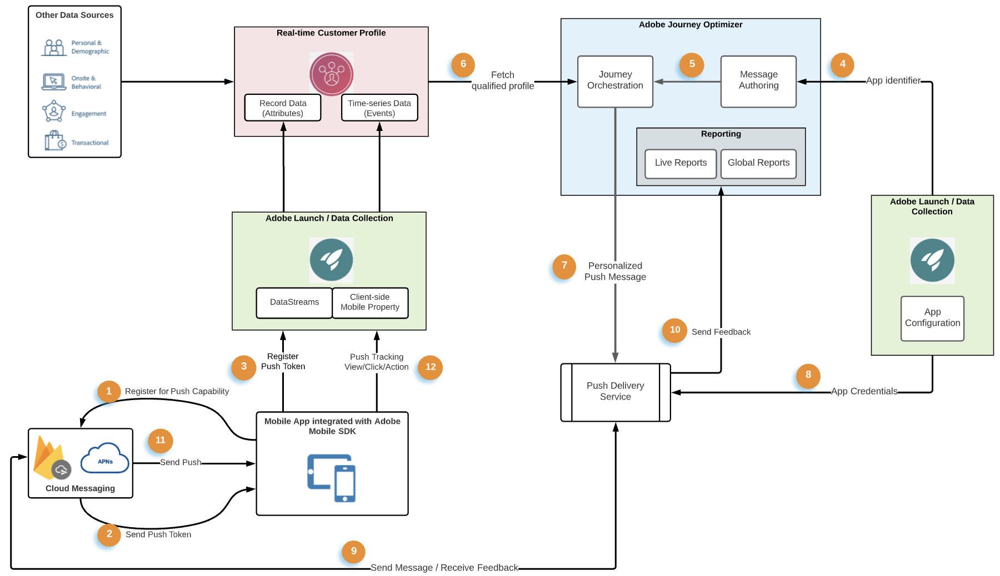

# Flusso di dati e componenti delle notifiche push {#get-started-push}

Questa pagina consente di configurare e comprendere i servizi e i flussi di lavoro chiave coinvolti nelle notifiche push in [!DNL Journey Optimizer].

>[!AVAILABILITY]
>
>È ora disponibile il nuovo flusso di lavoro di avvio rapido per l&#39;onboarding di **Mobile**. Utilizza questa nuova funzione del prodotto per configurare rapidamente Mobile SDK per iniziare a raccogliere e convalidare i dati degli eventi mobili e per inviare notifiche push mobili. Questa funzionalità è accessibile tramite la home page di Data Collection come versione beta pubblica. [Ulteriori informazioni](mobile-onboarding-wf.md)
>

Scopri come creare notifiche push in [questa pagina](create-push.md).

I passaggi per configurare il canale push in [!DNL Adobe Journey Optimizer] sono descritti in [questa pagina](push-configuration.md).

L’immagine seguente mostra i sistemi e i servizi coinvolti nei flussi di dati associati, evidenziando il modo in cui le notifiche push vengono distribuite dal punto di vista del servizio end-to-end.

1. Registrazione dell’app mobile di marca (Android o iOS) con i servizi di messaggistica push APN e Google FCM di Apple
1. I servizi di messaggistica generano un token push, ovvero un identificatore che [!DNL Adobe Journey Optimizer] utilizzerà per eseguire il targeting del dispositivo specifico con una notifica push.
1. Il token push generato in precedenza viene passato a Adobe Experience Platform e sincronizzato con Real-time Customer Profile; questa operazione viene eseguita OOTB con un SDK client di facile integrazione
1. I messaggi push sono creati in [!DNL Adobe Journey Optimizer], i messaggi push sono creati in base a una configurazione di canale (ossia un predefinito per messaggi)
1. I messaggi push possono essere inclusi nell’area di lavoro di orchestrazione in Percorsi
1. Al momento della pubblicazione del Percorso, i profili cliente basati sulle condizioni del Percorso sono qualificati per ricevere notifiche push, e in questo passaggio i payload dei messaggi push sono personalizzati
1. I payload push personalizzati vengono inoltrati a un servizio di consegna di messaggi push interno
1. Questo servizio interno convalida quindi le credenziali dell’app associata al messaggio, e
1. Invia il messaggio ai servizi di messaggistica di Apple e Google per la consegna finale
1. I feedback dei servizi di messaggistica vengono annotati, gli errori e i successi vengono registrati per la generazione di rapporti nel rapporto Percorsi Live &amp; Customer Journey Analytics
1. Le notifiche push vengono inviate ai dispositivi dell’utente finale
1. Le interazioni delle notifiche push per l’utente finale vengono inviate come eventi esperienza dal client dell’utente finale tramite l’integrazione con SDK

## Ruoli dei servizi chiave nelle notifiche push {#roles-of-key-services}

* **I provider del servizio di notifica push** sono i servizi Web dei componenti di base che inviano le notifiche dai server remoti alle app mobili.

  [!DNL Adobe Journey Optimizer] supporta sia le piattaforme Android che iOS e di conseguenza si integra con:
   * [Firebase Cloud Messaging (FCM)](https://firebase.google.com/docs/cloud-messaging) - per inviare notifiche all&#39;app mobile di Android
   * [Servizio notifiche push di Apple (APN)](https://developer.apple.com/library/archive/documentation/NetworkingInternet/Conceptual/RemoteNotificationsPG/APNSOverview.html) - per inviare notifiche all&#39;app mobile di iOS

* **Adobe Experience Platform Mobile SDK** che fornisce API di integrazione lato client per i dispositivi mobili tramite SDK compatibili con Android e iOS. SDK fornisce un&#39;estensione [!DNL Adobe Journey Optimizer] che espone diverse API specifiche per i messaggi push e abilita il flusso di dati, ad esempio la registrazione del token push o l&#39;invio di eventi di tracciamento push o di qualsiasi altro evento di esperienza personalizzato a Adobe Experience Platform. SDK fornisce inoltre una serie di altre estensioni che consentono di utilizzare altre funzionalità di Adobe Experience Cloud e di partner di terze parti.

  L&#39;integrazione di SDK richiede anche l&#39;installazione dei servizi di raccolta dati [&#x200B; di Adobe Experience Platform &#x200B;](https://experienceleague.adobe.com/docs/experience-platform/tags/home.html?lang=it){target="_blank"}come:

   * Creazione di un flusso di dati per configurare il profilo e i set di dati evento di esperienza rispetto ai quali i dati fluiscono in Adobe Experience Platform
   * Creazione di proprietà mobili lato client e aggiunta di estensioni. SDK si integra strettamente con queste estensioni per fornire un’esperienza di raccolta dati fluida.
   * Registrazione dell’identificatore del bundle per app mobili e delle credenziali dell’app

* **Il profilo cliente in tempo reale di Adobe Experience Platform** mantiene una visualizzazione olistica di ogni singolo cliente combinando dati provenienti da più canali, inclusi web, dispositivi mobili, CRM e di terze parti. Il profilo ti consente di consolidare i dati dei clienti in una visualizzazione unificata che offre un account utilizzabile e con marca temporale per ogni interazione con il cliente. Il token push per un determinato utente dell’app viene memorizzato sul profilo dell’utente come dati record, mentre le interazioni che l’utente effettua con le notifiche push vengono tracciate come dati di eventi di serie temporale. [Ulteriori informazioni su Adobe Experience Platform Real-time Customer Profile](https://experienceleague.adobe.com/docs/experience-platform/profile/home.html?lang=it){target="_blank"}.

* **[!DNL Adobe Journey Optimizer]** : una volta che le integrazioni dell&#39;app mobile con i componenti sopra menzionati sono implementate e i profili cliente in Adobe Experience Platform, puoi creare e orchestrare notifiche push in [!DNL Adobe Journey Optimizer] per interagire con i tuoi utenti.

## Eseguire il push della configurazione tecnica e dei flussi di lavoro degli utenti {#push-technical-setup}

La figura seguente mostra i vari passaggi, end-to-end, coinvolti nella configurazione dei componenti che formano l’ossatura del flusso di dati push. Le azioni sono state suddivise in categorie in base al ruolo che esegue la configurazione e al componente configurato.

**Argomenti correlati**

* [Configurare il canale push](push-configuration.md)
* [Rapporto notifiche push](../reports/journey-global-report-cja-push.md)
* [Creare una notifica push](create-push.md)
* [Aggiungere un messaggio in un percorso](../building-journeys/journeys-message.md)
* [Aggiungere un messaggio in una campagna](../campaigns/create-campaign.md)