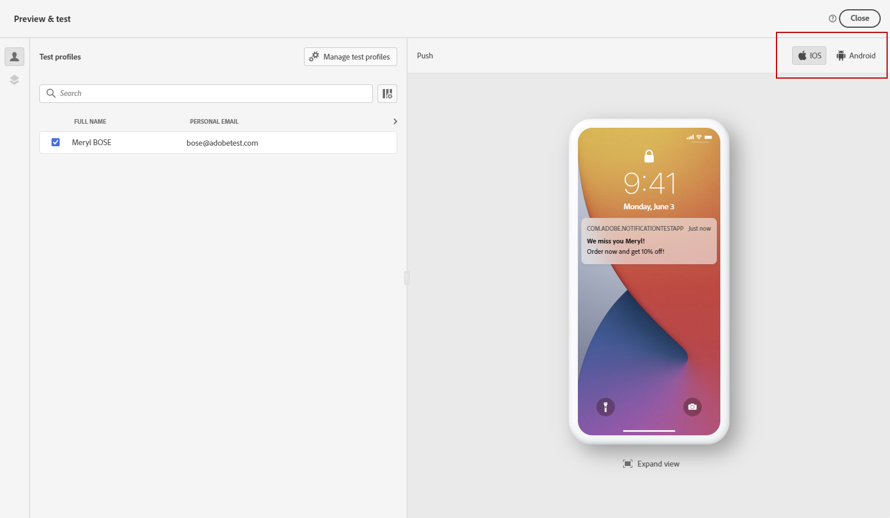
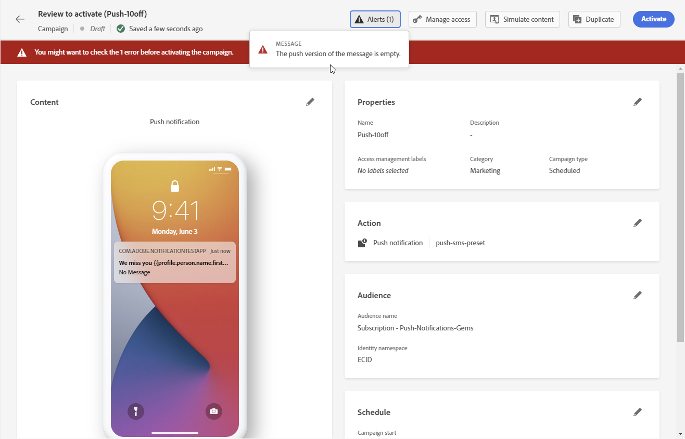

# Verificare e inviare una notifica push {#send-push}

>[!BEGINSHADEBOX]

**In questa pagina:** Scopri come visualizzare in anteprima, convalidare e inviare le notifiche push in Adobe Journey Optimizer.

>[!ENDSHADEBOX]

## Anteprima della notifica push {#preview-push}

Una volta definito il contenuto del messaggio, puoi visualizzarne l’anteprima utilizzando uno dei seguenti metodi di simulazione:

* Fai clic su **[!UICONTROL Simula contenuto]** per testare le varianti di contenuto con dati di input di esempio o con generazione automatica di IA. [Scopri come simulare varianti di contenuto](../test-approve/simulate-sample-input.md)
* Fai clic su **[!UICONTROL Simula contenuto]**, quindi seleziona **[!UICONTROL Simula contenuto (profili AEP)]** dal menu a discesa per visualizzare l&#39;anteprima con i profili di test. È quindi possibile selezionare il tipo di dispositivo per l&#39;anteprima del contenuto: **[!UICONTROL iOS]**, **[!UICONTROL Android]** o **[!UICONTROL Web]**.

Informazioni dettagliate su come visualizzare in anteprima e testare il contenuto sono disponibili nella sezione [Gestione dei contenuti](../content-management/preview-test.md).

## Convalidare la notifica push {#push-validate}

È necessario controllare gli avvisi nella sezione superiore dell’editor. Alcuni sono semplici avvisi, altri possono impedirti di inviare il messaggio. Possono verificarsi due tipi di avvisi: avvisi ed errori.

* **Avvisi** fai riferimento a consigli e best practice.

* **Gli errori** impediscono di testare o attivare il percorso finché non vengono risolti, ad esempio:

   * **[!UICONTROL La versione push del messaggio è vuota]**: questo errore viene visualizzato quando manca il titolo o il corpo della notifica push. Scopri come definire il contenuto delle notifiche push in [questa sezione](create-push.md).

   * **[!UICONTROL la configurazione non esiste]**: non puoi utilizzare il messaggio se la configurazione selezionata viene eliminata dopo la creazione del messaggio. Se si verifica questo errore, selezionare un&#39;altra configurazione nel messaggio **[!UICONTROL Proprietà]**. Ulteriori informazioni sulle configurazioni dei canali in [questa sezione](../configuration/channel-surfaces.md).

   * **[!UICONTROL Il payload push iOS/Android ha superato il limite di 4 KB]**: la dimensione della notifica push non può superare i 4 KB. Per rispettare questo limite, prova a ridurre l’uso di immagini o emoji. Scopri come gestire il contenuto delle notifiche push in [questa sezione](../push/create-push.md).

  

>[!NOTE]
>
> Per una migliore consegna dei messaggi, è consigliabile utilizzare sempre i numeri di telefono nei formati supportati dal provider. Ad esempio, Twilio e Sinch supportano solo i numeri di telefono in formato E.164.

## Inviare una notifica push{#push-send}

>[!IMPORTANT]
>
> Se la campagna è soggetta a una policy di approvazione, dovrai richiedere l’approvazione per poter inviare la notifica push. [Ulteriori informazioni](../test-approve/gs-approval.md)

Quando il messaggio push è pronto, completa la configurazione del [percorso](../building-journeys/journey-gs.md) o [campagna](../campaigns/create-campaign.md) per inviarlo.

**Argomenti correlati**

* [Configurare il canale push per dispositivi mobili](push-configuration.md)
* [Configurare il canale push per il web](push-configuration-web.md)
* [Rapporto notifiche push](../reports/journey-global-report-cja-push.md)
* [Creare una notifica push](create-push.md)
* [Aggiungere un messaggio in un percorso](../building-journeys/journey-action.md)
* [Aggiungere un messaggio in una campagna](../campaigns/create-campaign.md)

