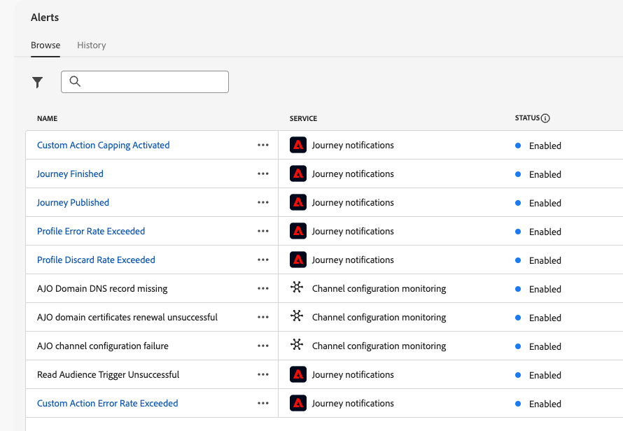
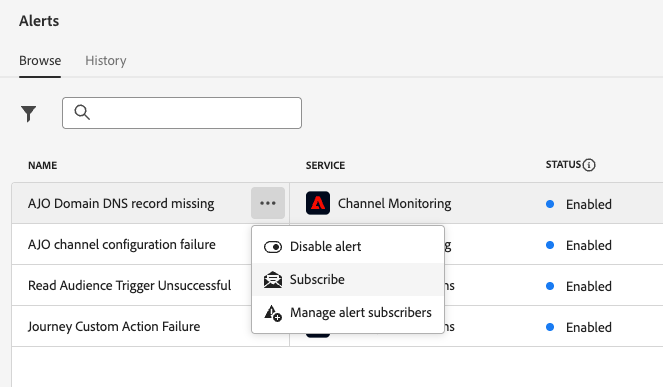
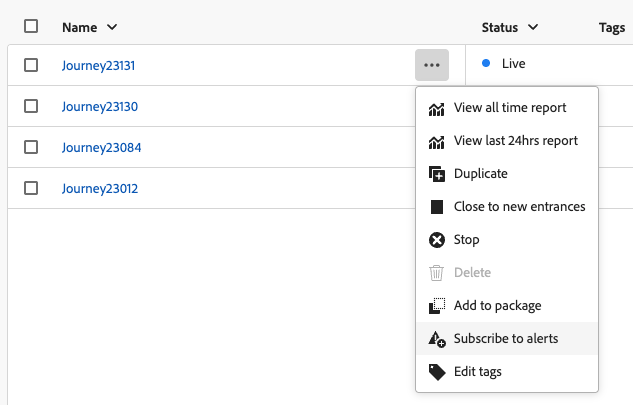

# Accedere e iscriversi agli avvisi di sistema {#alerts}

## Panoramica

Gli avvisi sono notifiche automatizzate che consentono di monitorare e risolvere i problemi in Adobe Journey Optimizer. Consentono di essere consapevoli in tempo reale dei potenziali problemi dei percorsi, delle campagne e delle configurazioni dei canali, consentendo di intraprendere azioni correttive prima che le esperienze dei clienti siano influenzate.

In Adobe Journey Optimizer sono disponibili due tipi di avvisi:

* **Avvisi di convalida nell&#39;area di lavoro**: durante la creazione di percorsi e campagne, utilizzare il pulsante **Avvisi** nell&#39;area di lavoro per identificare e risolvere gli errori di configurazione prima della pubblicazione. Scopri come [risolvere i problemi dei percorsi](../building-journeys/troubleshooting.md) e rivedere le campagne: [Campagne d&#39;azione](../campaigns/review-activate-campaign.md) | [Campagne attivate da API](../campaigns/review-activate-api-triggered-campaign.md) | [Campagne orchestrate](../orchestrated/start-monitor-campaigns.md).

* **Avvisi di monitoraggio del sistema** (dettagliati in questa pagina): ricevi notifiche proattive quando vengono superate le soglie operative o rilevati problemi nei percorsi live e nelle configurazioni dei canali, e quando si verificano eventi importanti del ciclo di vita della campagna (attivazione, consegna, arresto e errori correlati). Gli avvisi di sistema monitorano metriche quali tassi di errore, scarti di profilo e problemi di recapito dei messaggi e-mail, oltre a questi eventi di campagna.

**Vantaggi principali degli avvisi di sistema:**

* Rilevamento proattivo dei problemi prima dell’impatto sui clienti
* Monitoraggio automatico delle prestazioni e dello stato del percorso
* Avviso precoce per problemi di recapito messaggi e-mail
* Riduzione dei tempi di identificazione e risoluzione dei problemi operativi

Gli avvisi di sistema sono disponibili dal menu **[!UICONTROL Avvisi]** in **[!UICONTROL Amministrazione]**. Adobe Experience Platform fornisce diverse regole di avviso predefinite che è possibile abilitare, inclusi gli avvisi specifici di [!DNL Adobe Journey Optimizer] per le configurazioni di percorsi e canali.

## Prerequisiti

Prima di utilizzare gli avvisi:

* **Autorizzazioni**: sono necessarie autorizzazioni specifiche per visualizzare e gestire gli avvisi. Vedi [autorizzazioni richieste in Adobe Experience Platform](https://experienceleague.adobe.com/docs/experience-platform/observability/alerts/overview.html#permissions){target="_blank"}.

* **Riconoscimento sandbox**: le sottoscrizioni agli avvisi sono specifiche per la sandbox. Quando ti abboni agli avvisi, questi si applicano solo alla sandbox corrente. Quando viene reimpostata una sandbox, vengono reimpostate anche tutte le sottoscrizioni agli avvisi.

* **Preferenze di notifica**: configura la modalità di ricezione degli avvisi (e-mail e/o in-app) nelle [Preferenze Adobe Experience Cloud](../start/user-interface.md#in-product-uc).

## Avvisi disponibili {#available-alerts}

Journey Optimizer fornisce regole di avviso preconfigurate che monitorano aspetti specifici dei percorsi, delle campagne e delle configurazioni dei canali. Non è necessario creare questi avvisi, sono disponibili come predefiniti e possono essere attivati tramite abbonamento.

**Per accedere all&#39;elenco di avvisi:**

Passa a **[!UICONTROL Amministrazione]** > **[!UICONTROL Avvisi]** nel menu a sinistra. Nella scheda **Sfoglia** sono visualizzati tutti gli avvisi preconfigurati disponibili per Journey Optimizer.

{width=60%}

Sfoglia le schede seguenti per esaminare gli avvisi di configurazione di percorso, campagna e canale. Seleziona un nome di avviso in una scheda per espanderne la descrizione completa.

>[!BEGINTABS]

>[!TAB Avvisi di Percorso]

Tutte le notifiche di percorso disponibili nell’interfaccia utente sono elencate in questa scheda. Seleziona un nome di avviso per espanderne la descrizione completa e le indicazioni.

>[!CAUTION]
>
>Gli avvisi specifici di Adobe Journey Optimizer si applicano solo a **live** percorsi. Gli avvisi non vengono attivati per i percorsi in modalità di test.

+++ Lettura del trigger del pubblico non riuscita

Questo avviso ti avvisa se un&#39;attività **Read Audience** non ha elaborato alcun profilo 10 minuti dopo l&#39;ora di esecuzione pianificata. Questo errore può essere causato da problemi tecnici o perché il pubblico è vuoto. Se l’errore è causato da problemi tecnici, tieni presente che possono comunque verificarsi nuovi tentativi, a seconda del tipo di problema (ad esempio, se la creazione del processo di esportazione non è riuscita, verrà eseguito un nuovo tentativo ogni 10mn per un massimo di 1h).

Gli avvisi sulle attività **Read Audience** si applicano solo ai percorsi ricorrenti. **Le attività Read Audience** nei percorsi live che hanno una pianificazione per l&#39;esecuzione di **Once** o **As soon as possible** vengono ignorate.

Gli avvisi in **Read Audience** vengono risolti quando un profilo entra nel nodo **Read Audience** o dopo 1 ora.

Il nome della sottoscrizione all&#39;evento di I/O corrispondente all&#39;avviso **Read Audience Trigger Unsuccess** è **Percorso di ritardo, errori e errori di lettura del pubblico**.

Per risolvere i problemi relativi agli avvisi di **Read Audience**, controlla il tuo conteggio del pubblico nell&#39;interfaccia di Experience Platform.

➡️ [Configura pubblico di lettura](../building-journeys/read-audience.md)

➡️ [Definire e utilizzare i tipi di pubblico](../audience/about-audiences.md)

+++

+++ Frequenza di eliminazione profilo superata

Questo avviso ti avvisa se il rapporto tra gli scarti di profilo e i profili immessi negli ultimi 5 minuti ha superato la soglia. La soglia predefinita è impostata sul 20%, ma puoi definire una soglia personalizzata.

Fare clic sul nome dell&#39;avviso per verificare i dettagli e la configurazione dell&#39;avviso.

Un profilo può essere scartato per diversi motivi, in base ai quali verrà illustrato il metodo di risoluzione dei problemi. Di seguito sono elencati alcuni motivi comuni:

* Profilo scartato all’ingresso perché è già attivo in quel percorso unitario. Per risolvere questo problema, assicurati che il profilo abbia tempo sufficiente per uscire dal percorso prima che arrivi l’evento successivo per quel profilo.
* L’identità non è impostata per il profilo o lo spazio dei nomi utilizzato dal percorso del pubblico di lettura non è utilizzato in tale profilo. Per risolvere questo problema, assicurati che lo spazio dei nomi nel percorso corrisponda allo spazio dei nomi dell’identità utilizzato dai profili.
* Velocità effettiva eventi superata. Per risolvere questo problema, assicurati che gli eventi in arrivo nel sistema non superino questi limiti.

➡️ [Risoluzione dei problemi di percorso](../building-journeys/troubleshooting.md)

➡️ [Definire una soglia di avviso personalizzata](#custom-threshold)

+++

+++ È stato superato il tasso di errore dell’azione personalizzata

Questo avviso avvisa se il rapporto tra gli errori delle azioni personalizzate e le chiamate HTTP riuscite negli ultimi 5 minuti ha superato la soglia. La soglia predefinita è impostata sul 20%, ma puoi definire una soglia personalizzata.

>[!NOTE]
>
>Questo avviso sostituisce l&#39;avviso precedente di **Errore azione personalizzata Percorso**.

Fare clic sul nome dell&#39;avviso per verificare i dettagli e la configurazione dell&#39;avviso.

Gli errori delle azioni personalizzate possono verificarsi per diversi motivi. Per risolvere questi errori, è possibile:

* Controlla l’azione personalizzata utilizzando la modalità di test in un altro percorso.
* Controlla il report di percorso per visualizzare i motivi dell’errore durante l’azione.
* Controlla il tuo stepEvents di percorso per cercare ulteriori informazioni su &quot;failureReason&quot;.
* Verifica che l’azione personalizzata sia configurata correttamente e verifica che l’autenticazione sia ancora valida. Esegui un controllo manuale con Postman, ad esempio.
* Verifica che l’endpoint sia raggiungibile e che l’azione personalizzata possa raggiungerlo tramite il controllo della connettività delle azioni personalizzate.
* Verifica le credenziali di autenticazione, controlla la connettività Internet, ecc.

➡️ [Convalida in modalità di test](../building-journeys/testing-the-journey.md)

➡️ [Verifica il report live del percorso](../reports/journey-live-report.md)

➡️ [Configura azioni personalizzate](../action/about-custom-action-configuration.md)

➡️ [Definire una soglia di avviso personalizzata](#custom-threshold)

+++

+++ Frequenza di errori profilo superata

Questo avviso ti avvisa se il rapporto tra profili in errore e profili immessi negli ultimi 5 minuti ha superato la soglia. La soglia predefinita è impostata sul 20%, ma puoi definire una soglia personalizzata.

Fare clic sul nome dell&#39;avviso per verificare i dettagli e la configurazione dell&#39;avviso.

Per risolvere l’errore del profilo, puoi eseguire una query sui dati negli eventi dei passaggi per capire dove e perché il profilo non è riuscito nel percorso.

➡️ [Utilizzare gli eventi dei passaggi del percorso](../reports/journey-step-events-overview.md)

➡️ [Verifica il report live del percorso](../reports/journey-live-report.md)

➡️ [Definire una soglia di avviso personalizzata](#custom-threshold)

+++

+++ Percorso pubblicato

Questo avviso avvisa quando un percorso è stato pubblicato da un operatore nell’area di lavoro del percorso.

Si tratta di un avviso informativo che consente di tenere traccia degli eventi del ciclo di vita del percorso all’interno dell’organizzazione. Non esistono criteri di risoluzione, in quanto si tratta di una notifica una tantum.

➡️ [Pubblica un percorso](../building-journeys/publish-journey.md)

➡️ [Convalida in modalità di test](../building-journeys/testing-the-journey.md)

+++

+++ Percorso completato

Questo avviso notifica il completamento di un percorso. La definizione di &quot;finito&quot; varia a seconda del tipo di percorso.

Questo è un avviso informativo che ti aiuta a tenere traccia del completamento del percorso. Non esistono criteri di risoluzione, in quanto si tratta di una notifica una tantum.

➡️ [Comprendere quando un percorso è finito](../building-journeys/end-journey.md#journey-finished-definition)

+++

+++ Limitazione azione personalizzata attivata

Questo avviso ti avvisa quando il limite è stato attivato su un’azione personalizzata. Il limite viene utilizzato per limitare il numero di chiamate inviate a un endpoint esterno per evitare di sopraffare l’endpoint.

Fare clic sul nome dell&#39;avviso per verificare i dettagli e la configurazione dell&#39;avviso.

Quando si attiva il limite, significa che è stato raggiunto il numero massimo di chiamate API entro il periodo di tempo definito e che ulteriori chiamate vengono limitate o messe in coda.

Questo avviso viene risolto quando il limite non è più attivo o quando nessun profilo raggiunge l’azione personalizzata durante il periodo di valutazione.

Per risolvere i problemi relativi ai limiti:

* Controlla la configurazione dei limiti nell’azione personalizzata per verificare che i limiti siano appropriati per il tuo caso d’uso.
* Verifica se il volume di chiamate API è superiore al previsto e prendi in considerazione la possibilità di regolare la progettazione del percorso o le impostazioni di limitazione.
* Monitora l’endpoint esterno per garantire che possa gestire il carico previsto.

➡️ [Configura limite azioni personalizzato](../action/about-custom-action-configuration.md#custom-action-enhancements-best-practices)

+++

>[!TAB Avvisi campagna]

Gli avvisi di sistema ti avvisano quando si verificano eventi importanti del ciclo di vita o della consegna nelle campagne **Azione** e **Attivato da API**. Selezionare un nome di avviso per espanderne la descrizione.

+++ Campagna attivata

Notifica quando una campagna è stata **attivata** correttamente (pubblicazione/attivazione completata).

➡️ [Rivedi e attiva una campagna di azioni](../campaigns/review-activate-campaign.md)

➡️ [Rivedi e attiva una campagna attivata da API](../campaigns/review-activate-api-triggered-campaign.md)

+++

+++ Attivazione della campagna non riuscita

Notifica quando **l&#39;attivazione** di una campagna **non riesce**. Utilizza questo avviso per rilevare in anticipo i problemi tecnici o di configurazione e riprovare o correggere la campagna prima che i clienti siano interessati.

➡️ [Rivedi e attiva una campagna di azioni](../campaigns/review-activate-campaign.md)

➡️ [Rivedi e attiva una campagna attivata da API](../campaigns/review-activate-api-triggered-campaign.md)

➡️ [Verifica prerequisiti e configurazione della campagna](../campaigns/get-started-with-campaigns.md)

+++

+++ Campagna interrotta

Notifica quando una campagna è stata **interrotta** correttamente (ad esempio, dopo un&#39;interruzione manuale o quando l&#39;esecuzione viene completata in base al flusso di lavoro).

➡️ [Comprendere lo stato della campagna](../campaigns/manage-campaigns.md#statuses)

➡️ [Interrompere una campagna di azioni](../campaigns/manage-campaigns.md#stop)

+++

+++ Interruzione della campagna non riuscita

Notifica quando un&#39;operazione **stop** **non riesce**. Prima di riprovare, controlla lo stato della campagna ed eventuali errori visualizzati nell’interfaccia utente.

➡️ [Comprendere lo stato della campagna](../campaigns/manage-campaigns.md#statuses)

➡️ [Interpreta indicatori di errore](../campaigns/manage-campaigns.md#error-indicators)

➡️ [Interrompere una campagna di azioni](../campaigns/manage-campaigns.md#stop)

+++

+++ Consegna della campagna iniziata

Notifica quando **la consegna dei messaggi** per una campagna è **iniziata** (l&#39;esecuzione è stata spostata nella fase di consegna).

➡️ [Rivedi il rapporto della campagna (CJA)](../reports/campaign-global-report-cja.md)

➡️ [Gestione campagne](../campaigns/manage-campaigns.md)

+++

+++ Consegna della campagna completata

Notifica quando **la consegna dei messaggi** per una campagna è stata **completata**.

➡️ [Rivedi il rapporto della campagna (CJA)](../reports/campaign-global-report-cja.md)

➡️ [Gestione campagne](../campaigns/manage-campaigns.md)

+++

+++ Consegna della campagna non riuscita

Ti avvisa quando **la consegna del messaggio** per una campagna **non riesce**. Esamina i rapporti della campagna, i registri di esecuzione e la configurazione del canale per la risoluzione dei problemi.

➡️ [Rivedi il rapporto della campagna (CJA)](../reports/campaign-global-report-cja.md)

➡️ [Interpreta indicatori di errore](../campaigns/manage-campaigns.md#error-indicators)

➡️ [Configura consegna canale](../configuration/channel-surfaces.md)

+++

>[!TAB Avvisi configurazione canale]

Gli avvisi di monitoraggio della configurazione del canale disponibili nell’interfaccia utente sono elencati in questa scheda. Selezionare un nome di avviso per espandere i passaggi e le note della correzione.

+++ Record DNS di dominio AJO mancante

Questo avviso notifica quando i record DNS critici (NS o CNAME) necessari per la corretta configurazione del recapito messaggi risultano mancanti o non configurati correttamente. Senza questi record, il recapito messaggi e-mail potrebbe essere compromesso.

>[!NOTE]
>
>* I record NS sono essenziali per la delega completa dei sottodomini ad Adobe. [Ulteriori informazioni](../configuration/about-subdomain-delegation.md#full-subdomain-delegation)
>
>* I record CNAME supportano la configurazione del sottodominio CNAME. [Ulteriori informazioni](../configuration/about-subdomain-delegation.md#cname-subdomain-setup)

L&#39;avviso **Record DNS di dominio AJO mancante** viene attivato quando il sistema rileva che i record NS o CNAME richiesti sono assenti o non corrispondono agli standard di configurazione.

1. Fare clic sull&#39;avviso per reindirizzare al sottodominio [interessato](../configuration/delegate-subdomain.md) nell&#39;interfaccia [!DNL Journey Optimizer].

   <!--For guidance on editing delegated subdomains, see [this section](../configuration/delegate-subdomain.md).-->

1. Correggi la configurazione DNS impostando correttamente i record e [invia di nuovo la delega del sottodominio](../configuration/delegate-subdomain.md#submit-subdomain).

   >[!NOTE]
   >
   >Prima di procedere, assicurati che tutti i record siano stati creati correttamente nella soluzione di hosting del tuo dominio.

1. Se non si è sicuri dei valori corretti, è possibile creare un nuovo sottodominio in [!DNL Journey Optimizer] con lo stesso nome del sottodominio interessato. [Scopri come impostare un nuovo sottodominio](../configuration/delegate-subdomain.md#set-up-subdomain)

Se le modifiche non risolvono il problema, lo stesso avviso viene attivato nuovamente il giorno successivo.

<!--The I/O event subscription name corresponding to this alert is xx. > Do we need to mention this?-->

+++

+++ Errore di configurazione del canale AJO

>[!IMPORTANT]
>
>Questo avviso si applica solo alle configurazioni del canale **email** che utilizzano il tipo di delega [custom subdomain](../configuration/delegate-custom-subdomain.md). <!--Other channel types (such as SMS, push, or in-app) are not covered by this alert.-->

Questo avviso viene attivato nel caso in cui il controllo di sistema rilevi problemi di configurazione del canale e-mail. Questi problemi possono includere impostazioni di canale non configurate correttamente, configurazione DNS non valida, problemi dell’elenco di soppressione, incoerenza IP o qualsiasi altro errore che può influire sulla consegna delle e-mail.

Se ricevi un avviso di questo tipo, di seguito sono elencati i passaggi di risoluzione.

1. Fare clic sull&#39;avviso per essere indirizzato alla [configurazione del canale e-mail](../email/get-started-email-config.md) interessata nell&#39;interfaccia [!DNL Journey Optimizer].

   Per informazioni sulla modifica delle configurazioni del canale, consulta [questa sezione](../configuration/channel-surfaces.md#edit-channel-surface).

1. Rivedi i dettagli di configurazione e i messaggi di errore forniti. I motivi comuni di errore includono:

   * Convalida SPF non riuscita
   * Convalida DKIM non riuscita
   * Convalida del record MX non riuscita
   * Record DNS non validi

   >[!NOTE]
   >
   >I possibili motivi di errore di configurazione sono elencati in [questa sezione](../configuration/channel-surfaces.md).

1. Risolvi il problema:

   * Aggiorna la configurazione del canale in base alle esigenze.
   * Potrebbe essere necessario risolvere i problemi DNS specifici indicati nell’avviso.

   >[!NOTE]
   >
   >Poiché un singolo dominio può essere associato a più configurazioni di canale, la risoluzione dei problemi DNS per la configurazione di un canale può risolvere automaticamente i problemi correlati tra più configurazioni.

Se la modifica non risolve il problema, lo stesso avviso viene attivato nuovamente il giorno successivo.

Quando risolvi i problemi di configurazione e-mail, tieni presente le best practice elencate di seguito:

* Agisci tempestivamente: correggi gli errori di configurazione non appena vengono rilevati per evitare interruzioni nella consegna delle e-mail.
* Controlla tutte le configurazioni: se l’avviso indica che sono presenti più configurazioni e-mail interessate, rivedi e correggi ciascuna di esse.

+++

+++ Rinnovo dei certificati del dominio AJO non riuscito

>[!IMPORTANT]
>
>Questo avviso si applica solo alle configurazioni di canale che utilizzano il tipo di delega [sottodominio personalizzato](../configuration/delegate-custom-subdomain.md).

Questo avviso notifica quando un certificato del dominio delle risorse o di tracciamento in un sottodominio di delega personalizzato scade entro 30 giorni o è già scaduto. Senza certificati validi, il recapito messaggi e-mail e il tracciamento dei collegamenti potrebbero essere interrotti.

>[!NOTE]
>
>Il controllo viene eseguito **ogni settimana**.

Se questo avviso viene attivato, segui i passaggi seguenti per indagare e risolvere il problema.

1. Fai clic sull&#39;avviso per aprire il sottodominio [interessato](../configuration/delegate-subdomain.md) in [!DNL Journey Optimizer].

1. Rivedi i dettagli per verificare se è necessario rinnovare il certificato.

   * Se la data di scadenza è nel futuro, pianificare il risanamento: l&#39;avviso può fornire fino a 30 giorni di avviso.
   * Se il certificato è già scaduto, intervenire immediatamente.
   * Se il problema non viene risolto, lo stesso avviso viene attivato nuovamente la settimana successiva.

1. Nella soluzione di hosting DNS verificare che tutti i record richiesti per la delega del sottodominio corrispondano ancora ai valori visualizzati in [!DNL Journey Optimizer], inclusi i record utilizzati per la convalida SSL.

+++

>[!ENDTABS]

>[!NOTE]
>
>Per gli avvisi provenienti da altri servizi Adobe Experience Platform (acquisizione dati, risoluzione identità, segmentazione e altro ancora), consulta la [documentazione standard sulle regole di avviso](https://experienceleague.adobe.com/docs/experience-platform/observability/alerts/rules.html){target="_blank"}.

## Iscriversi agli avvisi {#subscribe-alerts}

Le sottoscrizioni di avvisi determinano quali utenti ricevono le notifiche quando vengono soddisfatte determinate condizioni (ad esempio quando vengono superate le soglie del tasso di errore o rilevati problemi di configurazione). Solo gli utenti abbonati ricevono le notifiche di avviso per gli avvisi selezionati.

### Funzionamento delle notifiche di avviso

**Ciclo di vita avviso:**

1. **Attivazione**: l&#39;avviso viene attivato quando viene soddisfatta la relativa condizione specifica (ad esempio, la percentuale di errore supera il 20%)
2. **Notifica**: tutti gli utenti abbonati ricevono le notifiche tramite i canali configurati
3. **Monitoraggio**: l&#39;avviso continua a monitorare la condizione a intervalli regolari
4. **Risoluzione**: quando la condizione viene risolta, i sottoscrittori ricevono una notifica &quot;Risolto&quot;

**Consegna notifiche:**

* **Canali di consegna**: gli avvisi vengono inviati tramite e-mail e/o notifiche in-app nel centro notifiche di Journey Optimizer (icona a forma di campana nell&#39;angolo in alto a destra). Configura i canali di consegna preferiti nelle [Preferenze Adobe Experience Cloud](../start/user-interface.md#in-product-uc).

* **Tipi di avviso**: Journey Optimizer fornisce avvisi occasionali (eventi informativi come &quot;percorso pubblicato&quot;) e avvisi ripetuti (soglie di monitoraggio). Gli avvisi ripetuti continuano a valutare e a inviare notifiche fino alla risoluzione della condizione.

* **Risoluzione automatica**: per evitare che i valori fluttuino a causa dell&#39;eccesso di notifiche, gli avvisi si risolvono automaticamente dopo 1 ora anche se la condizione persiste. Questo impedisce la generazione di notifiche continue quando le metriche si spostano attorno ai valori di soglia.

**Metodo di sottoscrizione alternativo:**

Per le integrazioni avanzate, puoi abbonarti tramite Eventi di I/O per inviare avvisi ai sistemi esterni. Consulta la [documentazione di Adobe Experience Platform](https://experienceleague.adobe.com/docs/experience-platform/observability/alerts/subscribe.html){target="_blank"}.

### Metodi di abbonamento

È possibile iscriversi agli avvisi in diversi modi:

* **[Sottoscrizione globale (sandbox)](#subscribe-alerts)**: ricevi notifiche per tutti i percorsi o le campagne corrispondenti nella **sandbox corrente**. Utilizzalo quando desideri una copertura ampia.
* **[Sottoscrizione specifica per il Percorso](#subscribe-alerts)**: per gli avvisi di percorso supportati, limita le notifiche a **un percorso** alla volta dall&#39;inventario di percorso.
* **Sottoscrizione specifica per la campagna**: gli avvisi sul ciclo di vita della campagna al momento possono essere sottoscritti solo a livello di sandbox.

>[!BEGINTABS]

>[!TAB Sottoscrizione globale]

Gli abbonamenti globali ti consentono di ricevere avvisi per tutti i percorsi e le campagne nella sandbox corrente.

**Per iscriversi a un avviso:**

1. Passa a **[!UICONTROL Amministrazione]** > **[!UICONTROL Avvisi]** nel menu a sinistra.

1. Nella scheda **[!UICONTROL Sfoglia]**, individua l&#39;avviso che desideri monitorare.

1. Fare clic su **[!UICONTROL Sottoscrivi]** per visualizzare l&#39;avviso desiderato.

   {width=80%}

**Per annullare l&#39;abbonamento:**

Fai clic su **[!UICONTROL Annulla iscrizione]** accanto all&#39;avviso.

>[!IMPORTANT]
>
>Le sottoscrizioni agli avvisi sono specifiche per sandbox. Devi iscriverti agli avvisi separatamente in ogni sandbox in cui desideri ricevere le notifiche.

**Metodo di sottoscrizione alternativo:**

È inoltre possibile effettuare la sottoscrizione tramite [Notifiche evento I/O](https://experienceleague.adobe.com/docs/experience-platform/observability/alerts/subscribe.html){target="_blank"}, che consente l&#39;integrazione con i sistemi esterni. I nomi delle sottoscrizioni di I/O agli avvisi di percorso sono indicati nella [scheda Avvisi di Percorso](#available-alerts) in **Avvisi disponibili**, se applicabile. Gli avvisi sul ciclo di vita delle campagne seguono lo stesso modello di abbonamento a Platform; consulta tale documentazione per l’integrazione programmatica.

>[!TAB abbonamento specifico per il Percorso]

Gli abbonamenti specifici del percorso consentono di monitorare singoli percorsi ad alta priorità senza ricevere avvisi per tutti i percorsi dell’organizzazione.

**Per sottoscrivere avvisi per un percorso specifico:**

1. Passare all&#39;inventario del percorso.

1. Fare clic sul menu **⋯** (altre azioni) per il percorso che si desidera monitorare.

1. Seleziona **[!UICONTROL Abbonati agli avvisi]**.

   {width=75%}

1. Seleziona gli avvisi da abilitare tra le opzioni disponibili:
   * [Tasso di eliminazione del profilo superato](#available-alerts)
   * [Tasso di errore delle azioni personalizzate superato](#available-alerts)
   * [Tasso di errore del profilo superato](#available-alerts)
   * [Percorso pubblicato](#available-alerts)
   * [Percorso completato](#available-alerts)
   * [Limitazione azioni personalizzate attivata](#available-alerts)

1. Fai clic su **[!UICONTROL Salva]** per confermare i tuoi abbonamenti.

**Per annullare l&#39;abbonamento:**

Apri la stessa finestra di dialogo, deseleziona gli avvisi e fai clic su **[!UICONTROL Salva]**.

>[!NOTE]
>
>L&#39;avviso [Read Audience Trigger Unsuccess](#available-alerts) è disponibile solo tramite la sottoscrizione globale, non tramite la sottoscrizione al percorso.

>[!ENDTABS]

<!--
Campaign-specific subscriptions apply to the [campaign lifecycle alerts](#available-alerts). They let you monitor individual high-priority campaigns without receiving the same alert for every campaign in the sandbox.

**To subscribe to campaign lifecycle alerts for a specific campaign:**

1. Go to the **[!UICONTROL Campaigns]** inventory and open the tab for your campaign type (**[!UICONTROL Action]** or **[!UICONTROL API triggered]**).

1. Click the **⋯** (more actions) menu for the campaign you want to monitor.

1. Select **[!UICONTROL Subscribe to alerts]**.

1. Select the campaign lifecycle alert(s) you want from the available options (see [Campaign alerts](#available-alerts)).

1. Click **[!UICONTROL Save]** to confirm your subscriptions.

**To unsubscribe:**

Open the same dialog, deselect the alert(s), and click **[!UICONTROL Save]**.

You can combine **sandbox-level** subscription (from the Alerts **[!UICONTROL Browse]** tab) with **campaign-specific** subscriptions. Use sandbox-level coverage for everything in the sandbox, and add per-campaign subscriptions only for campaigns you want to track separately.
-->

<!--To enable email alerting, refer to [Adobe Experience Platform documentation](https://experienceleague.adobe.com/docs/experience-platform/observability/alerts/ui.html#enable-email-alerts){target="_blank"}.-->

## Gestire gli avvisi {#manage-alerts}

### Modificare un avviso

Per controllare i dettagli di un avviso, fai clic sulla riga corrispondente. Il nome, lo stato e i canali di notifica vengono visualizzati nel pannello a sinistra.
Per gli avvisi di Percorso, utilizza il pulsante **[!UICONTROL Altre azioni]** per modificarli. Puoi quindi definire una [soglia personalizzata](#custom-threshold) per questi avvisi.

{width=60%}

### Definire una soglia personalizzata {#custom-threshold}

È possibile impostare soglie per [avvisi di Percorso](#available-alerts). La soglia di avviso sopra indicata è predefinita al 20%.

Per modificare la soglia:

1. Passa alla schermata **Avvisi**
1. Fai clic sul pulsante **[!UICONTROL Altre azioni]** dell&#39;avviso da aggiornare
1. Inserisci la nuova soglia e conferma. La nuova soglia si applica a **tutti** percorsi

{width=60%}

>[!CAUTION]
>
>I livelli di soglia sono globali per tutti i percorsi e non possono essere modificati singolarmente per percorso.

### Disattivare un avviso

Per impostazione predefinita, tutti gli avvisi sono attivati. Per disattivare un avviso, selezionare l&#39;opzione **[!UICONTROL Disattiva avviso]**: tutti i sottoscrittori dell&#39;avviso non riceveranno più le notifiche correlate.

### Stati degli avvisi

Di seguito sono elencati i possibili stati di avviso:

* **[!UICONTROL Abilitato]** - L&#39;avviso è abilitato e sta monitorando la condizione del trigger.
* **[!UICONTROL Disabilitato]** - L&#39;avviso è disabilitato e non sta monitorando la condizione del trigger. Non riceverai alcuna notifica per questo avviso.
* **[!UICONTROL Attivato]** - La condizione di attivazione dell&#39;avviso è attualmente soddisfatta.

### Visualizzare e aggiornare gli abbonati {#manage-subscribers}

Selezionare **[!UICONTROL Gestisci sottoscrittori avviso]** per visualizzare l&#39;elenco degli utenti che si sono iscritti all&#39;avviso.

{width=80%}

Per aggiungere altri abbonati, inserisci il proprio indirizzo e-mail separato da una virgola e seleziona **[!UICONTROL Aggiorna]**.

Per rimuovere i sottoscrittori, eliminarne l&#39;indirizzo di posta elettronica e selezionare **[!UICONTROL Aggiorna]**.

## Argomenti correlati {#additional-resources-alerts}

**Gestione Percorsi e campagne:**

* [Risoluzione dei problemi dei percorsi](../building-journeys/troubleshooting.md) - Identificazione e risoluzione dei problemi e degli errori più comuni del percorso
* [Verifica e pubblica percorsi](../building-journeys/publish-journey.md) - Convalida la configurazione del percorso prima della pubblicazione
* [Rivedi e attiva campagne di azione](../campaigns/review-activate-campaign.md) - Convalida pre-pubblicazione per campagne pianificate e occasionali
* [Rivedi e attiva campagne attivate da API](../campaigns/review-activate-api-triggered-campaign.md) - Convalida per campagne attivate da API
* [Monitorare le campagne orchestrate](../orchestrated/start-monitor-campaigns.md) - Tracciare e gestire l&#39;esecuzione delle campagne orchestrate

**Framework avvisi:**

* [Panoramica avvisi Adobe Experience Platform](https://experienceleague.adobe.com/docs/experience-platform/observability/alerts/overview.html?lang=it){target="_blank"} - Informazioni sul framework degli avvisi
* [Gestione degli avvisi nell&#39;interfaccia utente](https://experienceleague.adobe.com/docs/experience-platform/observability/alerts/ui.html){target="_blank"} - Visualizzazione, sottoscrizione e gestione degli avvisi
* [Abbonati agli avvisi tramite eventi di I/O](https://experienceleague.adobe.com/docs/experience-platform/observability/alerts/subscribe.html){target="_blank"} - Opzioni di integrazione avanzate
* [Regole di avviso standard](https://experienceleague.adobe.com/docs/experience-platform/observability/alerts/rules.html){target="_blank"} - Elenco completo degli avvisi di Platform disponibili
