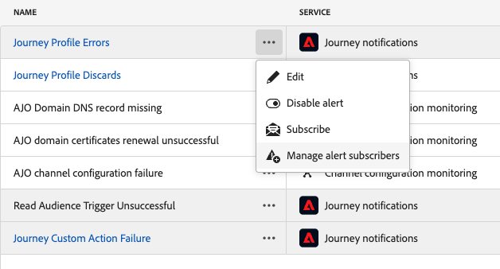

# Accedere e iscriversi agli avvisi di sistema {#alerts}

Durante la creazione di percorsi e campagne, utilizza il pulsante **Avvisi** per verificare e risolvere gli errori prima di eseguirli o pubblicarli.

Dal menu dedicato **[!UICONTROL Avvisi]**, puoi anche abbonarti a [!DNL Adobe Journey Optimizer] avvisi di sistema, come descritto in questa pagina.

## Accedere agli avvisi {#access-alerts}

In caso di errore, puoi ricevere gli avvisi di sistema nel centro notifiche di Journey Optimizer (avvisi in-app) e/o ricevere un messaggio e-mail. Per accedere a questi avvisi, segui la procedura indicata di seguito.

<!--These messages can repeat over a pre-defined time interval until the alert has been resolved.-->

>[!NOTE]
>
>Ulteriori informazioni sugli avvisi in Adobe Experience Platform sono disponibili nella [documentazione di Adobe Experience Platform](https://experienceleague.adobe.com/docs/experience-platform/observability/alerts/overview.html?lang=it){target="_blank"}.

Nel menu a sinistra, nella sezione **[!UICONTROL Amministrazione]**, fare clic su **[!UICONTROL Avvisi]**. Per Journey Optimizer sono disponibili diversi avvisi preconfigurati.

Esse sono elencate come segue e ogni segnalazione è descritta di seguito.

* Avvisi specifici dei percorsi:

   * l&#39;avviso [Errore azione personalizzata Percorso](#alert-custom-actions)
   * l&#39;avviso [Lettura trigger pubblico non riuscita](#alert-read-audiences)
<!--DOCAC-13465   * the [Profile Discard Rate Exceeded](#alert-discard-rate) alert
   * the [Custom Action Error Rate Exceeded](#alert-custom-action-error-rate) alert
   * the [Profile Error Rate Exceeded](#alert-profile-error-rate) alert-->

* Avvisi specifici per la configurazione del canale:

   * avviso [record DNS di dominio AJO mancante](#alert-dns-record-missing)
   * l&#39;avviso [errore di configurazione del canale AJO](#alert-channel-config-failure)
     <!--* the [AJO domain certificates renewal unsuccessful](#alert-certificates-renewal) alert-->

## Iscriversi agli avvisi {#subscribe-alerts}

Se si verifica un comportamento imprevisto e/o viene raggiunto un determinato set di condizioni nelle operazioni (ad esempio un potenziale problema quando il sistema supera una soglia), le notifiche di avviso vengono inviate a tutti gli utenti dell’organizzazione che si sono abbonati.

È possibile sottoscrivere ogni singolo avviso dall&#39;interfaccia utente, sia globalmente che dal menu **[!UICONTROL Avvisi]** (vedere [Sottoscrizione globale](#global-subscription))<!--DOCAC-13465, or unitary for a specific journey (see [Unitary subscription](#unitary-subscription))-->.

In base alle preferenze dell’abbonato, gli avvisi vengono inviati tramite e-mail e/o direttamente all’interno del centro notifiche di Journey Optimizer, nell’angolo in alto a destra dell’interfaccia utente (notifiche in-app). Seleziona la modalità di ricezione di questi avvisi nelle [!DNL Adobe Experience Cloud] **[!UICONTROL Preferenze]**. [Ulteriori informazioni](../start/user-interface.md#in-product-alerts)

Quando viene risolto un avviso, gli abbonati ricevono una notifica &quot;Risolto&quot;.

### Abbonamento globale {#global-subscription}

Per iscriverti/annullare l’iscrizione a un avviso per tutti i percorsi e le campagne, effettua le seguenti operazioni:

1. Passa alla dashboard **[!UICONTROL Avvisi]** dal menu a sinistra e seleziona l&#39;opzione **[!UICONTROL Abbonati]** per l&#39;avviso a cui desideri abbonarti.

   {width=80%}

   >[!NOTE]
   >
   >L’abbonamento si applica solo a una sandbox specifica. Devi iscriverti agli avvisi di ogni sandbox singolarmente.

1. Utilizza lo stesso metodo per **[!UICONTROL annullare l&#39;abbonamento]**.

È inoltre possibile effettuare la sottoscrizione tramite [Notifiche evento I/O](https://experienceleague.adobe.com/docs/experience-platform/observability/alerts/subscribe.html){target="_blank"}. Le regole di avviso sono organizzate in pacchetti di abbonamento diversi. Gli abbonamenti agli eventi corrispondenti agli avvisi specifici di Journey Optimizer sono descritti di seguito .

<!--DOCAC-13465
### Unitary subscription {#unitary-subscription}

To subscribe/unsubscribe to an alert for a specific journey, follow these steps:

1. Browse to the journey inventory and select the **[!UICONTROL Subscribe to alerts]** option for a specific journey.

      {width=80%}

1. Choose the alert(s). The following alerts are available: [Profile Discard Rate Exceeded](#alert-discard-rate), [Custom Action Error Rate Exceeded](#alert-custom-action-error-rate), and [Profile Error Rate Exceeded](#alert-profile-error-rate).
   
1. To unsubscribe to an alert, unselect it from the same screen.

1. Click **[!UICONTROL Save]** to confirm.
-->

<!--To enable email alerting, refer to [Adobe Experience Platform documentation](https://experienceleague.adobe.com/docs/experience-platform/observability/alerts/ui.html#enable-email-alerts){target="_blank"}.-->

## Avvisi percorso {#journey-alerts}

>[!CAUTION]
>
>Gli avvisi specifici di Adobe Journey Optimizer si applicano solo a **live** percorsi. Gli avvisi non vengono attivati per i percorsi in modalità di test.

### Azione personalizzata percorso non riuscita {#alert-custom-actions}

Questo avviso ti avvisa se un’azione personalizzata non riesce. Riteniamo che si sia verificato un errore in cui si è verificato più dell’1% di errori in una specifica azione personalizzata negli ultimi 5 minuti. Questo viene valutato ogni 30 secondi.

Fare clic sul nome dell&#39;avviso per verificare i dettagli e la configurazione dell&#39;avviso.

Gli avvisi sulle azioni personalizzate vengono risolti quando, negli ultimi 5 minuti:

* l’azione personalizzata non contiene errori (o errori al di sotto della soglia dell’1%),

* oppure, nessun profilo ha raggiunto l’azione personalizzata.

Il nome della sottoscrizione all&#39;evento di I/O corrispondente all&#39;avviso di azione personalizzata è **Errore Percorso azione personalizzata**.

Per risolvere i problemi relativi agli avvisi di **Azione personalizzata**:

* Controlla l’azione personalizzata utilizzando la modalità di test in un altro percorso:

  

* Controlla il report di percorso per visualizzare i motivi dell’errore durante l’azione.

  

* Controlla il tuo stepEvents di percorso per cercare ulteriori informazioni su &quot;failureReason&quot;.

* Controlla la configurazione dell’azione personalizzata e verifica che l’autenticazione sia ancora valida. Esegui un controllo manuale con Postman, ad esempio.

### Attivatore Read Audience Non Riuscito {#alert-read-audiences}

Questo avviso ti avvisa se un&#39;attività **Read Audience** non ha elaborato alcun profilo 10 minuti dopo l&#39;ora di esecuzione pianificata. Questo errore può essere causato da problemi tecnici o perché il pubblico è vuoto. Se l’errore è causato da problemi tecnici, tieni presente che possono comunque verificarsi nuovi tentativi, a seconda del tipo di problema (ad esempio, se la creazione del processo di esportazione non è riuscita, verrà eseguito un nuovo tentativo ogni 10mn per un massimo di 1h).

Gli avvisi sulle attività **Read Audience** si applicano solo ai percorsi ricorrenti. **Le attività Read Audience** nei percorsi live che hanno una pianificazione per l&#39;esecuzione di **Once** o **As soon as possible** vengono ignorate.

Gli avvisi in **Read Audience** vengono risolti quando un profilo entra nel nodo **Read Audience**.

Il nome della sottoscrizione all&#39;evento di I/O corrispondente all&#39;avviso **Read Audience Trigger Unsuccess** è **Percorso di ritardo, errori e errori di lettura del pubblico**.

Per risolvere i problemi relativi agli avvisi di **Read Audience**, controlla il numero di tipi di pubblico nell&#39;interfaccia di Experience Platform.

<!--DOCAC-13465

### Profile Discard Rate Exceeded {#alert-discard-rate}

This alert warns you if the ratio of profile discards to entered profiles over the last 5 minutes exceeded threshold. The defaut threshold is set to 20% but you can [define a custom theshold](#custom-threshold).

Click the name of the alert to check the alert details and configuration.

### Custom Action Error Rate Exceeded {#alert-custom-action-error-rate}

This alert warns you if the ratio of custom action errors to successful HTTP calls over the last 5 minutes exceeded threshold. The defaut threshold is set to 20% but you can [define a custom theshold](#custom-threshold).

### Profile Error Rate Exceeded {#alert-profile-error-rate}

This alert warns you if the ratio of custom action errors to successful HTTP calls over the last 5 minutes exceeded threshold. The defaut threshold is set to 20% but you can [define a custom theshold](#custom-threshold).

Click the name of the alert to check the alert details and configuration.
-->

## Avvisi di configurazione {#configuration-alerts}

### Record DNS di dominio AJO mancante {#alert-dns-record-missing}

Questo avviso notifica quando i record DNS critici (NS o CNAME) necessari per la corretta configurazione del recapito messaggi risultano mancanti o non configurati correttamente. Senza questi record, il recapito messaggi e-mail potrebbe essere compromesso.

>[!NOTE]
>
>* I record NS sono essenziali per la delega completa dei sottodomini ad Adobe. [Ulteriori informazioni](../configuration/about-subdomain-delegation.md#full-subdomain-delegation)
>
>* I record CNAME supportano la configurazione del sottodominio CNAME. [Ulteriori informazioni](../configuration/about-subdomain-delegation.md#cname-subdomain-setup)

L&#39;avviso **Record DNS di dominio AJO mancante** viene attivato quando il sistema rileva che i record NS o CNAME richiesti sono assenti o non corrispondono agli standard di configurazione.

1. Fare clic sull&#39;avviso per reindirizzare al sottodominio [interessato](../configuration/delegate-subdomain.md) nell&#39;interfaccia [!DNL Journey Optimizer].

   <!--For guidance on editing delegated subdomains, see [this section](../configuration/delegate-subdomain.md).-->

1. Correggi la configurazione DNS impostando correttamente i record e [invia di nuovo la delega del sottodominio](../configuration/delegate-subdomain.md#submit-subdomain).

   >[!NOTE]
   >
   >Prima di procedere, assicurati che tutti i record siano stati creati correttamente nella soluzione di hosting del tuo dominio.

1. Se non si è sicuri dei valori corretti, è possibile creare un nuovo sottodominio in [!DNL Journey Optimizer] con lo stesso nome del sottodominio interessato. [Scopri come impostare un nuovo sottodominio](../configuration/delegate-subdomain.md#set-up-subdomain)

Se le modifiche non risolvono il problema, lo stesso avviso viene attivato nuovamente il giorno successivo.

<!--The I/O event subscription name corresponding to this alert is xx. > Do we need to mention this?-->

### Errore di configurazione del canale AJO {#alert-channel-config-failure}

>[!IMPORTANT]
>
>Questo avviso si applica solo alle configurazioni del canale **email** che utilizzano il tipo di delega [custom subdomain](../configuration/delegate-custom-subdomain.md). <!--Other channel types (such as SMS, push, or in-app) are not covered by this alert.-->

Questo avviso viene attivato nel caso in cui il controllo di sistema rilevi problemi di configurazione del canale e-mail. Questi problemi possono includere impostazioni di canale non configurate correttamente, configurazione DNS non valida, problemi dell’elenco di soppressione, incoerenza IP o qualsiasi altro errore che può influire sulla consegna delle e-mail.

Se ricevi un avviso di questo tipo, i passaggi di risoluzione sono elencati di seguito:

1. Fare clic sull&#39;avviso per essere indirizzato alla [configurazione del canale e-mail](../email/get-started-email-config.md) interessata nell&#39;interfaccia [!DNL Journey Optimizer].

   Per informazioni sulla modifica delle configurazioni del canale, consulta [questa sezione](../configuration/channel-surfaces.md#edit-channel-surface).

1. Rivedi i dettagli di configurazione e i messaggi di errore forniti. I motivi comuni di errore includono:

   * Convalida SPF non riuscita
   * Convalida DKIM non riuscita
   * Convalida del record MX non riuscita
   * Record DNS non validi

   >[!NOTE]
   >
   >I possibili motivi di errore di configurazione sono elencati in [questa sezione](../configuration/channel-surfaces.md).

1. Risolvi il problema:

   * Aggiorna la configurazione del canale in base alle esigenze.
   * Potrebbe essere necessario risolvere i problemi DNS specifici indicati nell’avviso.

   >[!NOTE]
   >
   >Poiché un singolo dominio può essere associato a più configurazioni di canale, la risoluzione dei problemi DNS per la configurazione di un canale può risolvere automaticamente i problemi correlati tra più configurazioni.

Se la modifica non risolve il problema, lo stesso avviso viene attivato nuovamente il giorno successivo.

Quando risolvi i problemi di configurazione e-mail, tieni presente le best practice elencate di seguito:

* Agisci tempestivamente: correggi gli errori di configurazione non appena vengono rilevati per evitare interruzioni nella consegna delle e-mail.
* Controlla tutte le configurazioni: se l’avviso indica che sono presenti più configurazioni e-mail interessate, rivedi e correggi ciascuna di esse.

<!--### AJO domain certificates renewal unsuccessful {#alert-certificates-renewal}

This alert warns you if a domain certificate (CDN, tracking URL) renewal failed for a specific Journey Optimizer subdomain.-->

## Gestire gli avvisi {#manage-alerts}

### Modificare un avviso

Per controllare i dettagli di un avviso, fai clic sulla riga corrispondente. Il nome, lo stato e i canali di notifica vengono visualizzati nel pannello a sinistra.
<!--DOCAC-13465
For Journey alerts, use the **[!UICONTROL More actions]** button to edit them. You can then define a [custom theshold](#custom-threshold) for these alerts.-->

{width=60%}

<!--DOCAC-13465
#### Define a custom threshold {#custom-threshold}

You can set thresholds for the [Journey alerts](#journey-alerts). The threshold alerts above default to 20%. 

To change the threshold:

1. Browse to the **Alerts** screen
1. Click the **[!UICONTROL More actions]** button of the alert to update
1. Enter the new threshold and confirm. The new threshold applies to **all** journeys

{width=60%}

>[!CAUTION]
>
>The threshold levels are global across all journeys and cannot be individually modified per journey.
-->

### Disattivare un avviso

Per impostazione predefinita, tutti gli avvisi sono attivati. Per disattivare un avviso, selezionare l&#39;opzione **[!UICONTROL Disattiva avviso]**: tutti i sottoscrittori dell&#39;avviso non riceveranno più le notifiche correlate.

### Stati degli avvisi

Di seguito sono elencati i possibili stati di avviso:

* **[!UICONTROL Abilitato]** - L&#39;avviso è abilitato e sta monitorando la condizione del trigger.
* **[!UICONTROL Disabilitato]** - L&#39;avviso è disabilitato e non sta monitorando la condizione del trigger. Non riceverai alcuna notifica per questo avviso.
* **[!UICONTROL Attivato]** - La condizione di attivazione dell&#39;avviso è attualmente soddisfatta.

### Visualizzare e aggiornare gli abbonati {#manage-subscribers}

Selezionare **[!UICONTROL Gestisci sottoscrittori avviso]** per visualizzare l&#39;elenco degli utenti che si sono iscritti all&#39;avviso.

{width=80%}

Per aggiungere altri abbonati, inserisci il proprio indirizzo e-mail separato da una virgola e seleziona **[!UICONTROL Aggiorna]**.

Per rimuovere i sottoscrittori, eliminarne l&#39;indirizzo di posta elettronica e selezionare **[!UICONTROL Aggiorna]**.

## Risorse aggiuntive {#additional-resources-alerts}

* Scopri come risolvere i problemi dei percorsi in [questa pagina](../building-journeys/troubleshooting.md).
* Scopri come rivedere le campagne in [questa pagina](../campaigns/review-activate-campaign.md).