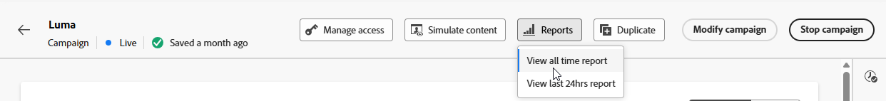

# Rapporto campagna attività live {#campaign-global-report-cja-activity}

>[!BEGINSHADEBOX]

Puoi accedere al report della campagna di attività live facendo clic sul pulsante **[!UICONTROL Report]** nella campagna e selezionando **[!UICONTROL Visualizza report tutto il tempo]**. [Ulteriori informazioni](report-gs-cja.md)

>[!ENDSHADEBOX]

## Statistiche di invio {#sending-statistics-mobile}

La tabella **[!UICONTROL Statistiche di invio]** fornisce una panoramica dettagliata delle metriche chiave relative alle campagne Live Activity. Visualizza informazioni essenziali come le dimensioni del pubblico target e il numero di notifiche push inviate correttamente, consentendoti di valutare la portata e le prestazioni complessive delle notifiche push live.

+++ Ulteriori informazioni sull’invio di metriche delle statistiche

* **[!UICONTROL Destinati]**: numero di profili qualificati per il pubblico prima dell&#39;applicazione di esclusioni, eliminazioni o rimozioni del consenso.

* **[!UICONTROL Invii]**: numero totale di notifiche push tentate da inviare ai profili di destinazione.

* **[!UICONTROL Recapitato]**: numero di notifiche push recapitate correttamente ai dispositivi, rispetto al numero totale di tentativi di invio.

* **[!UICONTROL Errori di invio]**: numero totale di notifiche push che non è stato possibile inviare a causa di errori (ad esempio, token non validi o problemi di connettività).

* **[!UICONTROL Inviare esclusioni]**: numero di profili esclusi dall&#39;invio da parte di Adobe Journey Optimizer (ad esempio, a causa dello stato di rinuncia o delle regole di idoneità).

+++

## Ciclo di vita dell’attività live {#lifecycle}

La tabella **[!UICONTROL Ciclo di vita attività in tempo reale]** offre una panoramica completa dell&#39;avanzamento delle attività in tempo reale nel tempo. Fornisce visibilità sugli eventi chiave, ad esempio quando le attività vengono avviate, aggiornate o terminate, consentendoti di comprendere meglio il coinvolgimento degli utenti e il ciclo di vita complessivo delle campagne di attività Live.

Il reporting varia a seconda che si utilizzino campagne transazionali o di marketing.

### Attività live transazionali

Per la campagna transazionale, il rapporto della campagna Attività live mostra tutti gli eventi del ciclo di vita, inclusi gli avvii remoti, gli avvii locali, gli aggiornamenti e le fine.

+++ Ulteriori informazioni sulle metriche del ciclo di vita delle attività live con le campagne transazionali

* **[!UICONTROL Avvii remoti]**: numero totale di eventi di avvio di attività live avviati in remoto, in genere attivati dal server o dai sistemi back-end.

* **[!UICONTROL Avvii locali]**: numero totale di eventi di avvio di attività live avviati localmente sul dispositivo di un utente, spesso risultanti da interazione dell&#39;utente o da attivatori lato client.

* **[!UICONTROL Aggiornamenti]**: numero totale di aggiornamenti delle attività live inviati ai dispositivi. Gli aggiornamenti possono includere modifiche di stato, nuovo contenuto o notifiche di avanzamento.

* **[!UICONTROL Fine]**: numero totale di eventi di fine attività Live inviati ai dispositivi.

* **[!UICONTROL Conteggio totali]**: totale complessivo di tutti gli eventi del ciclo di vita dell&#39;attività Live, inclusi gli inizi, gli aggiornamenti e le fine, che fornisce una misura completa del volume dell&#39;attività Live.

+++

### Marketing Attività live

Le campagne di marketing utilizzano le attività live per casi di utilizzo di trasmissione, inviando aggiornamenti a più dispositivi contemporaneamente.

Per le attività iOS Live nelle campagne di marketing, il rapporto mostra solo **[!UICONTROL eventi di avvio remoto]** e **[!UICONTROL errori di avvio remoto]** all&#39;avvio. Gli eventi **[!UICONTROL Aggiornamenti]** e **[!UICONTROL Fine]** non vengono tracciati perché APNs distribuisce gli aggiornamenti a tutti i dispositivi senza fornire feedback. Per visualizzare **[!UICONTROL Aggiornamenti]** e **[!UICONTROL Fine]** eventi, utilizza [la console Notifiche push di Apple](https://developer.apple.com/notifications/push-notifications-console/).

+++ Ulteriori informazioni sulle metriche del ciclo di vita delle attività live con le campagne di marketing

* **[!UICONTROL Avvii remoti]**: numero totale di eventi di avvio di attività live avviati in remoto, in genere attivati dal server o dai sistemi back-end.

* **[!UICONTROL Errori di avvio remoto]**: numero totale di errori che si sono verificati durante il tentativo di avviare le attività Live in remoto (ad esempio, token non validi o problemi di connettività).

+++

## Motivi di errore {#error-reasons}

La tabella **[!UICONTROL Motivi di errore]** ti consente di identificare gli errori specifici che si sono verificati durante il processo di invio delle attività live, semplificando un&#39;analisi approfondita di eventuali problemi riscontrati.

## Motivi di esclusione {#excluded-reasons}

La tabella **[!UICONTROL Motivi di esclusione]** illustra visivamente i diversi fattori che hanno portato all&#39;esclusione dei profili utente dal pubblico di destinazione, impedendo loro di ricevere la tua attività live.
