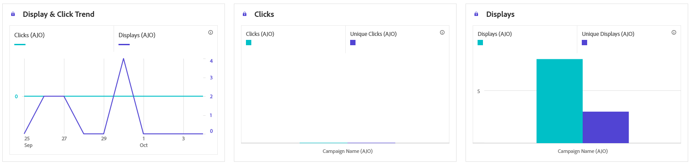
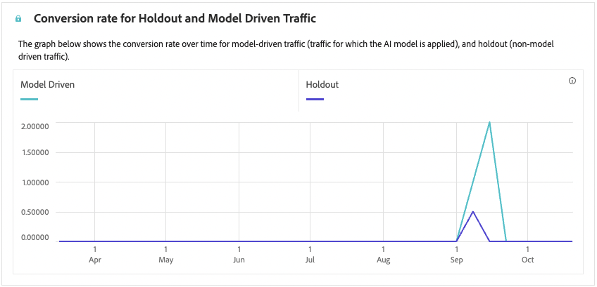

# Rapporto sulla campagna basata su codice {#campaign-global-report-cja-code}

>[!BEGINSHADEBOX]

Puoi accedere al report della campagna basato su codice facendo clic sul pulsante **[!UICONTROL Report]** nella campagna e selezionando **[!UICONTROL Visualizza report tutto il tempo]**. [Ulteriori informazioni](report-gs-cja.md)

>[!ENDSHADEBOX]

>[!NOTE]
>
>Le esperienze basate su codice funzionano come interazioni in entrata in cui gli utenti danno il consenso accedendo al sito o all’app. Di conseguenza, le metriche **Target** o **Pubblico**, che tengono traccia dei profili scelti per la consegna dei messaggi in uscita, non vengono incrementate per le campagne basate su codice.

## Visualizza e fai clic {#impressions-code}

I grafici **[!UICONTROL Visualizza e fai clic]** presentano un&#39;analisi dettagliata del coinvolgimento dei tuoi profili con le esperienze basate sul codice, fornendo informazioni preziose su come i profili interagiscono con i tuoi contenuti.

+++ Ulteriori informazioni sulle metriche Impression e Clic

* **[!UICONTROL Clic univoci]**: numero di profili che hanno fatto clic su un contenuto nelle esperienze.

* **[!UICONTROL Clic]**: numero di volte in cui è stato fatto clic su un contenuto nelle esperienze.

* **[!UICONTROL Visualizzazioni]**: numero di volte in cui è stata aperta l&#39;esperienza.

* **[!UICONTROL Visualizzazioni univoche]**: il numero di volte in cui l&#39;esperienza è stata aperta; non vengono prese in considerazione più interazioni di un profilo.

+++

## Dati di tracciamento {#track-data-code}

La tabella **[!UICONTROL Dati di tracciamento]** offre un&#39;istantanea dettagliata dell&#39;attività di profilo associata alle esperienze basate su codice, fornendo informazioni essenziali sull&#39;efficacia di coinvolgimento ed esperienze.

+++ Ulteriori informazioni sul tracciamento delle metriche dei dati

* **[!UICONTROL Persone]**: numero di profili utente qualificati come profili target per le esperienze.

* **[!UICONTROL Tasso di click-through (CTR)]**: percentuale di utenti che hanno interagito con le esperienze.

* **[!UICONTROL Clic]**: numero di volte in cui è stato fatto clic su un contenuto nelle esperienze.

* **[!UICONTROL Clic univoci]**: numero di profili che hanno fatto clic su un contenuto nelle esperienze.

* **[!UICONTROL Visualizzazioni]**: numero di volte in cui l&#39;esperienza è stata aperta.

* **[!UICONTROL Visualizzazioni univoche]**: il numero di volte in cui l&#39;esperienza è stata aperta, non vengono prese in considerazione più interazioni di un profilo.

+++

## Etichette collegamenti tracciati {#track-link-code}

La tabella **[!UICONTROL Etichette di collegamento tracciate]** offre una panoramica completa delle etichette di collegamento all&#39;interno delle esperienze basate sul codice, evidenziando quelle che generano il traffico più elevato di visitatori. Questa funzione ti consente di identificare e assegnare la priorità ai collegamenti più popolari.

+++ Ulteriori informazioni sulle metriche delle etichette dei collegamenti tracciati

* **[!UICONTROL Clic univoci]**: numero di profili che hanno fatto clic su un contenuto nelle esperienze basate su codice.

* **[!UICONTROL Clic]**: numero di volte in cui è stato fatto clic su un contenuto nelle esperienze basate su codice.

* **[!UICONTROL Visualizzazioni]**: numero di volte in cui è stata aperta l&#39;esperienza.

* **[!UICONTROL Visualizzazioni univoche]**: il numero di volte in cui l&#39;esperienza è stata aperta; non vengono prese in considerazione più interazioni di un profilo.

+++

## Reporting sulle decisioni {#decisioning-reporting}

### Decisioning dei KPI {#decisioning-kpis}

I **KPI decisionali** forniscono informazioni chiave sul coinvolgimento dei visitatori con le esperienze, incluse metriche quali:

* **[!UICONTROL Totale elementi]**: numero totale di singoli elementi che facevano parte di un&#39;esperienza o di un processo decisionale personalizzato entro un periodo specificato.

* **[!UICONTROL Totale visualizzazioni]**:

* **[!UICONTROL Clic totali]**: numero totale di volte in cui gli utenti hanno fatto clic su elementi, collegamenti, prodotti o altri elementi interattivi durante un periodo di tempo specificato.

* **[!UICONTROL Percentuale di fallback]**: percentuale di istanze in cui nessuna strategia di selezione è stata qualificata, con conseguente visualizzazione di un&#39;opzione generica o meno specifica.

### Funnel di coinvolgimento {#engagement-funnel}

La tabella **[!UICONTROL Engagement Funnel]** monitora le prestazioni delle esperienze personalizzate valutando l&#39;efficacia di ogni fase di funnel nelle interazioni degli utenti.

* **[!UICONTROL Visualizzazioni]**: numero totale di volte in cui le esperienze personalizzate sono state mostrate o presentate agli utenti attraverso vari punti di contatto.

* **[!UICONTROL Clic]**: numero totale di volte in cui gli utenti hanno fatto clic su esperienze personalizzate visualizzate.

### Elementi decisionali principali per percentuale di clickthrough {#top-decision}

La tabella **[!UICONTROL Elementi decisionali principali per CTR]** evidenzia le prestazioni dei singoli elementi in base al relativo tasso di click-through. Questa metrica aiuta a valutare quali elementi sono più efficaci nel coinvolgere gli utenti e guidare le interazioni.

* **[!UICONTROL Tasso di click-through (CTR)]**: percentuale di utenti che fanno clic su un collegamento, un annuncio pubblicitario o un consiglio rispetto al numero di volte in cui è stato visualizzato.

### Funnel di coinvolgimento per strategia di selezione {#engagement-funnel-selection}

La tabella **[!UICONTROL Engagement Funnel by Selection Strategy]** consente di monitorare e analizzare l&#39;efficacia con cui le diverse strategie di selezione coinvolgono gli utenti con esperienze personalizzate.

* **[!UICONTROL Visualizzazioni]**: numero totale di volte in cui le esperienze personalizzate sono state mostrate o presentate agli utenti attraverso vari punti di contatto.

* **[!UICONTROL Clic]**: numero totale di volte in cui gli utenti hanno fatto clic su esperienze personalizzate visualizzate.

### Prestazioni degli elementi decisionali {#decision-items-performance}

La tabella **[!UICONTROL Prestazioni degli elementi decisionali]** valuta le prestazioni di ogni elemento nel coinvolgere gli utenti e nell&#39;eseguire le azioni desiderate, ad esempio acquisti, clic o altre risposte.

* **[!UICONTROL Visualizzazioni]**: numero totale di volte in cui le esperienze personalizzate sono state mostrate o presentate agli utenti attraverso vari punti di contatto.

* **[!UICONTROL Clic]**: numero totale di volte in cui gli utenti hanno fatto clic su esperienze personalizzate visualizzate.

### Strategia di classificazione {#ranking-strategy}

>[!NOTE]
>
>La tabella **[!UICONTROL Strategia di classificazione]** diventa disponibile solo quando un [modello AI](../experience-decisioning/ranking/ai-models.md) è incorporato nella campagna. <!--[Learn more](../experience-decisioning/ranking/ranking-formulas.md)-->

La tabella **[!UICONTROL Strategia di classificazione]** fornisce informazioni approfondite sulle prestazioni dei modelli di classificazione basati sull&#39;intelligenza artificiale all&#39;interno di esperienze personalizzate confrontando due tipi di traffico:

* **Basato su modello**: gli utenti ricevono contenuti classificati in base al modello di intelligenza artificiale, ottimizzati per rilevanza e coinvolgimento.

* **Sospensione**: gli utenti ricevono contenuti distribuiti in modo casuale durante la fase di esplorazione del modello.

Le metriche chiave visualizzate includono:

* **[!UICONTROL Visualizzazioni]**: numero totale di volte in cui le esperienze personalizzate sono state mostrate o presentate agli utenti attraverso vari punti di contatto.

* **[!UICONTROL Clic]**: numero totale di volte in cui gli utenti hanno fatto clic su esperienze personalizzate visualizzate.

* **[!UICONTROL Tasso di conversione]**: percentuale di visualizzazioni che hanno generato azioni dell&#39;utente (ad esempio clic), a indicare il successo del modello nel coinvolgere gli utenti.

>[!NOTE]
>
>Attualmente il rapporto [Lift Measurement](../experience-decisioning/ranking/auto-optimization-model.md#lift) è disponibile solo per il modello di intelligenza artificiale [Personalized optimization](../experience-decisioning/ranking/personalized-optimization-model.md). Se hai bisogno di rapporti sulla misurazione dell’incremento, utilizza invece il modello di ottimizzazione personalizzata.

### Tasso di conversione per il traffico di attesa e basato su modello {#conversion-rate}

>[!NOTE]
>
>Il grafico **[!UICONTROL Tasso di conversione per blocco e traffico basato su modello]** diventa disponibile solo quando un [modello di IA](../experience-decisioning/ranking/ai-models.md) è incorporato nella campagna. <!--[Learn more](../experience-decisioning/ranking/ranking-formulas.md)-->

Il grafico **[!UICONTROL Tasso di conversione per il traffico di attesa e basato su modello]** mostra il tasso di conversione nel tempo per due tipi di traffico:

* **Basato su modello**: gli utenti ricevono contenuti classificati in base al modello di intelligenza artificiale, ottimizzati per rilevanza e coinvolgimento.

* **Sospensione**: gli utenti ricevono contenuti distribuiti in modo casuale durante la fase di esplorazione del modello.

>[!CAUTION]
>
>Quando si utilizza un modello di IA incorporato in una [formula di classificazione](../experience-decisioning/ranking/ranking-formulas.md), i dati non vengono rispecchiati nel report del tasso di conversione.
