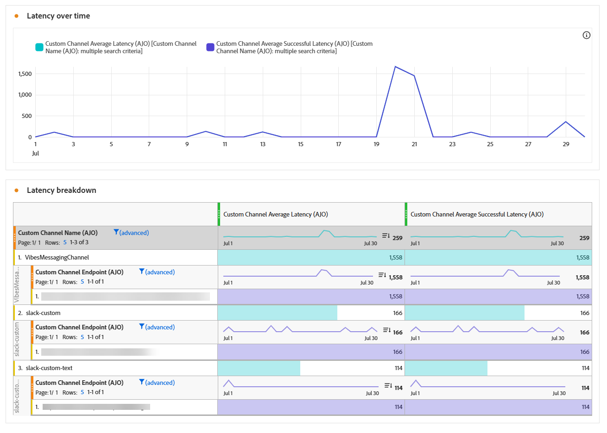

# Rapporto campagna canale personalizzato {#campaign-global-report-cja-custom-channel}

>[!BEGINSHADEBOX]

**In questa pagina:** scopri come leggere il rapporto della campagna per canali personalizzati in Adobe Journey Optimizer per esaminare KPI, esiti, latenza e raggruppamento dei risultati per le chiamate al canale personalizzate.

>[!ENDSHADEBOX]

>[!BEGINSHADEBOX]

Per accedere al report della campagna per il canale personalizzato, fai clic sul pulsante **[!UICONTROL Report]** nella campagna e seleziona **[!UICONTROL Visualizza report tutto il tempo]**. [Ulteriori informazioni](report-gs-cja.md)

>[!ENDSHADEBOX]

## KPI {#kpis-custom}

La sezione **[!UICONTROL KPI]** fornisce una visualizzazione consolidata dello stato operativo e dell&#39;affidabilità delle chiamate al canale personalizzate.

+++ Ulteriori informazioni sulle metriche dei KPI

* **[!UICONTROL Chiamate riuscite]**: numero totale di chiamate HTTP che hanno restituito una risposta valida senza errori.

* **[!UICONTROL 4xx errori]**: numero di chiamate non riuscite a causa di errori lato client, evidenziando problemi di configurazione o errori dell&#39;endpoint.

* **[!UICONTROL 5xx errori]**: numero di chiamate non riuscite a causa di errori sul lato server, evidenziando problemi di configurazione o errori dell&#39;endpoint.

* **[!UICONTROL Chiamate di timeout]**: numero di chiamate non riuscite perché hanno superato il tempo di risposta massimo. Questo aiuta a far emergere problemi di latenza o prestazioni con gli endpoint esterni.

* **[!UICONTROL Errori pre-chiamata]**: numero di invii di canali personalizzati non riusciti prima che la chiamata HTTP fosse stata effettuata all&#39;endpoint esterno. Questi errori si verificano nel livello di infrastruttura di [!DNL Journey Optimizer], non nel sistema esterno, e includono errori di autenticazione, errori di generazione delle richieste ed errori di analisi HTTP.

* **[!UICONTROL Latenza media]**: tempo medio di risposta end-to-end (in millisecondi) per tutte le chiamate HTTP, incluse le chiamate riuscite, gli errori e i timeout.

+++

## Risultati di canale personalizzati {#outcomes-custom}

Il grafico **[!UICONTROL Risultati]** mostra la tendenza dell&#39;indicatore KPI per le chiamate HTTP nel periodo di tempo selezionato, con una granularità che dipende dall&#39;intervallo di tempo selezionato (al giorno per un report di 7 giorni, all&#39;ora per un intervallo di tempo di 1 giorno o al minuto per un intervallo di tempo di 1 ora), mentre la tabella **[!UICONTROL Analisi stratificata risultati]** fornisce una suddivisione gerarchica di queste metriche per le chiamate HTTP, dalle metriche globali per endpoint al livello superiore, alle metriche per canale personalizzato che utilizzano tale endpoint, fino alle campagne e ai percorsi che si basano su di esse al livello inferiore.

+++ Ulteriori informazioni sulle metriche di suddivisione dei risultati

* **[!UICONTROL Canale personalizzato completato]**: numero totale di chiamate HTTP che hanno restituito una risposta valida senza errori.

* **[!UICONTROL 4xx errori]**: numero di chiamate non riuscite a causa di errori lato client, evidenziando problemi di configurazione o errori dell&#39;endpoint.

* **[!UICONTROL 5xx errori]**: numero di chiamate non riuscite a causa di errori sul lato server, evidenziando problemi di configurazione o errori dell&#39;endpoint.

* **[!UICONTROL Chiamate di timeout]**: numero di chiamate non riuscite perché hanno superato il tempo di risposta massimo. Questo aiuta a far emergere problemi di latenza o prestazioni con gli endpoint esterni.

* **[!UICONTROL Errori pre-chiamata]**: numero di invii di canali personalizzati non riusciti prima che la chiamata HTTP fosse stata effettuata all&#39;endpoint esterno. Questi errori si verificano nel livello di infrastruttura di [!DNL Journey Optimizer], non nel sistema esterno, e includono errori di autenticazione, errori di generazione delle richieste ed errori di analisi HTTP.

* **[!UICONTROL Chiamate]**: numero totale di chiamate HTTP, incluse chiamate riuscite, errori e timeout.

+++

## Latenza {#latency-custom}

Il grafico e le tabelle **[!UICONTROL Latenza]** visualizzano la tendenza delle metriche di latenza. Queste viste consentono di tenere traccia dei modelli di prestazioni, identificare i periodi di latenza di picco e monitorare l’impatto delle ottimizzazioni o delle modifiche al sistema nel tempo.

+++ Ulteriori informazioni sulle metriche della latenza

* **[!UICONTROL Latenza media]**: tempo medio di risposta end-to-end (in millisecondi) per tutte le chiamate HTTP, incluse le chiamate riuscite, gli errori e i timeout.

* **[!UICONTROL Latenza media riuscita]**: tempo medio di risposta end-to-end (in millisecondi) per le chiamate HTTP che hanno restituito una risposta valida senza errori.

+++
