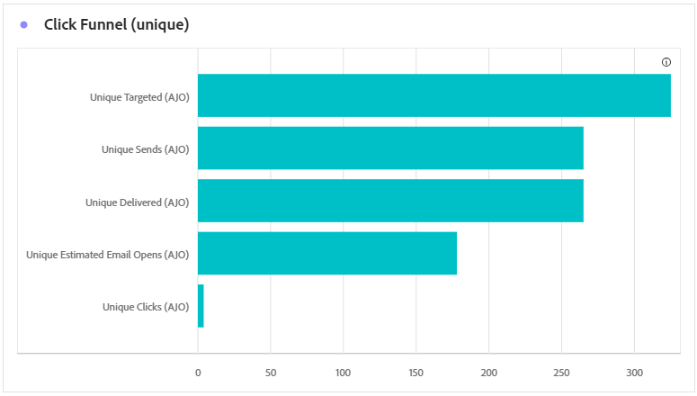
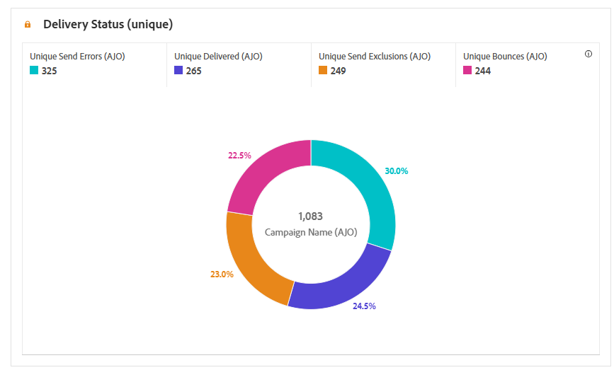
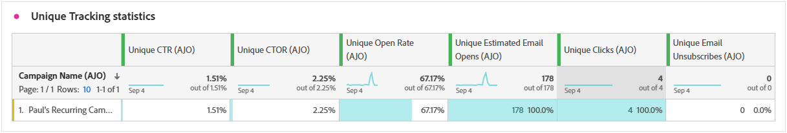
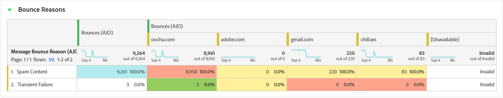

# Rapporto sulla campagna e-mail {#campaign-global-report-cja-email}

>[!INFO]
>
>Poiché Apple ha introdotto nuove funzioni di protezione della privacy per la sua app Mail nativa, tra cui Protezione privacy della posta, i mittenti non possono più utilizzare i pixel di tracciamento per raccogliere dati sui profili che hanno abilitato la Protezione della privacy della posta di Apple. Di conseguenza, potrebbe essere influenzata la capacità di Adobe Journey Optimizer di tenere traccia delle aperture delle e-mail utilizzando i pixel di tracciamento.
> [Ulteriori informazioni](https://experienceleaguecommunities.adobe.com/t5/adobe-campaign-classic-blogs/the-impact-of-apple-ios-privacy-changes-on-email-marketing-and/ba-p/699780?profile.language=it) sull&#39;impatto delle modifiche alla privacy di Apple iOS sul marketing via e-mail.
> 
> Per informazioni più precise, consigliamo di concentrarti sui clic e sulle metriche di conversione invece dei tassi di apertura.

>[!BEGINSHADEBOX]

Per accedere al report della campagna e-mail, fai clic sul pulsante **[!UICONTROL Report]** nella campagna e seleziona **[!UICONTROL Visualizza report completo]**. [Ulteriori informazioni](report-gs-cja.md)

>[!ENDSHADEBOX]

## KPI e-mail

Gli indicatori di prestazioni chiave (KPI, Key Performance Indicators) **[!UICONTROL E-mail]** forniscono un dashboard mirato di metriche univoche e aggregate che riflettono i livelli di prestazioni e coinvolgimento delle campagne e-mail.

+++ Ulteriori informazioni sulle metriche dei KPI e-mail

* **[!UICONTROL Tasso di click-through univoco]**: percentuale di profili univoci che hanno fatto clic su almeno un collegamento nell&#39;e-mail, rispetto al numero di e-mail consegnate univoche.

* **[!UICONTROL Percentuale di apertura dei clic]**: percentuale di profili che hanno interagito con il messaggio.

* **[!UICONTROL Percentuale aperture univoche]**: percentuale di profili univoci che hanno aperto l&#39;e-mail almeno una volta, rispetto al numero di e-mail consegnate univoche.

* **[!UICONTROL Percentuale non recapitate univoche]**: percentuale di profili univoci la cui e-mail è stata recapitata almeno una volta, in base al numero totale di invii univoci.

* **[!UICONTROL Recapitato]**: numero di e-mail inviate correttamente, in relazione al numero totale di messaggi inviati.

* **[!UICONTROL Consegna univoca]**: numero di profili univoci che hanno ricevuto almeno un messaggio.

* **[!UICONTROL Aperture stimate]**: stima del totale delle aperture e-mail che tiene conto sia delle aperture dirette dai profili che delle aperture automatizzate attivate dai server di posta. Questa metrica regola le aperture attivate dai server di posta per l’analisi della privacy o della sicurezza applicando una percentuale di apertura calcolata dai destinatari che hanno aperto manualmente l’e-mail a quelli le cui e-mail sono state aperte solo dai server di posta.

* **[!UICONTROL Aperture stimate univoche]**: stima del numero di destinatari e-mail univoci che probabilmente hanno aperto l&#39;e-mail. Questa metrica mira a fornire un conteggio più accurato del coinvolgimento individuale attivato dai server di posta per la scansione della privacy o della sicurezza applicando un tasso di apertura univoco calcolato da profili univoci che hanno aperto manualmente l’e-mail a coloro i cui messaggi e-mail sono stati aperti solo dai server di posta.

* **[!UICONTROL Clic]**: numero totale di volte in cui è stato fatto clic su qualsiasi collegamento nel messaggio, inclusi più clic dello stesso profilo.

* **[!UICONTROL Clic univoci]**: numero di profili univoci che hanno fatto clic su un contenuto del messaggio.

+++

## Click funnel univoco

Il grafico di **[!UICONTROL Click funnel]** presenta un&#39;analisi dettagliata del modo in cui i profili coinvolti nel contenuto delle e-mail offrono informazioni utili in ogni fase dell&#39;interazione, dalla consegna ai clic, aiutandoti a comprendere in che modo i messaggi guidano efficacemente il coinvolgimento degli utenti.

+++ Ulteriori informazioni sulle metriche di Click funnel

* **[!UICONTROL Destinazione univoca]**: numero di profili univoci di destinazione durante il processo di invio.

* **[!UICONTROL Invii univoci]**: numero di profili univoci per i quali è stato tentato l&#39;invio di almeno un&#39;e-mail.

* **[!UICONTROL Consegna univoca]**: numero di profili univoci che hanno ricevuto almeno un messaggio.

* **[!UICONTROL Aperture univoche stimate]**: stima del numero di destinatari e-mail univoci che probabilmente hanno aperto l&#39;e-mail. Questa metrica mira a fornire un conteggio più accurato del coinvolgimento individuale attivato dai server di posta per la scansione della privacy o della sicurezza applicando un tasso di apertura univoco calcolato da profili univoci che hanno aperto manualmente l’e-mail a coloro i cui messaggi e-mail sono stati aperti solo dai server di posta.

* **[!UICONTROL Clic univoci]**: numero di profili univoci che hanno fatto clic su un contenuto del messaggio.

+++

## Stato di consegna univoco

Il grafico **[!UICONTROL Stato consegna]** fornisce una visualizzazione completa dei dati relativi alle e-mail inviate nella campagna, offrendo informazioni approfondite sulle metriche chiave, ad esempio consegnate e non recapitate. Ciò consente un’analisi dettagliata del processo di invio delle e-mail, fornendo informazioni preziose sull’efficienza e le prestazioni delle campagne.

+++ Ulteriori informazioni sulle metriche dello stato della consegna

* **[!UICONTROL Errori di invio univoci]**: numero di profili univoci che hanno riscontrato almeno un errore di invio durante il processo in uscita.

* **[!UICONTROL Consegna univoca]**: numero di profili univoci che hanno ricevuto almeno un messaggio.

* **[!UICONTROL Esclusioni di invio univoche]**: numero di profili univoci esclusi dalla ricezione dei messaggi a causa di regole o criteri di pubblico predefiniti.

* **[!UICONTROL Messaggi non recapitati univoci]**: numero di profili univoci per i quali almeno un messaggio è stato recapitato durante il processo di invio.

+++

## Tendenza consegne e clic {#delivered-click}

Il grafico **[!UICONTROL Tendenza consegna vs clic]** presenta un&#39;analisi dettagliata del coinvolgimento dei tuoi profili con le e-mail, fornendo informazioni utili sul modo in cui i profili interagiscono con il contenuto. Il grafico utilizza due assi per mostrare le e-mail consegnate e i clic uno accanto all’altro, semplificando l’individuazione di pattern insoliti o modifiche nel coinvolgimento rispetto al numero di e-mail inviate.

+++ Ulteriori informazioni sulle metriche di tendenza Consegne e Clic

* **[!UICONTROL Recapitato]**: numero di e-mail inviate correttamente rispetto al numero totale di e-mail inviate.

* **[!UICONTROL Clic]**: numero di volte in cui è stato fatto clic su un contenuto nelle e-mail.

+++

## Statistiche di invio univoche {#unique-sending-statistics-email}

La tabella **[!UICONTROL Statistiche di invio univoche]** presenta una panoramica dettagliata delle metriche delle prestazioni delle e-mail univoche nelle campagne. Si concentra su singoli profili, come ad esempio quelli mirati in modo univoco, consegnati, non recapitati o esclusi, fornendo informazioni più approfondite su come le e-mail raggiungono e coinvolgono il pubblico.

+++ Ulteriori informazioni sulle metriche delle statistiche di invio univoche

* **[!UICONTROL Destinazione univoca]**: numero di profili univoci di destinazione durante il processo di invio.

* **[!UICONTROL Invii univoci]**: numero di profili univoci per i quali è stato tentato l&#39;invio di almeno un&#39;e-mail.

* **[!UICONTROL Consegne univoche]**: numero di profili univoci che hanno ricevuto almeno un&#39;e-mail.

* **[!UICONTROL Messaggi non recapitati univoci]**: numero di profili univoci per i quali almeno un&#39;e-mail ha generato un messaggio non recapitato.

* **[!UICONTROL Percentuale non recapitate univoche]**: percentuale di profili univoci la cui e-mail è stata recapitata almeno una volta, in base al numero totale di invii univoci.

* **[!UICONTROL Errori di invio univoci]**: numero di profili univoci che hanno rilevato almeno un errore di invio durante il processo in uscita.

* **[!UICONTROL Esclusioni di invio univoche]**: numero di profili univoci esclusi dalla ricezione dei messaggi a causa di regole di idoneità, segmentazione del pubblico o stato del profilo.

+++

## Statistiche di tracciamento univoche {#unique-tracking-statistics-email}

La tabella **[!UICONTROL Statistiche di tracciamento univoche]** fornisce una visualizzazione mirata del coinvolgimento a livello di profilo con le e-mail nella campagna. Mette in evidenza metriche univoche che offrono informazioni utili sul modo in cui i singoli profili interagiscono con il contenuto delle e-mail in fasi chiave del coinvolgimento.

+++ Ulteriori informazioni sulle metriche delle statistiche di tracciamento

* **[!UICONTROL Tasso CTR (Click-through rate) univoco]**: percentuale di profili univoci che hanno fatto clic su almeno un collegamento nell&#39;e-mail, rispetto al numero di e-mail consegnate univoche.

* **[!UICONTROL Tasso di apertura tramite click-through (CTOR) univoco]**: percentuale di profili univoci che hanno fatto clic su un collegamento dopo l&#39;apertura dell&#39;e-mail, in base alle aperture univoche.

* **[!UICONTROL Percentuale aperture univoche]**: percentuale di profili univoci che hanno aperto l&#39;e-mail almeno una volta, rispetto al numero di e-mail consegnate univoche.

* **[!UICONTROL Clic univoci]**: numero di profili univoci che hanno fatto clic su almeno un contenuto nell&#39;e-mail.

* **[!UICONTROL Aperture e-mail stimate univoche]**: stima del numero di destinatari e-mail univoci che probabilmente hanno aperto l&#39;e-mail. Questa metrica mira a fornire un conteggio più accurato del coinvolgimento individuale attivato dai server di posta per la scansione della privacy o della sicurezza applicando un tasso di apertura univoco calcolato da profili univoci che hanno aperto manualmente l’e-mail a coloro i cui messaggi e-mail sono stati aperti solo dai server di posta.

* **[!UICONTROL Annullamenti iscrizione e-mail univoci]**: numero di profili univoci che hanno fatto clic sul collegamento di annullamento dell&#39;iscrizione nelle e-mail o nella pagina di destinazione associata.

+++

## Statistiche di invio {#sending-statistics-email}

La tabella **[!UICONTROL Statistiche di invio]** fornisce un riepilogo completo dei dati essenziali relativi alle e-mail nelle campagne. Descrive le metriche chiave, ad esempio le interazioni con le e-mail e il numero di e-mail inviate correttamente, fornendo informazioni utili sull’efficacia e la portata delle e-mail e delle campagne.

+++ Ulteriori informazioni sull’invio di metriche delle statistiche

* **[!UICONTROL Destinato]**: numero totale di e-mail elaborate durante il processo di invio.

* **[!UICONTROL Invii]**: numero totale di invii per e-mail.

* **[!UICONTROL Recapitato]**: numero totale di e-mail inviate correttamente, in relazione al numero totale di messaggi inviati.

* **[!UICONTROL Mancati recapiti]**: totale degli errori accumulati durante il processo di invio e l&#39;elaborazione automatica dei resi in relazione al numero totale di messaggi inviati.

* **[!UICONTROL Percentuale non recapitate]**: percentuale di messaggi e-mail che hanno generato un mancato recapito, rispetto al numero totale di messaggi e-mail inviati.

* **[!UICONTROL Errori di invio]**: numero totale di errori che si sono verificati durante il processo di invio e che ne hanno impedito l&#39;invio ai profili.

* **[!UICONTROL Invia esclusioni]**: numero totale di profili esclusi da Adobe Journey Optimizer.

+++

## Statistiche di tracciamento {#tracking-statistics-email}

La tabella **[!UICONTROL E-mail - Statistiche di tracciamento]** offre un account dettagliato dell&#39;attività profilo relativa alle e-mail incluse nella campagna. Ciò include metriche su aperture, clic e altri indicatori di coinvolgimento rilevanti, che offrono una visualizzazione completa del modo in cui i profili interagiscono con il contenuto dell’e-mail.

+++ Ulteriori informazioni sulle metriche delle statistiche di tracciamento

* **[!UICONTROL Tasso di click-through (CTR)]**: percentuale di utenti che hanno interagito con l&#39;e-mail.

* **[!UICONTROL Percentuale di apertura dei clic]**: numero di volte in cui l&#39;e-mail è stata aperta.

* **[!UICONTROL Aperture e-mail stimate]**: stima del totale di aperture e-mail che rappresentano sia aperture dirette da profili che aperture automatizzate attivate dai server di posta. Questa metrica regola le aperture attivate dai server di posta per l’analisi della privacy o della sicurezza applicando una percentuale di apertura calcolata dai destinatari che hanno aperto manualmente l’e-mail a quelli le cui e-mail sono state aperte solo dai server di posta.

* **[!UICONTROL Clic]**: numero di volte in cui è stato fatto clic su un contenuto nelle e-mail.

* **[!UICONTROL Reclami spam]**: numero di volte in cui un messaggio è stato dichiarato come spam o posta indesiderata.

* **[!UICONTROL Annullamenti iscrizione]**: numero di clic sul collegamento di annullamento dell&#39;iscrizione o sulla pagina di destinazione associata.

+++

## Domini e-mail {#email-domains}

La tabella **[!UICONTROL Domini e-mail]** offre una suddivisione approfondita delle e-mail suddivise per dominio, fornendo informazioni approfondite sulle metriche delle prestazioni delle campagne e-mail. Questa analisi completa ti consente di comprendere il comportamento di diversi domini in risposta al contenuto delle e-mail.

+++ Ulteriori informazioni sulle metriche dei domini e-mail

* **[!UICONTROL Consegne univoche]**: numero di profili univoci che hanno ricevuto almeno un&#39;e-mail.

* **[!UICONTROL Aperture e-mail stimate]**: stima del totale di aperture e-mail che rappresentano sia aperture dirette da profili che aperture automatizzate attivate dai server di posta. Questa metrica regola le aperture attivate dai server di posta per l’analisi della privacy o della sicurezza applicando una percentuale di apertura calcolata dai destinatari che hanno aperto manualmente l’e-mail a quelli le cui e-mail sono state aperte solo dai server di posta.

* **[!UICONTROL Clic univoci]**: numero di profili univoci che hanno fatto clic su almeno un contenuto nell&#39;e-mail.

* **[!UICONTROL Messaggi non recapitati univoci]**: numero di profili univoci per i quali almeno un&#39;e-mail ha generato un messaggio non recapitato.

* **[!UICONTROL Errori di invio univoci]**: numero di profili univoci che hanno rilevato almeno un errore di invio durante il processo in uscita.

* **[!UICONTROL Esclusioni di invio univoche]**: numero di profili univoci esclusi dalla ricezione dei messaggi a causa di regole di idoneità, segmentazione del pubblico o stato del profilo.

+++

## Etichette collegamenti tracciati {#track-link-label}

La tabella **[!UICONTROL Etichette di collegamento tracciate]** offre una panoramica completa delle etichette di collegamento all&#39;interno delle e-mail, evidenziando quelle che generano il traffico di visitatori più elevato. Questa funzione ti consente di identificare e assegnare la priorità ai collegamenti più popolari.

+++ Ulteriori informazioni sulle metriche delle etichette dei collegamenti tracciati

* **[!UICONTROL Clic univoci]**: numero di profili che hanno fatto clic su un contenuto in un messaggio e-mail.

* **[!UICONTROL Clic]**: numero di volte in cui è stato fatto clic su un contenuto nelle e-mail.

+++

## URL collegamenti tracciati {#track-link-url}

La tabella **[!UICONTROL URL di collegamento tracciati]** fornisce una panoramica completa degli URL all&#39;interno dell&#39;e-mail che attraggono il traffico più elevato dei visitatori. Questo consente di identificare e assegnare la priorità ai collegamenti più popolari, migliorando la comprensione del coinvolgimento del profilo con contenuti specifici nelle e-mail.

+++ Ulteriori informazioni sulle metriche degli URL di collegamento tracciati

* **[!UICONTROL Clic univoci]**: numero di profili che hanno fatto clic su un contenuto in un messaggio e-mail.

* **[!UICONTROL Clic]**: numero di volte in cui è stato fatto clic su un contenuto nelle e-mail.

+++

## Oggetti e-mail {#email-subjects}

La tabella **[!UICONTROL Oggetti e-mail]** presenta una panoramica completa degli oggetti e-mail che hanno attirato il traffico visitatore più elevato. Questa risorsa offre informazioni preziose sulle dinamiche di coinvolgimento del pubblico.

+++ Ulteriori informazioni sulle metriche degli oggetti e-mail

* **[!UICONTROL Percentuale aperture univoche]**: percentuale di profili univoci che hanno aperto l&#39;e-mail almeno una volta, rispetto al numero di e-mail consegnate univoche.

* **[!UICONTROL Aperture e-mail stimate univoche]**: stima del numero di destinatari e-mail univoci che probabilmente hanno aperto l&#39;e-mail. Questa metrica mira a fornire un conteggio più accurato del coinvolgimento individuale attivato dai server di posta per la scansione della privacy o della sicurezza applicando un tasso di apertura univoco calcolato da profili univoci che hanno aperto manualmente l’e-mail a coloro i cui messaggi e-mail sono stati aperti solo dai server di posta.

* **[!UICONTROL Percentuale di aperture]**: percentuale di aperture delle e-mail rispetto al numero totale di e-mail consegnate, incluse più aperture da parte dello stesso profilo.

* **[!UICONTROL Aperture e-mail stimate]**: stima del totale di aperture e-mail che rappresentano sia aperture dirette da profili che aperture automatizzate attivate dai server di posta. Questa metrica regola le aperture attivate dai server di posta per l’analisi della privacy o della sicurezza applicando una percentuale di apertura calcolata dai destinatari che hanno aperto manualmente l’e-mail a quelli le cui e-mail sono state aperte solo dai server di posta.

+++

## Motivi di esclusione {#excluded-reasons}

La tabella **[!UICONTROL Motivi di esclusione]** presenta una visualizzazione completa dei diversi fattori che hanno determinato l&#39;esclusione dei profili utente dal pubblico di destinazione, causando la mancata ricezione del messaggio.

Per un elenco completo dei motivi di esclusione, consulta [questa pagina](exclusion-list.md).

## Motivi di mancato recapito {#bounce-reasons-email}

La tabella **[!UICONTROL Motivi di mancato recapito]** compila i dati disponibili relativi ai messaggi non recapitati, fornendo informazioni dettagliate sui motivi specifici alla base dei mancati recapiti e-mail.

Per ulteriori informazioni sui mancati recapiti, consulta la pagina [Elenco di soppressione](../reports/suppression-list.md).

## Motivi di errore {#error-reasons-email}

La tabella **[!UICONTROL Motivi di errore]** offre visibilità sugli errori specifici che si sono verificati durante il processo di invio, fornendo informazioni utili sulla natura e sulla ricorrenza degli errori.
