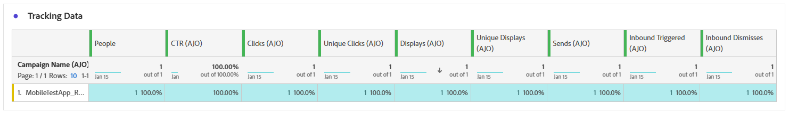

# Rapporto sulla campagna in-app {#campaign-global-report-cja-inapp}

>[!IMPORTANT]
>
>Prima di creare rapporti sulle campagne e i percorsi in-app, assicurati di seguire i prerequisiti per la generazione di rapporti forniti in [questa pagina](../in-app/inapp-configuration.md#experiment-prerequisites).

>[!BEGINSHADEBOX]

Per accedere al report della campagna in-app, fai clic sul pulsante **[!UICONTROL Reports]** nella campagna e seleziona **[!UICONTROL Visualizza report tutto il tempo]**. [Ulteriori informazioni](report-gs-cja.md)

>[!ENDSHADEBOX]

## Tendenza di visualizzazione e clic {#impression-click-trend}

Il grafico **[!UICONTROL Tendenza impression e clic]** presenta un&#39;analisi dettagliata del coinvolgimento dei tuoi profili con i messaggi in-app, fornendo informazioni preziose su come i profili interagiscono con i contenuti.

+++ Ulteriori informazioni sulle metriche della tendenza Impression &amp; Click

* **[!UICONTROL Clic]**: numero di volte in cui l&#39;utente ha interagito con i messaggi in-app.

* **[!UICONTROL Visualizzazioni]**: numero di volte in cui il messaggio in-app è stato visualizzato all&#39;utente.

+++

## Clic {#clicks-inapp}

Il grafico **[!UICONTROL Clic]** visualizza le metriche di clic in-app, illustrando sia il numero totale di clic sul contenuto che il numero di profili univoci che hanno fatto clic sul contenuto.

+++ Ulteriori informazioni sulle metriche Clic

* **[!UICONTROL Clic univoci]**: numero di profili che hanno fatto clic su un contenuto nei messaggi in-app

* **[!UICONTROL Clic]**: numero di volte in cui l&#39;utente ha interagito con i messaggi in-app.

+++

## Visualizzazione {#display-inapp}

Il grafico **[!UICONTROL Displays]** ti aiuta a comprendere sia la portata complessiva del messaggio che il numero di profili univoci coinvolti con esso.

+++ Ulteriori informazioni sulle metriche di visualizzazione

* **[!UICONTROL Visualizzazioni]**: numero di volte in cui il messaggio in-app è stato visualizzato all&#39;utente.

* **[!UICONTROL Visualizzazioni univoche]**: il numero di volte in cui il messaggio è stato aperto; non vengono prese in considerazione più interazioni di un profilo.

+++

## Dati di tracciamento {#tracking-data-inapp}

La tabella **[!UICONTROL Dati di tracciamento]** offre un&#39;istantanea dettagliata dell&#39;attività del profilo associata ai messaggi in-app, fornendo informazioni essenziali sull&#39;efficacia del coinvolgimento e dei messaggi in-app.

+++ Ulteriori informazioni sul tracciamento delle metriche dei dati

* **[!UICONTROL Persone]**: numero di profili utente idonei come profili di destinazione per i messaggi in-app.

* **[!UICONTROL Tasso di click-through (CTR)]**: percentuale di utenti che hanno interagito con i messaggi in-app.

* **[!UICONTROL Percentuale di apertura dei clic]**: numero di volte in cui i messaggi in-app sono stati aperti.

* **[!UICONTROL Clic]**: numero di volte in cui l&#39;utente ha interagito con i messaggi in-app.

* **[!UICONTROL Clic univoci]**: numero di profili che hanno fatto clic su un contenuto nei messaggi in-app.

* **[!UICONTROL Visualizzazioni]**: numero di volte in cui il messaggio in-app è stato visualizzato all&#39;utente.

* **[!UICONTROL Visualizzazioni univoche]**: il numero di volte in cui il messaggio è stato aperto; non vengono prese in considerazione più interazioni di un profilo.

* **[!UICONTROL Invii]**: numero di volte che l&#39;app ha richiesto la campagna in-app. Più richieste per sessione utente (ad esempio, al momento del lancio o del ricaricamento) possono causare il superamento del numero di utenti univoci se i dati della campagna non sono memorizzati nella cache.

* **[!UICONTROL Attivazione in entrata]**: numero di volte che l&#39;app ha considerato di visualizzare il messaggio in-app. Questo numero può essere inferiore al totale degli invii se le regole lato app impediscono la visualizzazione del messaggio.

* **[!UICONTROL Messaggi in entrata ignorati]**: numero di volte in cui gli utenti hanno ignorato il messaggio in-app senza interagire con esso.

+++

## Etichette collegamenti tracciati {#track-link-label-inapp}

La tabella **[!UICONTROL Etichette di collegamento tracciate]** offre una panoramica completa delle etichette di collegamento all&#39;interno dei messaggi in-app, evidenziando quelle che generano il traffico di visitatori più elevato. Questa funzione ti consente di identificare e assegnare la priorità ai collegamenti più popolari.

+++ Ulteriori informazioni sulle metriche delle etichette dei collegamenti tracciati

* **[!UICONTROL Clic univoci]**: numero di profili che hanno fatto clic su un contenuto nei messaggi in-app.

* **[!UICONTROL Clic]**: numero di volte in cui l&#39;utente ha interagito con i messaggi in-app.

* **[!UICONTROL Visualizzazioni]**: numero di volte in cui il messaggio in-app è stato visualizzato all&#39;utente.

* **[!UICONTROL Visualizzazioni univoche]**: il numero di volte in cui il messaggio è stato aperto; non vengono prese in considerazione più interazioni di un profilo.

+++

## URL collegamenti tracciati {#track-link-url-inapp}

La tabella **[!UICONTROL URL di collegamento tracciati]** fornisce una panoramica completa degli URL all&#39;interno dei messaggi in-app che attraggono il traffico più elevato di visitatori. Questo consente di identificare e assegnare la priorità ai collegamenti più popolari, migliorando la comprensione del coinvolgimento del profilo con contenuti specifici nei messaggi in-app.

+++ Ulteriori informazioni sulle metriche degli URL di collegamento tracciati

* **[!UICONTROL Clic univoci]**: numero di profili che hanno fatto clic su un contenuto nei messaggi in-app.

* **[!UICONTROL Clic]**: numero di volte in cui l&#39;utente ha interagito con i messaggi in-app.

+++
