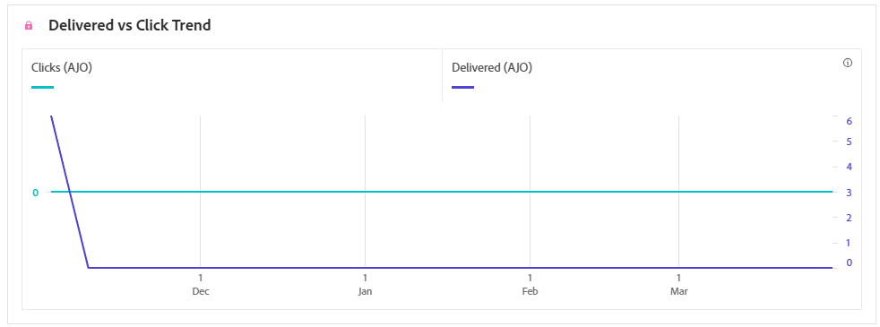
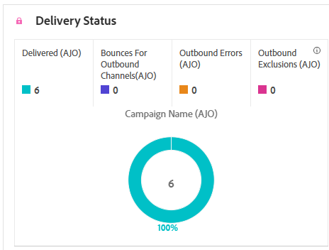

# Rapporto sulla campagna SMS {#campaign-global-report-cja-sms}

>[!BEGINSHADEBOX]

Per accedere al report della campagna SMS, fai clic sul pulsante **[!UICONTROL Report]** nella campagna e seleziona **[!UICONTROL Visualizza report completo]**. [Ulteriori informazioni](report-gs-cja.md)

>[!ENDSHADEBOX]

## Tendenza consegne e clic {#delivered-click-sms}

Il grafico **[!UICONTROL Tendenza consegna vs clic]** presenta un&#39;analisi dettagliata del coinvolgimento dei tuoi profili con le e-mail, fornendo informazioni utili sul modo in cui i profili interagiscono con il contenuto.

+++ Ulteriori informazioni sulle metriche di tendenza Consegne e Clic

* **[!UICONTROL Recapitato]**: numero di messaggi SMS inviati correttamente, in relazione al numero totale di messaggi SMS.

* **[!UICONTROL Clic]**: numero di volte in cui è stato fatto clic su un contenuto nei messaggi SMS.

+++

## Stato consegna {#delivery-status-sms}

La tabella **[!UICONTROL Stato consegna]** offre un account dettagliato dell&#39;attività del profilo correlata alle campagne SMS. Ciò include metriche su consegnati, clic e altri indicatori di coinvolgimento rilevanti, che offrono una panoramica completa del modo in cui i profili interagiscono con il contenuto SMS.

+++ Ulteriori informazioni sulle metriche dello stato della consegna

* **[!UICONTROL Recapitato]**: numero di messaggi SMS inviati correttamente, in relazione al numero totale di messaggi SMS.

* **[!UICONTROL Mancati recapiti per i canali in uscita]**: totale degli errori accumulati durante il processo di invio e l&#39;elaborazione automatica dei resi in relazione al numero totale di messaggi SMS inviati.

* **[!UICONTROL Errori in uscita]**: numero totale di errori che ne impediscono l&#39;invio ai profili.

* **[!UICONTROL Esclusioni in uscita]**: numero di profili esclusi da Adobe Journey Optimizer.

+++

## Etichette collegamenti tracciati {#track-link-label-sms}

La tabella **[!UICONTROL Etichette di collegamento tracciate]** offre una panoramica completa delle etichette di collegamento all&#39;interno dei messaggi SMS, evidenziando quelle che generano il traffico di visitatori più elevato. Questa funzione ti consente di identificare e assegnare la priorità ai collegamenti più popolari.

+++ Ulteriori informazioni sulle metriche delle etichette dei collegamenti tracciati

* **[!UICONTROL Clic univoci]**: numero di profili che hanno fatto clic su un contenuto nel messaggio SMS.

* **[!UICONTROL Clic]**: numero di volte in cui è stato fatto clic su un contenuto nei messaggi SMS.

+++

## URL collegamenti tracciati {#track-link-url-sms}

La tabella **[!UICONTROL URL di collegamento tracciati]** fornisce una panoramica completa degli URL all&#39;interno dei messaggi SMS che attraggono il traffico più elevato dei visitatori. Questo consente di identificare e assegnare la priorità ai collegamenti più popolari, migliorando la comprensione del coinvolgimento del profilo con contenuti specifici nei messaggi SMS.

+++ Ulteriori informazioni sulle metriche degli URL di collegamento tracciati

* **[!UICONTROL Clic univoci]**: numero di profili che hanno fatto clic su un contenuto nel messaggio SMS.

* **[!UICONTROL Clic]**: numero di volte in cui è stato fatto clic su un contenuto nei messaggi SMS.

* **[!UICONTROL Visualizzazioni]**: numero di volte in cui il messaggio è stato aperto.

* **[!UICONTROL Visualizzazioni univoche]**: il numero di volte in cui il messaggio è stato aperto; non vengono prese in considerazione più interazioni di un profilo.

+++

## Messaggio SMS in entrata {#sms-inbound}

La tabella **[!UICONTROL Messaggio SMS in entrata]** presenta una panoramica completa dei messaggi SMS che hanno attirato il traffico più elevato. Questa risorsa offre informazioni preziose sulle dinamiche di coinvolgimento del pubblico.

+++ Ulteriori informazioni sulle metriche dei messaggi SMS in entrata

* **[!UICONTROL Persone]**: numero di profili utente qualificati come profili target per i messaggi SMS.

+++

## Tipo di messaggio SMS {#sms-message-type}

La tabella **[!UICONTROL Tipo di messaggio SMS]** presenta una panoramica completa del tipo di messaggio SMS che ha attirato il traffico più elevato. Questa risorsa offre informazioni preziose sulle dinamiche di coinvolgimento del pubblico.

+++ Ulteriori informazioni sulle metriche del tipo di messaggio SMS

* **[!UICONTROL Persone]**: numero di profili utente qualificati come profili target per i messaggi SMS.

+++

## Provider SMS {#sms-providers}

La tabella **[!UICONTROL Provider SMS]** presenta una panoramica completa dei provider SMS che hanno attirato il traffico più elevato. Questa risorsa offre informazioni preziose sulle dinamiche di coinvolgimento del pubblico.

+++ Ulteriori informazioni sulle metriche dei provider SMS

* **[!UICONTROL Persone]**: numero di profili utente qualificati come profili target per i messaggi SMS.

+++

## Motivi di mancato recapito {#bounce-reasons-sms}

La tabella **[!UICONTROL Motivi di mancato recapito]** fornisce una panoramica completa dei dati relativi ai messaggi SMS non recapitati, fornendo informazioni utili sulle ragioni specifiche alla base delle istanze di mancato recapito dei messaggi SMS.

## Motivi di errore {#error-reasons-sms}

La tabella **[!UICONTROL Motivi di errore]** consente di identificare gli errori specifici che si sono verificati durante il processo di invio dei messaggi SMS, facilitando un&#39;analisi approfondita di eventuali problemi riscontrati.

## Motivi di esclusione {#excluded-reasons-sms}

La tabella **[!UICONTROL Escludi motivi]** mostra visivamente i diversi fattori che hanno portato all&#39;esclusione dei profili utente dal pubblico di destinazione, impedendo loro di ricevere i messaggi SMS.

Per un elenco completo dei motivi di esclusione, consulta [questa pagina](exclusion-list.md).
