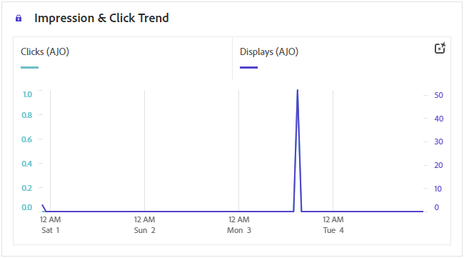

# Rapporto campagna web {#campaign-global-report-cja-web}

## Tendenza impression e clic {#impressions-web}

Il grafico **[!UICONTROL Tendenza impression e clic]** presenta un&#39;analisi dettagliata del coinvolgimento dei profili con le pagine Web, fornendo informazioni utili sul modo in cui i profili interagiscono con i contenuti.

+++ Ulteriori informazioni sulle metriche della tendenza Impression &amp; Click

* **[!UICONTROL Clic]**: numero di volte in cui è stato fatto clic su un contenuto nelle pagine Web.

* **[!UICONTROL Visualizzazioni]**: numero di volte in cui il messaggio è stato aperto.

+++

## Clic {#clicks-web}

Il grafico **[!UICONTROL Clic]** visualizza le metriche di clic delle pagine Web, illustrando sia il numero totale di clic sul contenuto che il numero di profili univoci che hanno fatto clic sul contenuto.

+++ Ulteriori informazioni sulle metriche Clic

* **[!UICONTROL Clic univoci]**: numero di profili che hanno fatto clic su un contenuto nelle pagine Web.

* **[!UICONTROL Clic]**: numero di volte in cui è stato fatto clic su un contenuto nelle pagine Web.

+++

## Visualizzazioni {#displays-web}

Il grafico **[!UICONTROL Displays]** ti aiuta a comprendere sia la portata complessiva del messaggio che il numero di profili univoci coinvolti con esso.

+++ Ulteriori informazioni sulle metriche di visualizzazione

* **[!UICONTROL Visualizzazioni]**: numero di volte in cui il messaggio è stato aperto.

* **[!UICONTROL Visualizzazioni univoche]**: il numero di volte in cui il messaggio è stato aperto; non vengono prese in considerazione più interazioni di un profilo.

+++

## Dati di tracciamento {#track-data-web}

La tabella **[!UICONTROL Dati di tracciamento]** offre un&#39;istantanea dettagliata dell&#39;attività di profilo associata alle pagine Web, fornendo informazioni essenziali sull&#39;efficacia del coinvolgimento e delle pagine Web.

+++ Ulteriori informazioni sul tracciamento delle metriche dei dati

* **[!UICONTROL Persone]**: numero di profili utente qualificati come profili target per le pagine Web.

* **[!UICONTROL Tasso di click-through (CTR)]**: percentuale di utenti che hanno interagito con le pagine Web.

* **[!UICONTROL Clic]**: numero di volte in cui è stato fatto clic su un contenuto nelle pagine Web.

* **[!UICONTROL Clic univoci]**: numero di profili che hanno fatto clic su un contenuto nelle pagine Web.

* **[!UICONTROL Visualizzazioni]**: numero di volte in cui la pagina Web è stata aperta.

* **[!UICONTROL Visualizzazioni univoche]**: numero di volte in cui la pagina Web è stata aperta, non vengono prese in considerazione più interazioni di un profilo.

+++

## Etichette collegamenti tracciati {#track-link-web}

La tabella **[!UICONTROL Etichette di collegamento tracciate]** offre una panoramica completa delle etichette di collegamento all&#39;interno delle pagine Web, evidenziando quelle che generano il traffico di visitatori più elevato. Questa funzione ti consente di identificare e assegnare la priorità ai collegamenti più popolari.

+++ Ulteriori informazioni sulle metriche delle etichette dei collegamenti tracciati

* **[!UICONTROL Clic univoci]**: numero di profili che hanno fatto clic su un contenuto nelle pagine Web.

* **[!UICONTROL Clic]**: numero di volte in cui è stato fatto clic su un contenuto nelle pagine Web.

* **[!UICONTROL Visualizzazioni]**: numero di volte in cui il messaggio è stato aperto.

* **[!UICONTROL Visualizzazioni univoche]**: il numero di volte in cui il messaggio è stato aperto; non vengono prese in considerazione più interazioni di un profilo.

+++

## URL collegamenti tracciati {#track-url-web}

La tabella **[!UICONTROL URL di collegamento tracciati]** fornisce una panoramica completa degli URL all&#39;interno delle pagine Web che attirano il traffico più elevato di visitatori. Questo consente di identificare e assegnare la priorità ai collegamenti più popolari, migliorando la comprensione del coinvolgimento del profilo con contenuti specifici nelle pagine web.

+++ Ulteriori informazioni sulle metriche degli URL di collegamento tracciati

* **[!UICONTROL Clic univoci]**: numero di profili che hanno fatto clic su un contenuto nelle pagine Web.

* **[!UICONTROL Clic]**: numero di volte in cui è stato fatto clic su un contenuto nelle pagine Web.

* **[!UICONTROL Visualizzazioni]**: numero di volte in cui il messaggio è stato aperto.

* **[!UICONTROL Visualizzazioni univoche]**: il numero di volte in cui il messaggio è stato aperto; non vengono prese in considerazione più interazioni di un profilo.

+++
