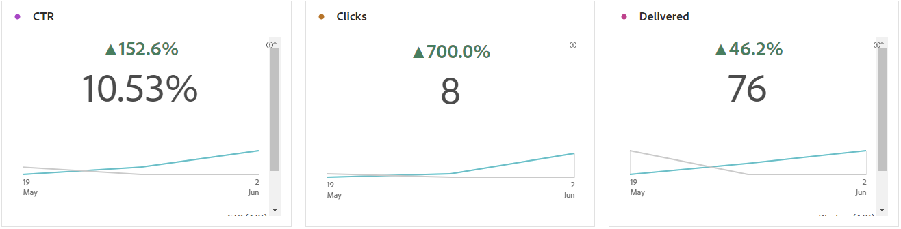
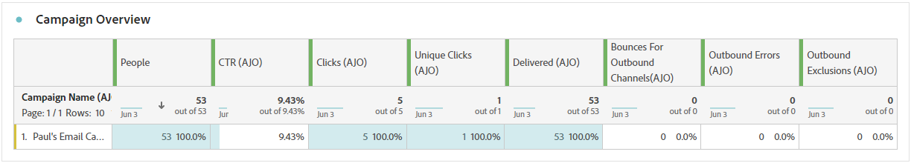
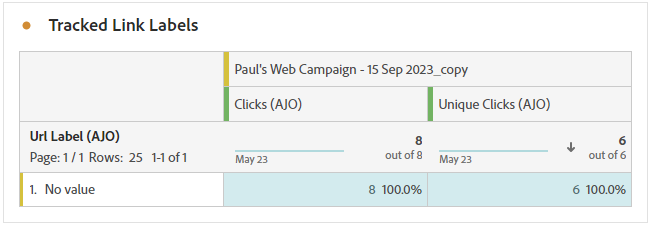

# Rapporto campagna {#campaign-global-report-cja}

>[!BEGINSHADEBOX]

Per accedere al report della campagna, fai clic sul pulsante **[!UICONTROL Reports]** nella campagna e seleziona **[!UICONTROL Visualizza report completo]**. [Ulteriori informazioni](report-gs-cja.md)

>[!ENDSHADEBOX]

## KPI della campagna {#campaign-kpis}

I **[!UICONTROL indicatori di prestazioni chiave (KPI, Key Performance Indicators) di Campaign]** funzionano come dashboard completo che fornisce un&#39;analisi delle metriche essenziali associate alla campagna. Questo include dettagli quali il numero di clic e il numero di messaggi consegnati, offrendo un’insight completa sull’efficacia e il livello di coinvolgimento della tua campagna.

I KPI variano in base ai canali utilizzati nella campagna.

+++ Ulteriori informazioni sulle metriche dei KPI per Campaign

* **[!UICONTROL Percentuale di click-through]**: percentuale di utenti che hanno interagito con il messaggio.

* **[!UICONTROL Clic]**: numero di volte in cui è stato fatto clic su un contenuto nel messaggio.

* **[!UICONTROL Recapitato]**: numero di e-mail inviate correttamente, in relazione al numero totale di messaggi inviati.

* **[!UICONTROL Visualizzazioni]**: numero di volte in cui il messaggio è stato aperto.

+++

>[!AVAILABILITY]
>Le campagne orchestrate supportano solo i canali SMS, E-mail e push. Altri canali (in-app, web, direct mailing, ecc.) non sono disponibili nelle campagne orchestrate e non vengono visualizzate nella reportistica.

### Panoramica della campagna {#delivery-global}

La tabella **[!UICONTROL Panoramica campagna]** funge da dashboard completo e offre una suddivisione dettagliata delle metriche chiave correlate alla campagna. Ciò include informazioni essenziali come il numero di profili e le azioni consegnate, fornendo una comprensione approfondita delle prestazioni e del coinvolgimento della campagna.

Tieni presente che le metriche variano in base ai canali utilizzati nella campagna.

+++ Ulteriori informazioni sulle metriche della panoramica di Campaign

* **[!UICONTROL Persone]**: numero di profili utente qualificati come profili target per i messaggi.

* **[!UICONTROL Percentuale di click-through]**: percentuale di utenti che hanno interagito con il messaggio.

* **[!UICONTROL Clic]**: numero di volte in cui è stato fatto clic su un contenuto nel messaggio.

* **[!UICONTROL Clic univoci]**: numero di profili che hanno fatto clic su un contenuto del messaggio.

* **[!UICONTROL Recapitato]**: numero di e-mail inviate correttamente, in relazione al numero totale di messaggi inviati.

* **[!UICONTROL Mancati recapiti per i canali in uscita]**: numero totale di errori accumulati durante il processo di invio e l&#39;elaborazione automatica dei resi in relazione al numero totale di messaggi inviati.

* **[!UICONTROL Errori in uscita]**: numero totale di errori che si sono verificati durante il processo di invio e che ne hanno impedito l&#39;invio ai profili.

* **[!UICONTROL Esclusioni in uscita]**: numero di profili esclusi da Adobe Journey Optimizer. [Ulteriori informazioni sul conteggio delle esclusioni](exclusion-list.md#exclusion-list).

* **[!UICONTROL Visualizzazioni]**: numero di volte in cui il messaggio è stato aperto.

* **[!UICONTROL Visualizzazioni univoche]**: il numero di volte in cui il messaggio è stato aperto; non vengono prese in considerazione più interazioni di un profilo.

+++

### Risultati funnel della campagna {#campaign-funnel}

Il grafico dei risultati di **[!UICONTROL Campaign funnel]** presenta un&#39;analisi dettagliata del coinvolgimento dei profili con i messaggi, fornendo informazioni utili sulle interazioni tra vari profili e il contenuto.

+++ Ulteriori informazioni sulle metriche dei risultati di Campaign funnel

* **[!UICONTROL Recapitato]**: numero di e-mail inviate correttamente, in relazione al numero totale di messaggi inviati.

* **[!UICONTROL Clic]**: numero di volte in cui è stato fatto clic su un contenuto nel messaggio.
+++

### Etichetta collegamento tracciato {#campaign-track}

La tabella **[!UICONTROL Tracked link label]** offre informazioni essenziali sul coinvolgimento dei visitatori con gli URL inclusi nei messaggi, fornendo informazioni utili su quali collegamenti attraggono il maggior numero di interazioni.

+++ Ulteriori informazioni sulle metriche delle etichette dei collegamenti tracciati

* **[!UICONTROL Clic univoci]**: numero di profili che hanno fatto clic su un contenuto del messaggio.

* **[!UICONTROL Clic]**: numero di volte in cui è stato fatto clic su un contenuto nel messaggio.

+++

## Panoramica sul targeting {#targeting}

Se imposti **[!UICONTROL Regole di targeting]** per il contenuto, la tabella **[!UICONTROL Panoramica targeting]** fornisce una visualizzazione dettagliata delle metriche chiave di coinvolgimento, mostrando come i profili target per ogni regola interagivano con il contenuto.

➡️ [Ulteriori informazioni sulle regole di targeting](../content-management/optimization-targeting.md)

+++ Ulteriori informazioni sulle metriche di panoramica del targeting

* **[!UICONTROL Persone]**: numero di profili utente qualificati come profili target per i tuoi eventi.

* **[!UICONTROL Clic univoci]**: numero di profili che hanno fatto clic su un contenuto in un messaggio e-mail.

* **[!UICONTROL Percentuale clic univoci]**: percentuale di profili target che hanno fatto clic almeno una volta.

+++
