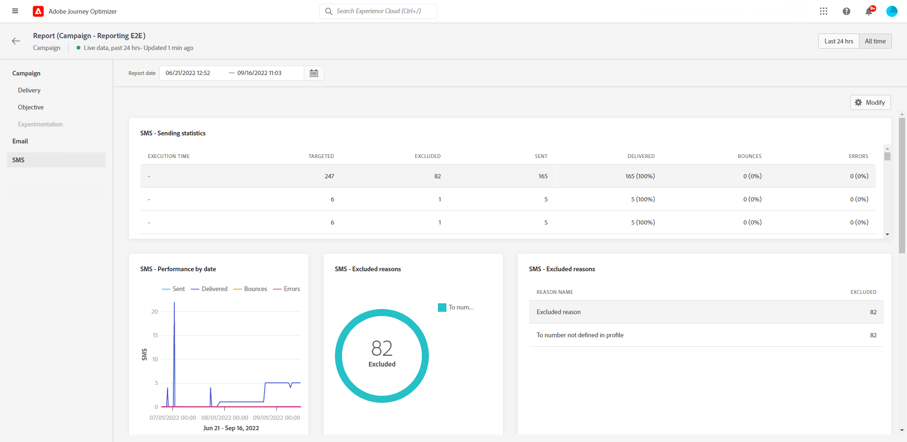

# Rapporto globale della campagna {#campaign-global-report}

>[!CONTEXTUALHELP]
>id="ajo_campaign_global_report"
>title="Rapporto globale della campagna"
>abstract="Il rapporto globale delle campagne consente di misurare l’impatto di una campagna in un periodo di tempo selezionato. Il rapporto è suddiviso in diversi widget che descrivono il successo e gli errori della campagna. Ogni dashboard di reporting può essere modificata ridimensionando o spostando i widget."

I report globali, accessibili dalla scheda Tutto il tempo, visualizzano gli eventi che si sono verificati almeno due ore fa e coprono gli eventi relativi a un periodo di tempo selezionato. Al confronto, i rapporti live si concentrano sugli eventi che si sono verificati nelle ultime 24 ore, con un intervallo di tempo minimo di due minuti dall’occorrenza dell’evento.

Il rapporto globale della campagna è accessibile direttamente dalla campagna con **[!UICONTROL Visualizza rapporto]** pulsante.

La campagna **[!UICONTROL Rapporto globale]** La pagina verrà visualizzata con le seguenti schede:

* [Campaign](#campaign-global)
* [E-mail](#email-global)
* [In-app](#inapp-global)
* [Push](#push-global)
* [SMS](#sms-global)
* [Web](#web-tab)
* [Direct mail](#direct-mail-global)

La campagna **[!UICONTROL Rapporto globale]** è diviso in diversi widget che descrivono nel dettaglio il successo e gli errori della campagna. Ogni widget può essere ridimensionato ed eliminato, se necessario. Per ulteriori informazioni, consulta questa [sezione](../reports/global-report.md#modify-dashboard).

Per un elenco dettagliato di tutte le metriche disponibili in Adobe Journey Optimizer, consulta [questa pagina](global-report.md#list-of-components-global.md)

## Scheda Campagna {#campaign-global}

### Distribuzione {#delivery-global}

Il **[!UICONTROL Statistiche della campagna]** widget fornisce dettagli sulle informazioni principali relative alla campagna:

* **[!UICONTROL Profili immessi]**: numero di profili che hanno avviato il percorso.

* **[!UICONTROL Azioni consegnate]**: numero totale di volte in cui è stata consegnata un’azione nel percorso.

* **[!UICONTROL Azioni non riuscite in %]**: numero totale di volte in cui un’azione non è riuscita nel percorso rispetto al numero totale di volte in cui è stata consegnata un’azione.

<!--
### Objectives report {#objectives-global}

The **[!UICONTROL Objectives]** tab allows you to better fine-tune your deliveries' reports by targeting one specific metric.

The **[!UICONTROL Objectives]** listed are linked to **[!UICONTROL Datasets]** that define a connection to a system in order to retrieve additional information. A list of built-in **[!UICONTROL Objectives]** is available but you can add your own by adding new **[!UICONTROL Dataset]**. For the detailed procedure, refer to this [section](../campaigns/reporting-configuration.md).

After selecting the Objectives you want to target on, the two **[!UICONTROL Performance overview]** and **[!UICONTROL Campaign objective]** widgets will provide a detailed summary of your delivery performance. 

With the **[!UICONTROL Campaign objective]** widget, you can also choose to compare your main objective with another metric.
-->

### Rapporto sulla sperimentazione {#experimentation-global}

>[!CONTEXTUALHELP]
>id="ajo_campaigns_content_experiment_click"
>title="Metrica Successo"
>abstract="Valore totale della metrica Successo, precedentemente selezionata durante la creazione degli esperimenti, diviso per il numero di profili."

Il **[!UICONTROL Sperimentazione]** fornisce informazioni chiave sulle prestazioni di ciascuna variante e identifica quella di maggior successo.

La definizione dell&#39;esecutore migliore potrebbe richiedere un po&#39; di tempo, sarà rappresentata da questa icona .

+++Ulteriori informazioni sulle diverse metriche e widget disponibili per il rapporto Sperimentazione.

Il **[!UICONTROL Risultato esperimento]** il widget descrive le prestazioni di ogni variante. È possibile modificare la linea di base selezionando uno dei trattamenti tra **[!UICONTROL Linea di base]** il menu a discesa. Il miglior trattamento sarà rappresentato da un’icona a forma di stella.

La tabella presenta le metriche seguenti:

* **[!UICONTROL Incremento rispetto alla linea di base]**: misura del miglioramento percentuale del tasso di conversione di un dato trattamento rispetto al basale.

* **[!UICONTROL Affidabilità]**: evidenza che un dato trattamento è uguale al trattamento di base. [Ulteriori informazioni](../campaigns/experiment-calculations.md#understand-confidence)

* **[!UICONTROL Clic in uscita univoci]**: numero totale di clic tra i canali in uscita.

* **[!UICONTROL Profili]**: numero di profili target per questo trattamento.

* **[!UICONTROL Clic/profili in uscita univoci]**: valore totale della metrica di successo, precedentemente selezionata durante la creazione degli esperimenti, diviso per il numero di profili.

Il **[!UICONTROL Intervallo di affidabilità]** Il grafico misura l’incertezza riguardo al miglioramento. Descrive la differenza percentuale nelle prestazioni tra la linea di base e il trattamento dalle prestazioni migliori. [Ulteriori informazioni](../campaigns/experiment-calculations.md#confidence-intervals).

L&#39;ultimo widget fornisce dati relativi al **[!UICONTROL Metrica di successo]** ha selezionato in precedenza per i trattamenti. È possibile selezionare una metrica di destinazione diversa dalla **[!UICONTROL Metrica]** menu a discesa per tenere traccia dei dati alternativi.

>[!CAUTION]
>
>Quando lavori con metriche filtrate per sperimentazione, tieni presente che la modifica della selezione della metrica dal menu a discesa nella pagina di confronto per la sperimentazione non manterrà il valore del filtro. Ad esempio, il passaggio da &quot;Clic&quot; a &quot;Clic univoci&quot; causerà la perdita del filtro applicato, rendendo il confronto impreciso o non valido.

+++

Per informazioni approfondite su questi risultati e su come interpretarli, consulta [questa pagina](../campaigns/get-started-experiment.md#interpret-results).

## Scheda E-mail {#email-global}

Dalla campagna **[!UICONTROL Rapporto globale]**, il **[!UICONTROL E-mail]** Questa scheda contiene le informazioni principali relative alle consegne e-mail inviate nella campagna.

+++Ulteriori informazioni sulle diverse metriche e widget disponibili per il rapporto e-mail.

Il **[!UICONTROL Statistiche di invio e-mail]** il grafico descrive il successo della consegna:

* **[!UICONTROL Target]**: numero totale di messaggi elaborati durante l’analisi della consegna.

* **[!UICONTROL Inviato]**: numero totale di invii per la consegna.

* **[!UICONTROL Consegnato]**: numero di messaggi inviati correttamente rispetto al numero totale di messaggi inviati.

* **[!UICONTROL Percentuale di consegna]**: percentuale di messaggi inviati correttamente.

* **[!UICONTROL Mancati recapiti]**: totale degli errori accumulati durante la consegna e l’elaborazione automatica dei messaggi restituiti rispetto al numero totale di messaggi inviati.

* **[!UICONTROL Percentuale non recapitate]**: percentuale di e-mail non recapitate rispetto alle e-mail inviate.

* **[!UICONTROL Errori]**: numero totale di errori che si sono verificati durante una consegna e che ne hanno impedito l’invio ai profili.

* **[!UICONTROL Frequenza errori]**: percentuale di errori che si sono verificati durante una consegna che ne ha impedito l’invio, rispetto alle e-mail inviate.

* **[!UICONTROL Nuovi tentativi]**: numero di e-mail nella coda per i nuovi tentativi.

* **[!UICONTROL Escluso]**: numero di profili che sono stati esclusi da Adobe Journey Optimizer.

Il **[!UICONTROL E-mail - Statistiche di tracciamento]** il widget contiene i dati disponibili per l’attività del destinatario per la consegna:

* **[!UICONTROL Aperture]**: numero di volte in cui l’e-mail è stata aperta.

* **[!UICONTROL Aperture univoche]**: percentuale di e-mail aperte.

* **[!UICONTROL Percentuale aperture]**: numero totale di e-mail aperte rispetto al numero di e-mail consegnate.

* **[!UICONTROL Clic]**: numero di volte in cui è stato fatto clic su un contenuto in un’e-mail.

* **[!UICONTROL Clic univoci]**: numero di destinatari che hanno fatto clic su un contenuto in un’e-mail.

* **[!UICONTROL Percentuale clic univoci]**: percentuale di utenti che hanno interagito con la consegna.

* **[!UICONTROL Annullamenti iscrizione]**: numero di clic sul collegamento di annullamento dell’abbonamento.

* **[!UICONTROL Reclami spam]**: numero di volte in cui un messaggio è stato dichiarato come spam o posta indesiderata.

Il **[!UICONTROL Statistiche di invio]** il grafico contiene i dati disponibili per le e-mail inviate, ad esempio:

* **[!UICONTROL Consegnato]**: numero di messaggi inviati correttamente rispetto al numero totale di messaggi inviati.

* **[!UICONTROL Mancati recapiti]**: totale degli errori accumulati durante la consegna e l’elaborazione automatica dei messaggi restituiti rispetto al numero totale di messaggi inviati.

* **[!UICONTROL Nuovi tentativi]**: numero di e-mail nella coda per i nuovi tentativi.

* **[!UICONTROL Errori]**: numero totale di errori che si sono verificati durante una consegna e che ne hanno impedito l’invio ai profili.

Il **[!UICONTROL Motivi di mancato recapito]** e **[!UICONTROL Categorie di mancato recapito]** I widget contengono i dati disponibili relativi ai messaggi non recapitati, ad esempio:

* **[!UICONTROL Mancato recapito permanente]**: numero totale di errori permanenti, ad esempio un indirizzo e-mail errato. Ciò comporta un messaggio di errore che indica esplicitamente che l’indirizzo non è valido, ad esempio Utente sconosciuto.

* **[!UICONTROL Mancato recapito non permanente]**: numero totale di errori temporanei, ad esempio una casella in entrata completa.

* **[!UICONTROL Ignorato]**: numero totale di messaggi temporanei, ad esempio Fuori sede, o un errore tecnico, ad esempio se il tipo di mittente è postmaster.

Per ulteriori informazioni sui mancati recapiti, consulta [Elenco di soppressione](../reports/suppression-list.md) pagina.

Il **[!UICONTROL Motivi di errore]** grafico e tabella ti consentono di vedere quale errore si è verificato durante la consegna.

Il **[!UICONTROL Motivi di esclusione]** il grafico e la tabella mostrano i diversi motivi che hanno impedito ai profili utente, esclusi dai profili target, di ricevere il messaggio.

Il **[!UICONTROL E-Mail - URL principale]** il grafico e la tabella indicano gli URL più visitati della consegna.

Il **[!UICONTROL E-mail - Dominio destinatario principale]** il grafico e la tabella indicano i domini più utilizzati dai destinatari per aprire l’e-mail.

>[!NOTE]
>
>Il **[!UICONTROL Ottimizzato e non ottimizzato]** e **[!UICONTROL Ottimizzazione del tempo di invio]**  I widget sono disponibili solo se per la consegna è attivata l’opzione Ottimizzazione ora di invio. Per ulteriori informazioni sull’ottimizzazione dell’ora di invio, consulta [questa pagina](../building-journeys/journeys-message.md#send-time-optimization).

Il **[!UICONTROL Ottimizzato e non ottimizzato]** il grafico descrive le informazioni principali relative al messaggio, ottimizzate o meno:

* **[!UICONTROL Inviato]**: numero totale di invii per la consegna.

* **[!UICONTROL Aperture]**: numero di volte in cui il messaggio è stato aperto.

* **[!UICONTROL Clic]**: numero di volte in cui è stato fatto clic su un contenuto in un’e-mail.

Il **[!UICONTROL Ottimizzazione del tempo di invio]** descrive il successo della consegna in base al metodo di invio: ottimizzato o normale.

* **[!UICONTROL Consegnato]**: numero di messaggi inviati correttamente rispetto al numero totale di messaggi inviati.
* **[!UICONTROL Mancati recapiti]**: totale degli errori accumulati durante la consegna e l’elaborazione automatica dei messaggi restituiti rispetto al numero totale di messaggi inviati.
+++

## Scheda In-app {#inapp-global}

Dalla campagna **[!UICONTROL Rapporto globale]**, il **[!UICONTROL In-app]** Questa scheda contiene le informazioni principali relative alle consegne in-app inviate nella campagna.

+++Ulteriori informazioni sulle diverse metriche e widget disponibili per il rapporto in-app.

Il **[!UICONTROL Prestazioni in-app]** I KPI descrivono le informazioni principali relative al coinvolgimento dei visitatori con i messaggi in-app, ad esempio:

* **[!UICONTROL Impression univoche]**: numero di utenti univoci a cui è stato recapitato il messaggio in-app.

* **[!UICONTROL Impression]**: numero totale di messaggi in-app consegnati a tutti gli utenti.

* **[!UICONTROL Tasso di interazioni]**: percentuale di accordi con il messaggio in-app. Ciò include tutte le azioni intraprese dagli utenti, come clic, revoche o qualsiasi altra interazione.

Il **[!UICONTROL Riepilogo in-app]** Il grafico mostra l’evoluzione delle impression e delle interazioni in-app per il periodo in questione.

Il **[!UICONTROL Interazioni per tipo]** grafici e tabelle dettagliano il modo in cui gli utenti interagivano con il messaggio in-app tracciando i clic, le eliminazioni o le interazioni.
+++

## Scheda Notifica push {#push-global}

Dalla campagna **[!UICONTROL Rapporto globale]**, il **[!UICONTROL Notifica push]** La scheda descrive le informazioni principali relative alle consegne push inviate nella campagna.

+++Ulteriori informazioni sulle diverse metriche e widget disponibili per il rapporto push.

Il **[!UICONTROL Notifica push - Statistiche di invio]** la tabella descrive le informazioni principali relative alle notifiche push con grafico e KPI:

* **[!UICONTROL Target]**: numero totale di messaggi elaborati durante l’analisi della consegna.

* **[!UICONTROL Inviato]**: numero totale di invii per la consegna.

* **[!UICONTROL Consegnato]**: numero di messaggi inviati correttamente rispetto al numero totale di messaggi inviati.

* **[!UICONTROL Percentuale di consegna]**: percentuale di messaggi inviati correttamente.

* **[!UICONTROL Mancati recapiti]**: totale degli errori accumulati durante la consegna e l’elaborazione automatica dei messaggi restituiti rispetto al numero totale di messaggi inviati.

* **[!UICONTROL Percentuale non recapitate]**: percentuale di notifiche push non recapitate rispetto alle notifiche push inviate.

* **[!UICONTROL Errori]**: numero totale di errori che si sono verificati durante una consegna e che ne hanno impedito l’invio ai profili.

* **[!UICONTROL Frequenza errori]**: percentuale di errori che si sono verificati durante una consegna che ne ha impedito l’invio, rispetto alle notifiche push inviate.

* **[!UICONTROL Escluso]**: numero di profili che sono stati esclusi da Adobe Journey Optimizer.

Il **[!UICONTROL Push - Statistiche di tracciamento]** contiene i dati disponibili per l’attività del destinatario per la consegna:

* **[!UICONTROL Aperture]**: numero di volte in cui un messaggio è stato aperto in una consegna.

* **[!UICONTROL Percentuale aperture]**: percentuale di notifiche push aperte.

* **[!UICONTROL Azioni]**: numero totale di azioni sulla notifica push consegnata, ad esempio clic su pulsante o rimozione.

* **[!UICONTROL Coinvolgimenti]**: numero totale di aperture e azioni per questa notifica push, ovvero se il profilo ha aperto la notifica push o se è stato fatto clic su un pulsante.

* **[!UICONTROL Tasso di coinvolgimento]**: percentuale di aperture e azioni per questa notifica push, ovvero se il profilo ha aperto la notifica push o se è stato fatto clic su un pulsante.

Il **[!UICONTROL Riepilogo notifiche push]** il grafico contiene i dati disponibili per le notifiche push inviate, ad esempio:

* **[!UICONTROL Aperture]**: numero di volte in cui un messaggio è stato aperto in una consegna.

* **[!UICONTROL Azioni]**: numero totale di azioni sulla notifica push consegnata, ad esempio clic su pulsante o rimozione.

* **[!UICONTROL Mancati recapiti]**: totale degli errori accumulati durante la consegna e l’elaborazione automatica dei messaggi restituiti rispetto al numero totale di messaggi inviati.

* **[!UICONTROL Consegnato]**: numero di messaggi inviati correttamente rispetto al numero totale di messaggi inviati.

* **[!UICONTROL Errori]**: numero totale di errori che si sono verificati durante una consegna e che ne hanno impedito l’invio ai profili.

>[!NOTE]
>
>Il **[!UICONTROL Ottimizzato e non ottimizzato]** e **[!UICONTROL Ottimizzazione del tempo di invio]**  I widget sono disponibili solo se per la consegna è attivata l’opzione Ottimizzazione ora di invio. Per ulteriori informazioni sull’ottimizzazione dell’ora di invio, consulta [questa pagina](../building-journeys/journeys-message.md#send-time-optimization).

Il **[!UICONTROL Ottimizzato e non ottimizzato]** il grafico descrive le informazioni principali relative al messaggio, ottimizzate o meno:

* **[!UICONTROL Consegnato]**: numero di messaggi inviati correttamente rispetto al numero totale di messaggi inviati.
* **[!UICONTROL Aperture]**: numero di volte in cui la consegna è stata aperta in una consegna.
* **[!UICONTROL Azioni]**: numero totale di azioni sulla notifica push consegnata, ad esempio clic su pulsante o rimozione.

Il **[!UICONTROL Ottimizzazione del tempo di invio]** descrive il successo della consegna in base al metodo di invio: ottimizzato o normale.

* **[!UICONTROL Consegnato]**: numero di messaggi inviati correttamente rispetto al numero totale di messaggi inviati.
* **[!UICONTROL Mancati recapiti]**: totale degli errori accumulati durante la consegna e l’elaborazione automatica dei messaggi restituiti rispetto al numero totale di messaggi inviati.

Il **[!UICONTROL Motivi di errore]** grafico e tabella ti consentono di vedere quale errore si è verificato durante la consegna.

Il **[!UICONTROL Motivi di esclusione]** il grafico e la tabella mostrano i diversi motivi che hanno impedito ai profili utente, esclusi dai profili target, di ricevere il messaggio.

Il **[!UICONTROL Tracciamento per piattaforma]**, **[!UICONTROL Invio per piattaforma]** e **[!UICONTROL Raggruppamento per piattaforma]** grafici e tabelle descrivono in dettaglio la riuscita della notifica push in base al sistema operativo del destinatario.
+++

## Scheda SMS {#sms-global}

Dalla campagna **[!UICONTROL Rapporto globale]**, il **[!UICONTROL SMS]** Questa scheda fornisce le informazioni principali relative alle consegne di SMS inviate nella campagna.

+++Ulteriori informazioni sulle diverse metriche e widget disponibili per il rapporto SMS.

Il **[!UICONTROL SMS - Statistiche di invio]** la tabella descrive il successo della consegna:

* **[!UICONTROL Target]**: numero di profili utente qualificati come profili target per questa consegna.

* **[!UICONTROL Escluso]**: numero di profili utente, esclusi dai profili target, che non hanno ricevuto il messaggio.

* **[!UICONTROL Inviato]**: numero totale di invii per la consegna.

* **[!UICONTROL Mancati recapiti]**: totale degli errori accumulati durante la consegna e l’elaborazione automatica dei messaggi restituiti rispetto al numero totale di messaggi inviati.

* **[!UICONTROL Errori]**: numero totale di errori che si sono verificati durante una consegna e che ne hanno impedito l’invio ai profili.

Il **[!UICONTROL Prestazioni SMS per data]** un grafico fornisce dettagli sulle informazioni principali relative al messaggio:

* **[!UICONTROL Inviato]**: numero totale di invii per la consegna.

* **[!UICONTROL Mancati recapiti]**: totale degli errori accumulati durante la consegna e l’elaborazione automatica dei messaggi restituiti rispetto al numero totale di messaggi inviati.

* **[!UICONTROL Errori]**: numero totale di errori che si sono verificati durante una consegna e che ne hanno impedito l’invio ai profili.

Il **[!UICONTROL Escludi motivi]**, **[!UICONTROL Motivi di mancato recapito]** e **[!UICONTROL Motivi di errore]** grafici e tabelle consentono di vedere quali errori ed esclusioni si sono verificati durante la consegna.

Il **[!UICONTROL SMS - Clic per collegamenti]** e **[!UICONTROL SMS - Statistiche di tracciamento]** i widget descrivono le informazioni principali relative al coinvolgimento dei visitatori con gli URL.

+++

## Scheda Web {#web-tab}

Dalla campagna **[!UICONTROL Rapporto globale]**, il **[!UICONTROL Web]** Questa scheda fornisce informazioni dettagliate sulle informazioni principali relative alle pagine Web.

+++Ulteriori informazioni sulle diverse metriche e widget disponibili per il rapporto Web.

Il **[!UICONTROL Prestazioni web]** I KPI descrivono le informazioni principali relative al coinvolgimento dei visitatori con le esperienze web, ad esempio:

* **[!UICONTROL Impression univoche]**: numero di utenti univoci a cui è stata consegnata l’esperienza web.

* **[!UICONTROL Impression]**: numero totale di esperienze web consegnate a tutti gli utenti.

* **[!UICONTROL Tasso di interazione]**: percentuale di accordi con la pagina web. Ciò include qualsiasi azione eseguita dagli utenti, ad esempio clic o altre interazioni.

Il **[!UICONTROL Riepilogo web]** il grafico mostra l’evoluzione delle tue esperienze web (impression, impressioni e interazioni uniche) per il periodo in questione.

Il **[!UICONTROL Interazioni per elemento]** la tabella descrive le informazioni principali relative al coinvolgimento dei visitatori con i vari elementi presenti nelle pagine web.
+++

## Scheda Direct mailing {#direct-mail-global}

Dalla campagna **[!UICONTROL Rapporto globale]**, il **[!UICONTROL Direct mail]** Questa scheda contiene le informazioni principali relative alle consegne Direct mailing.

+++Ulteriori informazioni sulle diverse metriche e widget disponibili per il rapporto Direct mail.

Il **[!UICONTROL Direct mailing - Statistiche di invio]** la tabella descrive il successo della consegna:

* **[!UICONTROL Target]**: numero di profili utente qualificati come profili target per questa consegna.

* **[!UICONTROL Inviato]**: numero totale di invii per la consegna.

* **[!UICONTROL Errori]**: numero totale di errori che si sono verificati durante una consegna e che ne hanno impedito l’invio ai profili.

* **[!UICONTROL Escluso]**: numero di profili utente, esclusi dai profili target, che non hanno ricevuto la consegna.

Il **[!UICONTROL Direct mailing - Motivi di esclusione]** e **[!UICONTROL Direct mailing - Motivi di errore]** grafici e tabelle consentono di vedere quali errori ed esclusioni si sono verificati durante la consegna.
+++

## Risorse aggiuntive

* [Introduzione alle campagne](../campaigns/get-started-with-campaigns.md)
* [Creare una campagna](../campaigns/create-campaign.md)
* [Creare campagne attivate da API](../campaigns/api-triggered-campaigns.md)
* [Modificare o interrompere una campagna](../campaigns/modify-stop-campaign.md)
* [Rapporto live della campagna](campaign-live-report.md)
