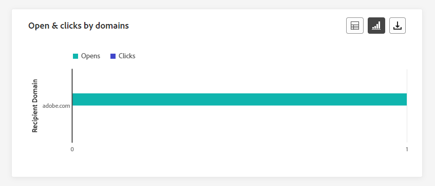
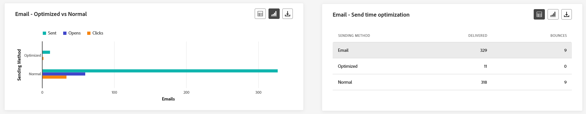
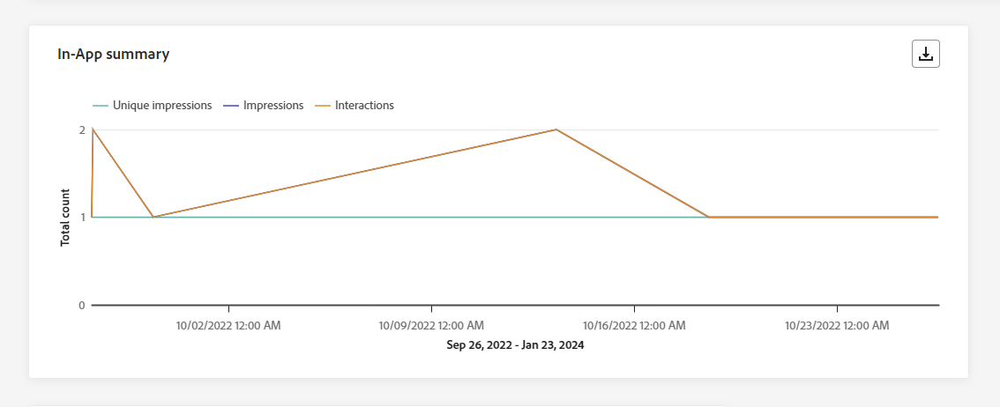
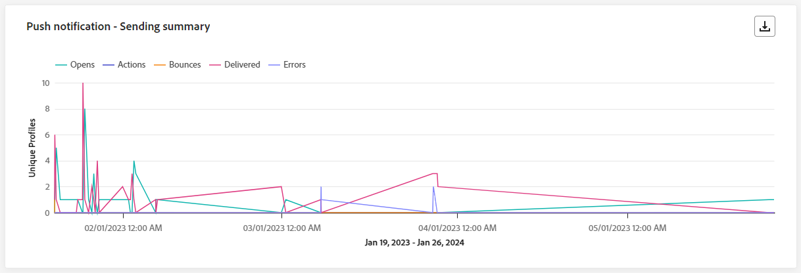
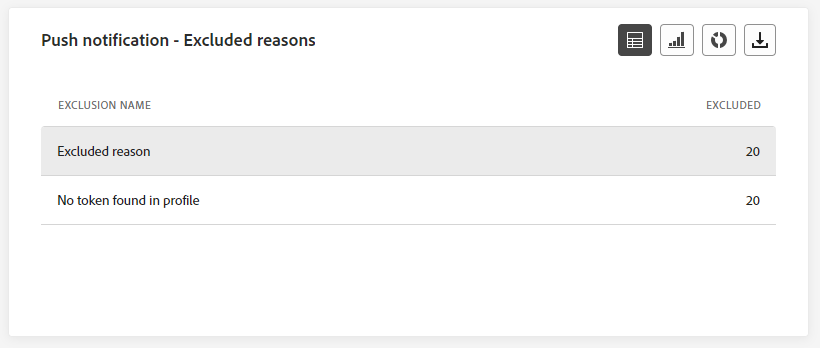

# Rapporto globale della campagna {#campaign-global-report}

>[!CONTEXTUALHELP]
>id="ajo_campaign_global_report"
>title="Rapporto globale della campagna"
>abstract="Il rapporto globale delle campagne consente di misurare l’impatto di una campagna in un periodo di tempo selezionato. Il rapporto è suddiviso in diversi widget che descrivono il successo e gli errori della campagna. Ogni dashboard di reporting può essere modificata ridimensionando o rimuovendo i widget."

I report globali, accessibili dalla scheda **Tutto il tempo**, visualizzano gli eventi verificatisi almeno due ore fa e coprono gli eventi relativi a un periodo di tempo selezionato. Al confronto, i rapporti live si concentrano sugli eventi che si sono verificati nelle ultime 24 ore, con un intervallo di tempo minimo di due minuti dall’occorrenza dell’evento.

Il report globale della campagna è accessibile direttamente dalla campagna con il pulsante **[!UICONTROL Visualizza report]**.

La pagina del **[!UICONTROL report globale]** della campagna verrà visualizzata con le seguenti schede:

* [Campaign](#campaign-global)
* [E-mail](#email-global)
* [In-app](#inapp-global)
* [Push](#push-global)
* [SMS](#sms-global)
* [Web](#web-tab)
* [Direct mail](#direct-mail-global)

Il **[!UICONTROL report globale]** della campagna è suddiviso in diversi widget che descrivono il successo e gli errori della campagna. Ogni widget può essere ridimensionato ed eliminato, se necessario. Per ulteriori informazioni, consulta questa [sezione](../reports/global-report.md#modify-dashboard).

Per un elenco dettagliato di tutte le metriche disponibili in Adobe Journey Optimizer, consulta [questa pagina](global-report.md#list-of-components-global.md)

## Scheda Campagna {#campaign-global}

### Distribuzione {#delivery-global}

>[!CONTEXTUALHELP]
>id="ajo_campaign_delivery_global"
>title="Statistiche della campagna"
>abstract="Il widget Statistiche della campagna descrive le informazioni principali relative alla campagna, ad esempio i profili immessi e le azioni consegnate."

I KPI di **[!UICONTROL Statistiche campagna]** fungono da dashboard completo e offrono una suddivisione dettagliata delle metriche chiave correlate alla campagna. Ciò include informazioni essenziali come il numero di profili e le azioni consegnate, fornendo una comprensione approfondita delle prestazioni e del coinvolgimento della campagna.

+++ Ulteriori informazioni sulle metriche delle statistiche di Campaign

* **[!UICONTROL Pubblico]**: numero di profili target.

* **[!UICONTROL Azioni consegnate]**: numero totale di volte univoche in cui è stata consegnata un&#39;azione.

* **[!UICONTROL Azioni non riuscite in %]**: percentuale di volte univoche in cui un&#39;azione non è riuscita rispetto al numero totale di volte in cui un&#39;azione è stata consegnata.

+++

<!--
### Objectives report {#objectives-global}

The **[!UICONTROL Objectives]** tab allows you to better fine-tune your deliveries' reports by targeting one specific metric.

The **[!UICONTROL Objectives]** listed are linked to **[!UICONTROL Datasets]** that define a connection to a system in order to retrieve additional information. A list of built-in **[!UICONTROL Objectives]** is available but you can add your own by adding new **[!UICONTROL Dataset]**. For the detailed procedure, refer to this [section](../content-management/reporting-configuration.md).

After selecting the Objectives you want to target on, the two **[!UICONTROL Performance overview]** and **[!UICONTROL Campaign objective]** widgets will provide a detailed summary of your delivery performance. 

With the **[!UICONTROL Campaign objective]** widget, you can also choose to compare your main objective with another metric.
-->

### Rapporto sulla sperimentazione {#experimentation-global}

>[!CONTEXTUALHELP]
>id="ajo_campaigns_content_experiment_click"
>title="Metrica di successo"
>abstract="Valore totale della metrica Successo, precedentemente selezionata durante la creazione degli esperimenti, diviso per il numero di profili."

La scheda **[!UICONTROL Sperimentazione]** fornisce informazioni chiave sulle prestazioni di ogni variante e identifica quella che ha avuto maggior successo.

La definizione dell&#39;esecutore migliore potrebbe richiedere un po&#39; di tempo, verrà rappresentata da questa icona .

+++Ulteriori informazioni sulle diverse metriche e widget disponibili per il rapporto Sperimentazione.

Il widget **[!UICONTROL Risultato esperimento]** descrive le prestazioni di ogni variante. Puoi modificare la linea di base selezionando uno dei trattamenti dal menu a discesa **[!UICONTROL Baseline]**. Il miglior trattamento sarà rappresentato da un’icona a forma di stella.

Per informazioni approfondite su questi risultati e su come interpretarli, consulta [questa pagina](../content-management/get-started-experiment.md#interpret-results).

La tabella presenta le metriche seguenti:

* **[!UICONTROL Incremento rispetto al basale]**: misura del miglioramento percentuale del tasso di conversione di un determinato trattamento rispetto al basale.

* **[!UICONTROL Affidabilità]**: prova che un determinato trattamento è uguale al trattamento basale. [Ulteriori informazioni](../content-management/experiment-calculations.md#understand-confidence)

* **[!UICONTROL Clic in uscita univoci]**: numero totale di clic tra i canali in uscita.

* **[!UICONTROL Profili]**: numero di profili target per questo trattamento.

* **[!UICONTROL Clic/profili in uscita univoci]**: valore totale della metrica di successo, precedentemente selezionata durante la creazione degli esperimenti, diviso per il numero di profili.

Il grafico **[!UICONTROL Intervallo di affidabilità]** misura l&#39;incertezza sul miglioramento. Descrive la differenza percentuale nelle prestazioni tra la linea di base e il trattamento dalle prestazioni migliori. [Ulteriori informazioni](../content-management/experiment-calculations.md#confidence-intervals).

L&#39;ultimo widget fornisce dati relativi alla **[!UICONTROL metrica di successo]** selezionata in precedenza per i trattamenti. È possibile selezionare una metrica di destinazione diversa dal menu a discesa **[!UICONTROL Metrica]** per tenere traccia dei dati alternativi.

>[!CAUTION]
>
>Quando lavori con metriche filtrate per sperimentazione, tieni presente che la modifica della selezione della metrica dal menu a discesa nella pagina di confronto per la sperimentazione non manterrà il valore del filtro. Ad esempio, il passaggio da &quot;Clic&quot; a &quot;Clic univoci&quot; causerà la perdita del filtro applicato, rendendo il confronto impreciso o non valido.

+++

## Scheda e-mail {#email-global}

### E-mail - Statistiche di invio {#sending-statistics-email}

>[!CONTEXTUALHELP]
>id="ajo_campaign_global_email_sending_statistics"
>title="E-mail - Statistiche di invio"
>abstract="La tabella della sezione E-mail - Statistiche di invio riepiloga dati essenziali sulle e-mail, ad esempio Target o Consegnati."

La tabella **[!UICONTROL Statistiche sull&#39;invio di e-mail]** fornisce un riepilogo completo dei dati essenziali relativi alle campagne e-mail. Descrive le metriche chiave, come la dimensione del pubblico target e il numero di e-mail inviate con successo, fornendo informazioni utili sull’efficacia e la portata delle e-mail.

+++ Ulteriori informazioni sulle metriche delle statistiche di invio di e-mail

* **[!UICONTROL Destinato]**: numero totale di e-mail elaborate durante il processo di invio.

* **[!UICONTROL Inviato]**: numero totale di invii per e-mail.

* **[!UICONTROL Recapitato]**: numero di e-mail inviate correttamente, in relazione al numero totale di messaggi inviati.

* **[!UICONTROL Percentuale di recapito]**: percentuale di messaggi e-mail inviati correttamente.

* **[!UICONTROL Mancati recapiti]**: totale degli errori accumulati durante il processo di invio e l&#39;elaborazione automatica dei resi in relazione al numero totale di messaggi inviati.

* **[!UICONTROL Percentuale di e-mail non recapitate]**: percentuale di e-mail non recapitate rispetto alle e-mail inviate.

* **[!UICONTROL Errori]**: numero totale di errori che si sono verificati durante il processo di invio e che ne hanno impedito l&#39;invio ai profili.

* **[!UICONTROL Frequenza errori]**: percentuale di errori che si sono verificati durante il processo di invio e che ne hanno impedito l&#39;invio rispetto alle e-mail inviate.

* **[!UICONTROL Nuovi tentativi]**: numero di e-mail in coda per i nuovi tentativi.

* **[!UICONTROL Esclusi]**: numero di profili esclusi da Adobe Journey Optimizer.

+++

### E-mail - Statistiche di tracciamento {#tracking-statistics-email}

>[!CONTEXTUALHELP]
>id="ajo_campaign_global_email_tracking_statistics"
>title="E-mail - Statistiche di tracciamento"
>abstract="La tabella della sezione E-mail - Statistiche di tracciamento e-mail fornisce i dati sulle attività dei profili per l’e-mail."

La tabella **[!UICONTROL E-mail - Statistiche di tracciamento]** offre un account dettagliato dell&#39;attività del profilo correlata alle campagne e-mail. Ciò include metriche su aperture, clic e altri indicatori di coinvolgimento rilevanti, che offrono una visualizzazione completa del modo in cui i profili interagiscono con il contenuto dell’e-mail.

+++ Ulteriori informazioni su E-mail - Metriche delle statistiche di tracciamento

* **[!UICONTROL Aperture]**: numero di volte in cui l&#39;e-mail è stata aperta.

* **[!UICONTROL Aperture univoche]**: percentuale di messaggi e-mail aperti.

* **[!UICONTROL Percentuale aperture]**: numero totale di messaggi e-mail aperti rispetto al numero di messaggi e-mail consegnati.

* **[!UICONTROL Clic]**: numero di volte in cui è stato fatto clic su un contenuto nelle e-mail.

* **[!UICONTROL Clic univoci]**: numero di profili che hanno fatto clic su un contenuto in un messaggio e-mail.

* **[!UICONTROL Percentuale di clic univoci]**: percentuale di utenti che hanno interagito con le e-mail.

* **[!UICONTROL Annullamenti iscrizione]**: numero di clic sul collegamento di annullamento dell&#39;iscrizione.

* **[!UICONTROL Reclami spam]**: numero di volte in cui un messaggio è stato dichiarato come spam o posta indesiderata.

+++

### E-mail: prestazioni di invio {#sending-performance-email}

>[!CONTEXTUALHELP]
>id="ajo_campaign_global_email_sending_performance"
>title="E-mail: prestazioni di invio"
>abstract="Il grafico E-mail: prestazioni di invio presenta dati completi sulle e-mail inviate, fornendo informazioni approfondite sulle metriche chiave, come consegnati e mancati recapiti, e consentendo un’analisi dettagliata del processo di consegna delle e-mail."

Il grafico **[!UICONTROL E-mail - Prestazioni invio]** fornisce una visualizzazione completa dei dati relativi alle e-mail inviate, offrendo informazioni approfondite sulle metriche chiave quali recapitato e non recapitato. Ciò consente un’analisi dettagliata del processo di invio delle e-mail, fornendo informazioni preziose sull’efficienza e le prestazioni delle campagne e-mail.

+++ Ulteriori informazioni sull’e-mail - Metriche delle prestazioni di invio

* **[!UICONTROL Recapitato]**: numero di e-mail inviate correttamente rispetto al numero totale di e-mail inviate.

* **[!UICONTROL Mancati recapiti]**: totale degli errori accumulati durante il processo di invio ed elaborazione automatica dei resi in relazione al numero totale di e-mail inviate.

* **[!UICONTROL Nuovi tentativi]**: numero di e-mail in coda per i nuovi tentativi.

* **[!UICONTROL Errori]**: numero totale di errori che si sono verificati durante il processo di invio e che ne hanno impedito l&#39;invio ai profili.

+++

### E-mail: motivi e categorie di mancato recapito {#bounces-email}

>[!CONTEXTUALHELP]
>id="ajo_campaign_global_email_bounce_categories"
>title="E-mail - Categorie di mancato recapito"
>abstract="I grafici e la tabella della sezione E-mail - Categorie di mancato recapito forniscono dati su errori temporanei e permanenti."

>[!CONTEXTUALHELP]
>id="ajo_campaign_global_email_bounce_reasons"
>title="E-mail - Motivi di mancato recapito"
>abstract="I grafici e la tabella della sezione E-mail - Motivi di mancato recapito contengono i dati disponibili relativi ai messaggi non recapitati."

I widget **[!UICONTROL E-mail - Motivi di mancato recapito]** e **[!UICONTROL E-mail - Motivi di mancato recapito]** compilano i dati disponibili relativi ai messaggi non recapitati, fornendo informazioni dettagliate sui motivi e sulle categorie specifici alla base dei messaggi non recapitati.

Per ulteriori informazioni sui mancati recapiti, consulta la pagina [Elenco di soppressione](../reports/suppression-list.md).

+++ Ulteriori informazioni su E-mail - Metriche delle categorie di mancato recapito

* **[!UICONTROL Notifica di mancato recapito]**: numero totale di errori permanenti, ad esempio un indirizzo e-mail errato. Ciò comporta un messaggio di errore che indica esplicitamente che l’indirizzo non è valido, ad esempio Utente sconosciuto.

* **[!UICONTROL Mancato recapito non permanente]**: numero totale di errori temporanei, ad esempio una casella in entrata completa.

* **[!UICONTROL Ignorato]**: il numero totale di messaggi temporanei, ad esempio Fuori sede, o un errore tecnico, ad esempio se il tipo di mittente è postmaster.

+++

### E-mail: motivi di errore {#errors-email}

>[!CONTEXTUALHELP]
>id="ajo_campaign_global_email_error_reasons"
>title="E-mail: motivi di errore"
>abstract="I grafici e la tabella della sezione E-mail - Motivi di errore consentono di identificare gli errori specifici che si sono verificati durante l’invio."

I grafici e la tabella **[!UICONTROL Motivi errore]** offrono visibilità sugli errori specifici che si sono verificati durante il processo di invio, fornendo informazioni utili sulla natura e sulla ricorrenza degli errori.

È possibile scegliere di passare da una tabella, un grafico a barre o una ciambella.

### E-mail - Motivi di esclusione {#excluded-email}

>[!CONTEXTUALHELP]
>id="ajo_campaign_global_email_excluded_reasons"
>title="E-mail - Motivi di esclusione"
>abstract="I grafici e la tabella della sezione Motivi di esclusione illustrano i vari fattori a causa dei quali il messaggio non è stato ricevuto dai profili utente che sono stati esclusi dal pubblico target."

I grafici e la tabella **[!UICONTROL Motivi di esclusione]** presentano una visualizzazione completa dei diversi fattori che hanno determinato l&#39;esclusione dei profili utente dal pubblico di destinazione, causando la mancata ricezione del messaggio.

Per un elenco completo dei motivi di esclusione, consulta [questa pagina](exclusion-list.md).

### Inviato e consegnato per dominio {#sent-domains}

>[!CONTEXTUALHELP]
>id="ajo_campaign_global_email_sent_domains"
>title="Inviato e consegnato per dominio"
>abstract="La tabella e il grafico Inviato e consegnato per domini forniscono un raggruppamento delle e-mail categorizzate per domini, presentando informazioni approfondite e dettagliate sulla prestazione complessiva delle comunicazioni via e-mail."

La tabella e il grafico **[!UICONTROL Inviati e consegnati per domini]** forniscono un raggruppamento dettagliato delle e-mail a livello di dominio, offrendo informazioni complete sulle prestazioni delle e-mail.

+++ Ulteriori informazioni sulle metriche Inviato e Consegnato per domini

* **[!UICONTROL Inviato]**: numero totale di invii per e-mail.

* **[!UICONTROL Recapitato]**: numero di e-mail inviate correttamente rispetto al numero totale di e-mail inviate.

+++

### Mancati recapiti ed errori per domini {#bounces-domains}

>[!CONTEXTUALHELP]
>id="ajo_campaign_global_email_bounces_domains"
>title="Mancati recapiti ed errori per domini"
>abstract="Il grafico e la tabella Mancati recapiti ed errori per domini forniscono un raggruppamento dettagliato a livello di dominio, fornendo informazioni approfondite su errori specifici riscontrati durante il processo di invio delle e-mail."

Il grafico e la tabella **[!UICONTROL Messaggi non recapitati ed errori per domini]** offrono un raggruppamento a livello di dominio degli errori specifici rilevati durante il processo di invio, fornendo un&#39;analisi dettagliata dei problemi che si sono verificati.

+++ Ulteriori informazioni su mancati recapiti ed errori per domini e metriche

* **[!UICONTROL Mancati recapiti]**: totale degli errori accumulati durante il processo di invio ed elaborazione automatica dei resi in relazione al numero totale di e-mail inviate.

* **[!UICONTROL Errori]**: numero totale di errori che si sono verificati durante il processo di invio impedendo l&#39;invio dell&#39;e-mail ai profili.

+++

### Aperture e clic per domini {#opens-domains}

>[!CONTEXTUALHELP]
>id="ajo_campaign_global_email_open_domains"
>title="Aperture e clic per domini"
>abstract="Il grafico e la tabella Aperture e clic per domini offrono un raggruppamento dettagliato a livello di dominio, presentando una panoramica completa del modo in cui il pubblico si relaziona con le e-mail."

Il grafico e la tabella **[!UICONTROL Apri e fai clic per domini]** mostrano un raggruppamento a livello di dominio del coinvolgimento dei profili con la tua e-mail, fornendo informazioni utili su come diversi domini interagiscono con il contenuto.

+++ Ulteriori informazioni sulle metriche Apri e clic per domini

* **[!UICONTROL Aperture]**: numero di volte in cui l&#39;e-mail è stata aperta.

* **[!UICONTROL Clic]**: numero di volte in cui è stato fatto clic su un contenuto in un&#39;e-mail.

+++

### Motivi di mancato recapito per dominio {#bounce-reasons-domains}

>[!CONTEXTUALHELP]
>id="ajo_campaign_global_email_bounces_reasons_domains"
>title="Motivi di mancato recapito per dominio"
>abstract="Il grafico e la tabella dei Motivi di mancato recapito per dominio forniscono un raggruppamento a livello di dominio, offrendo informazioni approfondite e complete su errori temporanei e permanenti. Questa analisi dettagliata offre informazioni utili sulle ragioni specifiche alla base dei messaggi non recapitati."

Il grafico e la tabella **[!UICONTROL Motivi di mancato recapito per dominio]** offrono un raggruppamento a livello di dominio dei dati relativi a errori temporanei e permanenti, fornendo informazioni dettagliate sui motivi alla base dei messaggi non recapitati.

+++ Ulteriori informazioni sui motivi di mancato recapito per metriche di dominio

* **[!UICONTROL Aperture]**: numero di volte in cui l&#39;e-mail è stata aperta.

* **[!UICONTROL Clic]**: numero di volte in cui è stato fatto clic su un contenuto in un&#39;e-mail.

+++

### E-mail: URL principale {#top-url-email}

>[!CONTEXTUALHELP]
>id="ajo_campaign_global_email_top_url"
>title="E-mail: URL principale"
>abstract="Il grafico e la tabella della sezione E-mail - URL principale offrono una panoramica completa degli URL all’interno dell’e-mail che vengono visitati di più, consentendoti di individuare i collegamenti più popolari."

Il grafico e la tabella **[!UICONTROL E-mail - URL principale]** forniscono una panoramica completa degli URL all&#39;interno dell&#39;e-mail che attirano il traffico più elevato dei visitatori. Questo consente di identificare e assegnare la priorità ai collegamenti più popolari, migliorando la comprensione del coinvolgimento del profilo con contenuti specifici nelle e-mail.

### E-mail - Dominio destinatario migliore {#top-recipient-email}

>[!CONTEXTUALHELP]
>id="ajo_campaign_global_email_best_recipient"
>title="E-mail - Dominio destinatario migliore"
>abstract="Il grafico e la tabella della sezione E-mail - Dominio destinatario migliore forniscono un raggruppamento dettagliato dei domini utilizzati più di frequente dai destinatari per aprire l’e-mail e insight sul comportamento dei destinatari."

>[!CAUTION]
>
> Il widget **[!UICONTROL E-mail - Dominio destinatario migliore]** ha una percentuale di precisione del 99,95%.

Il grafico e la tabella **[!UICONTROL E-mail - Dominio destinatario migliore]** offrono un raggruppamento dettagliato dei domini utilizzati più di frequente dai profili per aprire le e-mail. Questo fornisce informazioni utili sul comportamento del profilo, consentendoti di comprendere le piattaforme preferite.

+++ Ulteriori informazioni sull’e-mail - Metriche del dominio dei destinatari migliori

* **[!UICONTROL Recapitato]**: numero di e-mail inviate correttamente rispetto al numero totale di e-mail inviate.

* **[!UICONTROL Percentuale di recapito]**: percentuale di messaggi e-mail inviati correttamente.

* **[!UICONTROL Mancato recapito + Percentuale errori]**: percentuale di e-mail non recapitate rispetto alle e-mail inviate.

+++

### E-mail: ottimizzazione {#optimized-email}

>[!NOTE]
>
>I widget **[!UICONTROL Ottimizzati e non ottimizzati]** e **[!UICONTROL Ottimizzazione dell&#39;ora di invio]** sono disponibili solo se per l&#39;e-mail è attivata l&#39;opzione Ottimizzazione dell&#39;ora di invio. Per ulteriori informazioni sull&#39;ottimizzazione dell&#39;ora di invio, consultare [questa pagina](../building-journeys/journeys-message.md#send-time-optimization).

I widget **[!UICONTROL Ottimizzato e non ottimizzato]** e **[!UICONTROL Ottimizzazione dell&#39;ora di invio]** descrivono in dettaglio le informazioni principali relative al messaggio, ottimizzate o meno.

+++ Ulteriori informazioni sulle metriche di ottimizzazione del tempo di invio

* **[!UICONTROL Inviato]**: numero totale di invii.

* **[!UICONTROL Aperture]**: numero di volte in cui il messaggio è stato aperto.

* **[!UICONTROL Clic]**: numero di volte in cui è stato fatto clic su un contenuto in un&#39;e-mail.

* **[!UICONTROL Consegnato]**: numero di messaggi inviati correttamente rispetto al numero totale di messaggi inviati.

* **[!UICONTROL Mancati recapiti]**: totale degli errori accumulati durante il processo di invio e l&#39;elaborazione automatica dei resi in relazione al numero totale di messaggi inviati.

+++

### E-mail: offerte {#email-offers}

I widget **[!UICONTROL Statistiche offerte]**, **[!UICONTROL Statistiche offerte nel tempo]** e **[!UICONTROL Statistiche dettagliate offerte]** misurano il successo della tua offerta e il suo impatto sul pubblico di destinazione.

+++ Ulteriori informazioni su E-mail - Metriche delle offerte

* **[!UICONTROL Offerta inviata]**: numero totale di invii per l&#39;offerta.

* **[!UICONTROL Offer impression]**: numero di volte in cui l&#39;offerta è stata aperta nelle e-mail.

* **[!UICONTROL Clic su offerta]**: numero di volte in cui è stato fatto clic su un&#39;offerta nelle e-mail.

* **[!UICONTROL Nome posizionamento]**: nome del posizionamento utilizzato per visualizzare l&#39;offerta. Per ulteriori informazioni sul posizionamento, consulta questa [pagina](../offers/offer-library/creating-placements.md).

* **[!UICONTROL Nome offerta]**: nome dell&#39;offerta aggiunta nella consegna. Per ulteriori informazioni sul posizionamento, consulta questa [pagina](../offers/offer-library/creating-personalized-offers.md).

* **[!UICONTROL Offerta inviata]**: numero totale di invii per l&#39;offerta.

* **[!UICONTROL Percentuale di impression offerte]**: percentuale di offerte aperte rispetto al numero di offerte inviate.

+++

## Scheda in-app {#inapp-global}

Dal **[!UICONTROL report globale]** della campagna, la scheda **[!UICONTROL In-app]** fornisce dettagli sulle informazioni principali relative ai messaggi in-app inviati nella campagna.

### Prestazione in-app {#in-app-performance}

>[!CONTEXTUALHELP]
>id="ajo_campaign_global_inapp_performance"
>title="Prestazione in-app"
>abstract="I KPI (Key Performance Indicator) in-app forniscono informazioni essenziali sul coinvolgimento dei visitatori con i messaggi in-app."

I KPI **[!UICONTROL prestazioni in-app]** forniscono informazioni essenziali sul coinvolgimento dei visitatori con i messaggi in-app, fornendo metriche essenziali per valutare l&#39;efficacia e l&#39;impatto delle campagne in-app.

+++ Ulteriori informazioni sulle metriche delle prestazioni in-app

* **[!UICONTROL Impression univoche]**: numero di utenti univoci a cui è stato recapitato il messaggio in-app.

* **[!UICONTROL Impression]**: numero totale di messaggi in-app recapitati a tutti gli utenti.

* **[!UICONTROL Interazioni]**: numero totale di engagement con il messaggio in-app. Ciò include tutte le azioni intraprese dagli utenti, come clic, revoche o qualsiasi altra interazione.

+++

### Interazioni per tipo {#interactions-type}

>[!CONTEXTUALHELP]
>id="ajo_campaign_global_inapp_interactions"
>title="Interazioni per tipo"
>abstract="Le Interazioni per tipo rappresentano grafici e tabelle che descrivono il modo in cui gli utenti hanno interagito con il messaggio in-app tracciando eventuali clic, eliminazioni o interazioni."

I grafici e la tabella **[!UICONTROL Interazioni per tipo]** forniscono un resoconto dettagliato delle interazioni dei profili con il messaggio in-app, nonché delle azioni di tracciamento come clic, licenziamenti o altre forme di coinvolgimento.

### Riepilogo in-app {#in-app-summary}

>[!CONTEXTUALHELP]
>id="ajo_campaign_global_inapp_summary"
>title="Riepilogo in-app"
>abstract="Il grafico di riepilogo in-app illustra la progressione delle impression e delle interazioni in-app nel periodo specificato."

Il grafico **[!UICONTROL Riepilogo in-app]** illustra la progressione delle impression e delle interazioni in-app nel periodo specificato, fornendo una panoramica completa delle prestazioni dei messaggi in-app.

+++ Ulteriori informazioni sulle metriche di riepilogo in-app

* **[!UICONTROL Impression univoche]**: numero di utenti univoci a cui è stato recapitato il messaggio in-app.

* **[!UICONTROL Impression]**: numero totale di messaggi in-app recapitati a tutti gli utenti.

* **[!UICONTROL Interazioni]**: numero totale di engagement con il messaggio in-app. Ciò include tutte le azioni intraprese dagli utenti, come clic, revoche o qualsiasi altra interazione.

+++

## Scheda notifica push {#push-global}

Dal **[!UICONTROL report globale]** della campagna, la scheda **[!UICONTROL Notifica push]** fornisce i dettagli delle informazioni principali relative alle notifiche push inviate nella campagna.

### Notifica push: statistiche di invio {#push-sending-statistics}

>[!CONTEXTUALHELP]
>id="ajo_campaign_global_push_sending_statistics"
>title="Notifica push: statistiche di invio"
>abstract="La tabella Statistiche di invio delle notifiche push riepiloga i dati essenziali sulle notifiche push, come i messaggi di mirati o recapitati."

La tabella **[!UICONTROL Notifica push - Statistiche di invio]** fornisce un riepilogo conciso dei dati essenziali relativi alle notifiche push, incluse le metriche chiave quali il numero di messaggi di destinazione e il numero di messaggi consegnati correttamente.

+++ Ulteriori informazioni sulla notifica push - Metriche delle statistiche di invio

* **[!UICONTROL Tempo di esecuzione]**: ora di inizio di ogni esecuzione della notifica push ricorrente. Per eseguire il targeting solo di una o più notifiche push ricorrenti, selezionala dal menu a discesa **[!UICONTROL Tempo di esecuzione]**.

* **[!UICONTROL Target]**: numero totale di notifiche push elaborate durante l&#39;analisi.

* **[!UICONTROL Inviato]**: numero totale di invii per la notifica push.

* **[!UICONTROL Recapitato]**: numero di notifiche push inviate correttamente, in relazione al numero totale di notifiche push inviate.

* **[!UICONTROL Frequenza di recapito]**: percentuale di notifiche push inviate correttamente.

* **[!UICONTROL Mancati recapiti]**: totale degli errori cumulati durante il processo di invio ed elaborazione automatica dei resi in relazione al numero totale di notifiche push.

* **[!UICONTROL Percentuale non recapitate]**: percentuale di notifiche push non recapitate rispetto alle notifiche push inviate.

* **[!UICONTROL Errori]**: numero totale di errori che ne hanno impedito l&#39;invio ai profili.

* **[!UICONTROL Frequenza errori]**: percentuale di errori che si sono verificati durante il tentativo di impedire l&#39;invio rispetto alle notifiche push inviate.

* **[!UICONTROL Esclusi]**: numero di profili esclusi da Adobe Journey Optimizer.

+++

### Notifica push: statistiche di tracciamento {#push-tracking-statistics}

>[!CONTEXTUALHELP]
>id="ajo_campaign_global_push_tracking_statistics"
>title="Notifica push: statistiche di tracciamento"
>abstract="Le statistiche di tracciamento push forniscono dati sulle attività dei profili per le notifiche push."

Il widget **[!UICONTROL Notifica push- Statistiche di tracciamento]** offre un&#39;istantanea dettagliata dell&#39;attività di profilo associata alle notifiche push, fornendo informazioni essenziali sull&#39;efficacia del coinvolgimento e delle notifiche push.

+++ Ulteriori informazioni sulla notifica push - Metriche delle statistiche di tracciamento

* **[!UICONTROL Tempo di esecuzione]**: ora di inizio di ogni esecuzione della notifica push ricorrente. Per eseguire il targeting solo di una o più notifiche push ricorrenti, selezionala dal menu a discesa **[!UICONTROL Tempo di esecuzione]**.

* **[!UICONTROL Aperture]**: numero di volte in cui la notifica push è stata aperta.

* **[!UICONTROL Azioni]**: numero totale di azioni nella notifica push consegnate, ad esempio clic su un pulsante o chiusura.

+++

### Notifica push: riepilogo di invio {#push-summary}

>[!CONTEXTUALHELP]
>id="ajo_campaign_global_push_sending_summary"
>title="Notifica push: riepilogo di invio"
>abstract="Il grafico Riepilogo invio notifiche push visualizza i dati disponibili per le notifiche push inviate."

Il grafico **[!UICONTROL Notifica push - Riepilogo invio]** offre una rappresentazione dinamica, con un&#39;analisi dell&#39;attività delle notifiche push. Questa rappresentazione grafica fornisce un raggruppamento completo delle notifiche push inviate.

+++ Ulteriori informazioni sulla notifica push - Invio di metriche di riepilogo

* **[!UICONTROL Aperture]**: numero di volte in cui la notifica push è stata aperta.

* **[!UICONTROL Azioni]**: numero totale di azioni nella notifica push consegnate, ad esempio clic su un pulsante o chiusura.

* **[!UICONTROL Mancati recapiti]**: totale degli errori cumulativi ed elaborazione automatica dei resi in relazione al numero totale di notifiche push inviate.

* **[!UICONTROL Recapitato]**: numero di notifiche push inviate correttamente, in relazione al numero totale di notifiche push inviate.

* **[!UICONTROL Errori]**: numero totale di errori che ne hanno impedito l&#39;invio ai profili.

+++

### Notifica push - Ottimizzazione {#push-optimized}

>[!NOTE]
>
>I widget **[!UICONTROL Ottimizzati e non ottimizzati]** e **[!UICONTROL Ottimizzazione dell&#39;ora di invio]** sono disponibili solo se l&#39;opzione Ottimizzazione dell&#39;ora di invio è attivata per la notifica push. Per ulteriori informazioni sull&#39;ottimizzazione dell&#39;ora di invio, consultare [questa pagina](../building-journeys/journeys-message.md#send-time-optimization).

I widget **[!UICONTROL Ottimizzato e non ottimizzato]** e **[!UICONTROL Ottimizzazione dell&#39;ora di invio]** descrivono in dettaglio le informazioni principali relative al messaggio, ottimizzate o meno.

+++ Ulteriori informazioni sulla notifica push - Metriche di ottimizzazione del tempo di invio

* **[!UICONTROL Recapitato]**: numero di notifiche push inviate correttamente, in relazione al numero totale di notifiche push inviate.

* **[!UICONTROL Aperture]**: numero di volte in cui la notifica push è stata aperta.

* **[!UICONTROL Azioni]**: numero totale di azioni nella notifica push consegnate, ad esempio clic su un pulsante o chiusura.

* **[!UICONTROL Mancati recapiti]**: totale degli errori accumulati durante il processo di invio ed elaborazione automatica dei resi in relazione al numero totale di notifiche push inviate.

+++

### Notifica push: motivi di errore {#error-reasons-push}

>[!CONTEXTUALHELP]
>id="ajo_campaign_global_push_error_reasons"
>title="Notifica push: motivi di errore"
>abstract="I grafici e la tabella Motivi di errore consentono di identificare gli errori specifici che si sono verificati durante il processo di invio."

La tabella e i grafici **[!UICONTROL Motivi di errore]** consentono di identificare gli errori specifici che si sono verificati durante il processo di invio delle notifiche push, fornendo informazioni dettagliate su eventuali problemi riscontrati durante il processo.

### Notifica push: motivi di esclusione {#excluded-push}

>[!CONTEXTUALHELP]
>id="ajo_campaign_global_push_excluded_reasons"
>title="Notifica push: motivi di esclusione"
>abstract="I grafici e la tabella della sezione Motivi di esclusione illustrano i vari fattori a causa dei quali il messaggio non è stato ricevuto dai profili utente che sono stati esclusi dal pubblico target."

I grafici e la tabella **[!UICONTROL Motivi di esclusione]** mostrano i diversi motivi che hanno impedito ai profili utente, esclusi dai profili target, di ricevere le notifiche push.

Per un elenco completo dei motivi di esclusione, consulta [questa pagina](exclusion-list.md).

### Notifica push: raggruppamento per piattaforma {#breakdown-platform-push}

>[!CONTEXTUALHELP]
>id="ajo_campaign_global_push_breakdown_platform"
>title="Notifica push: raggruppamento per piattaforma"
>abstract="La tabella e i grafici della Notifica push: raggruppamento per piattaforma forniscono un raggruppamento del successo delle notifiche push in base al sistema operativo del profilo."

Il grafico e la tabella **[!UICONTROL Notifica push - Raggruppamento per piattaforma]** forniscono un&#39;analisi dettagliata del successo delle notifiche push, con informazioni basate sul sistema operativo del profilo. Questo raggruppamento migliora la comprensione delle prestazioni delle notifiche push tra le diverse piattaforme.

+++ Ulteriori informazioni sulla notifica push: suddivisione per metriche della piattaforma

* **[!UICONTROL Target]**: numero totale di notifiche push elaborate durante l&#39;analisi.

* **[!UICONTROL Recapitato]**: numero di notifiche push inviate correttamente, in relazione al numero totale di notifiche push inviate.

* **[!UICONTROL Aperture]**: numero di volte in cui la notifica push è stata aperta.

* **[!UICONTROL Azioni]**: numero totale di azioni nella notifica push consegnate, ad esempio clic su un pulsante o chiusura.

* **[!UICONTROL Mancati recapiti]**: totale degli errori cumulativi ed elaborazione automatica dei resi in relazione al numero totale di notifiche push inviate.

* **[!UICONTROL Errori]**: numero totale di errori che ne hanno impedito l&#39;invio ai profili.

* **[!UICONTROL Esclusi]**: numero di profili esclusi da Adobe Journey Optimizer.

+++

## Scheda SMS {#sms-global}

Dal **[!UICONTROL report globale]** della campagna, la scheda **[!UICONTROL SMS]** fornisce dettagli sulle informazioni principali relative ai messaggi SMS inviati nella campagna.

### SMS: statistiche di invio {#sms-sending-statistics}

>[!CONTEXTUALHELP]
>id="ajo_campaign_global_sms_sending_statistics"
>title="SMS: statistiche di invio"
>abstract="La tabella SMS: statistiche di invio riepiloga i dati essenziali sui messaggi SMS, ad esempio i messaggi mirati o recapitati."

La tabella **[!UICONTROL SMS - Statistiche di invio]** fornisce un riepilogo conciso dei dati essenziali relativi ai messaggi SMS, includendo metriche chiave quali il numero di messaggi di destinazione e il numero di messaggi consegnati correttamente.

+++ Ulteriori informazioni sugli SMS - Metriche delle statistiche di invio

* **[!UICONTROL Tempo di esecuzione]**: ora di inizio di ogni esecuzione del messaggio SMS ricorrente. Per eseguire il targeting solo di uno o più messaggi SMS ricorrenti, selezionali dal menu a discesa **[!UICONTROL Tempo di esecuzione]**.

* **[!UICONTROL Destinati]**: numero di profili utente qualificati come profili target.

* **[!UICONTROL Escluso]**: numero di profili utente, esclusi dai profili target, che non hanno ricevuto il messaggio.

* **[!UICONTROL Inviato]**: numero totale di invii per i messaggi SMS.

* **[!UICONTROL Mancati recapiti]**: totale degli errori accumulati durante il processo di invio e l&#39;elaborazione automatica dei resi in relazione al numero totale di messaggi SMS inviati.

* **[!UICONTROL Errori]**: numero totale di errori che ne hanno impedito l&#39;invio ai profili.

+++

### SMS: statistiche di tracciamento {#sms-tracking-statistics}

>[!CONTEXTUALHELP]
>id="ajo_campaign_sms_tracking_statistics"
>title="SMS: statistiche di tracciamento"
>abstract="Il widget SMS: statistiche di tracciamento fornisce una panoramica completa delle informazioni essenziali relative all’interazione dei visitatori con l’URL."

Il widget **[!UICONTROL SMS - Statistiche di tracciamento]** fornisce una panoramica dettagliata delle informazioni chiave relative al coinvolgimento dei visitatori con gli URL, fornendo informazioni approfondite sull&#39;efficacia dei messaggi SMS.

+++ Ulteriori informazioni su SMS - Metriche delle statistiche di tracciamento

* **[!UICONTROL Tempo di esecuzione]**: ora di inizio di ogni esecuzione dell&#39;SMS ricorrente. Per eseguire il targeting solo di uno o più SMS ricorrenti, selezionali dal menu a discesa **[!UICONTROL Tempo di esecuzione]**.

* **[!UICONTROL Clic]**: numero di volte in cui è stato fatto clic su un contenuto in un messaggio SMS.

+++

### SMS: prestazione per data {#sms-perfomance-date}

>[!CONTEXTUALHELP]
>id="ajo_campaign_global_sms_performance"
>title="SMS: prestazione per data"
>abstract="Il widget SMS: prestazione per data fornisce informazioni chiave sui messaggi tramite una rappresentazione grafica."

Il widget Prestazioni **[!UICONTROL SMS per data]** offre una panoramica dettagliata delle informazioni chiave relative ai messaggi, presentate tramite un grafico, che fornisce informazioni approfondite sulle tendenze delle prestazioni in periodi di tempo specifici.

+++ Ulteriori informazioni sugli SMS - Metriche delle prestazioni per data

* **[!UICONTROL Inviato]**: numero totale di invii per i messaggi SMS.

* **[!UICONTROL Mancati recapiti]**: totale degli errori accumulati durante il processo di invio e l&#39;elaborazione automatica dei resi in relazione al numero totale di messaggi SMS inviati.

* **[!UICONTROL Errori]**: numero totale di errori che ne hanno impedito l&#39;invio ai profili.

+++

### SMS: motivi di errore {#sms-error}

>[!CONTEXTUALHELP]
>id="ajo_campaign_global_sms_error_reasons"
>title="SMS: motivi di errore"
>abstract="I grafici e la tabella della sezione SMS - Motivi di errore consentono di individuare gli errori specifici che si sono verificati durante il processo di invio."

I grafici e la tabella **[!UICONTROL Motivi di errore]** consentono di identificare gli errori specifici che si sono verificati durante il processo di invio dei messaggi SMS, semplificando un&#39;analisi approfondita di eventuali problemi riscontrati.

### SMS: motivi di esclusione {#sms-excluded-reasons}

>[!CONTEXTUALHELP]
>id="ajo_campaign_global_sms_excluded_reasons"
>title="SMS: motivi di esclusione"
>abstract="I grafici e la tabella della sezione Motivi di esclusione illustrano i vari fattori a causa dei quali il messaggio non è stato ricevuto dai profili utente che sono stati esclusi dal pubblico target."

I grafici e la tabella **[!UICONTROL Escludi motivi]** illustrano visivamente i diversi fattori che hanno portato all&#39;esclusione dei profili utente dal pubblico di destinazione, impedendo loro di ricevere i messaggi SMS.

Per un elenco completo dei motivi di esclusione, consulta [questa pagina](exclusion-list.md).

### SMS: motivi di mancato recapito {#sms-bounces-reasons}

>[!CONTEXTUALHELP]
>id="ajo_campaign_global_sms_bounces_reasons"
>title="SMS: motivi di mancato recapito"
>abstract="I grafici e la tabella Motivi di mancato recapito contengono i dati disponibili relativi ai messaggi non recapitati."

I grafici e la tabella **[!UICONTROL Motivi di mancato recapito]** forniscono una panoramica completa dei dati relativi ai messaggi SMS non recapitati, fornendo informazioni utili sulle ragioni specifiche alla base delle istanze di mancato recapito dei messaggi SMS.

### SMS: clic per collegamenti {#sms-clicks-links}

>[!CONTEXTUALHELP]
>id="ajo_campaign_global_sms_clicks_links"
>title="SMS: clic per collegamenti"
>abstract="Il widget SMS: clic per collegamenti fornisce informazioni approfondite essenziali sul coinvolgimento dei visitatori con gli URL nei messaggi."

Il widget **[!UICONTROL SMS - Clic per collegamenti]** offre informazioni essenziali sul coinvolgimento dei visitatori con gli URL inclusi nei messaggi, fornendo informazioni utili su quali collegamenti attraggono maggiormente l&#39;interazione.

## Scheda web {#web-tab}

Dal **[!UICONTROL report globale]** della campagna, la scheda **[!UICONTROL Web]** fornisce i dettagli delle informazioni principali relative alle pagine Web.

### Prestazione web {#web-performance}

>[!CONTEXTUALHELP]
>id="ajo_campaign_global_web_performance"
>title="Prestazione web"
>abstract="I KPI per le prestazioni web forniscono informazioni complete sul coinvolgimento dei visitatori con le esperienze web."

I KPI **[!UICONTROL Prestazioni Web]** offrono informazioni complete sul coinvolgimento dei visitatori con le pagine Web, incluse metriche chiave quali impressioni e interazioni.

+++ Ulteriori informazioni sulle metriche delle prestazioni web

* **[!UICONTROL Impression univoche]**: numero di utenti univoci a cui è stata recapitata l&#39;esperienza Web.

* **[!UICONTROL Impression]**: numero totale di esperienze Web distribuite a tutti gli utenti.

* **[!UICONTROL Tasso di interazione]**: percentuale di impegni con la pagina Web. Ciò include qualsiasi azione eseguita dagli utenti, ad esempio clic o altre interazioni.

+++

### Riepilogo web {#web-summary}

>[!CONTEXTUALHELP]
>id="ajo_campaign_global_web_summary"
>title="Riepilogo web"
>abstract="Il grafico Riepilogo web illustra la progressione delle esperienze web, incluse impression, impression univoche e interazioni, nel periodo specificato."

Il grafico **[!UICONTROL Riepilogo Web]** mostra l&#39;evoluzione delle esperienze Web (impression, impressioni e interazioni univoche) per il periodo in questione.

+++ Ulteriori informazioni sulle metriche di riepilogo web

* **[!UICONTROL Impression univoche]**: numero di utenti univoci a cui è stata recapitata l&#39;esperienza Web.

* **[!UICONTROL Impression]**: numero totale di esperienze Web distribuite a tutti gli utenti.

* **[!UICONTROL Interazione]**: numero totale di impegni con la pagina Web. Ciò include qualsiasi azione eseguita dagli utenti, ad esempio clic o altre interazioni.

+++

### Interazioni per elemento {#web-interactions}

>[!CONTEXTUALHELP]
>id="ajo_campaign_global_web_interactions"
>title="Interazioni per elemento"
>abstract="La tabella Interazioni per elemento fornisce informazioni chiave sul coinvolgimento dei visitatori con diversi elementi nelle pagine web."

La tabella **[!UICONTROL Interazioni per elemento]** presenta informazioni complete sul coinvolgimento dei visitatori con i vari elementi presenti nelle pagine Web, offrendo informazioni utili sulle interazioni e le preferenze degli utenti.

+++ Ulteriori informazioni sulle interazioni per metriche degli elementi

* **[!UICONTROL Interazione]**: numero totale di impegni con la pagina Web. Ciò include qualsiasi azione eseguita dagli utenti, ad esempio clic o altre interazioni.

* **[!UICONTROL Tasso di interazione]**: percentuale di impegni con la pagina Web. Ciò include qualsiasi azione eseguita dagli utenti, ad esempio clic o altre interazioni.

+++

## Scheda direct mail {#direct-mail-global}

Dal **[!UICONTROL report globale]** della campagna, la scheda **[!UICONTROL Direct mail]** fornisce i dettagli delle informazioni principali relative ai messaggi Direct Mail.

### Direct mail - Statistiche di invio {#direct-mail-sending-statistics}

>[!CONTEXTUALHELP]
>id="ajo_campaign_global_direct_sending_statistics"
>title="Direct mail - Statistiche di invio"
>abstract="La tabella Statistiche di invio Direct Mail riepiloga i dati essenziali relativi ai messaggi Direct Mail, ad esempio i messaggi mirati o recapitati."

La tabella **[!UICONTROL Direct Mail - Statistiche di invio]** fornisce un riepilogo sintetico dei dati essenziali relativi ai messaggi Direct Mail, includendo metriche chiave quali il numero di messaggi di destinazione e il numero di messaggi consegnati correttamente.

+++ Ulteriori informazioni sulla direct mailing - Metriche delle statistiche di invio

* **[!UICONTROL Tempo di esecuzione]**: ora di inizio di ogni esecuzione della direct mailing ricorrente. Per eseguire il targeting solo di uno o più direct mailing ricorrenti, selezionarli dal menu a discesa **[!UICONTROL Tempo di esecuzione]**.

* **[!UICONTROL Destinati]**: numero di profili utente idonei come profili di destinazione per i messaggi di direct mailing.

* **[!UICONTROL Inviato]**: numero totale di invii per i messaggi di direct mailing.

* **[!UICONTROL Errori]**: numero totale di errori che si sono verificati durante il processo di invio e che ne hanno impedito l&#39;invio ai profili.

* **[!UICONTROL Escluso]**: numero di profili utente, esclusi dai profili target, che non hanno ricevuto i messaggi di direct mailing.

+++

### Direct mail: motivi di errore {#direct-mail-error}

>[!CONTEXTUALHELP]
>id="ajo_campaign_global_direct_error_reasons"
>title="Direct mail: motivi di errore"
>abstract="I grafici e la tabella Direct Mail - Motivi di errore consentono di individuare gli errori specifici che si sono verificati durante il processo di invio."

I grafici e la tabella **[!UICONTROL Direct mailing - Error reason]** forniscono i mezzi per identificare errori specifici che si sono verificati durante il processo di invio dei messaggi di direct mailing, consentendo un&#39;analisi dettagliata di eventuali problemi riscontrati.

### Direct mail: motivi di esclusione {#direct-mail-excluded}

>[!CONTEXTUALHELP]
>id="ajo_campaign_global_direct_excluded_reasons"
>title="Direct mail: motivi di esclusione"
>abstract="I grafici e la tabella dei motivi di esclusione di Direct mail illustrano i vari fattori che hanno portato ai profili utente, esclusi dal pubblico mirato, a non ricevere il messaggio."

I grafici e la tabella **[!UICONTROL Direct mailing - Excluded reason]** illustrano visivamente i vari fattori che hanno determinato l&#39;esclusione dei profili utente dal pubblico di destinazione, impedendo loro di ricevere i messaggi di direct mailing.

Per un elenco completo dei motivi di esclusione, consulta [questa pagina](exclusion-list.md).

## Risorse aggiuntive

* [Introduzione alle campagne](../campaigns/get-started-with-campaigns.md)
* [Creare una campagna](../campaigns/create-campaign.md)
* [Creare campagne attivate da API](../campaigns/api-triggered-campaigns.md)
* [Modificare o interrompere una campagna](../campaigns/modify-stop-campaign.md)
* [Rapporto live della campagna](campaign-live-report.md)
