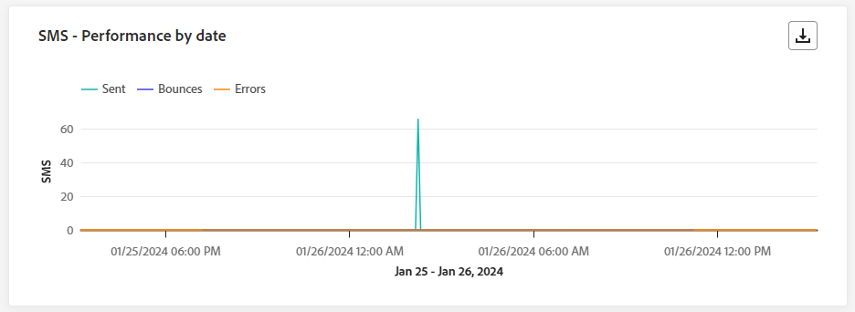

# Rapporto live della campagna {#campaign-live-report}

>[!CONTEXTUALHELP]
>id="ajo_campaign_live_report"
>title="Rapporto live della campagna"
>abstract="Il rapporto live delle campagne consente di misurare e visualizzare in tempo reale l’impatto e le prestazioni di una campagna solo nelle ultime 24 ore. Il rapporto è suddiviso in diversi widget che descrivono il successo e gli errori della campagna. Ogni dashboard di reporting può essere modificata ridimensionando o rimuovendo i widget."

I rapporti live, accessibili dalla scheda Ultime 24 ore, visualizzano gli eventi che si sono verificati nelle ultime 24 ore, con un intervallo di tempo minimo di due minuti dall’occorrenza dell’evento. Al confronto, i rapporti di Customer Journey Analytics si concentrano sugli eventi che si sono verificati almeno due ore fa e coprono gli eventi in un periodo di tempo selezionato.

Puoi accedere al rapporto live della campagna direttamente dalla campagna facendo clic sul pulsante **[!UICONTROL Rapporti]** e selezionando **[!UICONTROL Visualizza ultimo rapporto di 24 ore]**.

La pagina del **[!UICONTROL report live]** della campagna verrà visualizzata con le seguenti schede:

* [Campaign](#campaign-live)
* [E-mail](#email-live)
* [In-app](#inapp-live)
* [Push](#push-live)
* [SMS](#sms-live)
* [Web](#web-tab)
* [Direct mail](#direct-mail-tab)

>[!AVAILABILITY]
>Le campagne orchestrate supportano solo i canali SMS, E-mail e push. Altri canali (in-app, web, direct mailing, ecc.) non sono disponibili nelle campagne orchestrate e non compaiono nei rapporti.

Il **[!UICONTROL report live]** della campagna è suddiviso in diversi widget che descrivono il successo e gli errori della campagna. Ogni widget può essere ridimensionato ed eliminato, se necessario. Per ulteriori informazioni, consulta questa [sezione](../reports/live-report.md#modify-dashboard).

Per un elenco dettagliato di tutte le metriche disponibili in Adobe Journey Optimizer, consulta [questa pagina](live-report.md#live-report).

## Scheda Campagna {#campaign-live}

### Consegna {#delivery-live}

I KPI di **[!UICONTROL Statistiche campagna]** fungono da dashboard completo e offrono una suddivisione dettagliata delle metriche chiave delle ultime 24 ore relative alla campagna. Ciò include informazioni essenziali come il numero di profili e le azioni consegnate, fornendo una comprensione approfondita delle prestazioni e del coinvolgimento della campagna.

+++ Ulteriori informazioni sulle metriche delle statistiche di Campaign

* **[!UICONTROL Pubblico]**: numero di profili target.

* **[!UICONTROL Azioni consegnate]**: numero totale di volte univoche in cui è stata consegnata un&#39;azione.

* **[!UICONTROL Errori]**: numero totale di errori che si sono verificati durante il processo di invio e che ne hanno impedito l&#39;invio ai profili.

+++

<!--
### Experimentation tab (#experimentation-live)

From your Campaign **[!UICONTROL Live report]**, the **[!UICONTROL Experimentation]** tab details the main information relative to how each variant is performing and if there is was winner during the test.
-->

## Scheda e-mail {#email-live}

Dal **[!UICONTROL report live]** della campagna, la scheda **[!UICONTROL E-mail]** fornisce i dettagli delle informazioni principali relative all&#39;e-mail inviata nella campagna.

### E-mail: prestazioni di invio {#email-sending-performance}

>[!CONTEXTUALHELP]
>id="ajo_campaign_live_email_sending_statistics"
>title="E-mail - Statistiche di invio"
>abstract="Il grafico E-mail - Statistiche di invio riepiloga i dati essenziali relativi all’email, ad esempio e-mail mirate o consegnate nelle ultime 24 ore."

L&#39;**[!UICONTROL E-mail - Prestazioni invio]** offre una panoramica completa dei dati relativi alle e-mail inviate nelle ultime 24 ore. Fornisce informazioni approfondite su metriche essenziali, come i messaggi consegnati e non recapitati, consentendo un esame dettagliato del processo di invio delle e-mail.

+++ Ulteriori informazioni sulle metriche delle prestazioni dell’invio di e-mail

* **[!UICONTROL Recapitato]**: numero di e-mail inviate correttamente.

* **[!UICONTROL Mancati recapiti]**: totale degli errori accumulati durante il processo di invio e l&#39;elaborazione della restituzione automatica.

* **[!UICONTROL Nuovi tentativi]**: numero di e-mail in coda per i nuovi tentativi.

* **[!UICONTROL Errori]**: numero totale di errori che si sono verificati durante il processo di invio e che ne hanno impedito l&#39;invio ai profili.
+++

### E-mail - Statistiche

>[!CONTEXTUALHELP]
>id="ajo_campaign_live_email_statistics"
>title="E-mail - Statistiche"
>abstract="La tabella E-mail - Statistiche fornisce dati sull’attività del profilo relativi all’email nelle ultime 24 ore."

La tabella **[!UICONTROL Invio di metriche per e-mail]** offre un riepilogo completo dei dati delle ultime 24 ore. Descrive le metriche essenziali, tra cui le dimensioni del pubblico target e il numero di e-mail consegnate correttamente. Questo fornisce informazioni utili sull’efficacia e la portata delle campagne e-mail.

+++ Ulteriori informazioni su E-mail - Metriche delle statistiche

* **[!UICONTROL Tempo di esecuzione]**: ora di inizio di ogni esecuzione dell&#39;e-mail ricorrente. Per eseguire il targeting solo di una o più e-mail ricorrenti, selezionale dal menu a discesa **[!UICONTROL Tempo di esecuzione]**.

* **[!UICONTROL Destinati]**: numero totale di messaggi elaborati durante il processo di invio.

* **[!UICONTROL Escluso]**: numero di profili utente, esclusi dai profili target, che non hanno ricevuto il messaggio.

* **[!UICONTROL Inviato]**: numero totale di invii.

* **[!UICONTROL Recapitato]**: numero di messaggi inviati correttamente.

* **[!UICONTROL Mancati recapiti]**: totale degli errori accumulati durante il processo di invio e l&#39;elaborazione della restituzione automatica.

* **[!UICONTROL Errori]**: numero totale di errori che si sono verificati durante il processo di invio e che ne hanno impedito l&#39;invio ai profili.

* **[!UICONTROL Aperture]**: numero di volte in cui un messaggio è stato aperto.

* **[!UICONTROL Clic]**: numero di volte in cui è stato fatto clic su un contenuto.

* **[!UICONTROL Annulla iscrizione]**: numero di clic sul collegamento di annullamento dell&#39;iscrizione.

* **[!UICONTROL Reclami spam]**: numero di volte in cui un messaggio è stato dichiarato come spam o posta indesiderata.

* **[!UICONTROL Nuovi tentativi]**: numero di e-mail in coda per i nuovi tentativi.
+++

### E-mail: categorie e motivi di mancato recapito {#bounce-categories}

>[!CONTEXTUALHELP]
>id="ajo_campaign_live_email_bounce_categories"
>title="E-mail - Categorie di mancato recapito"
>abstract="I grafici e la tabella E-mail - Categorie di mancato recapito forniscono dati sugli errori temporanei e permanenti nelle ultime 24 ore."

>[!CONTEXTUALHELP]
>id="ajo_campaign_live_email_bounce_reasons"
>title="E-mail - Motivi di mancato recapito"
>abstract="I grafici e la tabella E-mail - Motivi di mancato recapito contengono i dati disponibili relativi ai messaggi non recapitati nelle ultime 24 ore."

I widget **[!UICONTROL Motivi di mancato recapito]** e **[!UICONTROL Categorie di mancato recapito]** compilano i dati disponibili delle ultime 24 ore relativi ai messaggi non recapitati, fornendo informazioni dettagliate sui motivi specifici e sulle categorie dietro i mancati recapiti e-mail.

Per ulteriori informazioni sui mancati recapiti, consulta la pagina [Elenco di soppressione](../reports/suppression-list.md).

+++ Ulteriori informazioni su E-mail - Categorie di mancato recapito e metriche dei motivi

* **[!UICONTROL Notifica di mancato recapito]**: numero totale di errori permanenti, ad esempio un indirizzo e-mail errato. Ciò comporta un messaggio di errore che indica esplicitamente che l’indirizzo non è valido, ad esempio Utente sconosciuto.

* **[!UICONTROL Mancato recapito non permanente]**: numero totale di errori temporanei, ad esempio una casella in entrata completa.

* **[!UICONTROL Ignorato]**: il numero totale di messaggi temporanei, ad esempio Fuori sede, o un errore tecnico, ad esempio se il tipo di mittente è postmaster.

+++

### E-mail: prestazione per data {#email-performance-date}

>[!CONTEXTUALHELP]
>id="ajo_campaign_live_email_performance_bydate"
>title="E-mail: prestazione per data"
>abstract="Il grafico E-mail: prestazione per data presenta i dati completi sulle ultime 24 ore relative alle e-mail inviate, offrendo informazioni approfondite sulle metriche chiave, come consegnati e mancati recapiti, e consentendo un’analisi dettagliata del processo di consegna delle e-mail."

Il widget **[!UICONTROL E-mail - Prestazioni per data]** offre una panoramica dettagliata delle informazioni chiave relative ai messaggi, presentate tramite un grafico, che fornisce informazioni approfondite sulle tendenze delle prestazioni nelle ultime 24 ore.

+++ Ulteriori informazioni su E-mail - Metriche prestazioni per data e motivi

* **[!UICONTROL Inviato]**: numero totale di invii.

* **[!UICONTROL Recapitato]**: numero di messaggi inviati correttamente.

* **[!UICONTROL Mancati recapiti]**: totale degli errori accumulati durante il processo di invio e l&#39;elaborazione della restituzione automatica.

* **[!UICONTROL Errori]**: numero totale di errori che si sono verificati durante il processo di invio e che ne hanno impedito l&#39;invio ai profili.

* **[!UICONTROL Aperture]**: numero di volte in cui un messaggio è stato aperto.

* **[!UICONTROL Clic]**: numero di volte in cui è stato fatto clic su un contenuto.

* **[!UICONTROL Annullamenti iscrizione]**: numero di clic sul collegamento di annullamento dell&#39;iscrizione.

* **[!UICONTROL Reclami spam]**: numero di volte in cui un messaggio è stato dichiarato come spam o posta indesiderata.

+++

### Motivi di errore {#email-error-reasons}

>[!CONTEXTUALHELP]
>id="ajo_campaign_live_email_error_reasons"
>title="E-mail: motivi di errore"
>abstract="I grafici e la tabella E-mail - Motivi di errore consentono di individuare gli errori che si sono verificati durante il processo di invio nelle ultime 24 ore."

I grafici e le tabelle **[!UICONTROL Cause di errore]** forniscono ad insight informazioni sugli errori specifici che si sono verificati durante il processo di invio nelle ultime 24 ore. Queste informazioni sono utili per comprendere la natura e la frequenza degli errori.

### Motivi di esclusione {#email-exclude-reasons}

>[!CONTEXTUALHELP]
>id="ajo_campaign_live_email_excluded_reasons"
>title="E-mail - Motivi di esclusione"
>abstract="I grafici e la tabella della sezione Motivi di esclusione illustrano i vari fattori a causa dei quali il messaggio non è stato ricevuto dai profili utente che sono stati esclusi dal pubblico target nelle ultime 24 ore."

I grafici e la tabella **[!UICONTROL Motivi di esclusione]** offrono una prospettiva completa sui vari fattori che hanno portato all&#39;esclusione dei profili utente dal pubblico di destinazione nelle ultime 24 ore.

Per un elenco completo dei motivi di esclusione, consulta [questa pagina](exclusion-list.md).

### E-mail - Dominio destinatario migliore {#email-best-recipient}

>[!CONTEXTUALHELP]
>id="ajo_campaign_live_email_best_recipient"
>title="E-mail - Dominio destinatario migliore"
>abstract="Il grafico e la tabella E-mail - Dominio destinatario migliore forniscono un raggruppamento dettagliato dei domini utilizzati più di frequente dai destinatari per aprire l’e-mail, offrendo informazioni utili sul comportamento dei destinatari nelle ultime 24 ore."

Il grafico e la tabella **[!UICONTROL E-mail - Dominio destinatario migliore]** forniscono un&#39;analisi approfondita dei domini utilizzati più di frequente dai profili per aprire le e-mail nelle ultime 24 ore. Questo fornisce informazioni utili sul comportamento del profilo, consentendoti di comprendere le piattaforme preferite.

### E-mail: offerte {#email-offers}

>[!NOTE]
>
>I widget e le metriche delle offerte sono disponibili solo se è stata inserita una decisione in un messaggio e-mail. Per ulteriori informazioni sulla gestione delle decisioni, consulta questa [pagina](../offers/get-started/starting-offer-decisioning.md).

I widget **[!UICONTROL Statistiche offerte]** e **[!UICONTROL Statistiche offerte nel tempo]** misurano il successo della tua offerta e il suo impatto sul pubblico di destinazione. Descrive le informazioni principali relative al messaggio con i KPI.

+++ Ulteriori informazioni su E-mail - Metriche delle offerte

* **[!UICONTROL Offerta inviata]**: numero totale di invii per l&#39;offerta.

* **[!UICONTROL Offer impression]**: numero di volte in cui l&#39;offerta è stata aperta nelle e-mail.

* **[!UICONTROL Clic su offerta]**: numero di volte in cui è stato fatto clic su un&#39;offerta nelle e-mail.

+++

## Scheda in-app {#inapp-live}

Dal **[!UICONTROL report live]** della campagna, la scheda **[!UICONTROL In-app]** fornisce i dettagli delle informazioni principali relative ai messaggi in-app inviati nella campagna.

### Prestazione in-app {#inapp-performance}

>[!CONTEXTUALHELP]
>id="ajo_campaign_live_inapp_performance"
>title="Prestazione in-app"
>abstract="I KPI della sezione Prestazioni in-app forniscono informazioni essenziali sul coinvolgimento dei visitatori con i messaggi in-app delle ultime 24 ore."

I KPI **[!UICONTROL prestazioni in-app]** forniscono informazioni essenziali sul coinvolgimento dei profili con i messaggi in-app nelle ultime 24 ore, fornendo metriche essenziali per valutare l&#39;efficacia e l&#39;impatto delle campagne in-app.

+++ Ulteriori informazioni sulle metriche delle prestazioni in-app

* **[!UICONTROL Impression]**: numero totale di messaggi in-app inviati a tutti gli utenti.

* **[!UICONTROL Interazioni]**: numero totale di engagement con il messaggio in-app. Ciò include tutte le azioni intraprese dagli utenti, come clic, revoche o qualsiasi altra interazione.

+++

### Riepilogo in-app {#inapp-summary}

>[!CONTEXTUALHELP]
>id="ajo_campaign_live_inapp_summary"
>title="Riepilogo in-app"
>abstract="Il grafico della sezione Riepilogo in-app illustra la progressione delle impression e delle interazioni in-app nelle ultime 24 ore."

Il grafico **[!UICONTROL Riepilogo in-app]** illustra la progressione delle impression e delle interazioni in-app nelle ultime 24 ore, fornendo una panoramica completa delle prestazioni dei messaggi in-app.

+++ Ulteriori informazioni sulle metriche di riepilogo in-app

* **[!UICONTROL Impression]**: numero totale di messaggi in-app recapitati a tutti gli utenti.

* **[!UICONTROL Interazioni]**: numero totale di engagement con il messaggio in-app. Ciò include tutte le azioni intraprese dagli utenti, come clic, revoche o qualsiasi altra interazione.

+++

### Interazioni per tipo {#inapp-interactions}

>[!CONTEXTUALHELP]
>id="ajo_campaign_live_inapp_interactions"
>title="Interazioni per tipo"
>abstract="I grafici e le tabelle della sezione Interazioni per tipo descrivono nel dettaglio il modo in cui gli utenti hanno interagito con il messaggio in-app, tracciando eventuali clic, annullamenti o interazioni delle ultime 24 ore."

I grafici e la tabella **[!UICONTROL Interazioni per tipo]** forniscono un resoconto dettagliato dell&#39;interazione dei profili con il messaggio in-app nelle ultime 24 ore, tracciando azioni quali clic, licenziamenti o altre forme di coinvolgimento.

## Scheda notifica push {#push-live}

Dal **[!UICONTROL rapporto live]** della campagna, la scheda **[!UICONTROL Notifica push]** fornisce i dettagli delle informazioni principali relative alla notifica push inviata nella campagna.

### Notifica push: prestazione di invio {#push-sending-performance}

>[!CONTEXTUALHELP]
>id="ajo_campaign_live_push_sending_performance"
>title="Notifica push: prestazione di invio"
>abstract="Il grafico delle prestazioni di invio delle notifiche push riassume i dati essenziali relativi alle notifiche push, come Errori o Messaggi consegnati nelle ultime 24 ore."

Il grafico delle prestazioni di invio delle **[!UICONTROL notifiche push]** offre una panoramica completa dei dati relativi alle notifiche push inviate nelle ultime 24 ore. Fornisce informazioni approfondite su metriche essenziali come consegnate e non consegnate, consentendo un esame dettagliato del processo di invio delle notifiche push.

+++ Ulteriori informazioni sulla notifica push - Invio delle metriche delle prestazioni

* **[!UICONTROL Recapitato]**: numero di messaggi inviati correttamente.

* **[!UICONTROL Mancati recapiti]**: totale degli errori accumulati durante il processo di invio e l&#39;elaborazione della restituzione automatica.

* **[!UICONTROL Errori]**: numero totale di errori che si sono verificati durante il processo di invio e che ne hanno impedito l&#39;invio ai profili.

+++

### Notifica push - Statistiche {#push-statistics}

>[!CONTEXTUALHELP]
>id="ajo_campaign_live_push_statistics"
>title="Notifica push - Statistiche"
>abstract="La tabella delle statistiche sulle notifiche push fornisce dati sull’attività del destinatario relativi alla notifica push nelle ultime 24 ore."

La tabella **[!UICONTROL Notifica push - Statistiche]** fornisce un riepilogo conciso dei dati essenziali relativi alle notifiche push nelle ultime 24 ore, incluse le metriche chiave quali il numero di messaggi di destinazione e il numero di messaggi consegnati correttamente.

+++ Ulteriori informazioni sulla notifica push: metriche delle statistiche

* **[!UICONTROL Tempo di esecuzione]**: ora di inizio di ogni esecuzione della notifica push ricorrente. Per eseguire il targeting solo di una o più notifiche push ricorrenti, selezionala dal menu a discesa **[!UICONTROL Tempo di esecuzione]**.

* **[!UICONTROL Destinati]**: numero totale di messaggi elaborati durante il processo di invio.

* **[!UICONTROL Escluso]**: numero di profili utente, esclusi dai profili target, che non hanno ricevuto il messaggio.

* **[!UICONTROL Inviato]**: numero totale di invii.

* **[!UICONTROL Recapitato]**: numero di messaggi inviati correttamente.

* **[!UICONTROL Mancati recapiti]**: totale degli errori accumulati durante il processo di invio e l&#39;elaborazione della restituzione automatica.

* **[!UICONTROL Errori]**: numero totale di errori che si sono verificati durante il processo di invio e che ne hanno impedito l&#39;invio ai profili.

* **[!UICONTROL Aperture]**: numero di volte in cui un messaggio è stato aperto.

+++

### Notifica push: riepilogo di invio {#push-sending-summary}

>[!CONTEXTUALHELP]
>id="ajo_campaign_live_push_sending_summary"
>title="Notifica push: riepilogo di invio"
>abstract="Il grafico di riepilogo dell’invio delle notifiche push visualizza i dati disponibili per le notifiche push inviate nelle ultime 24 ore."

Il grafico **[!UICONTROL Notifica push - Statistiche]** offre una rappresentazione dinamica, con un&#39;analisi dell&#39;attività delle notifiche push nelle ultime 24 ore. Questa rappresentazione grafica fornisce un raggruppamento completo delle notifiche push inviate.

+++ Ulteriori informazioni sulle notifiche push - Invio di metriche di riepilogo

* **[!UICONTROL Aperture]**: numero di volte in cui la notifica push è stata aperta.

* **[!UICONTROL Azioni]**: numero totale di azioni nella notifica push consegnate, ad esempio clic su un pulsante o chiusura.

* **[!UICONTROL Mancati recapiti]**: totale degli errori cumulativi ed elaborazione automatica dei resi in relazione al numero totale di messaggi inviati.

* **[!UICONTROL Consegnato]**: numero di messaggi inviati correttamente rispetto al numero totale di messaggi inviati.

* **[!UICONTROL Errori]**: numero totale di errori che ne hanno impedito l&#39;invio ai profili.

+++

### Notifica push: motivi di esclusione {#push-excluded}

>[!CONTEXTUALHELP]
>id="ajo_campaign_live_push_excluded_reasons"
>title="Notifica push: motivi di esclusione"
>abstract="I grafici e la tabella della sezione Motivi di esclusione illustrano i vari fattori a causa dei quali il messaggio non è stato ricevuto dai profili utente che sono stati esclusi dal pubblico target nelle ultime 24 ore."

I grafici e la tabella **[!UICONTROL Motivi di esclusione]** mostrano i diversi motivi che hanno impedito ai profili utente, esclusi dai profili target, di ricevere le notifiche push nelle ultime 24 ore.

Per un elenco completo dei motivi di esclusione, consulta [questa pagina](exclusion-list.md).

### Notifica push: motivi di errore {#push-error}

>[!CONTEXTUALHELP]
>id="ajo_campaign_live_push_error_reasons"
>title="Notifica push: motivi di errore"
>abstract="I grafici e la tabella Motivi di errore consentono di individuare gli errori specifici che si sono verificati nelle ultime 24 ore durante il processo di invio."

La tabella e i grafici **[!UICONTROL Motivi di errore]** consentono di identificare gli errori specifici che si sono verificati durante il processo di invio delle notifiche push nelle ultime 24 ore, fornendo informazioni dettagliate su eventuali problemi riscontrati durante il processo.

### Notifica push: raggruppamento per piattaforma {#push-breakdown-platform}

>[!CONTEXTUALHELP]
>id="ajo_campaign_live_push_breakdown_platform"
>title="Notifica push: raggruppamento per piattaforma"
>abstract="La tabella e i grafici della sezione Raggruppamento per piattaforma forniscono un riepilogo del buon esito delle notifiche push nelle ultime 24 ore, in base al sistema operativo del destinatario."

Il grafico e la tabella **[!UICONTROL Notifica push - Raggruppamento per piattaforma]** forniscono un&#39;analisi dettagliata del successo delle notifiche push nelle ultime 24 ore, con informazioni basate sul sistema operativo del tuo profilo. Questo raggruppamento migliora la comprensione delle prestazioni delle notifiche push tra le diverse piattaforme.

+++ Ulteriori informazioni sulla notifica push: suddivisione per metriche della piattaforma

* **[!UICONTROL Destinati]**: numero totale di messaggi elaborati durante l&#39;analisi.

* **[!UICONTROL Consegnato]**: numero di messaggi inviati correttamente rispetto al numero totale di messaggi inviati.

* **[!UICONTROL Aperture]**: numero di volte in cui la notifica push è stata aperta.

* **[!UICONTROL Azioni]**: numero totale di azioni nella notifica push consegnate, ad esempio clic su un pulsante o chiusura.

* **[!UICONTROL Mancati recapiti]**: totale degli errori cumulativi ed elaborazione automatica dei resi in relazione al numero totale di messaggi inviati.

* **[!UICONTROL Errori]**: numero totale di errori che ne hanno impedito l&#39;invio ai profili.

* **[!UICONTROL Esclusi]**: numero di profili esclusi da Adobe Journey Optimizer.

+++

## Scheda SMS {#sms-live}

Dal **[!UICONTROL report live]** della campagna, la scheda **[!UICONTROL SMS]** fornisce i dettagli delle informazioni principali relative al messaggio SMS inviato nella campagna.

### SMS: statistiche {#sms-statistics}

>[!CONTEXTUALHELP]
>id="ajo_campaign_live_sms_statistics"
>title="SMS: statistiche"
>abstract="La tabella Statistiche di invio SMS riepiloga i dati essenziali relativi ai messaggi SMS, ad esempio Target o Messaggi consegnati, delle ultime 24 ore."

La tabella **[!UICONTROL SMS - Statistiche]** fornisce un riepilogo conciso dei dati essenziali relativi ai messaggi SMS nelle ultime 24 ore, includendo metriche chiave quali il numero di messaggi di destinazione e il numero di messaggi consegnati correttamente.

+++ Ulteriori informazioni su SMS - Metriche delle statistiche

* **[!UICONTROL Tempo di esecuzione]**: ora di inizio di ogni esecuzione del messaggio SMS ricorrente. Per eseguire il targeting solo di uno o più messaggi SMS ricorrenti, selezionali dal menu a discesa **[!UICONTROL Tempo di esecuzione]**.

* **[!UICONTROL Destinati]**: numero di profili utente qualificati come profili target.

* **[!UICONTROL Escluso]**: numero di profili utente, esclusi dai profili target, che non hanno ricevuto il messaggio.

* **[!UICONTROL Inviato]**: numero totale di invii.

* **[!UICONTROL Mancati recapiti]**: totale degli errori accumulati durante il processo di invio e l&#39;elaborazione della restituzione automatica.

* **[!UICONTROL Errori]**: numero totale di errori che si sono verificati durante il processo di invio e che ne hanno impedito l&#39;invio ai profili.

* **[!UICONTROL Clic]**: numero totale di visite URL.

+++

### SMS: prestazione per data {#sms-perfomance-date}

>[!CONTEXTUALHELP]
>id="ajo_campaign_live_sms_performance"
>title="SMS: prestazione per data"
>abstract="Il widget Prestazioni SMS per data rappresenta graficamente le informazioni chiave delle ultime 24 ore relative ai messaggi."

Il widget Prestazioni **[!UICONTROL SMS per data]** offre una panoramica dettagliata delle informazioni chiave relative ai messaggi, presentate tramite un grafico, che fornisce informazioni approfondite sulle tendenze delle prestazioni nelle ultime 24 ore.

+++ Ulteriori informazioni sulla funzione SMS - Metriche delle prestazioni per data

* **[!UICONTROL Inviato]**: numero totale di invii.

* **[!UICONTROL Mancati recapiti]**: totale degli errori accumulati durante il processo di invio e l&#39;elaborazione della restituzione automatica.

* **[!UICONTROL Errori]**: numero totale di errori che si sono verificati durante il processo di invio e che ne hanno impedito l&#39;invio ai profili.

+++

### SMS: motivi di errore {#sms-error-reasons}

>[!CONTEXTUALHELP]
>id="ajo_campaign_live_sms_error_reasons"
>title="SMS: motivi di errore"
>abstract="I grafici e la tabella SMS - Motivi di errore consentono di individuare gli errori specifici che si sono verificati nelle ultime 24 ore durante il processo di consegna."

I grafici e la tabella **[!UICONTROL Motivi di esclusione]** consentono di identificare gli errori specifici che si sono verificati durante il processo di invio dei messaggi SMS nelle ultime 24 ore, semplificando un&#39;analisi approfondita di eventuali problemi riscontrati.

### SMS: motivi di esclusione {#sms-excluded-reasons}

>[!CONTEXTUALHELP]
>id="ajo_campaign_live_sms_excluded_reasons"
>title="SMS: motivi di esclusione"
>abstract="I grafici e la tabella della sezione Motivi di esclusione illustrano i vari fattori a causa dei quali il messaggio non è stato ricevuto dai profili utente che sono stati esclusi dal pubblico target nelle ultime 24 ore."

I grafici e la tabella **[!UICONTROL Motivi di esclusione]** illustrano visivamente i diversi fattori che hanno portato all&#39;esclusione dei profili utente dal pubblico di destinazione, impedendo loro di ricevere i messaggi SMS nelle ultime 24 ore.

Per un elenco completo dei motivi di esclusione, consulta [questa pagina](exclusion-list.md).

### SMS: motivi di mancato recapito {#sms-bounces-reasons}

>[!CONTEXTUALHELP]
>id="ajo_campaign_live_sms_bounces_reasons"
>title="SMS: motivi di mancato recapito"
>abstract="I grafici e la tabella della sezione Motivi di mancato recapito contengono i dati disponibili per e ultime 24 ore relativi ai messaggi non recapitati."

I grafici e la tabella **[!UICONTROL Motivi di mancato recapito]** forniscono una panoramica completa dei dati relativi ai messaggi SMS non recapitati, fornendo informazioni utili sulle ragioni specifiche alla base delle istanze di messaggi SMS non recapitati nelle ultime 24 ore.

## Scheda web {#web-tab}

Dal **[!UICONTROL report live]** della campagna, la scheda **[!UICONTROL Web]** fornisce i dettagli delle informazioni principali relative alle pagine Web.

### Prestazione web {#web-performance}

>[!CONTEXTUALHELP]
>id="ajo_campaign_live_web_performance"
>title="Prestazione web"
>abstract="I KPI della sezione Prestazioni web forniscono informazioni complete sul coinvolgimento dei visitatori con le esperienze web nelle ultime 24´ore."

I KPI **[!UICONTROL Prestazioni web]** offrono informazioni complete sul coinvolgimento dei visitatori con le pagine web nelle ultime 24 ore, comprendendo metriche chiave quali impressioni e interazioni.

+++ Ulteriori informazioni sulle metriche delle prestazioni web

* **[!UICONTROL Impression]**: numero totale di esperienze Web distribuite a tutti gli utenti.

* **[!UICONTROL Interazioni]**: numero totale di impegni con la pagina Web. Ciò include qualsiasi azione eseguita dagli utenti, ad esempio clic o altre interazioni.

+++ 

### Riepilogo web {#web-summary}

>[!CONTEXTUALHELP]
>id="ajo_campaign_live_web_summary"
>title="Riepilogo web"
>abstract="Il grafico Riepilogo web illustra la progressione delle esperienze web, incluse impression, impression univoche e interazioni, per le ultime 24 ore."

Il grafico **[!UICONTROL Riepilogo Web]** mostra l&#39;evoluzione delle esperienze Web (impression, impressioni e interazioni univoche) nelle ultime 24 ore.

+++ Ulteriori informazioni sulle metriche di riepilogo web

* **[!UICONTROL Impression]**: numero totale di esperienze Web distribuite a tutti gli utenti.

* **[!UICONTROL Interazioni]**: numero totale di impegni con la pagina Web. Ciò include qualsiasi azione eseguita dagli utenti, ad esempio clic o altre interazioni.

+++ 

### Interazioni per elemento {#web-interactions}

>[!CONTEXTUALHELP]
>id="ajo_campaign_live_web_interactions"
>title="Interazioni per elemento"
>abstract="La tabella Interazioni per elemento fornisce informazioni chiave sul coinvolgimento dei visitatori con diversi elementi delle pagine web nelle ultime 24 ore."

La tabella **[!UICONTROL Interazioni per elemento]** presenta informazioni complete sul coinvolgimento dei visitatori con i vari elementi presenti nelle pagine Web nelle ultime 24 ore, offrendo informazioni utili sulle interazioni e le preferenze degli utenti.

## Scheda direct mail {#direct-mail-tab}

Dal **[!UICONTROL Live Report]** della campagna, la scheda **[!UICONTROL Direct mail]** fornisce i dettagli delle informazioni principali relative alla direct mailing.

### Direct mail - Statistiche di invio {#direct-mail-sending}

>[!CONTEXTUALHELP]
>id="ajo_campaign_live_direct_sending_statistics"
>title="Direct mail - Statistiche di invio"
>abstract="La tabella della sezione Direct mail - Statistiche di invio riepiloga i dati essenziali delle ultime 24 ore relativi ai messaggi direct mail, ad esempio Target o Messaggi consegnati."

La tabella **[!UICONTROL Direct Mail - Statistiche di invio]** fornisce un riepilogo sintetico dei dati essenziali relativi ai messaggi Direct Mail, includendo metriche chiave quali il numero di messaggi di destinazione e il numero di messaggi consegnati correttamente nelle ultime 24 ore.

+++ Ulteriori informazioni sulla direct mailing - Metriche delle statistiche di invio

* **[!UICONTROL Destinati]**: numero di profili utente qualificati come profili target.

* **[!UICONTROL Inviato]**: numero totale di invii.

* **[!UICONTROL Errori]**: numero totale di errori che si sono verificati durante il processo di invio e che ne hanno impedito l&#39;invio ai profili.

* **[!UICONTROL Escluso]**: numero di profili utente, esclusi dai profili target, che non hanno ricevuto la direct mailing.

+++

### Direct mail: motivi di errore {#direct-mail-error-reasons}

>[!CONTEXTUALHELP]
>id="ajo_campaign_live_direct_error_reasons"
>title="Direct mail: motivi di errore"
>abstract="I grafici e la tabella della sezione Direct mail - Motivi di errore consentono di individuare gli errori che si sono verificati nelle ultime 24 ore."

I grafici e la tabella **[!UICONTROL Direct mailing - Error reason]** forniscono i mezzi per identificare errori specifici che si sono verificati durante il processo di invio dei messaggi di direct mailing, consentendo un&#39;analisi dettagliata di tutti i problemi riscontrati nelle ultime 24 ore.

### Direct mail: motivi di esclusione {#direct-mail-excluded-reasons}

>[!CONTEXTUALHELP]
>id="ajo_campaign_live_direct_excluded_reasons"
>title="Direct mail: motivi di esclusione"
>abstract="I grafici e la tabella della sezione Direct mail - Motivi di esclusione illustrano i vari fattori a causa dei quali il messaggio non è stato ricevuto dai profili utente che sono stati esclusi dal pubblico target, per le ultime 24 ore."

I grafici e la tabella **[!UICONTROL Direct mailing - Excluded reason]** illustrano visivamente i vari fattori che hanno determinato l&#39;esclusione dei profili utente dal pubblico di destinazione, impedendo loro di ricevere i messaggi di direct mailing nelle ultime 24 ore.

Per un elenco completo dei motivi di esclusione, consulta [questa pagina](exclusion-list.md).

## Risorse aggiuntive

* [Introduzione alle campagne](../campaigns/get-started-with-campaigns.md)
* [Creare una campagna](../campaigns/create-campaign.md)
* [Creare campagne attivate da API](../campaigns/api-triggered-campaigns.md)
* [Modificare o interrompere una campagna](../campaigns/manage-campaigns.md)
* [Rapporto campagna](campaign-global-report-cja.md)
