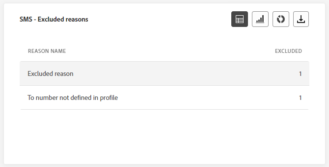
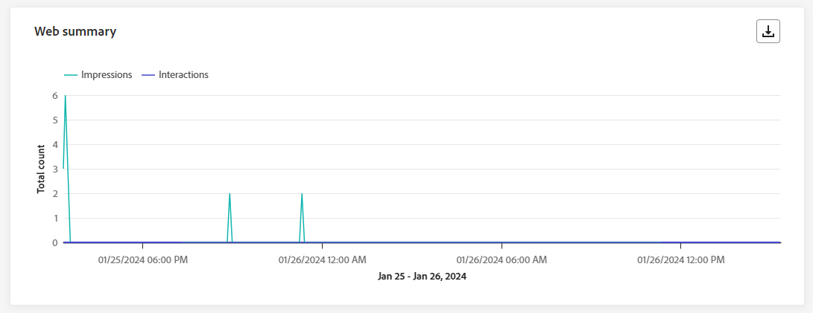
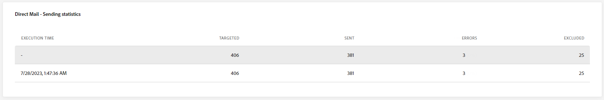
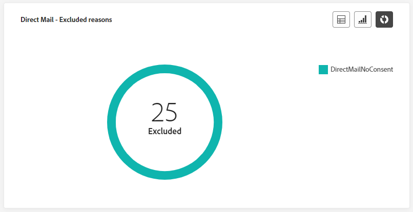

# Rapporto live della campagna {#campaign-live-report}

>[!CONTEXTUALHELP]
>id="ajo_campaign_live_report"
>title="Rapporto live della campagna"
>abstract="Il rapporto live delle campagne consente di misurare e visualizzare in tempo reale l’impatto e le prestazioni di una campagna solo nelle ultime 24 ore. Il rapporto è suddiviso in diversi widget che descrivono il successo e gli errori della campagna. Ogni dashboard di reporting può essere modificata ridimensionando o spostando i widget."

I rapporti live, accessibili dalla scheda Ultime 24 ore, visualizzano gli eventi che si sono verificati nelle ultime 24 ore, con un intervallo di tempo minimo di due minuti dall’occorrenza dell’evento. Al confronto, i rapporti globali si concentrano sugli eventi che si sono verificati almeno due ore fa e coprono gli eventi in un periodo di tempo selezionato.

Il rapporto live della campagna è accessibile direttamente dalla campagna con **[!UICONTROL Vista live]** pulsante.

La campagna **[!UICONTROL Rapporto live]** La pagina verrà visualizzata con le seguenti schede:

* [Campaign](#campaign-live)
* [E-mail](#email-live)
* [In-app](#inapp-live)
* [Push](#push-live)
* [SMS](#sms-live)
* [Web](#web-tab)
* [Direct mail](#direct-mail-tab)

La campagna **[!UICONTROL Rapporto live]** è diviso in diversi widget che descrivono nel dettaglio il successo e gli errori della campagna. Ogni widget può essere ridimensionato ed eliminato, se necessario. Per ulteriori informazioni, consulta questa [sezione](../reports/live-report.md#modify-dashboard).

Per un elenco dettagliato di tutte le metriche disponibili in Adobe Journey Optimizer, consulta [questa pagina](live-report.md#list-of-components-live).

## Scheda Campagna {#campaign-live}

### Distribuzione {#delivery-live}

Il **[!UICONTROL Statistiche della campagna]** I KPI fungono da dashboard completo e offrono una suddivisione dettagliata delle metriche chiave delle ultime 24 ore relative alla campagna. Ciò include informazioni essenziali come il numero di profili e le azioni consegnate, fornendo una comprensione approfondita delle prestazioni e del coinvolgimento della campagna.

+++ Ulteriori informazioni sulle metriche delle statistiche di Campaign

* **[!UICONTROL Pubblico]**: numero di profili target.

* **[!UICONTROL Azioni consegnate]**: numero totale di volte in cui è stata consegnata un’azione.

* **[!UICONTROL Errori]**: numero totale di errori che si sono verificati durante il processo di invio e che ne hanno impedito l’invio ai profili.

+++

<!--
### Experimentation tab (#experimentation-live)

From your Campaign **[!UICONTROL Live report]**, the **[!UICONTROL Experimentation]** tab details the main information relative to how each variant is performing and if there is was winner during the test.
-->

## Scheda e-mail {#email-live}

Dalla campagna **[!UICONTROL Rapporto live]**, il **[!UICONTROL E-mail]** La scheda contiene le informazioni principali relative all’e-mail inviata nella campagna.

### E-mail - Prestazioni di invio {#email-sending-performance}

>[!CONTEXTUALHELP]
>id="ajo_campaign_live_email_sending_statistics"
>title="E-mail - Statistiche di invio"
>abstract="Il grafico E-mail - Statistiche di invio riepiloga i dati essenziali relativi all’email, ad esempio e-mail mirate o consegnate nelle ultime 24 ore."

Il **[!UICONTROL E-mail - Prestazioni di invio]** offre una panoramica completa dei dati relativi alle e-mail inviate nelle ultime 24 ore. Fornisce informazioni approfondite su metriche essenziali, come i messaggi consegnati e non recapitati, consentendo un esame dettagliato del processo di invio delle e-mail.

+++ Ulteriori informazioni sulle metriche delle prestazioni dell’invio di e-mail

* **[!UICONTROL Consegnato]**: numero di e-mail inviate correttamente.

* **[!UICONTROL Mancati recapiti]**: totale degli errori accumulati durante il processo di invio e l’elaborazione automatica della restituzione.

* **[!UICONTROL Nuovi tentativi]**: numero di e-mail nella coda per i nuovi tentativi.

* **[!UICONTROL Errori]**: numero totale di errori che si sono verificati durante il processo di invio e che ne hanno impedito l’invio ai profili.
+++

### E-mail - Statistiche

>[!CONTEXTUALHELP]
>id="ajo_campaign_live_email_statistics"
>title="E-mail - Statistiche"
>abstract="La tabella E-mail - Statistiche fornisce dati sull’attività del profilo relativi all’email nelle ultime 24 ore."

Il **[!UICONTROL Metriche di invio per e-mail]** la tabella offre un riepilogo completo dei dati delle ultime 24 ore. Descrive le metriche essenziali, tra cui le dimensioni del pubblico target e il numero di e-mail consegnate correttamente. Questo fornisce informazioni utili sull’efficacia e la portata delle campagne e-mail.

+++ Ulteriori informazioni su E-mail - Metriche delle statistiche

* **[!UICONTROL Tempo di esecuzione]**: ora di inizio di ogni esecuzione dell’e-mail ricorrente. Per eseguire il targeting di una o più e-mail ricorrenti, selezionala dall’opzione **[!UICONTROL Tempo di esecuzione]** a discesa.

* **[!UICONTROL Target]**: numero totale di messaggi elaborati durante il processo di invio.

* **[!UICONTROL Escluso]**: numero di profili utente, esclusi dai profili target, che non hanno ricevuto il messaggio.

* **[!UICONTROL Inviato]**: numero totale di invii.

* **[!UICONTROL Consegnato]**: numero di messaggi inviati correttamente.

* **[!UICONTROL Mancati recapiti]**: totale degli errori accumulati durante il processo di invio e l’elaborazione automatica della restituzione.

* **[!UICONTROL Errori]**: numero totale di errori che si sono verificati durante il processo di invio e che ne hanno impedito l’invio ai profili.

* **[!UICONTROL Aperture]**: numero di volte in cui un messaggio è stato aperto.

* **[!UICONTROL Clic]**: numero di volte in cui è stato fatto clic su un contenuto.

* **[!UICONTROL Annulla iscrizione]**: numero di clic sul collegamento di annullamento dell’abbonamento.

* **[!UICONTROL Reclami spam]**: numero di volte in cui un messaggio è stato dichiarato come spam o posta indesiderata.

* **[!UICONTROL Nuovi tentativi]**: numero di e-mail nella coda per i nuovi tentativi.
+++

### E-mail - Categorie e motivi di mancato recapito {#bounce-categories}

>[!CONTEXTUALHELP]
>id="ajo_campaign_live_email_bounce_categories"
>title="E-mail - Categorie di mancato recapito"
>abstract="I grafici e la tabella E-mail - Categorie di mancato recapito forniscono dati sugli errori temporanei e permanenti nelle ultime 24 ore."

>[!CONTEXTUALHELP]
>id="ajo_campaign_live_email_bounce_reasons"
>title="E-mail - Motivi di mancato recapito"
>abstract="I grafici e la tabella E-mail - Motivi di mancato recapito contengono i dati disponibili relativi ai messaggi non recapitati nelle ultime 24 ore."

Il **[!UICONTROL Motivi di mancato recapito]** e **[!UICONTROL Categorie di mancato recapito]** i widget compilano i dati disponibili delle ultime 24 ore relativi ai messaggi non recapitati, fornendo informazioni dettagliate sui motivi specifici e sulle categorie dietro le e-mail non recapitate.

Per ulteriori informazioni sui mancati recapiti, consulta [Elenco di soppressione](../reports/suppression-list.md) pagina.

+++ Ulteriori informazioni su E-mail - Categorie di mancato recapito e metriche dei motivi

* **[!UICONTROL Mancato recapito permanente]**: numero totale di errori permanenti, ad esempio un indirizzo e-mail errato. Ciò comporta un messaggio di errore che indica esplicitamente che l’indirizzo non è valido, ad esempio Utente sconosciuto.

* **[!UICONTROL Mancato recapito non permanente]**: numero totale di errori temporanei, ad esempio una casella in entrata completa.

* **[!UICONTROL Ignorato]**: numero totale di messaggi temporanei, ad esempio Fuori sede, o un errore tecnico, ad esempio se il tipo di mittente è postmaster.

+++

### E-mail - Prestazioni per data {#email-performance-date}

>[!CONTEXTUALHELP]
>id="ajo_campaign_live_email_performance_bydate"
>title="E-mail - Prestazioni per data"
>abstract="Il grafico E-mail - Prestazioni per data presenta dati completi sulle ultime 24 ore relative alle e-mail inviate, fornendo informazioni approfondite su metriche chiave quali recapitato e non recapitato, consentendo un’analisi dettagliata del processo di invio delle e-mail."

Il **[!UICONTROL E-mail - Prestazioni per data]** widget offre una panoramica dettagliata delle informazioni chiave relative ai messaggi, presentate tramite un grafico, che fornisce informazioni sulle tendenze delle prestazioni nelle ultime 24 ore.

+++ Ulteriori informazioni su E-mail - Metriche prestazioni per data e motivi

* **[!UICONTROL Inviato]**: numero totale di invii.

* **[!UICONTROL Consegnato]**: numero di messaggi inviati correttamente.

* **[!UICONTROL Mancati recapiti]**: totale degli errori accumulati durante il processo di invio e l’elaborazione automatica della restituzione.

* **[!UICONTROL Errori]**: numero totale di errori che si sono verificati durante il processo di invio e che ne hanno impedito l’invio ai profili.

* **[!UICONTROL Aperture]**: numero di volte in cui un messaggio è stato aperto.

* **[!UICONTROL Clic]**: numero di volte in cui è stato fatto clic su un contenuto.

* **[!UICONTROL Annullamenti iscrizione]**: numero di clic sul collegamento di annullamento dell’abbonamento.

* **[!UICONTROL Reclami spam]**: numero di volte in cui un messaggio è stato dichiarato come spam o posta indesiderata.

+++

### Motivi di errore {#email-error-reasons}

>[!CONTEXTUALHELP]
>id="ajo_campaign_live_email_error_reasons"
>title="E-mail - Motivi di errore"
>abstract="I grafici e la tabella E-mail - Motivi di errore consentono di individuare gli errori che si sono verificati durante il processo di invio nelle ultime 24 ore."

Il **[!UICONTROL Motivi di errore]** I grafici e le tabelle forniscono informazioni sugli errori specifici che si sono verificati durante il processo di invio nelle ultime 24 ore. Queste informazioni sono utili per comprendere la natura e la frequenza degli errori.

### Motivi di esclusione {#email-exclude-reasons}

>[!CONTEXTUALHELP]
>id="ajo_campaign_live_email_excluded_reasons"
>title="E-mail - Motivi di esclusione"
>abstract="I grafici e la tabella Motivi di esclusione illustrano i vari fattori a causa di quali il messaggio non è stato ricevuto dai profili utente che sono stati esclusi dal pubblico target nelle ultime 24 ore."

Il **[!UICONTROL Motivi di esclusione]** grafici e tabelle offrono una prospettiva completa sui vari fattori che hanno portato all’esclusione dei profili utente dal pubblico di destinazione nelle ultime 24 ore.

Fai riferimento a [questa pagina](exclusion-list.md) per l’elenco completo dei motivi di esclusione.

### E-mail - Dominio destinatario migliore {#email-best-recipient}

>[!CONTEXTUALHELP]
>id="ajo_campaign_live_email_best_recipient"
>title="E-mail - Dominio destinatario migliore"
>abstract="Il grafico e la tabella E-mail - Dominio destinatario migliore forniscono un raggruppamento dettagliato dei domini utilizzati più di frequente dai destinatari per aprire l’e-mail, offrendo informazioni utili sul comportamento dei destinatari nelle ultime 24 ore."

Il **[!UICONTROL E-mail - Dominio destinatario migliore]** Il grafico e la tabella forniscono un’analisi approfondita dei domini utilizzati più di frequente dai profili per aprire le e-mail nelle ultime 24 ore. Questo fornisce informazioni utili sul comportamento del profilo, consentendoti di comprendere le piattaforme preferite.

### E-mail - Offerte {#email-offers}

>[!NOTE]
>
>I widget e le metriche delle offerte sono disponibili solo se è stata inserita una decisione in un messaggio e-mail. Per ulteriori informazioni sulla gestione delle decisioni, consulta questa [pagina](../offers/get-started/starting-offer-decisioning.md).

Il **[!UICONTROL Statistica sulle offerte]** e **[!UICONTROL Statistiche sulle offerte nel tempo]** i widget misurano il successo e l’impatto dell’offerta sul pubblico di destinazione. Descrive le informazioni principali relative al messaggio con i KPI.

+++ Ulteriori informazioni su E-mail - Metriche delle offerte

* **[!UICONTROL Offerta inviata]**: numero totale di invii per l’offerta.

* **[!UICONTROL Impression offerta]**: numero di volte in cui l’offerta è stata aperta nelle e-mail.

* **[!UICONTROL Clic sull’offerta]**: numero di volte in cui hai fatto clic su un’offerta nelle e-mail.

+++

## Scheda in-app {#inapp-live}

Dalla campagna **[!UICONTROL Rapporto live]**, il **[!UICONTROL In-app]** Questa scheda contiene le informazioni principali relative ai messaggi in-app inviati nella campagna.

### Prestazioni in-app {#inapp-performance}

>[!CONTEXTUALHELP]
>id="ajo_campaign_live_inapp_performance"
>title="Prestazioni in-app"
>abstract="I KPI della sezione Prestazioni in-app forniscono informazioni essenziali sul coinvolgimento dei visitatori con i messaggi in-app delle ultime 24 ore."

Il **[!UICONTROL Prestazioni in-app]** I KPI forniscono informazioni essenziali sul coinvolgimento dei profili con i messaggi in-app nelle ultime 24 ore, fornendo metriche essenziali per valutare l’efficacia e l’impatto delle campagne in-app.

+++ Ulteriori informazioni sulle metriche delle prestazioni in-app

* **[!UICONTROL Impression]**: numero totale di messaggi in-app inviati a tutti gli utenti.

* **[!UICONTROL Interazioni]**: numero totale di engagement con il messaggio in-app. Ciò include tutte le azioni intraprese dagli utenti, come clic, revoche o qualsiasi altra interazione.

+++

### Riepilogo in-app {#inapp-summary}

>[!CONTEXTUALHELP]
>id="ajo_campaign_live_inapp_summary"
>title="Riepilogo in-app"
>abstract="Il grafico della sezione Riepilogo in-app illustra la progressione delle impression e delle interazioni in-app nelle ultime 24 ore."

Il **[!UICONTROL Riepilogo in-app]** Il grafico illustra la progressione delle impression e delle interazioni in-app nelle ultime 24 ore, fornendo una panoramica completa delle prestazioni dei messaggi in-app.

+++ Ulteriori informazioni sulle metriche di riepilogo in-app

* **[!UICONTROL Impression]**: numero totale di messaggi in-app consegnati a tutti gli utenti.

* **[!UICONTROL Interazioni]**: numero totale di engagement con il messaggio in-app. Ciò include tutte le azioni intraprese dagli utenti, come clic, revoche o qualsiasi altra interazione.

+++

### Interazioni per tipo {#inapp-interactions}

>[!CONTEXTUALHELP]
>id="ajo_campaign_live_inapp_interactions"
>title="Interazioni per tipo"
>abstract="I grafici e le tabelle della sezione Interazioni per tipo descrivono nel dettaglio il modo in cui gli utenti hanno interagito con il messaggio in-app, tracciando eventuali clic, annullamenti o interazioni delle ultime 24 ore."

Il **[!UICONTROL Interazioni per tipo]** grafici e tabelle forniscono un resoconto dettagliato dell’interazione dei profili con il messaggio in-app nelle ultime 24 ore, tracciando azioni quali clic, licenziamenti o qualsiasi altra forma di coinvolgimento.

## Scheda notifica push {#push-live}

Dalla campagna **[!UICONTROL Rapporto live]**, il **[!UICONTROL Notifica push]** La scheda fornisce informazioni dettagliate sulle informazioni principali relative alla notifica push inviata nella campagna.

### Notifica push - Prestazioni di invio {#push-sending-performance}

>[!CONTEXTUALHELP]
>id="ajo_campaign_live_push_sending_performance"
>title="Notifica push - Prestazioni di invio"
>abstract="Il grafico delle prestazioni di invio delle notifiche push riassume i dati essenziali relativi alle notifiche push, come Errori o Messaggi consegnati nelle ultime 24 ore."

Il **[!UICONTROL Prestazione invio notifiche push]** graph offre una panoramica completa dei dati relativi alle notifiche push inviate nelle ultime 24 ore. Fornisce informazioni approfondite su metriche essenziali come consegnate e non consegnate, consentendo un esame dettagliato del processo di invio delle notifiche push.

+++ Ulteriori informazioni sulla notifica push - Invio delle metriche delle prestazioni

* **[!UICONTROL Consegnato]**: numero di messaggi inviati correttamente.

* **[!UICONTROL Mancati recapiti]**: totale degli errori accumulati durante il processo di invio e l’elaborazione automatica della restituzione.

* **[!UICONTROL Errori]**: numero totale di errori che si sono verificati durante il processo di invio e che ne hanno impedito l’invio ai profili.

+++

### Notifica push - Statistiche {#push-statistics}

>[!CONTEXTUALHELP]
>id="ajo_campaign_live_push_statistics"
>title="Notifica push - Statistiche"
>abstract="La tabella delle statistiche sulle notifiche push fornisce dati sull’attività del destinatario relativi alla notifica push nelle ultime 24 ore."

Il **[!UICONTROL Notifica push - Statistiche]** La tabella fornisce un riepilogo conciso dei dati essenziali relativi alle notifiche push nelle ultime 24 ore, incluse metriche chiave quali il numero di messaggi target e il numero di messaggi consegnati correttamente.

+++ Ulteriori informazioni sulla notifica push: metriche delle statistiche

* **[!UICONTROL Tempo di esecuzione]**: ora di inizio di ogni esecuzione della notifica push ricorrente. Per eseguire il targeting di una o più notifiche push ricorrenti, selezionala dal menu **[!UICONTROL Tempo di esecuzione]** a discesa.

* **[!UICONTROL Target]**: numero totale di messaggi elaborati durante il processo di invio.

* **[!UICONTROL Escluso]**: numero di profili utente, esclusi dai profili target, che non hanno ricevuto il messaggio.

* **[!UICONTROL Inviato]**: numero totale di invii.

* **[!UICONTROL Consegnato]**: numero di messaggi inviati correttamente.

* **[!UICONTROL Mancati recapiti]**: totale degli errori accumulati durante il processo di invio e l’elaborazione automatica della restituzione.

* **[!UICONTROL Errori]**: numero totale di errori che si sono verificati durante il processo di invio e che ne hanno impedito l’invio ai profili.

* **[!UICONTROL Aperture]**: numero di volte in cui un messaggio è stato aperto.

+++

### Notifica push - Riepilogo di invio {#push-sending-summary}

>[!CONTEXTUALHELP]
>id="ajo_campaign_live_push_sending_summary"
>title="Notifica push - Riepilogo di invio"
>abstract="Il grafico di riepilogo dell’invio delle notifiche push visualizza i dati disponibili per le notifiche push inviate nelle ultime 24 ore."

Il **[!UICONTROL Notifica push - Statistiche]** graph offre una rappresentazione dinamica che mostra un’analisi dell’attività delle notifiche push nelle ultime 24 ore. Questa rappresentazione grafica fornisce un raggruppamento completo delle notifiche push inviate.

+++ Ulteriori informazioni sulla notifica push - Invio di metriche di riepilogo

* **[!UICONTROL Aperture]**: numero di volte in cui la notifica push è stata aperta.

* **[!UICONTROL Azioni]**: numero totale di azioni sulla notifica push consegnata, ad esempio clic su pulsante o rimozione.

* **[!UICONTROL Mancati recapiti]**: totale degli errori accumulati e dell’elaborazione automatica della restituzione in relazione al numero totale di messaggi inviati.

* **[!UICONTROL Consegnato]**: numero di messaggi inviati correttamente rispetto al numero totale di messaggi inviati.

* **[!UICONTROL Errori]**: numero totale di errori che ne hanno impedito l’invio ai profili.

+++

### Notifica push - Motivi di esclusione {#push-excluded}

>[!CONTEXTUALHELP]
>id="ajo_campaign_live_push_excluded_reasons"
>title="Notifica push - Motivi di esclusione"
>abstract="I grafici e la tabella Motivi di esclusione illustrano i vari fattori che hanno portato i profili utente che sono stati esclusi dal pubblico di destinazione a non ricevere il messaggio nelle ultime 24 ore."

Il **[!UICONTROL Motivi di esclusione]** i grafici e le tabelle mostrano i diversi motivi che hanno impedito ai profili utente, esclusi dai profili target, di ricevere le notifiche push nelle ultime 24 ore.

Fai riferimento a [questa pagina](exclusion-list.md) per l’elenco completo dei motivi di esclusione.

### Notifica push - Motivi di errore {#push-error}

>[!CONTEXTUALHELP]
>id="ajo_campaign_live_push_error_reasons"
>title="Notifica push - Motivi di errore"
>abstract="I grafici e la tabella Motivi di errore consentono di individuare gli errori specifici che si sono verificati nelle ultime 24 ore durante il processo di invio."

Il **[!UICONTROL Motivi di errore]** la tabella e i grafici ti forniscono la possibilità di identificare gli errori specifici che si sono verificati durante il processo di invio delle notifiche push nelle ultime 24 ore, fornendo informazioni dettagliate su eventuali problemi incontrati durante il percorso.

### Notifica push - Raggruppamento per piattaforma {#push-breakdown-platform}

>[!CONTEXTUALHELP]
>id="ajo_campaign_live_push_breakdown_platform"
>title="Notifica push - Raggruppamento per piattaforma"
>abstract="La tabella e i grafici della sezione Raggruppamento per piattaforma forniscono un riepilogo del buon esito delle notifiche push nelle ultime 24 ore, in base al sistema operativo del destinatario."

Il **[!UICONTROL Notifica push - Raggruppamento per piattaforma]** grafico e tabella forniscono un’analisi dettagliata del successo delle notifiche push nelle ultime 24 ore, con informazioni basate sul sistema operativo del profilo. Questo raggruppamento migliora la comprensione delle prestazioni delle notifiche push tra le diverse piattaforme.

+++ Ulteriori informazioni sulla notifica push: suddivisione per metriche della piattaforma

* **[!UICONTROL Target]**: numero totale di messaggi elaborati durante l’analisi.

* **[!UICONTROL Consegnato]**: numero di messaggi inviati correttamente rispetto al numero totale di messaggi inviati.

* **[!UICONTROL Aperture]**: numero di volte in cui la notifica push è stata aperta.

* **[!UICONTROL Azioni]**: numero totale di azioni sulla notifica push consegnata, ad esempio clic su pulsante o rimozione.

* **[!UICONTROL Mancati recapiti]**: totale degli errori accumulati e dell’elaborazione automatica della restituzione in relazione al numero totale di messaggi inviati.

* **[!UICONTROL Errori]**: numero totale di errori che ne hanno impedito l’invio ai profili.

* **[!UICONTROL Escluso]**: numero di profili che sono stati esclusi da Adobe Journey Optimizer.

+++

## Scheda SMS {#sms-live}

Dalla campagna **[!UICONTROL Rapporto live]**, il **[!UICONTROL SMS]** La scheda contiene le informazioni principali relative al messaggio SMS inviato nella campagna.

### SMS - Statistiche {#sms-statistics}

>[!CONTEXTUALHELP]
>id="ajo_campaign_live_sms_statistics"
>title="SMS - Statistiche"
>abstract="La tabella Statistiche di invio SMS riepiloga i dati essenziali relativi ai messaggi SMS, ad esempio Target o Messaggi consegnati, delle ultime 24 ore."

Il **[!UICONTROL SMS - Statistiche]** La tabella fornisce un riepilogo conciso dei dati essenziali relativi ai messaggi SMS inviati nelle ultime 24 ore, includendo metriche chiave quali il numero di messaggi target e il numero di messaggi consegnati correttamente.

+++ Ulteriori informazioni sugli SMS - Metriche delle statistiche

* **[!UICONTROL Tempo di esecuzione]**: ora di inizio di ogni esecuzione del messaggio SMS ricorrente. Per eseguire il targeting solo di uno o più messaggi SMS ricorrenti, selezionalo dal **[!UICONTROL Tempo di esecuzione]** a discesa.

* **[!UICONTROL Target]**: numero di profili utente qualificati come profili target.

* **[!UICONTROL Escluso]**: numero di profili utente, esclusi dai profili target, che non hanno ricevuto il messaggio.

* **[!UICONTROL Inviato]**: numero totale di invii.

* **[!UICONTROL Mancati recapiti]**: totale degli errori accumulati durante il processo di invio e l’elaborazione automatica della restituzione.

* **[!UICONTROL Errori]**: numero totale di errori che si sono verificati durante il processo di invio e che ne hanno impedito l’invio ai profili.

* **[!UICONTROL Clic]**: numero totale di visite URL.

+++

### SMS - Prestazioni per data {#sms-perfomance-date}

>[!CONTEXTUALHELP]
>id="ajo_campaign_live_sms_performance"
>title="SMS - Prestazioni per data"
>abstract="Il widget Prestazioni SMS per data rappresenta graficamente le informazioni chiave delle ultime 24 ore relative ai messaggi."

Il **[!UICONTROL Prestazioni SMS per data]** widget offre una panoramica dettagliata delle informazioni chiave relative ai messaggi, presentate tramite un grafico, che fornisce informazioni sulle tendenze delle prestazioni nelle ultime 24 ore.

+++ Ulteriori informazioni sugli SMS - Metriche delle prestazioni per data

* **[!UICONTROL Inviato]**: numero totale di invii.

* **[!UICONTROL Mancati recapiti]**: totale degli errori accumulati durante il processo di invio e l’elaborazione automatica della restituzione.

* **[!UICONTROL Errori]**: numero totale di errori che si sono verificati durante il processo di invio e che ne hanno impedito l’invio ai profili.

+++

### SMS - Motivi di errore {#sms-error-reasons}

>[!CONTEXTUALHELP]
>id="ajo_campaign_live_sms_error_reasons"
>title="SMS - Motivi di errore"
>abstract="I grafici e la tabella SMS - Motivi di errore consentono di individuare gli errori specifici che si sono verificati nelle ultime 24 ore durante il processo di consegna."

Il **[!UICONTROL Motivi di esclusione]** I grafici e le tabelle ti consentono di identificare gli errori specifici che si sono verificati durante il processo di invio dei messaggi SMS nelle ultime 24 ore, semplificando un’analisi approfondita di eventuali problemi riscontrati.

### SMS - Motivi di esclusione {#sms-excluded-reasons}

>[!CONTEXTUALHELP]
>id="ajo_campaign_live_sms_excluded_reasons"
>title="SMS - Motivi di esclusione"
>abstract="I grafici e la tabella Motivi di esclusione illustrano i vari fattori che hanno portato i profili utente che sono stati esclusi dal pubblico di destinazione a non ricevere il messaggio nelle ultime 24 ore."

Il **[!UICONTROL Motivi di esclusione]** I grafici e le tabelle illustrano visivamente i diversi fattori che hanno portato all’esclusione dei profili utente dal pubblico di destinazione, impedendo loro di ricevere i messaggi SMS nelle ultime 24 ore.

Fai riferimento a [questa pagina](exclusion-list.md) per l’elenco completo dei motivi di esclusione.

### SMS - Motivi di mancato recapito {#sms-bounces-reasons}

>[!CONTEXTUALHELP]
>id="ajo_campaign_live_sms_bounces_reasons"
>title="SMS - Motivi di mancato recapito"
>abstract="I grafici e la tabella della sezione Motivi di mancato recapito contengono i dati disponibili per e ultime 24 ore relativi ai messaggi non recapitati."

Il **[!UICONTROL Motivi di mancato recapito]** I grafici e le tabelle forniscono una panoramica completa dei dati relativi ai messaggi SMS non recapitati, fornendo informazioni utili sulle ragioni specifiche alla base delle istanze di messaggi SMS non recapitati nelle ultime 24 ore.

## Scheda web {#web-tab}

Dalla campagna **[!UICONTROL Rapporto live]**, il **[!UICONTROL Web]** Questa scheda fornisce informazioni dettagliate sulle informazioni principali relative alle pagine Web.

### Prestazioni web {#web-performance}

>[!CONTEXTUALHELP]
>id="ajo_campaign_live_web_performance"
>title="Prestazioni web"
>abstract="I KPI della sezione Prestazioni web forniscono informazioni complete sul coinvolgimento dei visitatori con le esperienze web nelle ultime 24´ore."

Il **[!UICONTROL Prestazioni web]** I KPI offrono informazioni complete sul coinvolgimento dei visitatori con le pagine web nelle ultime 24 ore, comprendendo metriche chiave come impressioni e interazioni.

+++ Ulteriori informazioni sulle metriche delle prestazioni web

* **[!UICONTROL Impression]**: numero totale di esperienze web consegnate a tutti gli utenti.

* **[!UICONTROL Interazioni]**: numero totale di engagement con la pagina web. Ciò include qualsiasi azione eseguita dagli utenti, ad esempio clic o altre interazioni.

+++

### Riepilogo web {#web-summary}

>[!CONTEXTUALHELP]
>id="ajo_campaign_live_web_summary"
>title="Riepilogo web"
>abstract="Il grafico Riepilogo web illustra la progressione delle esperienze web, incluse impression, impression univoche e interazioni, per le ultime 24 ore."

Il **[!UICONTROL Riepilogo web]** il grafico mostra l’evoluzione delle esperienze web (impression, impression e interazioni uniche) nelle ultime 24 ore.

+++ Ulteriori informazioni sulle metriche di riepilogo web

* **[!UICONTROL Impression]**: numero totale di esperienze web consegnate a tutti gli utenti.

* **[!UICONTROL Interazioni]**: numero totale di engagement con la pagina web. Ciò include qualsiasi azione eseguita dagli utenti, ad esempio clic o altre interazioni.

+++

### Interazioni per elemento {#web-interactions}

>[!CONTEXTUALHELP]
>id="ajo_campaign_live_web_interactions"
>title="Interazioni per elemento"
>abstract="La tabella Interazioni per elemento fornisce informazioni chiave sul coinvolgimento dei visitatori con diversi elementi delle pagine web nelle ultime 24 ore."

Il **[!UICONTROL Interazioni per elemento]** la tabella presenta informazioni complete sul coinvolgimento dei visitatori con i vari elementi presenti sulle pagine web nelle ultime 24 ore, offrendo informazioni utili sulle interazioni e le preferenze degli utenti.

## Scheda direct mail {#direct-mail-tab}

Dalla campagna **[!UICONTROL Rapporto live]**, il **[!UICONTROL Direct mail]** Questa scheda contiene le informazioni principali relative alla direct mailing.

### Direct mail - Statistiche di invio {#direct-mail-sending}

>[!CONTEXTUALHELP]
>id="ajo_campaign_live_direct_sending_statistics"
>title="Direct mail - Statistiche di invio"
>abstract="La tabella della sezione Direct mail - Statistiche di invio riepiloga i dati essenziali delle ultime 24 ore relativi ai messaggi direct mail, ad esempio Target o Messaggi consegnati."

Il **[!UICONTROL Direct mailing - Statistiche di invio]** La tabella fornisce un riepilogo conciso dei dati essenziali relativi ai messaggi Direct Mail, includendo metriche chiave quali il numero di messaggi target e il numero di messaggi consegnati correttamente nelle ultime 24 ore.

+++ Ulteriori informazioni sulla direct mailing - Metriche delle statistiche di invio

* **[!UICONTROL Target]**: numero di profili utente qualificati come profili target.

* **[!UICONTROL Inviato]**: numero totale di invii.

* **[!UICONTROL Errori]**: numero totale di errori che si sono verificati durante il processo di invio e che ne hanno impedito l’invio ai profili.

* **[!UICONTROL Escluso]**: numero di profili utente, esclusi dai profili target, che non hanno ricevuto la direct mailing.

+++

### Direct mail - Motivi di errore {#direct-mail-error-reasons}

>[!CONTEXTUALHELP]
>id="ajo_campaign_live_direct_error_reasons"
>title="Direct mail - Motivi di errore"
>abstract="I grafici e la tabella della sezione Direct mail - Motivi di errore consentono di individuare gli errori che si sono verificati nelle ultime 24 ore."

Il **[!UICONTROL Direct mailing - Motivi di errore]** grafici e tabelle consentono di identificare errori specifici che si sono verificati durante il processo di invio dei messaggi di direct mailing, consentendo un’analisi dettagliata di eventuali problemi riscontrati nelle ultime 24 ore.

### Direct mail - Motivi di esclusione {#direct-mail-excluded-reasons}

>[!CONTEXTUALHELP]
>id="ajo_campaign_live_direct_excluded_reasons"
>title="Direct mail - Motivi di esclusione"
>abstract="I grafici e la tabella della sezione Direct mail - Motivi di esclusione illustrano i vari fattori a causa dei quali il messaggio non è stato ricevuto dai profili utente che sono stati esclusi dal pubblico target, per le ultime 24 ore."

Il **[!UICONTROL Direct mailing - Motivi di esclusione]** grafici e tabelle illustrano visivamente i vari fattori che hanno portato all’esclusione dei profili utente dal pubblico di destinazione, impedendo loro di ricevere i messaggi di direct mailing nelle ultime 24 ore.

Fai riferimento a [questa pagina](exclusion-list.md) per l’elenco completo dei motivi di esclusione.

## Risorse aggiuntive

* [Introduzione alle campagne](../campaigns/get-started-with-campaigns.md)
* [Creare una campagna](../campaigns/create-campaign.md)
* [Creare campagne attivate da API](../campaigns/api-triggered-campaigns.md)
* [Modificare o interrompere una campagna](../campaigns/modify-stop-campaign.md)
* [Rapporto globale della campagna](campaign-global-report.md)
