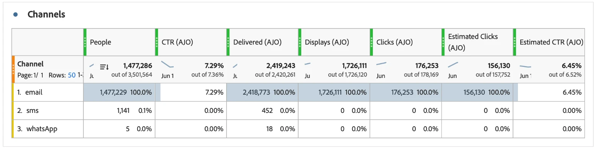

# Rapporto panoramica {#channel-report-cja}

>[!BEGINSHADEBOX]

**In questa pagina:** scopri come utilizzare il rapporto Panoramica per analizzare metriche di traffico e coinvolgimento unificate in tutte le campagne e i percorsi, con schede dedicate per percorsi, campagne, canali, set di regole di limitazione dei percorsi e modelli di ottimizzazione.

>[!ENDSHADEBOX]

Il rapporto Panoramica offre agli utenti un riepilogo completo delle metriche di traffico e coinvolgimento per tutte le campagne e i percorsi all’interno dell’ambiente. Queste metriche sono combinate per presentare valori unificati per azioni provenienti da canali diversi, che comprendono varie campagne e percorsi.

Per accedere al rapporto Panoramica, vai al menu **Rapporti** nella sezione **Gestione dei Percorsi**.

La pagina del rapporto viene visualizzata con le seguenti schede:

* [Percorsi](#journey)
* [Campagne](#campaign)
* [Canali](#channel)
* [Set di regole](#rule-sets)
* [Modelli di ottimizzazione](#optimization-models)

Per ulteriori informazioni su Customer Journey Analytics Workspace e su come filtrare e analizzare i dati, consultare [questa pagina](https://experienceleague.adobe.com/it/docs/analytics-platform/using/cja-workspace/home).

## In evidenza {#highlights}

I KPI **[!UICONTROL Elementi di rilievo]** fungono da dashboard completo e offrono una suddivisione dettagliata delle metriche chiave per tutte le campagne e i percorsi all&#39;interno dell&#39;ambiente, consentendo di valutare rapidamente le prestazioni e identificare le aree da migliorare.

+++ Ulteriori informazioni sulle metriche Evidenziazioni

* **[!UICONTROL Coinvolgimento di Percorso]**: numero totale di singoli utenti univoci che hanno ricevuto messaggi inviati tramite il percorso, che rappresentano profili distinti che hanno raggiunto un punto di azione designato nel percorso.

* **[!UICONTROL Entrate Percorso]**: numero totale di persone che hanno raggiunto l&#39;evento di ingresso del percorso.

* **[!UICONTROL Errori di Percorso]**: numero totale di singoli percorsi non eseguiti correttamente.

* **[!UICONTROL Percentuale di clic]**: percentuale di clic nei messaggi.

* **[!UICONTROL Percentuale di apertura click-through (CTOR)]**: numero di volte in cui il messaggio è stato aperto.

* **[!UICONTROL Persone]**: numero di profili utente qualificati come profili target per i messaggi.

* **[!UICONTROL Clic]**: numero di volte in cui è stato fatto clic su un contenuto nei messaggi.

* **[!UICONTROL Reclami spam]**: numero di volte in cui un messaggio è stato dichiarato come spam o posta indesiderata.

* **[!UICONTROL Annullamenti iscrizione]**: numero di clic sul collegamento di annullamento dell&#39;iscrizione.

+++

## Percorso {#journey}

La tabella **[!UICONTROL Percorso]** funge da dashboard completo e fornisce un&#39;analisi delle metriche chiave correlate al percorso. Include dettagli quali il numero di profili inseriti e le istanze di singoli percorsi non riusciti, offrendo una comprensione approfondita dell’efficacia e dei livelli di coinvolgimento del percorso.

Facendo clic sul nome di qualsiasi percorso elencato in questa tabella, puoi esplorare facilmente ogni percorso singolarmente, ottenendo accesso immediato al relativo rapporto completo in una nuova scheda.

+++ Ulteriori informazioni sulle metriche del Percorso

* **[!UICONTROL Coinvolgimento di Percorso]**: numero totale di singoli utenti univoci che hanno ricevuto messaggi inviati tramite il percorso, che rappresentano profili distinti che hanno raggiunto un punto di azione designato nel percorso.

* **[!UICONTROL Entrate Percorso]**: numero totale di persone che hanno raggiunto l&#39;evento di ingresso del percorso.

* **[!UICONTROL Uscite dal Percorso]**: numero totale di singoli utenti che sono usciti dal percorso.

* **[!UICONTROL Errori di Percorso]**: numero totale di singoli percorsi non eseguiti correttamente.

+++

## Campagne {#campaign}

La tabella **[!UICONTROL Campaign]** funziona come un dashboard completo che presenta una panoramica dettagliata delle metriche critiche per la campagna. Offre dati essenziali come il numero di profili e invii, consentendoti di accedere a un’insight completa sulle prestazioni e sui livelli di coinvolgimento della campagna.

Facendo clic sul nome di una delle campagne elencate in questa tabella, puoi esplorare facilmente ogni singola campagna, ottenendo accesso immediato al relativo rapporto completo in una nuova scheda.

+++ Ulteriori informazioni sulle metriche di Campaign

* **[!UICONTROL Persone]**: numero di profili utente qualificati come profili target per i messaggi.

* **[!UICONTROL Tasso di click-through (CTR)]**: percentuale di clic nei messaggi.

* **[!UICONTROL Invii]**: numero totale di invii per ogni campagna.

* **[!UICONTROL Recapitato]**: numero di messaggi inviati correttamente.

* **[!UICONTROL Visualizzazioni]**: numero di volte in cui il messaggio è stato aperto.

* **[!UICONTROL Clic]**: numero di volte in cui è stato fatto clic su un contenuto nei messaggi.

* **[!UICONTROL Clic stimati]**: numero di volte in cui è stato fatto clic su un contenuto nel messaggio, escluso il traffico identificato di bot e di interazione non umana (NHI).

+++

## Canali {#channel}

### Canali

La tabella **[!UICONTROL Canali]** fornisce una suddivisione dettagliata del coinvolgimento dei profili con i messaggi a livello di canale. Questo consente di ottenere informazioni più approfondite sulle prestazioni dei diversi canali.

+++ Ulteriori informazioni sulle metriche dei canali

* **[!UICONTROL Persone]**: numero di profili utente qualificati come profili target per i messaggi.

* **[!UICONTROL Tasso di click-through (CTR)]**: percentuale di clic nei messaggi.

* **[!UICONTROL Recapitato]**: numero di messaggi inviati correttamente.

* **[!UICONTROL Visualizzazioni]**: numero di volte in cui il messaggio è stato aperto.

* **[!UICONTROL Clic]**: numero di volte in cui è stato fatto clic su un contenuto nei messaggi.

* **[!UICONTROL Clic stimati]**: numero di volte in cui è stato fatto clic su un contenuto nel messaggio, escluso il traffico identificato di bot e di interazione non umana (NHI).

+++

### Errori in uscita

La tabella **[!UICONTROL Errori in uscita]** consente di individuare con precisione gli errori che si sono verificati durante il processo di invio, facilitando una chiara comprensione di eventuali problemi riscontrati.

### Esclusioni in uscita

La tabella **[!UICONTROL Esclusioni in uscita]** presenta una visualizzazione completa dei diversi fattori che hanno determinato l&#39;esclusione dei profili utente dal pubblico di destinazione, causando la mancata ricezione del messaggio.

## Limitazione di percorso e conflitti {#rule-sets}

La tabella **[!UICONTROL Limitazione Percorsi e conflitti]** fornisce informazioni dettagliate sulle prestazioni dei set di regole di arbitraggio di percorso, mostrando le entrate e le esclusioni di percorso in base alle regole di limitazione e ai punteggi di priorità applicati ai percorsi.

+++ Ulteriori informazioni sulle metriche dei set di regole

La colonna **[!UICONTROL Voci Percorso per set di regole]** mostra il numero di profili immessi nel percorso. Sono disponibili tre tipi di ingresso:

* **&#x200B;**&#x200B;[!UICONTROL Nessun conflitto]&#x200B;**&#x200B;**: il profilo è entrato nel percorso senza conflitti nel set di regole. Nessun set di regole attivo ha impedito questa immissione e la voce di percorso si è verificata indipendentemente dalle regole di arbitrato.

* **Priorità più alta**: il profilo è entrato nel percorso a causa della priorità più alta rispetto ad altri percorsi concorrenti. Anche se si è verificato un conflitto (il profilo è qualificato per più percorsi), questo percorso è stato selezionato a causa del suo punteggio di priorità più alto.

* **Non applicato**: il profilo è entrato nel percorso, ma il set di regole non era attivo o non è stato applicato a questa voce di percorso al momento dell&#39;immissione.

La colonna **[!UICONTROL Esclusioni]** mostra il numero di profili esclusi dall&#39;accesso al percorso. I profili possono essere esclusi per due motivi:

* **Limite raggiunto**: il profilo ha raggiunto il numero massimo di voci di percorso o di percorsi simultanei consentito dalla regola di limite.

* **Priorità inferiore**: il limite non è stato raggiunto, ma altri percorsi con priorità più elevata soddisfano i vincoli. Il profilo è stato escluso da questo percorso e al suo posto è stato inserito un percorso con priorità maggiore.

+++

Per analizzare queste esclusioni a livello di Data Lake tramite Adobe Experience Platform Query Service, vedi [Query con regole business](query-examples.md#business-rules-queries).

➡️ [Ulteriori informazioni su limiti di percorso e arbitrato](../conflict-prioritization/journey-capping.md)

## Modelli di ottimizzazione {#optimization-models}

Le tabelle **[!UICONTROL Ottimizzazione dell&#39;ora di invio]** forniscono informazioni approfondite sulle prestazioni dei messaggi e-mail o push ottimizzati e di controllo. Utilizzala per confrontare metriche chiave quali invii, aperture, clic e mancati recapiti, in modo da poter vedere come funziona ogni variante e prendere decisioni in merito all’ottimizzazione.

Tieni presente che le metriche in questo report, inclusi **[!UICONTROL Lift]** e **[!UICONTROL Confidence]**, sono calcolate a partire da **60 giorni** di invii e coinvolgimento.

+++ Ulteriori informazioni sulle metriche di ottimizzazione dell’ora di invio

* **[!UICONTROL Invii]**: numero totale di volte in cui è stata inviata ogni variante del messaggio.

* **[!UICONTROL Apri]**: numero totale di eventi aperti registrati per il messaggio.

* **[!UICONTROL Percentuale di apertura]**: la percentuale di messaggi inviati per i quali il profilo ha aperto il messaggio almeno una volta.

* **[!UICONTROL Incremento]**: miglioramento percentuale del tasso di conversione per un dato trattamento rispetto alla variante al basale. Incremento quantifica l&#39;entità di una differenza; interpretarla insieme a **[!UICONTROL Affidabilità]**.

* **[!UICONTROL Affidabilità]**: la forza statistica delle prove che la frequenza di apertura o clic della variante Ottimizzata per il tempo di invio differisce dalla variante di controllo (tempo di invio assegnato in modo casuale). Viene calcolato con un test Z a due proporzioni.

+++
