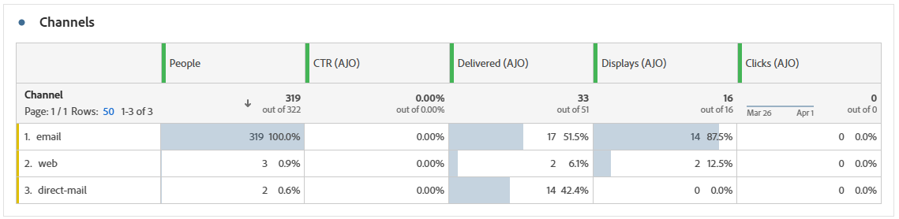

# Rapporto panoramica {#channel-report-cja}

Il rapporto Panoramica offre agli utenti un riepilogo completo delle metriche di traffico e coinvolgimento per tutte le campagne e i percorsi all’interno dell’ambiente. Queste metriche sono combinate per presentare valori unificati per azioni provenienti da canali diversi, che comprendono varie campagne e percorsi.

Per accedere al rapporto Panoramica, vai al **Rapporti** menu all&#39;interno di **Gestione percorso** sezione.

La pagina del rapporto viene visualizzata con le seguenti schede:

* [Percorsi](#journey)
* [Campagne](#campaign)
* [Canali](#channel)

Per ulteriori informazioni su Workspace di Customer Journey Analytics e su come filtrare e analizzare i dati, consulta [questa pagina](https://experienceleague.adobe.com/en/docs/analytics-platform/using/cja-workspace/home).

## In evidenza {#highlights}

Il **[!UICONTROL In evidenza]** I KPI fungono da dashboard completo e offrono un raggruppamento dettagliato delle metriche chiave per tutte le campagne e i percorsi all’interno dell’ambiente, consentendo di valutare rapidamente le prestazioni e identificare le aree da migliorare.

+++ Ulteriori informazioni sulle metriche Evidenziazioni

* **[!UICONTROL Coinvolgimento percorso]**: numero totale di individui che hanno interagito con i messaggi inviati dal percorso.

* **[!UICONTROL Immissioni percorso]**: numero totale di individui che hanno raggiunto l’evento di ingresso del percorso.

* **[!UICONTROL Errori percorso]**: numero totale di singoli percorsi non eseguiti correttamente.

* **[!UICONTROL Percentuale di click-through]**: percentuale di clic nei messaggi.

* **[!UICONTROL Percentuale di apertura click-through (CTOR)]**: numero di volte in cui il messaggio è stato aperto.

* **[!UICONTROL Persone]**: numero di profili utente qualificati come profili target per i messaggi.

* **[!UICONTROL Clic]**: numero di volte in cui si è fatto clic su un contenuto nei messaggi.

* **[!UICONTROL Reclami spam]**: numero di volte in cui un messaggio è stato dichiarato come spam o posta indesiderata.

* **[!UICONTROL Annulla iscrizione]**: numero di clic sul collegamento di annullamento dell’abbonamento.

+++

## Percorso {#journey}

Il **[!UICONTROL Percorso]** La tabella funge da dashboard completo e fornisce un’analisi delle metriche chiave correlate al percorso. Include dettagli quali il numero di profili inseriti e le istanze di singoli percorsi non riusciti, offrendo una comprensione approfondita dell’efficacia e dei livelli di coinvolgimento del percorso.

Facendo clic sul nome di qualsiasi percorso elencato in questa tabella, puoi esplorare facilmente ogni percorso singolarmente, ottenendo accesso immediato al relativo rapporto completo in una nuova scheda.

+++ Ulteriori informazioni sulle metriche di Percorso

* **[!UICONTROL Immissioni percorso]**: numero totale di individui che hanno raggiunto l’evento di ingresso del percorso.

* **[!UICONTROL Uscite dal percorso]**: numero totale di individui che sono usciti dal percorso.

* **[!UICONTROL Errori percorso]**: numero totale di singoli percorsi non eseguiti correttamente.

+++

## Campagne {#campaign}

Il **[!UICONTROL Campagna]** la tabella funziona come un dashboard completo che presenta una panoramica dettagliata delle metriche critiche per la campagna. Contiene dati essenziali come il numero di profili e di invii, che ti consentono di ottenere informazioni complete sulle prestazioni e sui livelli di coinvolgimento della campagna.

Facendo clic sul nome di una delle campagne elencate in questa tabella, puoi esplorare facilmente ogni singola campagna, ottenendo accesso immediato al relativo rapporto completo in una nuova scheda.

+++ Ulteriori informazioni sulle metriche di Campaign

* **[!UICONTROL Persone]**: numero di profili utente qualificati come profili target per i messaggi.

* **[!UICONTROL Invia]**: numero totale di invii per ogni campagna.

* **[!UICONTROL Display]**: numero di volte in cui il messaggio è stato aperto.

* **[!UICONTROL Clic]**: numero di volte in cui si è fatto clic su un contenuto nei messaggi.

+++

## Canali {#channel}

### Canali

Il **[!UICONTROL Canali]** La tabella fornisce una suddivisione dettagliata del coinvolgimento dei profili con i messaggi a livello di canale. Questo consente di ottenere informazioni più approfondite sulle prestazioni dei diversi canali.

+++ Ulteriori informazioni sulle metriche dei canali

* **[!UICONTROL Persone]**: numero di profili utente qualificati come profili target per i messaggi.

* **[!UICONTROL Percentuale di click-through]**: percentuale di clic nei messaggi.

* **[!UICONTROL Invia]**: numero totale di invii per ogni campagna.

* **[!UICONTROL Display]**: numero di volte in cui il messaggio è stato aperto.

* **[!UICONTROL Clic]**: numero di volte in cui si è fatto clic su un contenuto nei messaggi.

+++

### Errori in uscita

Il **[!UICONTROL Errori in uscita]** la tabella ti consente di individuare con precisione gli errori che si sono verificati durante l’intero processo di invio, facilitando una chiara comprensione di eventuali problemi riscontrati.

### Esclusioni in uscita

Il **[!UICONTROL Esclusioni in uscita]** La tabella presenta una panoramica completa dei diversi fattori che hanno portato all’esclusione dei profili utente dal pubblico di destinazione, causando la mancata ricezione del messaggio.
