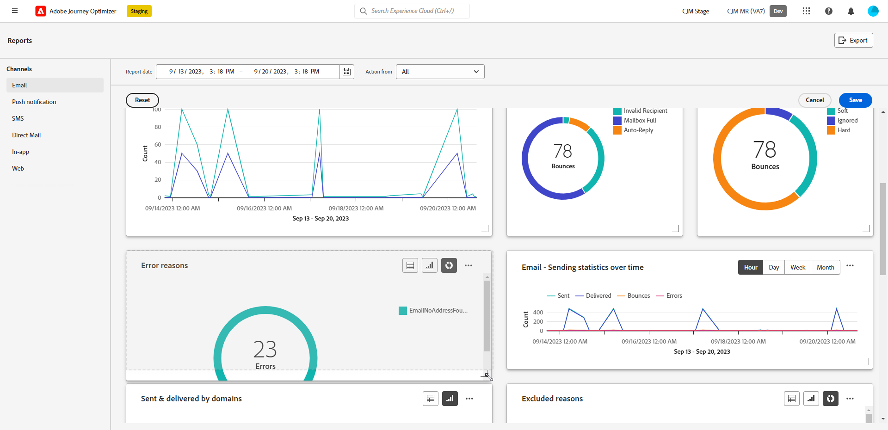

# Introduzione ai rapporti sul canale {#channel-report-gs}

>[!AVAILABILITY]
>
>L’esperienza di reporting corrente verrà ritirata a gennaio 2025. Dopo questa data, la nuova esperienza di reporting diventerà lo standard. Consigliamo di acquisire familiarità con le nuove funzioni e funzionalità per garantire una transizione semplice. [Introduzione alla nuova interfaccia di Journey Optimizer per la generazione di rapporti.](report-gs-cja.md)

I rapporti per canale fungono da potente strumento che fornisce una panoramica completa delle metriche di traffico e coinvolgimento in un rapporto unificato per ciascun canale, includendo tutte le azioni di tutte le campagne e i Percorsi. È divisa in diversi widget, ciascuno dei quali fornisce una visualizzazione specifica delle prestazioni della campagna o del percorso.

I rapporti Canale sono completamente personalizzabili, per cui puoi ridimensionare o rimuovere widget per creare una dashboard che soddisfi le tue esigenze specifiche. Puoi anche esportare i dati del rapporto in un file PDF o CSV per ulteriori analisi.

Ulteriori informazioni sulle diverse metriche e widget disponibili per i rapporti Canale su <!--[this page](channel-report.md)-->.

## Prima di iniziare {#manage-reports-prereq}

Prima di iniziare, verifica di avere accesso al menu **[!UICONTROL Rapporti]**.

Se non riesci a visualizzare il menu **[!UICONTROL Rapporti]**, devi estendere i tuoi diritti di accesso per includere l&#39;autorizzazione **[!UICONTROL Visualizza rapporti canale]**. Puoi estendere le tue autorizzazioni se hai accesso a [Autorizzazioni](https://experienceleague.adobe.com/docs/experience-platform/access-control/home.html?lang=it){target="_blank"} per Adobe Experience Platform per la tua organizzazione. In caso contrario, contattare l&#39;amministratore di Adobe Journey Optimizer.

+++Scopri come assegnare le autorizzazioni per i rapporti

Tieni presente che questa autorizzazione è inclusa nei seguenti **[!UICONTROL Ruoli]** incorporati: Responsabile campagna, Approvatore campagna, Visualizzatore campagna e Amministratore campagna.

Per assegnare l&#39;autorizzazione corrispondente al tuo **[!UICONTROL Ruolo]**:

1. Dal prodotto [!DNL Permissions], passare al menu **[!UICONTROL Ruoli]** e selezionare il ruolo che si desidera aggiornare con la nuova autorizzazione **[!UICONTROL Visualizza report canale]**.

1. Dal dashboard **[!UICONTROL Ruolo]**, fai clic su **[!UICONTROL Modifica]**.

   

1. Trascina e rilascia la risorsa **[!UICONTROL Rapporti]** per assegnare le autorizzazioni.

   Dall&#39;elenco a discesa delle risorse **[!UICONTROL Report]**, selezionare l&#39;autorizzazione **[!UICONTROL Visualizza report canale]**.

   

1. Fai clic su **[!UICONTROL Salva]**.

Gli utenti assegnati a questo **[!UICONTROL Ruolo]** ora possono accedere al menu **[!UICONTROL Rapporti]**.

+++

## Gestire la dashboard dei report {#manage-reports}

Per accedere e gestire i rapporti sui canali, segui questi passaggi:

1. Passa al menu **[!UICONTROL Rapporti]** nella sezione **[!UICONTROL Gestione Percorsi]**.

   

1. Dal dashboard, scegli un **Inizio** e un **[!UICONTROL Ora di fine]** per eseguire il targeting di dati specifici.

1. Dal menu a discesa **[!UICONTROL Azione da]**, seleziona se desideri eseguire il targeting di campagne, Percorsi o entrambi.

   

1. Fai clic su **[!UICONTROL Modifica]** per ridimensionare o rimuovere i widget e creare un dashboard che soddisfi le tue esigenze specifiche.

   

1. Una volta che sei soddisfatto dell&#39;ordine di visualizzazione e delle dimensioni dei widget, fai clic su **[!UICONTROL Salva]**.

1. A seconda del widget, è possibile scegliere di passare da una tabella, un grafico a barre o una ciambella.

1. Fai clic sull’icona della percentuale per visualizzare i dati come percentuali.

   

## Esportazione dei rapporti {#export-reports}

Puoi esportare facilmente i diversi rapporti in formato PDF o CSV, per condividerli, manipolarli o stamparli. I passaggi dettagliati per esportare i rapporti sui canali sono disponibili nelle seguenti schede:

>[!BEGINTABS]

>[!TAB Esporta il report come file PDF]

1. Dal report, fai clic su **[!UICONTROL Esporta]** e seleziona **[!UICONTROL File PDF]**.

1. Nella finestra Stampa configurare il documento in base alle esigenze. Le opzioni possono variare a seconda del browser in uso.

1. Scegliere se stampare o salvare il report come PDF.

1. Individuare la cartella in cui si desidera salvare il file, rinominarlo, se necessario, e fare clic su Salva.

Il report è ora disponibile per la visualizzazione o la condivisione in un file pdf.

>[!TAB Esporta il report come file CSV]

1. Dal tuo report, fai clic su **[!UICONTROL Esporta]** e seleziona **[!UICONTROL File CSV]** per generare un file CSV a livello di report complessivo.

1. Puoi anche scegliere di esportare i dati da un widget specifico. Fai clic su **[!UICONTROL Esporta dati widget in CSV]** accanto al widget selezionato.

1. Il file viene scaricato automaticamente e si trova nei file locali.

   Se hai generato il file a livello di report, contiene informazioni dettagliate per ciascun widget, inclusi il titolo e i dati.

   Se hai generato il file a livello di widget, fornisce specificamente i dati per il widget selezionato.

>[!ENDTABS]
