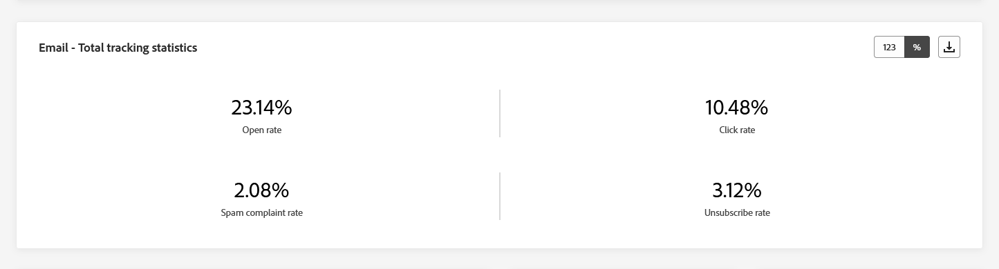
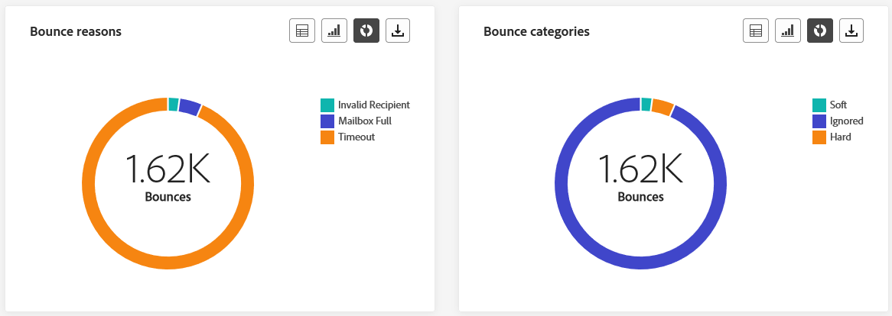
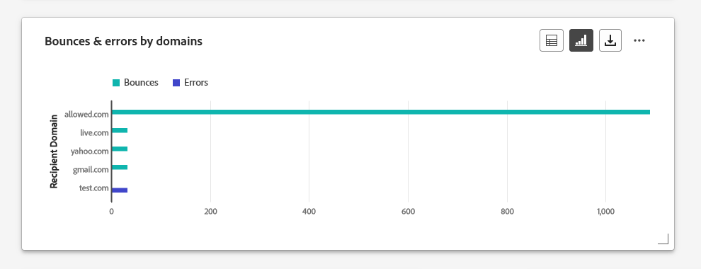
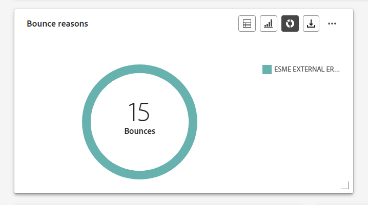
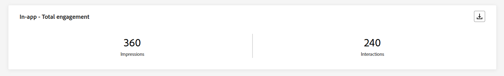

# Rapporti sul canale {#channel-report}

>[!CONTEXTUALHELP]
>id="ajo_channel_level_report"
>title="Rapporto a livello di canale"
>abstract="I rapporti sul canale offrono una panoramica completa delle metriche del traffico e del coinvolgimento su tutti i canali. I rapporti sono suddivisi in diversi widget che descrivono nel dettaglio i successi e gli errori della campagna e dei percorsi. Ogni dashboard di reporting può essere modificata ridimensionando o rimuovendo i widget."

>[!IMPORTANT]
>
> Per accedere al **Report** menu, è necessario disporre di **[!UICONTROL Visualizzare i rapporti sul canale]** autorizzazione. [Ulteriori informazioni](channel-report-gs.md#before-starting-manage-reports-prereq)

I rapporti sul canale forniscono agli utenti una panoramica completa delle metriche del traffico e del coinvolgimento a livello di canale. Le metriche vengono aggregate per presentare valori consolidati per le azioni provenienti dal canale scelto, che si estendono su vari percorsi e campagne.

Puoi accedere ai rapporti sul canale navigando su **Rapporti** menu all&#39;interno di **Gestione percorso** sezione. È completamente personalizzabile, puoi filtrare i dati a seconda della data del rapporto o dell’azione. [Ulteriori informazioni](channel-report-gs.md)

La pagina del rapporto viene visualizzata con le seguenti schede:

* [E-mail](#email)
* [Notifiche push](#push)
* [SMS](#sms)
* [In-app](#inapp)
* [Web](#web)
* [Direct mail](#direct-mail)

➡️ [Scopri questa funzione nel video](#channel-report-video)

## E-mail {#email}

Dai rapporti sul canale, il menu E-mail fornisce i dettagli delle informazioni principali relative alle e-mail inviate nelle campagne e nei Percorsi. Le metriche sono descritte di seguito.

### E-mail - Statistiche di invio totali {#email-total-sending}

>[!CONTEXTUALHELP]
>id="ajo_channel_email_sending_statistics"
>title="E-mail - Statistiche di invio totali"
>abstract="I KPI delle Email: statistiche di invio totali riepilogano i dati essenziali sulle e-mail, come messaggi mirati o consegnati."

Il **[!UICONTROL Statistiche di invio totali e-mail]** Il widget offre una panoramica completa delle prestazioni delle e-mail, con indicatori di prestazioni chiave (KPI, Key Performance Indicator) che riepilogano i dati essenziali relativi alle e-mail.

+++ Ulteriori informazioni sulle metriche delle statistiche di invio totali delle e-mail

* **[!UICONTROL Target]**: numero totale di e-mail elaborate.

* **[!UICONTROL Inviato]**: numero totale di invii.

* **[!UICONTROL Consegnato]**: numero di e-mail inviate correttamente, in relazione al numero totale di messaggi inviati.

* **[!UICONTROL Percentuale di consegna]**: percentuale di e-mail inviate correttamente.

* **[!UICONTROL Mancati recapiti]**: totale degli errori accumulati e dell’elaborazione automatica della restituzione in relazione al numero totale di messaggi inviati.

* **[!UICONTROL Percentuale non recapitate]**: percentuale di e-mail non recapitate rispetto alle e-mail inviate.

* **[!UICONTROL Errori]**: numero totale di errori che ne hanno impedito l’invio ai profili.

* **[!UICONTROL Frequenza errori]**: percentuale di errori che ne hanno impedito l’invio rispetto alle e-mail inviate.

* **[!UICONTROL Escluso]**: numero di profili che sono stati esclusi da Adobe Journey Optimizer.

* **[!UICONTROL Percentuale di esclusione]**: percentuale di profili che sono stati esclusi da Adobe Journey Optimizer.

+++

### E-mail: statistiche di tracciamento totali {#email-total-tracking}

>[!CONTEXTUALHELP]
>id="ajo_channel_email_tracking_statistics"
>title="E-mail: statistiche di tracciamento totali"
>abstract="I KPI E-mail - Statistiche di tracciamento totali forniscono dati sull’attività del profilo per le e-mail."

Il **[!UICONTROL Statistiche di tracciamento del totale delle e-mail]** widget offre un’istantanea dettagliata dell’attività del profilo associata alle e-mail, fornendo informazioni essenziali sull’efficacia di coinvolgimento ed e-mail.

+++ Ulteriori informazioni sulle metriche delle statistiche di tracciamento del totale delle e-mail

* **[!UICONTROL Aperture]**: numero di volte in cui il messaggio è stato aperto.

* **[!UICONTROL Percentuale aperture]**: numero totale di e-mail aperte rispetto al numero di e-mail consegnate.

* **[!UICONTROL Clic]**: numero di volte in cui è stato fatto clic su un contenuto in un messaggio.

* **[!UICONTROL Percentuale di clic]**: percentuale di utenti che hanno interagito con l’e-mail.

* **[!UICONTROL Reclami spam]**: numero di volte in cui un messaggio è stato dichiarato come spam o posta indesiderata.

* **[!UICONTROL Percentuale reclami spam]**: percentuale di messaggi dichiarati come spam o posta indesiderata rispetto al numero di e-mail inviate.

* **[!UICONTROL Annulla iscrizione]**: numero di clic sul collegamento di abbonamento.

* **[!UICONTROL Percentuale di annullamento abbonamento]**: percentuale di annullamento dell’abbonamento rispetto al numero di e-mail inviate.

+++

### E-mail - Statistiche di invio nel tempo {#email-sending-statistics-overtime}

>[!CONTEXTUALHELP]
>id="ajo_channel_email_sending_statistics_overtime"
>title="E-mail - Statistiche di invio nel tempo"
>abstract="Il grafico E-mail - Statistiche di invio nel tempo presenta dati relativi alle e-mail inviate, suddivisi su base oraria, giornaliera, settimanale o mensile."

Il **[!UICONTROL E-mail - Statistiche di invio nel tempo]** graph offre una rappresentazione dinamica, con un’analisi dell’attività e-mail. Questa rappresentazione grafica fornisce una suddivisione completa delle e-mail inviate, consentendoti di osservare tendenze e pattern su scala oraria, giornaliera, settimanale o mensile.

+++ Ulteriori informazioni sull’e-mail - Statistiche di invio nel tempo

* **[!UICONTROL Inviato]**: numero totale di invii.

* **[!UICONTROL Consegnato]**: numero di e-mail inviate correttamente, in relazione al numero totale di e-mail inviate.

* **[!UICONTROL Mancati recapiti]**: totale degli errori cumulativi e dell’elaborazione automatica della restituzione in relazione al numero totale di e-mail inviate.

* **[!UICONTROL Errori]**: numero totale di errori che ne hanno impedito l’invio ai profili.

+++

### E-mail - Statistiche di tracciamento nel tempo {#email-tracking-statistics-overtime}

>[!CONTEXTUALHELP]
>id="ajo_channel_email_tracking_statistics_overtime"
>title="E-mail - Statistiche di tracciamento nel tempo"
>abstract="Il grafico E-mail - Statistiche di tracciamento nel tempo fornisce dati sull’attività del profilo secondo le e-mail, suddivisi su base oraria, giornaliera, settimanale o mensile."

Il **[!UICONTROL E-mail - Statistiche di tracciamento nel tempo]** graph fornisce una panoramica dettagliata dell’attività del profilo correlata alle e-mail. Questa rappresentazione grafica suddivide i dati su base oraria, giornaliera, settimanale o mensile, offrendo informazioni utili sull’evoluzione del coinvolgimento dei destinatari in diversi intervalli di tempo.

+++ Ulteriori informazioni su E-mail - Statistiche di tracciamento nel tempo metriche

* **[!UICONTROL Aperture]**: numero di volte in cui il messaggio è stato aperto.

* **[!UICONTROL Clic]**: numero di volte in cui è stato fatto clic su un contenuto in un messaggio.

+++

### E-mail: categorie e motivi di mancato recapito {#bounce-categories}

>[!CONTEXTUALHELP]
>id="ajo_channel_email_bounce_categories"
>title="Categorie di mancato recapito"
>abstract="I grafici e la tabella di Categorie di mancato recapito forniscono dati sugli errori temporanei e permanenti."

>[!CONTEXTUALHELP]
>id="ajo_channel_email_bounce_reasons"
>title="Motivi di mancato recapito"
>abstract="I grafici e la tabella Motivi di mancato recapito contengono i dati disponibili relativi ai messaggi non recapitati."

Il **[!UICONTROL Categorie di mancato recapito]** e **[!UICONTROL Motivi di mancato recapito]** I widget racchiudono i dati associati ai messaggi non recapitati, fornendo una panoramica completa delle varie categorie e dei motivi specifici alla base dei messaggi non recapitati

Per ulteriori informazioni sui mancati recapiti, consulta [Elenco di soppressione](../reports/suppression-list.md) pagina.

+++ Ulteriori informazioni sulle metriche delle categorie di mancato recapito

* **[!UICONTROL Mancato recapito permanente]**: numero totale di errori permanenti, ad esempio un indirizzo e-mail errato. Ciò comporta un messaggio di errore che indica esplicitamente che l’indirizzo non è valido, ad esempio Utente sconosciuto.

* **[!UICONTROL Mancato recapito non permanente]**: numero totale di errori temporanei, ad esempio una casella in entrata completa.

* **[!UICONTROL Ignorato]**: numero totale di messaggi temporanei, ad esempio Fuori sede, o un errore tecnico, ad esempio se il tipo di mittente è postmaster.

+++

### Motivi di errore {#error-reasons}

>[!CONTEXTUALHELP]
>id="ajo_channel_email_error_reasons"
>title="Motivi di errore"
>abstract="I grafici e la tabella Motivi di errore consentono di identificare gli errori specifici che si sono verificati durante il processo di invio."

Il **[!UICONTROL Motivi di errore]** grafici e tabelle consentono di individuare con precisione gli errori che si sono verificati durante l’intero processo di invio, facilitando una chiara comprensione di eventuali problemi riscontrati.

### Motivi di esclusione {#excluded-reasons}

>[!CONTEXTUALHELP]
>id="ajo_channel_email_excluded_reasons"
>title="Motivi di esclusione"
>abstract="I grafici e la tabella della sezione Motivi di esclusione illustrano i vari fattori a causa dei quali il messaggio non è stato ricevuto dai profili utente che sono stati esclusi dal pubblico target."

Il **[!UICONTROL Motivi di esclusione]** grafici e tabelle presentano una visione completa dei diversi fattori che hanno determinato l’esclusione dei profili utente dal pubblico di destinazione, causando la mancata ricezione del messaggio.

Fai riferimento a [questa pagina](exclusion-list.md) per l’elenco completo dei motivi di esclusione.

### Inviato e consegnato per dominio {#sent-delivered-domains}

>[!CONTEXTUALHELP]
>id="ajo_channel_email_sending_delivered_domains"
>title="Inviato e consegnato per dominio"
>abstract="Il grafico e la tabella Inviato e consegnato per dominio rappresentano il raggruppamento a livello di dominio di ogni dato importante relativo all’invio di e-mail."

Il **[!UICONTROL Inviato e consegnato da domini]** la tabella e il grafico forniscono un raggruppamento dettagliato delle consegne e-mail a livello di dominio, offrendo informazioni complete sulle prestazioni delle e-mail.

+++ Ulteriori informazioni sulle metriche Inviato e Consegnato per domini

* **[!UICONTROL Inviato]**: numero totale di invii per e-mail.

* **[!UICONTROL Consegnato]**: numero di messaggi inviati correttamente rispetto al numero totale di messaggi inviati.

+++

### Mancati recapiti ed errori per domini {#bounces-errors-domains}

>[!CONTEXTUALHELP]
>id="ajo_channel_email_bounces_errors_domains"
>title="Mancati recapiti ed errori per domini"
>abstract="Il grafico e la tabella Mancati recapiti ed errori per dominio rappresentano il raggruppamento a livello di dominio degli errori specifici che si sono verificati durante il processo di invio."

Il **[!UICONTROL Mancati recapiti ed errori per domini]** grafico e tabella offrono un raggruppamento a livello di dominio degli errori specifici riscontrati durante il processo di invio, fornendo un’analisi dettagliata dei problemi che si sono verificati.

+++ Ulteriori informazioni su mancati recapiti ed errori per domini e metriche

* **[!UICONTROL Mancati recapiti]**: totale degli errori accumulati durante il processo di invio e l’elaborazione automatica della restituzione in relazione al numero totale di messaggi inviati.

* **[!UICONTROL Errori]**: numero totale di errori che si sono verificati durante il processo di invio e che ne hanno impedito l’invio ai profili.

+++

### Aperture e clic per domini {#open-clicks-domains}

>[!CONTEXTUALHELP]
>id="ajo_channel_email_open_clicks_domains"
>title="Aperture e clic per domini"
>abstract="Il grafico e la tabella Aperture e clic per dominio rappresentano il raggruppamento a livello di dominio del coinvolgimento dei visitatori con la tua e-mail."

Il **[!UICONTROL Apri e fai clic per domini]** un grafico con una tabella mostra un raggruppamento a livello di dominio del coinvolgimento dei visitatori con la tua e-mail, fornendo informazioni utili su come diversi domini interagiscono con i contenuti.

+++ Ulteriori informazioni sulle metriche Apri e clic per domini

* **[!UICONTROL Aperture]**: numero di volte in cui l’e-mail è stata aperta.

* **[!UICONTROL Clic]**: numero di volte in cui è stato fatto clic su un contenuto in un’e-mail.

+++

### Motivi di mancato recapito per dominio {#bounce-reasons-domains}

>[!CONTEXTUALHELP]
>id="ajo_channel_email_bounce_reasons_domains"
>title="Motivi di mancato recapito per dominio"
>abstract="Il grafico e la tabella Motivi di mancato recapito per dominio rappresentano il raggruppamento a livello di dominio dei dati su errori temporanei e permanenti."

Il **[!UICONTROL Motivi di mancato recapito per dominio]** Il grafico e la tabella forniscono un raggruppamento dei dati a livello di dominio relativi a errori temporanei e permanenti, fornendo informazioni dettagliate sui motivi alla base dei messaggi non recapitati.

Per ulteriori informazioni sui mancati recapiti, consulta [Elenco di soppressione](../reports/suppression-list.md) pagina.

## Notifica push {#push}

Dai rapporti sul canale, il **Notifica push** Il menu descrive le informazioni principali relative alle notifiche push inviate nelle campagne e nei Percorsi. Le metriche sono descritte di seguito.

### Notifiche push - Statistiche di invio totali {#push-total-sending}

>[!CONTEXTUALHELP]
>id="ajo_channel_push_sending_statistics"
>title="Notifiche push - Statistiche di invio totali"
>abstract="I KPI della sezione Notifiche push - Statistiche di invio totali riepilogano i dati essenziali sulle notifiche push, come Target o Consegnati."

Il **[!UICONTROL Notifiche push - Statistiche di invio totali]** I KPI fungono da riepilogo completo e racchiudono i dati essenziali relativi alle notifiche push. Queste metriche includono informazioni dettagliate sul pubblico target e sullo stato di consegna effettivo, fornendo una visione completa dell’efficacia e della portata delle notifiche push.

+++ Ulteriori informazioni sulle notifiche push - Metriche statistiche di invio totali

* **[!UICONTROL Target]**: numero totale di notifiche push elaborate.

* **[!UICONTROL Inviato]**: numero totale di notifiche push inviate.

* **[!UICONTROL Consegnato]**: numero di notifiche push inviate correttamente, in relazione al numero totale di notifiche push inviate.

* **[!UICONTROL Percentuale di consegna]**: percentuale di notifiche push inviate correttamente.

* **[!UICONTROL Mancati recapiti]**: totale degli errori accumulati e dell’elaborazione automatica della restituzione in relazione al numero totale di messaggi inviati.

* **[!UICONTROL Percentuale non recapitate]**: percentuale di notifiche push non recapitate rispetto alle notifiche push inviate.

* **[!UICONTROL Errori]**: numero totale di errori che ne hanno impedito l’invio ai profili.

* **[!UICONTROL Frequenza errori]**: percentuale di errori che ne hanno impedito l’invio rispetto alle notifiche push inviate.

* **[!UICONTROL Escluso]**: numero di profili che sono stati esclusi da Adobe Journey Optimizer.

* **[!UICONTROL Percentuale di esclusione]**: percentuale di profili che sono stati esclusi da Adobe Journey Optimizer.

+++

### Notifica push - Statistiche di tracciamento totali {#push-total-tracking}

>[!CONTEXTUALHELP]
>id="ajo_channel_push_tracking_statistics"
>title="Notifica push - Statistiche di tracciamento totali"
>abstract="La sezione Notifica push - Statistiche di tracciamento totali fornisce dati sulle attività dei profili per le notifiche push."

Il **[!UICONTROL Notifica push - Statistiche di tracciamento totali]** widget offre un’istantanea dettagliata dell’attività del profilo associata alle notifiche push, fornendo informazioni essenziali sull’efficacia delle notifiche push e di coinvolgimento.

+++ Ulteriori informazioni sulle notifiche push - Metriche statistiche di tracciamento totali

* **[!UICONTROL Aperture]**: numero di volte in cui è stata aperta una notifica push.

* **[!UICONTROL Percentuale aperture]**: percentuale di notifiche push aperte.

* **[!UICONTROL Azioni]**: numero totale di azioni sulla notifica push consegnata, ad esempio clic su pulsante o rimozione.

* **[!UICONTROL Percentuale azioni]**: percentuale di azioni sulla notifica push consegnata rispetto alle notifiche push inviate.

+++

### Notifiche push - Statistiche di invio nel tempo {#push-sending-overtime}

>[!CONTEXTUALHELP]
>id="ajo_channel_push_sending_statistics_overtime"
>title="Notifiche push - Statistiche di invio nel tempo"
>abstract="Il grafico della sezione Notifiche push - Statistiche di invio nel tempo presenta i dati relativi alle notifiche push inviate, suddivisi su base oraria, giornaliera, settimanale o mensile."

Il **[!UICONTROL Notifiche push - Statistiche di invio nel tempo]** graph offre una rappresentazione dinamica che mostra un’analisi dell’attività delle notifiche push. Questa rappresentazione grafica fornisce una suddivisione completa delle notifiche push inviate, consentendoti di osservare tendenze e pattern su scala oraria, giornaliera, settimanale o mensile.

+++ Ulteriori informazioni sulle notifiche push - Statistiche di invio nel tempo

* **[!UICONTROL Inviato]**: numero totale di notifiche push inviate.

* **[!UICONTROL Consegnato]**: numero di notifiche push inviate correttamente, in relazione al numero totale di notifiche push inviate.

* **[!UICONTROL Mancati recapiti]**: totale degli errori accumulati e dell’elaborazione automatica della restituzione in relazione al numero totale di messaggi inviati.

* **[!UICONTROL Errori]**: numero totale di errori che ne hanno impedito l’invio ai profili.

+++

### Notifiche push - Statistiche di tracciamento nel tempo {#push-tracking-overtime}

>[!CONTEXTUALHELP]
>id="ajo_channel_push_tracking_statistics_overtime"
>title="Notifiche push - Statistiche di tracciamento nel tempo"
>abstract="Il grafico della sezione Notifiche push - Statistiche di tracciamento nel tempo fornisce dati sulle attività dei profili per le notifiche push, suddivisi su base oraria, giornaliera, settimanale o mensile."

Il **[!UICONTROL Notifiche push - Tracciamento delle statistiche nel tempo]** graph fornisce una panoramica dettagliata dell’attività del profilo correlata alle notifiche push. Questa rappresentazione grafica suddivide i dati su base oraria, giornaliera, settimanale o mensile, offrendo informazioni utili sull’evoluzione del coinvolgimento dei destinatari in diversi intervalli di tempo.

+++ Ulteriori informazioni sulla notifica push - Tracciamento delle statistiche nel tempo metriche

* **[!UICONTROL Aperture]**: numero di volte in cui la notifica push è stata aperta.

* **[!UICONTROL Azioni]**: numero totale di azioni sulla notifica push consegnata, ad esempio clic su pulsante o rimozione.

+++

### Notifiche push: motivi di esclusione {#push-excluded-reasons}

>[!CONTEXTUALHELP]
>id="ajo_channel_push_excluded_reasons"
>title="Motivi di esclusione"
>abstract="I grafici e la tabella della sezione Motivi di esclusione illustrano i vari fattori a causa dei quali il messaggio non è stato ricevuto dai profili utente che sono stati esclusi dal pubblico target."

Il **[!UICONTROL Motivi di esclusione]** il grafico e la tabella mostrano i diversi motivi che hanno impedito ai profili utente, esclusi dai profili target, di ricevere le notifiche push.

Fai riferimento a [questa pagina](exclusion-list.md) per l’elenco completo dei motivi di esclusione.

### Notifiche push: motivi di errore {#push-error-reasons}

>[!CONTEXTUALHELP]
>id="ajo_channel_push_error_reasons"
>title="Motivi di errore"
>abstract="I grafici e la tabella Motivi di errore consentono di identificare gli errori specifici che si sono verificati durante il processo di invio."

Il **[!UICONTROL Motivi di errore]** grafici e tabelle consentono di identificare gli errori specifici che si sono verificati durante il processo di invio delle notifiche push, fornendo informazioni dettagliate su eventuali problemi riscontrati durante il processo.

### Notifiche push: tracciamento per piattaforma {#push-tracking-platform}

>[!CONTEXTUALHELP]
>id="ajo_channel_push_tracking_statistics_platform"
>title="Statistiche di tracciamento per piattaforma"
>abstract="Il grafico e la tabella Statistiche di tracciamento per piattaforma forniscono dati sulle attività dei profili per le notifiche push, a seconda del sistema operativo del profilo."

Il **[!UICONTROL Notifiche push - Tracciamento per piattaforma]** i grafici e le tabelle descrivono l’attività dei destinatari per la notifica push in base al sistema operativo del profilo.

### Notifiche push: invio per piattaforma {#push-sending-platform}

>[!CONTEXTUALHELP]
>id="ajo_channel_push_sending_statistics_platform"
>title="Statistiche di invio per piattaforma"
>abstract="Il grafico e la tabella Statistiche di invio per piattaforma presentano dati relativi alle notifiche push inviate."

Il **[!UICONTROL Notifiche push - Invio per piattaforma]** il grafico e le tabelle forniscono un raggruppamento completo che descrive il successo delle notifiche push in relazione ai sistemi operativi dei profili. Questa analisi approfondita offre informazioni utili sull’efficacia delle notifiche push nelle diverse piattaforme.

## SMS {#sms}

Dal tuo **Canale** rapporti, il menu SMS descrive le informazioni principali relative agli SMS inviati nelle campagne e nei Percorsi. Le metriche sono descritte di seguito.

### SMS - Statistiche di invio totali {#sms-sending-statistics}

>[!CONTEXTUALHELP]
>id="ajo_channel_sms_sending_statistics"
>title="SMS - Statistiche di invio totali"
>abstract="I KPI della sezione SMS - Statistiche di invio totali riepiloga dati essenziali sui messaggi SMS, come Target o Consegnati."

Il **[!UICONTROL SMS - Statistiche di invio totali]** I KPI fungono da riepilogo completo e racchiudono i dati essenziali relativi all’SMS. Queste metriche includono informazioni dettagliate sul pubblico target e sullo stato effettivo della consegna, fornendo una visione completa dell’efficacia e della portata dei messaggi SMS.

+++ Ulteriori informazioni sulle notifiche push - Metriche statistiche di invio totali

* **[!UICONTROL Target]**: numero di profili utente qualificati come profili target per il canale SMS.

* **[!UICONTROL Inviato]**: numero totale di messaggi SMS inviati.

* **[!UICONTROL Consegnato]**: numero di messaggi SMS inviati correttamente, in relazione al numero totale di messaggi SMS inviati.

* **[!UICONTROL Percentuale di consegna]**: percentuale di messaggi SMS inviati correttamente.

* **[!UICONTROL Mancati recapiti]**: totale degli errori accumulati e dell’elaborazione automatica della restituzione in relazione al numero totale di messaggi SMS inviati.

* **[!UICONTROL Percentuale non recapitate]**: percentuale di messaggi SMS non recapitati rispetto ai messaggi SMS inviati.

* **[!UICONTROL Errori]**: numero totale di errori che ne hanno impedito l’invio ai profili.

* **[!UICONTROL Frequenza errori]**: percentuale di errori che ne impedivano l’invio rispetto ai messaggi SMS inviati.

* **[!UICONTROL Escluso]**: numero di profili utente, esclusi dai profili target, che non hanno ricevuto il messaggio.

* **[!UICONTROL Percentuale di esclusione]**: percentuale di profili che sono stati esclusi da Adobe Journey Optimizer.

+++

### SMS - Statistiche di tracciamento totali {#sms-tracking-statistics}

>[!CONTEXTUALHELP]
>id="ajo_channel_sms_tracking_statistics"
>title="SMS - Statistiche di tracciamento totali"
>abstract="La sezione SMS - Statistiche di tracciamento totali fornisce dati sulle attività dei profili per i messaggi SMS."

Il **[!UICONTROL SMS - Statistiche di tracciamento totali]** Il widget fornisce una panoramica dettagliata delle informazioni chiave relative al coinvolgimento dei visitatori con gli URL, fornendo informazioni sull’efficacia dei messaggi SMS:

* **[!UICONTROL Clic]**: numero di volte in cui è stato fatto clic su un contenuto nel messaggio SMS.

### SMS - Statistiche di invio nel tempo {#sms-sending-statistics-overtime}

>[!CONTEXTUALHELP]
>id="ajo_channel_sms_sending_statistics_overtime"
>title="SMS - Statistiche di invio nel tempo"
>abstract="Il grafico della sezione SMS - Statistiche di invio nel tempo presenta i dati relativi ai messaggi SMS inviati, suddivisi su base oraria, giornaliera, settimanale o mensile."

Il **[!UICONTROL SMS - Statistiche di invio nel tempo]** Il grafico offre una visualizzazione completa dei messaggi SMS inviati, fornendo dati suddivisi su base oraria, giornaliera, settimanale o mensile. Questa rappresentazione grafica consente di tracciare e analizzare le tendenze nell’attività di messaggistica SMS su intervalli di tempo diversi.

+++ Ulteriori informazioni sugli SMS - Statistiche di invio nel tempo

* **[!UICONTROL Inviato]**: numero totale di messaggi SMS inviati.

* **[!UICONTROL Mancati recapiti]**: totale degli errori accumulati e dell’elaborazione automatica della restituzione in relazione al numero totale di messaggi SMS inviati.

* **[!UICONTROL Errori]**: numero totale di errori che ne hanno impedito l’invio ai profili.

+++

### SMS - Statistiche di tracciamento nel tempo {#sms-tracking-statistics-overtime}

>[!CONTEXTUALHELP]
>id="ajo_channel_sms_tracking_statistics_overtime"
>title="SMS - Statistiche di tracciamento nel tempo"
>abstract="Il grafico della sezione SMS - Statistiche di tracciamento nel tempo fornisce dati sulle attività dei profili per i messaggi SMS, suddivisi su base oraria, giornaliera, settimanale o mensile."

Il **[!UICONTROL SMS - Statistiche di tracciamento nel tempo]** Il grafico fornisce dati sull’attività del profilo correlata ai messaggi SMS, offrendo una suddivisione dettagliata su base oraria, giornaliera, settimanale o mensile. Questa rappresentazione grafica consente di analizzare e comprendere i pattern di coinvolgimento degli utenti in intervalli di tempo diversi.

* **[!UICONTROL Clic]**: numero di volte in cui è stato fatto clic su un contenuto nel messaggio SMS.

### Motivi di esclusione {#sms-excluded-reasons}

>[!CONTEXTUALHELP]
>id="ajo_channel_sms_excluded_reasons"
>title="Motivi di esclusione"
>abstract="I grafici e la tabella della sezione Motivi di esclusione illustrano i vari fattori a causa dei quali il messaggio non è stato ricevuto dai profili utente che sono stati esclusi dal pubblico target."

Il **[!UICONTROL Motivi di esclusione]** I grafici e le tabelle illustrano visivamente i diversi fattori che hanno portato all’esclusione dei profili utente dal pubblico di destinazione, impedendo loro di ricevere i messaggi SMS.

Fai riferimento a [questa pagina](exclusion-list.md) per l’elenco completo dei motivi di esclusione.

### Motivi di mancato recapito {#sms-bounce-reasons}

>[!CONTEXTUALHELP]
>id="ajo_channel_sms_bounce_reasons"
>title="Motivi di mancato recapito"
>abstract="I grafici e la tabella Motivi di mancato recapito contengono i dati disponibili relativi ai messaggi non recapitati."

Il **[!UICONTROL Motivi di mancato recapito]** I grafici e le tabelle forniscono una panoramica completa dei dati relativi ai messaggi SMS non recapitati, fornendo informazioni utili sulle ragioni specifiche alla base delle istanze di messaggi SMS non recapitati.

### Motivi di errore {#sms-error-reasons}

>[!CONTEXTUALHELP]
>id="ajo_channel_sms_error_reasons"
>title="Motivi di errore"
>abstract="I grafici e la tabella Motivi di errore consentono di identificare gli errori specifici che si sono verificati durante il processo di invio."

Il **[!UICONTROL Motivi di errore]** I grafici e le tabelle ti consentono di identificare gli errori specifici che si sono verificati durante il processo di invio dei messaggi SMS, semplificando un’analisi approfondita di eventuali problemi riscontrati.

## Direct mail {#direct-mail}

Dal tuo **Canale** rapporti, il **Direct mail** Il menu descrive le informazioni principali relative ai messaggi di direct mailing inviati nel tuo **Campagne** e **Percorsi**. Le metriche sono descritte di seguito.

### Direct mail - Statistiche di invio totali {#direct-mail-total-sending}

>[!CONTEXTUALHELP]
>id="ajo_channel_direct_sending_statistics"
>title="Direct mail - Statistiche di invio totali"
>abstract="I KPI della sezione Direct mail - Statistiche di invio totali riepilogano dati essenziali relativi ai messaggi direct mail, come Target o Consegnati."

Il **[!UICONTROL Direct mailing - Statistiche di invio totali]** widget offre una panoramica completa delle prestazioni dei messaggi di direct mailing, con indicatori di prestazioni chiave (KPI, Key Performance Indicator) che riepilogano i dati essenziali relativi ai messaggi di direct mailing.

+++ Ulteriori informazioni sulla direct mailing - Metriche statistiche di invio totali

* **[!UICONTROL Target]**: numero di profili utente idonei come profili target per i messaggi Direct mail.

* **[!UICONTROL Inviato]**: numero totale di invii.

* **[!UICONTROL Errori]**: numero totale di errori che ne hanno impedito l’invio ai profili.

* **[!UICONTROL Frequenza errori]**: percentuale di errori che ne hanno impedito l’invio rispetto alle notifiche push inviate.

* **[!UICONTROL Escluso]**: numero di profili utente, esclusi dai profili target, che non hanno ricevuto il messaggio.

* **[!UICONTROL Percentuale di esclusione]**: percentuale di profili che sono stati esclusi da Adobe Journey Optimizer.

+++

### Motivi di esclusione {#direct-mail-excluded-reasons}

>[!CONTEXTUALHELP]
>id="ajo_channel_direct_excluded_reasons"
>title="Motivi di esclusione"
>abstract="I grafici e la tabella della sezione Motivi di esclusione illustrano i vari fattori a causa dei quali il messaggio non è stato ricevuto dai profili utente che sono stati esclusi dal pubblico target."

Il **[!UICONTROL Direct mailing - Motivi di esclusione]** grafici e tabelle illustrano visivamente i vari fattori che hanno portato all’esclusione dei profili utente dal pubblico di destinazione, impedendo loro di ricevere i messaggi di direct mailing.

Fai riferimento a [questa pagina](exclusion-list.md) per l’elenco completo dei motivi di esclusione.

### Motivi di errore {#direct-mail-error-reasons}

>[!CONTEXTUALHELP]
>id="ajo_channel_direct_error_reasons"
>title="Motivi di errore"
>abstract="I grafici e la tabella Motivi di errore consentono di identificare gli errori specifici che si sono verificati durante il processo di invio."

Il **[!UICONTROL Direct mailing - Motivi di errore]** fornisce i mezzi per identificare errori specifici che si sono verificati durante il processo di invio dei messaggi di direct mailing, consentendo un’analisi dettagliata di eventuali problemi riscontrati.

## In-app {#in-app}

Dai rapporti sul canale, il menu in-app fornisce i dettagli delle informazioni principali relative ai messaggi in-app inviati nelle campagne e nei Percorsi. Le metriche sono descritte di seguito.

### Coinvolgimento totale in-app {#inapp-total-engagement}

>[!CONTEXTUALHELP]
>id="ajo_channel_inapp_engagement"
>title="In-app - Coinvolgimento totale"
>abstract="I KPI della sezione In-app - Coinvolgimento totale forniscono informazioni complete sul coinvolgimento dei visitatori con i messaggi in-app, incluse metriche quali impression e interazioni."

Il **[!UICONTROL Coinvolgimento totale in-app]** I KPI forniscono informazioni complete sul coinvolgimento dei visitatori con i messaggi in-app, includendo metriche chiave quali **Impression** e **Interazioni**.

+++ Ulteriori informazioni sulle metriche di coinvolgimento totale in-app

* **[!UICONTROL Impression]**: numero totale di messaggi in-app consegnati a tutti gli utenti.

* **[!UICONTROL Interazioni]**: numero totale di engagement con il messaggio in-app. Ciò include tutte le azioni intraprese dagli utenti, come clic, revoche o qualsiasi altra interazione.

+++

### Coinvolgimento nel tempo in-app {#inapp-engagement-overtime}

>[!CONTEXTUALHELP]
>id="ajo_channel_inapp_engagement_overtime"
>title="In-app - Coinvolgimento nel tempo"
>abstract="Il grafico In-app - Coinvolgimento nel tempo tiene traccia delle impression e delle interazioni in-app, fornendo raggruppamenti orari, giornalieri, settimanali e mensili."

Il **[!UICONTROL Intervento in-app straordinario]** Il grafico mostra l’evoluzione delle impression e delle interazioni in-app per il periodo in questione, tenendo traccia di eventuali impression, ignoramenti o interazioni.

+++ Ulteriori informazioni sulle metriche del tempo straordinario di coinvolgimento in-app

* **[!UICONTROL Impression]**: numero totale di messaggi in-app consegnati a tutti gli utenti.

* **[!UICONTROL Interazioni]**: numero totale di engagement con il messaggio in-app. Ciò include tutte le azioni intraprese dagli utenti, come clic, revoche o qualsiasi altra interazione.

+++

## Web {#web}

Dal tuo **Canale** report, il menu Web descrive le informazioni principali relative alle pagine Web incluse nel **Campagne** e **Percorsi**. Le metriche sono descritte di seguito.

### Web - Coinvolgimento totale {#web-engagement-total}

>[!CONTEXTUALHELP]
>id="ajo_channel_web_engagement"
>title="Web - Coinvolgimento totale"
>abstract="I KPI della sezione Web - Coinvolgimento totale forniscono informazioni complete sul coinvolgimento dei visitatori con le pagine web, incluse metriche quali impression e interazioni."

Il **[!UICONTROL Coinvolgimento totale web]** I KPI offrono informazioni complete sul coinvolgimento dei visitatori con le pagine web, incluse metriche chiave come impressioni e interazioni.

+++ Ulteriori informazioni sulle metriche di coinvolgimento totale sul web

* **[!UICONTROL Impression]**: numero totale di esperienze web consegnate a tutti gli utenti.

* **[!UICONTROL Interazioni]**: numero totale di engagement con la pagina web. Ciò include qualsiasi azione eseguita dagli utenti, ad esempio clic o altre interazioni.

+++

### Web - Coinvolgimento totale nel tempo {#web-engagement-total-overtime}

>[!CONTEXTUALHELP]
>id="ajo_channel_web_engagement_overtime"
>title="Web - Coinvolgimento totale nel tempo"
>abstract="Il grafico Web - Coinvolgimento totale nel tempo tiene traccia delle impression e delle interazioni delle pagine web, fornendo raggruppamenti orari, giornalieri, settimanali e mensili."

Il **[!UICONTROL Straordinari di coinvolgimento sul web]** Il grafico monitora **Impression** e **Interazioni** sulle tue pagine web, con analisi dettagliate su base oraria, giornaliera, settimanale e mensile.

+++ Ulteriori informazioni sulle metriche del tempo straordinario di coinvolgimento web

* **[!UICONTROL Impression]**: numero totale di esperienze web consegnate a tutti gli utenti.

* **[!UICONTROL Interazioni]**: numero totale di engagement con la pagina web. Ciò include qualsiasi azione eseguita dagli utenti, ad esempio clic o altre interazioni.

+++

## Rapporto sul canale (video) {#channel-report-video}

Scopri come accedere, navigare ed esportare i rapporti a livello di canale in questo video

>[!VIDEO](https://video.tv.adobe.com/v/3424537?quality=12)
