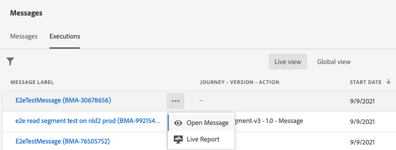
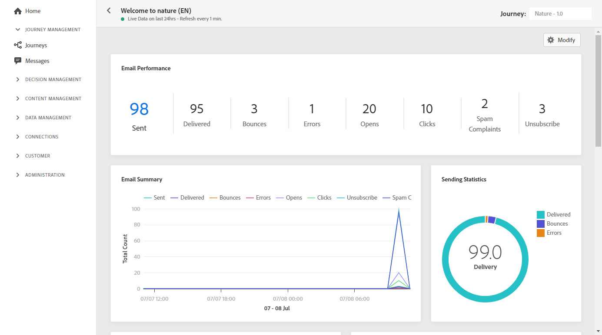
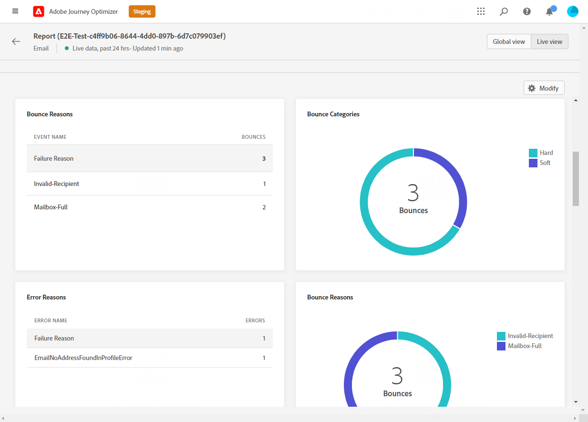

# Rapporto live delle e-mail {#email-live-report}

L’e-mail **[!UICONTROL Live report]** esegue solo il targeting di una consegna e-mail specifica.

Da **[!UICONTROL Executions]** della scheda **[!UICONTROL Messages]** menu, seleziona **[!UICONTROL Live view]** dal menu avanzato della consegna selezionata, seleziona **[!UICONTROL Live report]**.

L’e-mail **[!UICONTROL Live report]** è suddiviso in diversi widget che descrivono in dettaglio il successo e gli errori della consegna. Se necessario, ogni widget può essere ridimensionato ed eliminato. Per ulteriori informazioni su questo consulta [sezione](live-report.md#modify-dashboard).

**[!UICONTROL Email performance]** e **[!UICONTROL Email summary]** I widget descrivono nel dettaglio le informazioni principali relative al messaggio con un grafico e KPI:

* **[!UICONTROL Targeted]**: Numero di profili utente qualificati come profili di destinazione per questa consegna.

* **[!UICONTROL Sent]**: Numero totale di invii per la consegna.

* **[!UICONTROL Delivered]**: Numero di messaggi inviati correttamente in relazione al numero totale di messaggi inviati.

* **[!UICONTROL Opens]**: Numero di volte in cui un messaggio è stato aperto in una consegna.

* **[!UICONTROL Clicks]**: Numero di volte in cui è stato fatto clic su un contenuto in una consegna.

* **[!UICONTROL Bounces]**: Totale degli errori cumulati durante la consegna e l’elaborazione automatica della restituzione in relazione al numero totale di messaggi inviati.

* **[!UICONTROL Errors]**: Numero totale di errori che si sono verificati durante una consegna e che ne impediscono l’invio ai profili.

* **[!UICONTROL Spam complaints]**: Numero di messaggi classificati come spam.

* **[!UICONTROL Unsubscriptions]**: Numero di clic sul collegamento di annullamento dell’abbonamento.

* **[!UICONTROL Excluded]**: Numero di profili utente, esclusi dai profili target, che non hanno ricevuto il messaggio.

La **[!UICONTROL Sending Statistics]** widget descrive il successo della consegna:

* **[!UICONTROL Delivered]**: Numero di messaggi inviati correttamente in relazione al numero totale di messaggi inviati.

* **[!UICONTROL Bounces]**: Totale degli errori cumulati durante la consegna e l’elaborazione automatica della restituzione in relazione al numero totale di messaggi inviati.

* **[!UICONTROL Errors]**: Numero totale di errori che si sono verificati durante una consegna e che ne impediscono l’invio ai profili.

La **[!UICONTROL Error Reasons]** grafico e tabella consentono di vedere quale errore si è verificato durante la consegna.

La **[!UICONTROL Bounce Reasons]** e **[!UICONTROL Bounce categories]** I widget contengono i dati disponibili relativi ai messaggi non recapitati, ad esempio:

* **[!UICONTROL Hard bounce]**: Numero totale di errori permanenti, ad esempio un indirizzo e-mail errato. Ciò comporta un messaggio di errore che indica esplicitamente che l’indirizzo non è valido, ad esempio l’utente sconosciuto.

* **[!UICONTROL Soft bounce]**: Numero totale di errori temporanei, ad esempio una casella in entrata completa.

* **[!UICONTROL Ignored]**: Numero totale di temporanei, ad esempio Fuori sede, o un errore tecnico, ad esempio se il tipo di mittente è postmaster.

>[!NOTE]
>
>I widget e le metriche Offerte sono disponibili solo se una decisione è stata inserita in un’e-mail. Per ulteriori informazioni sulla gestione delle decisioni, consulta questo [page](../offers/get-started/starting-offer-decisioning.md).

La **[!UICONTROL Offers statistic]** e **[!UICONTROL Offers statistics]** i widget nel tempo misurano il successo e l’impatto dell’offerta sul pubblico di destinazione. Vengono descritte in dettaglio le informazioni principali relative al messaggio con i KPI:

* **[!UICONTROL Offer sent]**: Numero totale di invii per l’offerta.

* **[!UICONTROL Offer impression]**: Numero di volte in cui l’offerta è stata aperta in una consegna.

* **[!UICONTROL Offer clicks]**: Numero di volte in cui un’offerta è stata selezionata in una consegna.

>[!NOTE]
>
>I profili con **[!UICONTROL Suppressed]** o **[!UICONTROL Not allowed]** lo stato viene escluso durante il processo di invio del messaggio. Pertanto, mentre **Rapporti sui percorsi** mostrerà questi profili come spostati nel percorso ([Leggi segmento](../building-journeys/read-segment.md) e [Messaggio](../building-journeys/journeys-message.md) attività), **Rapporti e-mail** non li includerà nella **[!UICONTROL Sent]** le metriche vengono filtrate prima dell’invio dell’e-mail.
>
>Per saperne di più sul [Elenco di eliminazione](suppression-list.md) e [Elenco Consentiti](../configuration/allow-list.md). Per scoprire il motivo di tutti i casi di esclusione, puoi utilizzare il [Servizio query Adobe Experience Platform](https://experienceleague.adobe.com/docs/experience-platform/query/api/getting-started.html){target=&quot;_blank&quot;}.
