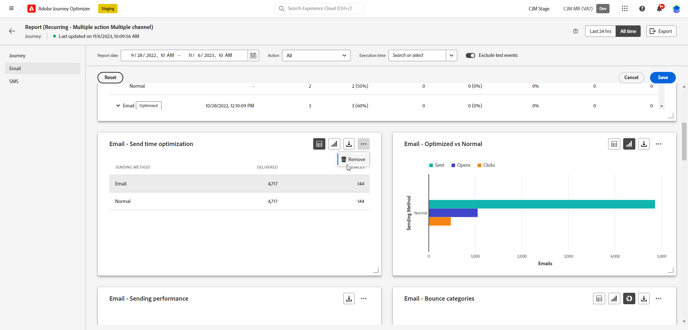

# Introduzione ai rapporti globali {#global-report}

>[!NOTE]
>
> Se vengono effettuate query personalizzate tramite API quando si utilizza Query Service, si prega di attendere un certo ritardo per i rapporti.

Utilizza il **[!UICONTROL Rapporto globale]** per misurare l’impatto di percorsi e consegne in un periodo di tempo selezionato.

* Se desideri eseguire il targeting di un percorso o di consegne nel contesto di un percorso, da **[!UICONTROL Percorsi]** , accedere al percorso e fare clic sul pulsante **[!UICONTROL Visualizza rapporto]** pulsante. Puoi quindi trovare i rapporti globali relativi a Percorso, e-mail, SMS e push.

  

* Se desideri eseguire il targeting di una campagna, da **[!UICONTROL Campagne]** , accedi alla tua campagna e fai clic sul pulsante **[!UICONTROL Rapporti]** pulsante.

  

* Se si desidera passare dalla modalità **[!UICONTROL Rapporto live]** al **[!UICONTROL Rapporto globale]** per la consegna, fai clic su **[!UICONTROL Sempre]** dal selettore di tabulazione.

  

Per un elenco dettagliato di tutte le metriche disponibili in Adobe Journey Optimizer, consulta [questa pagina](#list-of-components-global)

## Personalizza dashboard {#modify-dashboard}

Ogni dashboard di reporting può essere modificato modificando il periodo di tempo e ridimensionando o rimuovendo i widget. La modifica dei widget ha effetto solo sul dashboard dell&#39;utente corrente. Gli altri utenti visualizzeranno le proprie dashboard o quelle impostate per impostazione predefinita.

1. Dal rapporto globale, seleziona un’ora di inizio e di fine per eseguire il targeting di dati specifici.

   

1. Per i rapporti di Percorso che coinvolgono più rapporti configurati **[!UICONTROL Azioni]**, scegli un **[!UICONTROL Azione]** dal menu a discesa.

1. Se desideri eseguire il targeting solo di uno o più messaggi ricorrenti, selezionali dall’ **[!UICONTROL Tempo di esecuzione]** a discesa.

   

1. Scegliere se si desidera escludere gli eventi di test dai rapporti con la barra di attivazione. Per ulteriori informazioni sugli eventi di test, consulta [questa pagina](../building-journeys/testing-the-journey.md).

   Tieni presente che **[!UICONTROL Escludere gli eventi di test]** L&#39;opzione è disponibile solo per i rapporti di Percorso.

   

1. Clic **[!UICONTROL Modifica]** per iniziare a personalizzare la dashboard.

   

1. Regolate le dimensioni dei widget trascinandone l&#39;angolo inferiore destro.

   

1. Clic **[!UICONTROL Rimuovi]** per rimuovere i widget non necessari.

   

1. Quando si è soddisfatti dell&#39;ordine di visualizzazione e delle dimensioni dei widget, fare clic su **[!UICONTROL Salva]**.

1. Per personalizzare la modalità di visualizzazione dei dati, puoi passare da diverse opzioni di visualizzazione, ad esempio grafici, tabelle e grafici ad anello.

   

Il dashboard è ora salvato. Le diverse modifiche verranno riapplicate per un utilizzo successivo dei rapporti live. Se necessario, utilizza **[!UICONTROL Reimposta]** per ripristinare l&#39;ordine dei widget e dei widget predefiniti.

## Esportare i rapporti {#export-reports}

Puoi esportare facilmente i diversi rapporti in formato PDF o CSV, per condividerli o stamparli. I passaggi per esportare i rapporti sono descritti nelle schede seguenti.

➡️ [Scopri questa funzione nel video](#video-csv)

>[!BEGINTABS]

>[!TAB Esportare il rapporto come file CSV]

1. Dal report, fai clic su **[!UICONTROL Esporta]** e seleziona **[!UICONTROL File CSV]** per generare un file CSV a livello di report complessivo.

   

1. Puoi anche scegliere di esportare i dati da un widget specifico. Clic **[!UICONTROL Esporta dati widget in CSV]** accanto al widget selezionato.

   

1. Il file viene scaricato automaticamente e si trova nei file locali.

   Se hai generato il file a livello di report, contiene informazioni dettagliate per ciascun widget, inclusi il titolo e i dati.

   Se hai generato il file a livello di widget, fornisce specificamente i dati per il widget selezionato.

>[!TAB Esportare il report come file PDF]

1. Dal report, fai clic su **[!UICONTROL Esporta]** e seleziona **[!UICONTROL file PDF]**.

   

1. Nella finestra Stampa configurare il documento in base alle esigenze. Le opzioni possono variare a seconda del browser in uso.

1. Scegliere se stampare o salvare il report come PDF.

1. Individuare la cartella in cui si desidera salvare il file, rinominarlo, se necessario, e fare clic su Salva.

Il report è ora disponibile per la visualizzazione o la condivisione in un file pdf.

>[!ENDTABS]

### Esportare rapporti (video) {#video-csv}

Scopri come scaricare un rapporto CSV per un rapporto e per un singolo widget nel seguente video tutorial.

>[!VIDEO](https://video.tv.adobe.com/v/3424603?quality=12)

>[!CONTEXTUALHELP]
>id="ajo_report_campaign_CTR"
>title="CTR"
>abstract="Widget CTR"

>[!CONTEXTUALHELP]
>id="ajo_report_campaign_clicks"
>title="Clic"
>abstract="Widget clic"

>[!CONTEXTUALHELP]
>id="ajo_report_campaign_delivered"
>title="Consegnate"
>abstract="Widget consegnato"

>[!CONTEXTUALHELP]
>id="ajo_report_campaign_overview"
>title="Panoramica di Campaign"
>abstract="Widget panoramica campagna"

>[!CONTEXTUALHELP]
>id="ajo_report_campaign_funnel"
>title="Risultati funnel della campagna"
>abstract="Widget risultati funnel campagna"

>[!CONTEXTUALHELP]
>id="ajo_report_campaign_tracking_link"
>title="Etichette collegamento tracciato"
>abstract="Widget etichette collegamenti tracciati"

>[!CONTEXTUALHELP]
>id="ajo_report_campaign_displays"
>title="Visualizzazioni"
>abstract="Visualizza widget"

<!--campaign email-->

>[!CONTEXTUALHELP]
>id="ajo_report_campaign_email_delivered_click"
>title="Tendenza consegne e clic"
>abstract="Widget tendenza consegne e clic"

>[!CONTEXTUALHELP]
>id="ajo_report_campaign_email_delivery_status"
>title="Stato della consegna"
>abstract="Widget stato consegna"

>[!CONTEXTUALHELP]
>id="ajo_report_campaign_email_sending_statistics"
>title="Statistiche di invio"
>abstract="Widget statistiche di invio"

>[!CONTEXTUALHELP]
>id="ajo_report_campaign_email_tracking_statistics"
>title="Statistiche di tracciamento"
>abstract="Widget statistiche di tracciamento"

>[!CONTEXTUALHELP]
>id="ajo_report_campaign_email_domains"
>title="Domini e-mail"
>abstract="Widget domini e-mail"

>[!CONTEXTUALHELP]
>id="ajo_report_campaign_email_tracked_link"
>title="Etichette collegamento tracciato"
>abstract="Widget etichette collegamento tracciamento"

>[!CONTEXTUALHELP]
>id="ajo_report_campaign_email_tracked_link_urls"
>title="URL di collegamento tracciati"
>abstract="Widget degli URL di collegamento tracciati"

>[!CONTEXTUALHELP]
>id="ajo_report_campaign_email_subjects"
>title="Oggetti e-mail"
>abstract="Widget oggetti e-mail"

>[!CONTEXTUALHELP]
>id="ajo_report_campaign_email_bounce_reasons"
>title="Motivi di mancato recapito"
>abstract="Widget motivi di mancato recapito"

>[!CONTEXTUALHELP]
>id="ajo_report_campaign_email_exclude"
>title="Escludi motivi"
>abstract="Widget Escludi motivi"

>[!CONTEXTUALHELP]
>id="ajo_report_campaign_email_error"
>title="Motivi di errore"
>abstract="Widget motivi di errore"

<!--campaign push-->

>[!CONTEXTUALHELP]
>id="ajo_report_campaign_push_sending_statistics"
>title="Statistiche di invio"
>abstract="Widget statistiche di invio"

>[!CONTEXTUALHELP]
>id="ajo_report_campaign_push_tracking_statistics"
>title="Statistiche di tracciamento"
>abstract="Widget statistiche di tracciamento"

>[!CONTEXTUALHELP]
>id="ajo_report_campaign_push_tracked_link"
>title="Etichette collegamento tracciato"
>abstract="Widget etichette collegamento tracciamento"

>[!CONTEXTUALHELP]
>id="ajo_report_campaign_push_tracked_link_urls"
>title="URL di collegamento tracciati"
>abstract="Widget degli URL di collegamento tracciati"

>[!CONTEXTUALHELP]
>id="ajo_report_campaign_push_bounce_reasons"
>title="Motivi di mancato recapito"
>abstract="Widget motivi di mancato recapito"

>[!CONTEXTUALHELP]
>id="ajo_report_campaign_push_exclude"
>title="Motivi di esclusione"
>abstract="Widget motivi esclusi"

>[!CONTEXTUALHELP]
>id="ajo_report_campaign_push_email_error"
>title="Motivi di errore"
>abstract="Widget motivi di errore"

<!--campaign inapp-->

>[!CONTEXTUALHELP]
>id="ajo_report_campaign_inapp_impression"
>title="Tendenza impression e clic"
>abstract="Widget tendenza impression e clic"

>[!CONTEXTUALHELP]
>id="ajo_report_campaign_inapp_clicks"
>title="Clic"
>abstract="Widget clic"

>[!CONTEXTUALHELP]
>id="ajo_report_campaign_inapp_displays"
>title="Visualizzazioni"
>abstract="Visualizza widget"

>[!CONTEXTUALHELP]
>id="ajo_report_campaign_inapp_tracking_data"
>title="Dati di tracciamento"
>abstract="Widget dati di tracciamento"

>[!CONTEXTUALHELP]
>id="ajo_report_campaign_inapp_tracked_link"
>title="Etichette collegamento tracciato"
>abstract="Widget etichette collegamenti tracciati"

>[!CONTEXTUALHELP]
>id="ajo_report_campaign_inapp_tracked_link_urls"
>title="URL di collegamento tracciati"
>abstract="Widget degli URL di collegamento tracciati"

<!--campaign sms-->

>[!CONTEXTUALHELP]
>id="ajo_report_campaign_sms_delivered_click"
>title="Tendenza consegne e clic"
>abstract="Widget tendenza consegne e clic"

>[!CONTEXTUALHELP]
>id="ajo_report_campaign_sms_delivery_status"
>title="Stato della consegna"
>abstract="Widget stato consegna"

>[!CONTEXTUALHELP]
>id="ajo_report_campaign_sms_tracked_link"
>title="Etichette collegamento tracciato"
>abstract="Widget etichette collegamento tracciamento"

>[!CONTEXTUALHELP]
>id="ajo_report_campaign_sms_tracked_link_urls"
>title="URL di collegamento tracciati"
>abstract="Widget degli URL di collegamento tracciati"

>[!CONTEXTUALHELP]
>id="ajo_report_campaign_sms_inbound"
>title="Messaggio SMS in entrata"
>abstract="Widget messaggio SMS in entrata"

>[!CONTEXTUALHELP]
>id="ajo_report_campaign_sms_message_type"
>title="Tipo di messaggio SMS"
>abstract="Widget tipo di messaggio SMS"

>[!CONTEXTUALHELP]
>id="ajo_report_campaign_sms_providers"
>title="Provider SMS"
>abstract="Widget provider SMS"

>[!CONTEXTUALHELP]
>id="ajo_report_campaign_sms_bounce"
>title="Motivi di mancato recapito"
>abstract="Widget motivi di mancato recapito"

>[!CONTEXTUALHELP]
>id="ajo_report_campaign_sms_exclude"
>title="Escludi motivi"
>abstract="Widget Escludi motivi"

>[!CONTEXTUALHELP]
>id="ajo_report_campaign_sms_error"
>title="Motivi di errore"
>abstract="Widget motivi di errore"
