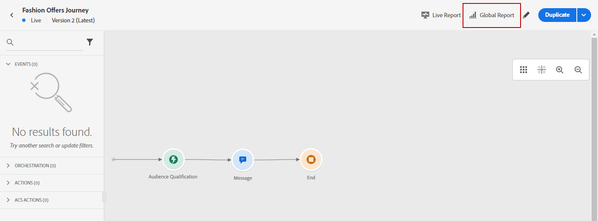
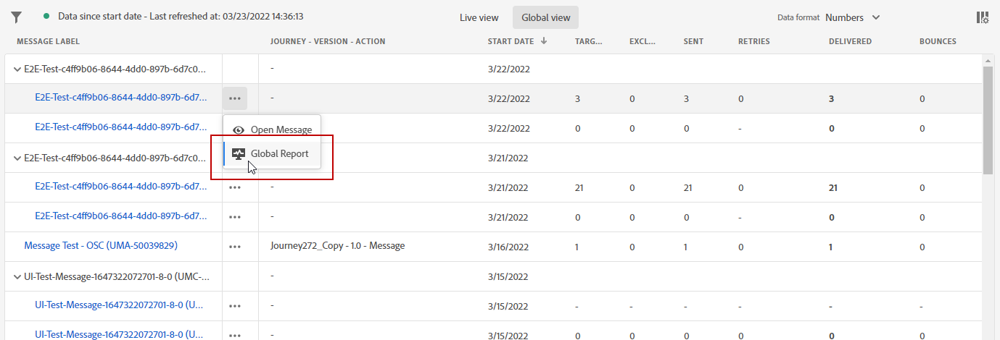

# Report globale {#global-report}

>[!NOTE]
>
> Se le query personalizzate vengono effettuate tramite API quando si utilizza il servizio Query, si prega di attendersi un certo ritardo per i rapporti.

Utilizza la **[!UICONTROL Global report]** per misurare l’impatto dei percorsi e delle consegne su un periodo di tempo selezionato.

* Se desideri eseguire il targeting di uno o più percorsi di consegne nel contesto di un percorso, dal **[!UICONTROL Journeys]** accedere al percorso e fare clic su **[!UICONTROL Global report]** icona. Puoi quindi trovare il Percorso, l’e-mail e il push **[!UICONTROL Global report]**.

   

* Se desideri eseguire il targeting di una consegna specifica, dalla **[!UICONTROL Global view]** del **[!UICONTROL Executions]** scheda dei messaggi, seleziona **[!UICONTROL Global Report]** dal menu avanzato della consegna selezionata.

   

* Se desideri passare dalla **[!UICONTROL Global report]** al **[!UICONTROL Live report]** per la consegna, fai clic su **[!UICONTROL Live view]** dal commutatore di tabulazione.

   

## Personalizza dashboard {#modify-dashboard}

Ogni dashboard di reporting può essere modificato modificando il periodo di tempo e ridimensionando o rimuovendo i widget. La modifica dei widget influisce solo sul dashboard dell&#39;utente corrente. Altri utenti visualizzeranno le proprie dashboard o quelle impostate per impostazione predefinita.

1. Dal rapporto Globale, seleziona un&#39;ora di inizio e di fine per eseguire il targeting di dati specifici.

   

1. Scegli se escludere gli eventi di test dai rapporti con la barra di attivazione. Per ulteriori informazioni sugli eventi di test, consulta [questa pagina](../building-journeys/testing-the-journey.md).

   Tieni presente che **[!UICONTROL Exclude test events]** è disponibile solo per i rapporti di Percorso.

   

1. Fai clic su **[!UICONTROL Modify]** per iniziare a personalizzare il dashboard.

   

1. Regolare le dimensioni dei widget trascinandone l&#39;angolo in basso a destra.

   

1. Fai clic su **[!UICONTROL Remove]** per rimuovere qualsiasi widget non è necessario.

   

1. Una volta soddisfatti dell&#39;ordine di visualizzazione e delle dimensioni dei widget, fai clic su **[!UICONTROL Save]**.

Il dashboard viene ora salvato. Le diverse modifiche verranno applicate nuovamente per un utilizzo successivo dei rapporti live. Se necessario, utilizza le **[!UICONTROL Reset]** per ripristinare l&#39;ordine predefinito dei widget e dei widget.
