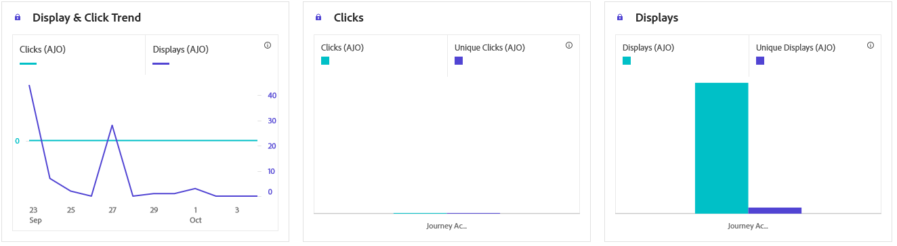

# Rapporto sulle schede di contenuto del percorso {#journey-global-report}

>[!BEGINSHADEBOX]

Puoi accedere al report percorso schede di contenuto facendo clic sul pulsante **[!UICONTROL Visualizza report]** all&#39;interno del percorso. [Ulteriori informazioni](report-gs-cja.md)

>[!ENDSHADEBOX]

## Visualizza e fai clic {#displays-content-card}

I grafici **[!UICONTROL Visualizzazione e clic]** presentano un&#39;analisi dettagliata del coinvolgimento dei profili con le schede dei contenuti, fornendo informazioni utili su come i profili interagiscono con i contenuti.

+++ Ulteriori informazioni sulle metriche Visualizzazioni e Clic

* **[!UICONTROL Clic univoci]**: numero di profili che hanno fatto clic su un contenuto nelle schede Contenuto.

* **[!UICONTROL Clic]**: numero di volte in cui è stato fatto clic su un contenuto nelle schede Contenuto.

* **[!UICONTROL Visualizzazioni]**: numero di volte in cui la scheda Contenuto è stata aperta.

* **[!UICONTROL Visualizzazioni univoche]**: numero di volte in cui la scheda Contenuto è stata aperta, non vengono prese in considerazione più interazioni di un profilo.

+++

## Dati di tracciamento {#track-data-content}

La tabella **[!UICONTROL Dati di tracciamento]** offre un&#39;istantanea dettagliata dell&#39;attività di profilo associata alle schede Contenuto, fornendo informazioni essenziali sull&#39;efficacia del coinvolgimento e delle esperienze.

+++ Ulteriori informazioni sul tracciamento delle metriche dei dati

* **[!UICONTROL Persone]**: numero di profili utente qualificati come profili target per le schede Contenuto.

* **[!UICONTROL Tasso di click-through (CTR)]**: percentuale di utenti che hanno interagito con le schede Contenuto.

* **[!UICONTROL Clic]**: numero di volte in cui è stato fatto clic su un contenuto nelle schede Contenuto.

* **[!UICONTROL Clic univoci]**: numero di profili che hanno fatto clic su un contenuto nelle schede Contenuto.

* **[!UICONTROL Visualizzazioni]**: numero di volte in cui la scheda Contenuto è stata aperta.

* **[!UICONTROL Visualizzazioni univoche]**: numero di volte in cui la scheda Contenuto è stata aperta, non vengono prese in considerazione più interazioni di un profilo.

+++

## Etichette collegamenti tracciati {#track-link-content}

La tabella **[!UICONTROL Etichette di collegamento tracciate]** offre una panoramica completa delle etichette di collegamento all&#39;interno delle schede Contenuto, evidenziando quelle che generano il traffico di visitatori più elevato. Questa funzione ti consente di identificare e assegnare la priorità ai collegamenti più popolari.

+++ Ulteriori informazioni sulle metriche delle etichette dei collegamenti tracciati

* **[!UICONTROL Clic univoci]**: numero di profili che hanno fatto clic su un contenuto nelle schede Contenuto.

* **[!UICONTROL Clic]**: numero di volte in cui è stato fatto clic su un contenuto nelle schede Contenuto.

* **[!UICONTROL Visualizzazioni]**: numero di volte in cui la scheda Contenuto è stata aperta.

* **[!UICONTROL Visualizzazioni univoche]**: numero di volte in cui la scheda Contenuto è stata aperta, non vengono prese in considerazione più interazioni di un profilo.

+++
